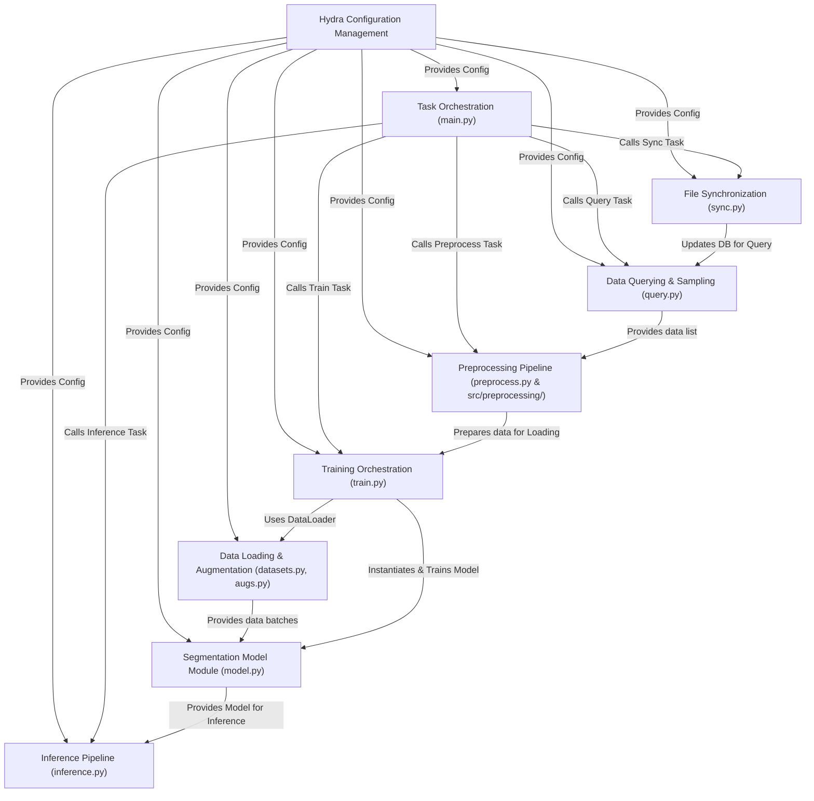

# Tutorial: SemiF-Segmentation

This project provides a pipeline for **image segmentation**.
It allows users to *query* specific image data from a database, *preprocess* it (e.g., cropping, relabeling), *train* a segmentation model (like UNet or DeepLabV3+) using Pytorch Lightning, and finally *run inference* to generate segmentation masks on new images.
The entire process is managed using **Hydra** configuration, making it easy to configure experiments and swap components like models or data augmentation techniques.

## Chapters

1. [Task Orchestration (`main.py`)
](docs/01_task_orchestration___main_py___.md)
2. [Hydra Configuration Management
](docs/02_hydra_configuration_management_.md)
3. [Data Querying & Sampling (`query.py`)
](docs/03_data_querying___sampling___query_py___.md)
4. [Preprocessing Pipeline (`preprocess.py` & `src/preprocessing/`)
](docs/04_preprocessing_pipeline___preprocess_py_____src_preprocessing____.md)
5. [Data Loading & Augmentation (`datasets.py`, `augs.py`)
](docs/05_data_loading___augmentation___datasets_py____augs_py___.md)
6. [Segmentation Model Module (`model.py`)
](docs/06_segmentation_model_module___model_py___.md)
7. [Training Orchestration (`train.py`)
](docs/07_training_orchestration___train_py___.md)
8. [Inference Pipeline (`inference.py`)
](docs/08_inference_pipeline___inference_py___.md)
9. [File Synchronization (`sync.py`)
](docs/09_file_synchronization___sync_py___.md)

---

Generated by [AI Codebase Knowledge Builder](https://github.com/The-Pocket/Tutorial-Codebase-Knowledge)
