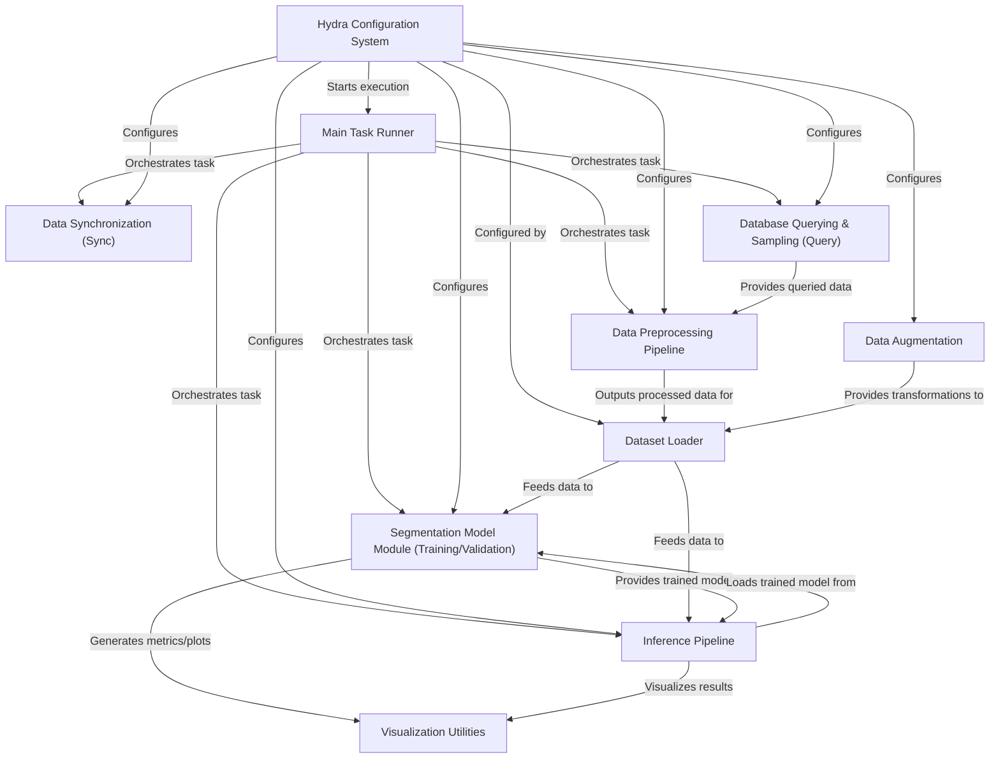

# SemiF-Segmentation

This project is designed for **segmenting** objects (like plants) in images.
It uses the SemiField **database** to find relevant images based on criteria,
**prepares** the image data through steps like cropping and remapping,
**trains** a deep learning model for segmentation,
and then runs **inference** to generate masks on new images.
Everything is controlled via a flexible **configuration system**.

## Chapters

1. [Hydra Configuration System
](docs/01_hydra_configuration_system_.md)
2. [Main Task Runner
](docs/02_main_task_runner_.md)
3. [Data Synchronization (Sync)
](docs/03_data_synchronization__sync__.md)
4. [Database Querying & Sampling (Query)
](docs/04_database_querying___sampling__query__.md)
5. [Data Preprocessing Pipeline
](docs/05_data_preprocessing_pipeline_.md)
6. [Data Augmentation
](docs/06_data_augmentation_.md)
7. [Dataset Loader
](docs/07_dataset_loader_.md)
8. [Segmentation Model Module (Training/Validation)
](docs/08_segmentation_model_module__training_validation__.md)
9. [Inference Pipeline
](docs/09_inference_pipeline_.md)
10. [Visualization Utilities
](docs/10_visualization_utilities_.md)

---

Generated by [AI Codebase Knowledge Builder](https://github.com/The-Pocket/Tutorial-Codebase-Knowledge)