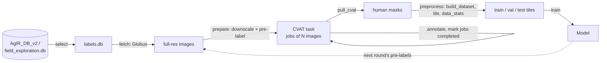

# SemiF-Segmentation

Vegetation vs. background segmentation for SemiField and field images, trained
on human labels. Images are selected from the AgIR or field databases, moved
here with Globus, annotated as full images in CVAT, and pulled back as masks
for preprocessing and training.


```mermaid
flowchart LR
    DB[(AgIR_DB_v2 /<br>field_exploration.db)] -->|select| L[labels.db]
    L -->|fetch: Globus| I[full-res images]
    I -->|prepare: downscale + pre-label| C[CVAT task<br>jobs of N images]
    C -->|annotate, mark jobs completed| C
    C -->|pull_cvat| M[human masks]
    M -->|preprocess: build_dataset, tile, data_stats| T[train / val / test tiles]
    T -->|train| Model
    Model -.->|next round's pre-labels| I
```

Everything is a Hydra mode: `python main.py mode=<mode>`, with `sync`, `label`,
`preprocess`, `train`, and `inference`.

## Setup

```bash
conda env create -f environment.yaml   # or: pip install -r requirements.txt
```

Credentials live in the gitignored `.keys/keys.yaml`:

```yaml
cvat:
  url: https://app.cvat.ai     # CVAT cloud
  org_id: 123                  # every request is scoped to this organization
  username: ...
  password: ...                # or `token: ...` for a personal access token
```

For Globus transfers (`conf/transfer/default.yaml`):
- register a native app at https://app.globus.org/settings/developers and set
  `transfer.globus.client_id`; the first transfer prints a login URL, after which
  tokens are cached;
- fill in the collection IDs under `transfer.globus.endpoints` and each root's
  `endpoint_path` in `conf/sources/default.yaml`;
- the destination is Globus Connect Personal on this machine, which shares only
  `~/` and must be running during transfers.

Until Globus is set up, `transfer.backend=copy` copies from the NFS mounts instead.

## Labeling rounds (`mode=label`)

A round is a config file that extends `conf/label/default.yaml` (see
`conf/label/example.yaml`):

```yaml
# conf/label/r001_covercrops.yaml
defaults: [default, _self_]
round: r001_covercrops
source: field                  # field | semif  (conf/sources)
select:
  n_images: 200
  balance_by: [location]
  filters: {plant_type: COVERCROPS}   # value | [values] | "pattern%"
```

```bash
python main.py mode=label label=r001_covercrops
```

This runs five tasks, each tracked per image in `data/labels/labels.db`:

| Task | Does | Status after |
|---|---|---|
| `select` | Queries a local snapshot of the source DB, skips images already in any round, balance-samples up to `n_images` | `selected` |
| `fetch` | Globus transfer of the full-resolution images (one transfer per source root) | `fetched` |
| `prepare` | Downscales to `label.prepare.max_side` for CVAT; pre-labels with `label.prelabel.checkpoint` | `prepared` |
| `push_cvat` | Creates a task in the CVAT project (labels `vegetation` and tag `exclude`), jobs of `cvat.segment_size` images, uploads pre-labels as editable masks | `in_cvat` |
| `pull_cvat` | Reads jobs whose state is `completed`, rasterizes vegetation masks/polygons, scales them to native resolution | `labeled` / `excluded` |

Then annotate in CVAT: fix the masks, tag unusable frames `exclude`, and mark
each job completed. Re-run the same command to pull finished jobs; it's safe to
re-run at any point, since every task only acts on images in the status it
expects. `label.retry_errors=true` retries images a task marked as `error`.

Human masks are 0/1 PNGs in `data/labels/masks/<source>/` (native resolution)
and `data/labels/cvat_masks/<source>/` (the resolution annotated in CVAT). They
aren't copied anywhere else, so keep the CVAT tasks: `pull_cvat` can always
re-export them (`label.pull_cvat.refresh=true`).

## Training

```bash
python main.py mode=preprocess   # build_dataset -> tile -> data_stats
python main.py mode=train
python main.py mode=inference
```

- `build_dataset` takes every labeled image in `labels.db` (optionally filtered
  by `sources`/`rounds`) and assigns train/val/test per group (batch by default).
  A split is stored in `labels.db` the first time an image is seen and never
  changes, so the test set stays fixed as rounds are added.
- `tile` resizes images to `preprocess.tile.scale` and cuts `tile_size` tiles,
  keeping background tiles and image edges. `inference.rescale_factor` follows
  the same scale.
- `train` validates and tests the best checkpoint and writes `run_info.json`
  (metrics, label rounds, per-split counts) to the run's version directory.

## Configuration

| Group | What it sets |
|---|---|
| `conf/label/` | Labeling rounds: tasks, selection, downscaling, pre-label model |
| `conf/sources/` | Source DBs, snapshot policy, and the storage roots their paths resolve against |
| `conf/transfer/` | Transfer backend, Globus client ID, collections, destination |
| `conf/cvat/` | CVAT URL/organization (defaults from `.keys/keys.yaml`), project, job size, when to pull |
| `conf/preprocess/` | Split sizes and grouping, tile scale/size |
| `conf/model/`, `conf/train/`, `conf/augment/`, `conf/inference/` | Model, training, augmentation, inference |
| `conf/paths/` | Where everything is written |

## Tests

```bash
python -m pytest
```

## Archived code

Unused scripts, the self-hosted CI training workflows, the auto-generated
tutorial that used to live in `docs/`, and the old auto-mask training path were
moved to [archive/](archive/). See [archive/README.md](archive/README.md) for
what was moved and why.
