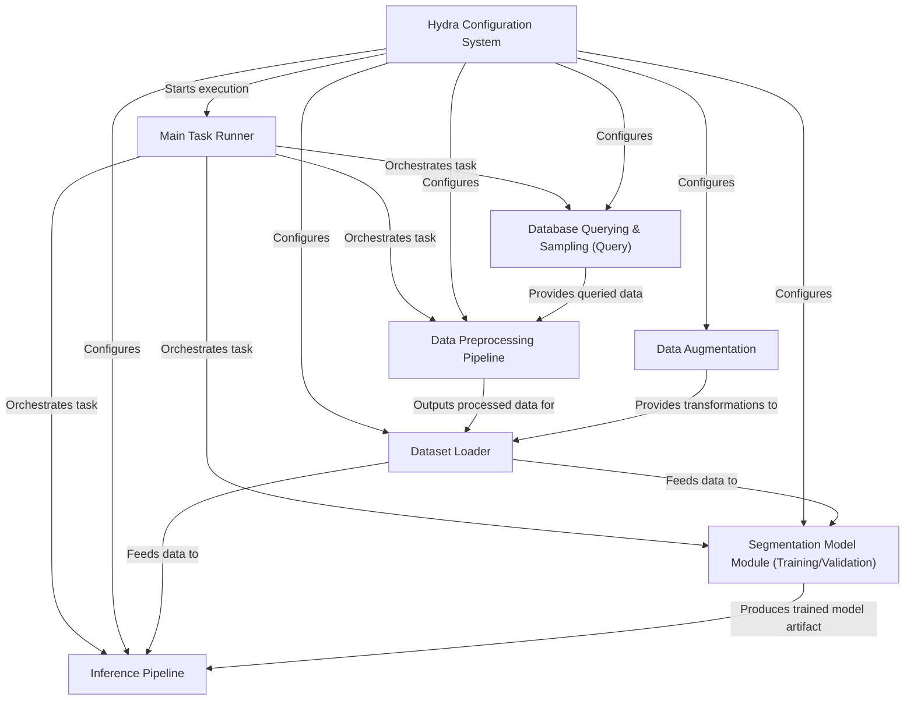

# SemiF-Segmentation

This project is designed for **segmenting** objects (like plants) in images.
It uses the SemiField **database** to find relevant images based on criteria,
**prepares** the image data through steps like cropping and remapping,
**trains** a deep learning model for segmentation,
and then runs **inference** to generate masks on new images.
Everything is controlled via a flexible **configuration system**.

```mermaid
flowchart TD
    
    A1["Main Task Runner"]
    A0["Hydra Configuration System"]
    
    A3["Database Querying & Sampling (Query)"]
    A4["Data Preprocessing Pipeline"]
    A5["Dataset Loader"]
    A6["Data Augmentation"]
    A7["Segmentation Model Module (Training/Validation)"]
    A8["Inference Pipeline"]
    
    %% Execution Flow
    A0 -- "Starts execution" --> A1

    %% Orchestration
    A1 -- "Orchestrates task" --> A3
    A1 -- "Orchestrates task" --> A4
    A1 -- "Orchestrates task" --> A7
    A1 -- "Orchestrates task" --> A8

    %% Configuration
    A0 -- "Configures" --> A3
    A0 -- "Configures" --> A4
    A0 -- "Configures" --> A5
    A0 -- "Configures" --> A6
    A0 -- "Configures" --> A7
    A0 -- "Configures" --> A8

    %% Data Flow
    A3 -- "Provides queried data" --> A4
    A4 -- "Outputs processed data for" --> A5
    A6 -- "Provides transformations to" --> A5

    %% Model Usage
    A5 -- "Feeds data to" --> A7
    A5 -- "Feeds data to" --> A8

    %% Model Artifact
    A7 -- "Produces trained model artifact" --> A8

```

## Archived code

Unused scripts, the self-hosted CI training workflows, and the auto-generated
tutorial that used to live in `docs/` were moved to [archive/](archive/). See
[archive/README.md](archive/README.md) for what was moved and why.
