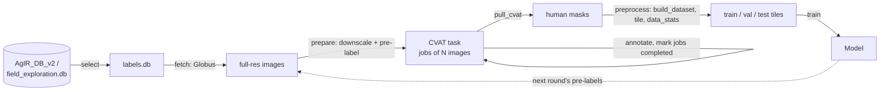

# SemiF-Segmentation

Vegetation vs. background segmentation for SemiField and field images, trained
on human labels. Images are selected from the AgIR or field databases, moved
here with Globus, annotated as full images in CVAT, and pulled back as masks
for preprocessing and training. Each labeling round is written in
[AgIR-CVToolkit](https://github.com/precision-sustainable-ag/AgIR-CVToolkit)'s
output format.


```mermaid
flowchart LR
    DB[(AgIR_DB_v2 /<br>field_exploration.db)] -->|select| L[labels.db]
    L -->|fetch: Globus| I[full-res images]
    I -->|prepare: downscale + pre-label| C[CVAT task<br>jobs of N images]
    C -->|annotate, mark jobs completed| C
    C -->|pull_cvat| M[human masks]
    M -->|preprocess: build_dataset, tile, data_stats| T[train / val / test tiles]
    T -->|train| Model
    Model -.->|next round's pre-labels| I
```

Everything is a Hydra mode: `python main.py mode=<mode>`, with `sync`, `label`,
`preprocess`, `train`, and `inference`.

## Setup

Dependencies are managed with [uv](https://docs.astral.sh/uv/) (`pyproject.toml`,
`uv.lock`). torch and torchvision come from PyTorch's CUDA 12.6 index, which
has x86_64 and aarch64 (GH200) wheels.

```bash
uv sync                          # creates .venv with the locked versions
uv run python main.py mode=...   # or: source .venv/bin/activate
uv run pytest
```

Globus transfers also need the Globus CLI: `uv tool install globus-cli`.

Credentials live in the gitignored `.keys/keys.yaml`:

```yaml
cvat:
  url: https://app.cvat.ai     # CVAT cloud
  org_id: 123                  # every request is scoped to this organization
  username: ...
  password: ...                # or `token: ...` for a personal access token
```

Globus transfers use the `globus` CLI, as AgIR-CVToolkit's `scinet-transfer` does
(`conf/transfer/default.yaml`):
- install it and log in once: `uv tool install globus-cli`, then `globus login`;
- fill in the collection IDs under `transfer.globus.endpoints` and each root's
  `endpoint_path` in `conf/sources/default.yaml`. If a collection needs a
  data_access consent, the first transfer fails with the `globus session consent`
  command to run;
- the destination is Globus Connect Personal on this machine, which shares only
  `~/` and must be running during transfers.

Until Globus is set up, `transfer.backend=copy` copies from the NFS mounts instead.

## Labeling rounds (`mode=label`)

A round is a config file that extends `conf/label/default.yaml` (see
`conf/label/example.yaml`):

```yaml
# conf/label/r001_covercrops.yaml
defaults: [default, _self_]
round: r001_covercrops
source: field                  # field | semif  (conf/sources)
select:
  n_images: 200
  balance_by: [location]
  filters: {plant_type: COVERCROPS}   # value | [values] | "pattern%"
```

```bash
python main.py mode=label label=r001_covercrops
```

This runs five tasks, each tracked per image in the project's ledger,
`outputs/runs/<project.name>/labels.db`:

| Task | Does | Status after |
|---|---|---|
| `select` | Queries a local snapshot of the source DB, skips images already in any of the project's rounds, balance-samples up to `n_images` | `selected` |
| `fetch` | Globus transfer of the full-resolution images (one transfer per source root) | `fetched` |
| `prepare` | Downscales to `label.prepare.max_side` for CVAT; pre-labels with `label.prelabel.checkpoint` | `prepared` |
| `push_cvat` | Creates the task `<project.name>_<round>` in the CVAT project (labels `vegetation` and tag `exclude`), jobs of `cvat.segment_size` images, uploads pre-labels as editable masks | `in_cvat` |
| `pull_cvat` | Reads jobs whose state is `completed` and rasterizes their vegetation masks/polygons | `labeled` / `excluded` |

Then annotate in CVAT: fix the masks, tag unusable frames `exclude`, and mark
each job completed. Re-run the same command to pull finished jobs; it's safe to
re-run at any point, since every task only acts on images in the status it
expects. `label.retry_errors=true` retries images a task marked as `error`.

A round is one AgIR-CVToolkit run, `project.subname` being the round's name,
so its folder reads like the ones `agir-cv query` and `agir-cv scinet-transfer`
write:

```
outputs/runs/<project.name>/
├── labels.db                          # the project's ledger
└── <round>/
    ├── cfg.yaml                       # config of the latest run, with runtime (user, host, git commit, overrides) and paths
    ├── logs/<epoch>.log               # one per run; Hydra's files are in logs/hydra/
    ├── query/query.csv                # select: the round's images (image_path as the source DB stores it)
    ├── query/query_spec.json          # select: database, filters, sampling, who/when/where
    ├── globus_batch.txt               # fetch: "<source> <destination>" per file (globus_batch_<root>.txt per root if several)
    ├── transfer_manifest.json         # fetch: endpoints, destination, Globus task IDs
    ├── field-batches/... or semifield-developed-images/...   # fetch: full-resolution images, laid out as on the source storage
    ├── images/<image_id>.jpg          # prepare: the downscaled copies uploaded to CVAT
    ├── masks/<image_id>.png           # prepare: model pre-labels (0/255)
    ├── boxes/<image_id>.json          # prepare, box rounds: SAM 3 boxes uploaded as rectangles
    ├── cvat_downloads/<task name>/    # pull_cvat: annotations/job_<id>.json and masks/<image_id>.png (box rounds: boxes/<image_id>.json)
    ├── manifest.csv                   # one row per image: status, paths, CVAT task/job/frame
    └── metrics.json                   # status counts and each task's latest summary
```

Human masks are 0/1 PNGs at the resolution they were annotated in CVAT
(`cvat_downloads/<task name>/masks/`); `tile` scales them to each image. They
aren't copied anywhere else, so keep the CVAT tasks: `pull_cvat` can always
re-export them (`label.pull_cvat.refresh=true`).

### Box rounds

With `label.prelabel.kind=sam3_boxes` a round labels plant boxes instead of
masks. `prepare` uploads each image downscaled to `max_side` (never tiles) and
pre-labels it with SAM 3 boxes, computed as the preprocess task
`full_image_boxes` does (downscale by `proposals.full_image.scale`, predict on
`proposals.tiling` tiles, merge), into `boxes/<image_id>.json`. `push_cvat`
puts the task in its own CVAT project, `cvat.detection.project_name`, with one
rectangle label per detection class (`cvat.detection.labels`) and the
`exclude` tag, and uploads one rectangle per plant for annotators to fix, add
or delete. `pull_cvat` writes `cvat_downloads/<task name>/boxes/<image_id>.json`:
the corrected boxes at full resolution (xyxy pixel edges) with their label,
and each box's provenance from comparing it with the uploaded pre-labels:
`sam3` (unchanged), `sam3_corrected` (edited; IoU of at least
`label.pull_cvat.match_iou` with a pre-label) or `human` (added). The ledger's
`boxes_path` points to it.

## Training

```bash
python main.py mode=preprocess   # build_dataset -> tile -> data_stats
python main.py mode=train
python main.py mode=inference
```

- `build_dataset` takes every labeled image in the project's `labels.db`
  (optionally filtered by `sources`/`rounds`) and assigns train/val/test per
  group (batch by default).
  A split is stored in `labels.db` the first time an image is seen and never
  changes, so the test set stays fixed as rounds are added.
- `tile` resizes images to `preprocess.tile.scale` and cuts `tile_size` tiles,
  keeping background tiles and image edges. `inference.rescale_factor` follows
  the same scale.
- `train` validates and tests the best checkpoint and writes `run_info.json`
  (metrics, label rounds, per-split counts) to the run's version directory.
- `inference` runs `train/version_<inference.inference.version>` on the images
  in `inference.inference.explicit_img_dir.img_dir` and writes a new `run/`,
  `run_2/`, ... folder each time, so re-running with another threshold never
  overwrites earlier predictions.

## SAM 3 pseudo-instances (optional)

The instance models (`model=maskrcnn`, `model=maskrcnn_pointrend`) train by
default on one instance per connected blob of the semantic mask, which merges
touching plants. [SAM 3](https://github.com/facebookresearch/sam3) can act as a
teacher instead: it proposes plant instances from text prompts (`plant`,
`weed`, `broadleaf plant`, ...), the semantic labels decide which proposals to
trust, and the result is instance annotations to train on. SAM 3 is not
needed to train or run the trained model.

SAM 3 is under Meta's [SAM License](https://github.com/facebookresearch/sam3/blob/main/LICENSE)
(royalty-free, commercial use allowed; publications must acknowledge SAM; its
weights and derivatives may only be redistributed under that license). The
checkpoint is gated: request access at https://huggingface.co/facebook/sam3,
then once per machine create a read token (huggingface.co > Settings > Access
Tokens) and run `uv run hf auth login`.

```bash
uv sync --extra sam3
uv run hf auth login                  # paste the read token
python main.py mode=preprocess preprocess.tasks.build_dataset=false preprocess.tasks.tile=false \
  preprocess.tasks.data_stats=false preprocess.tasks.pseudo_instances=true \
  proposals.pseudo_labels.max_tiles=20  # trial run; look at previews/ and summary.csv, then drop max_tiles
python main.py mode=train model=maskrcnn_pointrend model.instances.source=pseudo
```

For each tile of
`proposals.pseudo_labels.splits`, `pseudo_instances`
([src/preprocessing/pseudo_instances.py](src/preprocessing/pseudo_instances.py)):

1. runs SAM 3 with each of `proposals.prompts` and keeps proposals scoring at least `proposals.score_threshold`;
2. drops proposals that disagree with the tile's semantic mask
   (`proposals.filtering`: share on plant pixels, share on labeled background,
   IoU with the plants in the proposal's box, ...) and small/large ones;
3. removes duplicates by mask IoU (`mask_nms_threshold`) and settles
   proposals inside other proposals (`containment_threshold`,
   `containment_policy`: keep the higher-scored, the whole plant, or its parts);
4. clips each instance to the semantic foreground, gives overlapping pixels to
   the higher-scored instance, and takes the class from the semantic mask.

It writes `paths.split_dir/<split>/instances_sam3/`: `<stem>.png` (uint16
instance ids) + `<stem>.json` (class, score, `annotation_source`, the
generator settings), `proposals/<stem>.json` (every proposal, its metrics and
why it was rejected), `previews/`, and `summary.csv` (instances per tile, and
the share of plant pixels no instance claimed). Re-running skips tiles that are
done (`proposals.pseudo_labels.overwrite=true` redoes them). To correct an
instance, edit the id map and set its `annotation_source` to
`sam3_corrected` (`human` for instances drawn from scratch).

### Boxes for full-size images

`preprocess.tasks.full_image_boxes=true` does the same for whole images
([src/preprocessing/full_image_boxes.py](src/preprocessing/full_image_boxes.py)):
each full image of `proposals.full_image.splits` (from the manifest, with its
label mask) is downscaled by `proposals.full_image.scale` (default: the
training scale), predicted on overlapping tiles merged across tile edges,
filtered and clipped to the semantic mask, and its boxes are written **in
full-resolution pixels** to
`preprocess/data/full_image_boxes/sam3_scale<scale>/`: `boxes.csv`
(one row per box), `<image_id>.json` (also the boxes at the working scale),
`previews/`. `proposals.full_image.image_dir` boxes a folder of images without
masks instead.

In Python:

```python
from src.models import build_model, build_proposal_generator
from src.models.external_proposals import predict_with_proposals

generator = build_proposal_generator(cfg.proposals.name, cfg.proposals)  # "sam3"
result = generator.predict(image, semantic_mask=mask) # ProposalResult: .proposals, .rejected
target = generator.create_pseudo_target(image, semantic_mask=mask)  # {"boxes", "labels", "masks", ...}
instances = generator.predict_tiled(full_image)       # large images: tiles merged as in tiled_instances

# SAM-assisted inference: the trained model classifies and refines the proposals' boxes
model = build_model("maskrcnn_pointrend", num_classes=2).eval()
detections = predict_with_proposals(model, [image_tensor], [result.boxes])
```

SAM 3 works on 1008 x 1008 inputs and returns at most 200 instances per
prompt, so keep tiles near 1024 px (as `preprocess.tile.tile_size` does), and
use `predict_tiled` for whole images.

### Fine-tuning SAM 3's detector (`mode=sam3_finetune`)

Trains SAM 3 on the project's corrected labels and checks it against zero-shot
SAM 3 ([src/sam3_finetune.py](src/sam3_finetune.py), [conf/sam3_finetune](conf/sam3_finetune/default.yaml)):

```bash
# box rounds (label.prelabel.kind=sam3_boxes): the pulled boxes
python main.py mode=sam3_finetune project.name=plant_boxes_001 sam3_finetune.name=v1
# semantic rounds: one plant box per blob of the pulled vegetation masks (plant only)
python main.py mode=sam3_finetune project.name=vegetation_001 sam3_finetune.labels=masks sam3_finetune.name=masks_v1
```

Only the detector is trained: the vision and text encoders stay frozen
(`train.freeze`), and there is no mask head or mask loss (sam3's own box-only
fine-tuning recipe, run with sam3.train's Trainer on one GPU). Tasks, in
`outputs/runs/<project.name>/sam3_finetune/<name>/`:

| Task | Writes |
|---|---|
| `dataset` | `dataset/{train,valid}/`: images downscaled by `proposals.full_image.scale` and cut into `proposals.tiling` tiles, as pre-labeling sees them, in COCO (category = the SAM 3 prompt); the split is kept per image in `split.json` |
| `train` | `train/checkpoints/checkpoint.pt` (trained weights only), `train/tensorboard/`; delete `train/` to start over, it resumes otherwise |
| `export` | `sam3_finetuned.pt` (~0.4 GB): the trained detector weights and the checkpoint they apply to; loading it rebuilds that checkpoint (mask head included) and puts them in |
| `evaluate` | `eval.json`: box AP (overall, per class) and precision/recall at `proposals.score_threshold`, zero-shot vs fine-tuned, on `dataset/valid` |

Use the result for pre-labels with
`proposals.checkpoint=<run>/sam3_finetuned.pt proposals.tiling.box_from=model`:
`box_from=model` takes SAM 3's predicted boxes (what fine-tuning trains)
instead of its masks' extents. Masks still come from the original mask head,
fed by the fine-tuned decoder, so check them before using that checkpoint for
`pseudo_instances`.

Two workarounds for sam3 at the pinned commit live in
[src/finetune](src/finetune): its ViT MLPs use an inference-only fused kernel,
so a frozen vision encoder runs under `no_grad`; and its Triton focal loss
returns NaN gradients for `gamma=0` (the presence loss) once the model is
confident, so that loss uses sam3's PyTorch implementation.

## Where outputs go

Everything a project produces sits in its AgIR-CVToolkit-style folder,
`outputs/runs/<project.name>/`; `data/` only holds inputs and caches (source
DB snapshots, image sets to run inference on).

```
outputs/runs/<project.name>/
├── labels.db                                    # labeling ledger (splits too)
├── <round>/                                     # one run folder per labeling round (above)
├── preprocess/data/                             # manifest.csv, tiles_<size>px_scale<scale>/, data_stats/
├── train/version_<N>/                           # checkpoints/best.ckpt, metrics.csv, run_info.json
└── inference/<input set>/version_<N>/run_<n>/   # masks/, overlays/, plots/, inference_times.csv, .hydra/
```

Predictions are grouped by input set (`inference.inference.inference_subname`)
and by the model version that made them. Each mode's Hydra logs are in
`<mode>/hydra/`, except a labeling round's, which are in its `logs/hydra/`.

## Configuration

| Group | What it sets |
|---|---|
| `conf/label/` | Labeling rounds: tasks, selection, downscaling, pre-label model |
| `conf/sources/` | Source DBs, snapshot policy, and the storage roots their paths resolve against |
| `conf/transfer/` | Transfer backend, globus CLI, collections, destination and transfer options |
| `conf/cvat/` | CVAT URL/organization (defaults from `.keys/keys.yaml`), project, job size, when to pull |
| `conf/preprocess/` | Split sizes and grouping, tile scale/size |
| `conf/model/`, `conf/train/`, `conf/augment/`, `conf/inference/` | Model, training, augmentation, inference |
| `conf/proposals/` | SAM 3 teacher: model, prompts, proposal filtering, pseudo-instance output (optional) |
| `conf/paths/` | Where everything is written: `outputs/runs/<project.name>/` |

## Tests

```bash
uv run pytest
```

## Archived code

Unused scripts, the self-hosted CI training workflows, the auto-generated
tutorial that used to live in `docs/`, and the old auto-mask training path were
moved to [archive/](archive/). See [archive/README.md](archive/README.md) for
what was moved and why.
