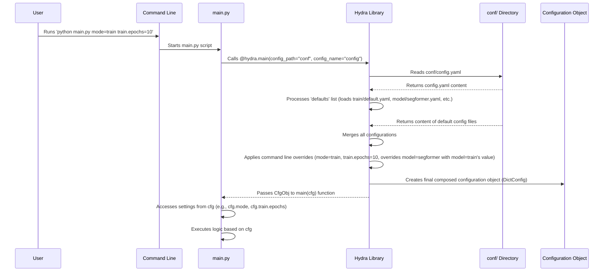

# Chapter 1: Hydra Configuration

Welcome to the first chapter of the SemiF-Segmentation tutorial! This project helps you train powerful models to understand images by identifying different objects or regions. Before we dive into the details of processing data or training models, let's talk about the **central control panel** of this project: **Hydra Configuration**.

## The Challenge: Managing Complexity

Imagine you're building a complex machine learning pipeline. You need to decide:

*   Which **model** to use (e.g., a simple one or a complex one)?
*   How many **epochs** (training cycles) should the model train for?
*   What **batch size** should you use for training?
*   Where is your **dataset** located?
*   Should you apply **data augmentation**? If so, which types?
*   Which **task** do you want to run right now (e.g., preprocess data, train the model, run inference)?

If you put all these settings directly inside your Python code, changing anything would mean editing the code, which can be messy, error-prone, and makes it hard to keep track of different experiments. You might end up with comments like `# TODO: Change epochs back to 50 later`.

Hydra solves this problem by letting you manage all your project's settings externally using simple, human-readable configuration files.

## What is Hydra?

Hydra is a framework for elegantly configuring complex applications. Its core idea is to manage configuration through **structured configuration files**, typically written in YAML format.

Think of your project as a complex machine. Hydra is like the main control panel with different sections (dials, buttons, switches) for each part of the machine (model settings, training settings, data paths, etc.). Instead of hardcoding these settings *inside* the machine's components, you define them on the *outside* using this control panel (the configuration files).

This allows you to:

1.  **Organize:** Keep related settings together in logical groups.
2.  **Compose:** Easily combine different sets of configurations (e.g., combine "default training settings" with "model A settings").
3.  **Override:** Change specific settings without touching the configuration files directly, especially useful for running different experiments from the command line.

## How it Works in SemiF-Segmentation

In the SemiF-Segmentation project, all the configuration files are located in the `conf` directory. Let's look at the main entry point: `conf/config.yaml`.

```yaml
# --- File: conf/config.yaml ---
defaults:
  - paths: default           # Default paths config
  - query: default           # Default query config
  - preprocess: default      # Default training config
  - augment: default         # Default augmentations config
  - model: segformer         # Model config (segformer, deeplabv3plus)
  - train: default           # Default Train config
  - inference: default       # Inference config

  - _self_                   # Ensures overriding behavior

project:
  name: test_synthetic

mode: ??? # required argument for command line. Either sync, query, preprocess, train, or inference

job_now_date: &nowdir ${now:%Y-%m-%d}
job_now_time: &nowtime ${now:%H:%M:%S}

hydra:
  run:
    dir: ${paths.project_mode_dir}/hydra/${job_now_date}_${job_now_time}
  # output_subdir: "default"
```

This `config.yaml` is the *primary* configuration file.

*   The `defaults` section is where the magic of **composition** happens. It lists other configuration files that Hydra should load and combine. For example, `- train: default` tells Hydra to load the configuration from `conf/train/default.yaml`. `- model: segformer` tells it to load `conf/model/segformer.yaml`.
*   Hydra merges all these default configurations into a single, large configuration object.
*   Parameters defined directly in `config.yaml` (like `project` and `mode`) are also included.
*   The `mode: ???` is special. The `???` means this value is **required** and *must* be provided, usually from the command line. This is how you tell the project which task you want to run (e.g., `train`, `preprocess`, `inference`).

Let's peek at one of the default files mentioned: `conf/train/default.yaml`.

```yaml
# --- File: conf/train/default.yaml ---
mode: train
epochs: 50
batch_size: 4
seed: 42
augment: default
class_mode: multiclass
out_classes: 3

loss:
  name: smpDiceLoss

lr:
  base_lr: 0.001

# ... other training settings ...

trainer:
  max_epochs: ${train.epochs} # Example of referencing other parts of config

# ... more settings ...
```

This file contains settings specifically for the training process. Notice how some values like `max_epochs` use `${train.epochs}`. This is **interpolation**, allowing values to reference other parts of the composed configuration.

## Accessing Configuration in Code (`main.py`)

Now, how does the Python code use this configuration? Let's look at a simplified version of `main.py`.

```python
# --- File: main.py (Simplified) ---
import logging
import hydra
from omegaconf import DictConfig # DictConfig is Hydra's config object type
from omegaconf import OmegaConf

log = logging.getLogger(__name__)

# ... TASK_REGISTRY dictionary ...

@hydra.main(version_base="1.3", config_path="conf", config_name="config")
def main(cfg: DictConfig) -> None:
    # The 'cfg' variable here holds the ENTIRE composed configuration!
    cfg = OmegaConf.create(cfg) # Ensure it's a modifiable OmegaConf object
    
    mode = cfg.mode # Access the 'mode' parameter
    log.info(f"Starting {mode}")

    # ... Use cfg to select and run tasks ...
    # Example: Access training epochs
    # print(f"Training for {cfg.train.epochs} epochs")
    # Example: Access model architecture name
    # print(f"Using model: {cfg.model.arch_name}")

    # Example: Access batch size
    # print(f"Batch size: {cfg.train.batch_size}")

    # Call the selected task function, passing the configuration
    if mode in TASK_REGISTRY:
       TASK_REGISTRY[mode](cfg)
    else:
       log.error(f"Task {mode} not found")

if __name__ == "__main__":
    main()
```

*   The `@hydra.main` decorator is the key. It tells Hydra to load the configuration before running the `main` function.
*   `config_path="conf"` tells Hydra where to find the configuration directory.
*   `config_name="config"` tells Hydra the name of the primary configuration file (without the `.yaml` extension).
*   When `main` is called, Hydra automatically passes the complete, merged configuration as the `cfg` argument (which is a `DictConfig` object from the `omegaconf` library, specifically designed for working with structured configs).
*   Inside `main`, you can access any parameter from any of the loaded configuration files using dot notation (e.g., `cfg.mode`, `cfg.train.epochs`, `cfg.model.arch_name`).

## Overriding Configuration from the Command Line

This is one of Hydra's most powerful features. You can easily change any setting without modifying the YAML files by providing key-value pairs on the command line.

Let's revisit our initial problem: changing the training epochs. The default in `conf/train/default.yaml` is 50.

To run the training task with the default settings:

```bash
python main.py mode=train
```

This command sets `cfg.mode` to `train`, which tells `main.py` to execute the training logic using the configuration loaded from the defaults (including `train.epochs=50`).

Now, to run training but only for 10 epochs instead:

```bash
python main.py mode=train train.epochs=10
```

That's it! Hydra intercepts `train.epochs=10` and overrides the default value (`50`) with `10` *before* the `cfg` object is passed to your `main` function.

You can override multiple settings:

```bash
python main.py mode=train train.epochs=20 train.batch_size=8 model=deeplabv3plus
```

This command:
*   Sets the task mode to `train`.
*   Changes the number of training epochs to 20.
*   Changes the batch size to 8.
*   Crucially, it also tells Hydra to load the `conf/model/deeplabv3plus.yaml` configuration instead of the default `segformer`, changing the model architecture used for training. This overrides the `- model: segformer` line in `config.yaml`.

This command-line overriding capability is fantastic for:
*   Quickly testing different hyperparameters.
*   Running multiple experiments with slight variations.
*   Reproducing specific experiment settings.

## Internal Workflow (Simplified)

Here's a simplified view of what happens when you run a command like `python main.py mode=train train.epochs=10`:



Hydra acts as an intermediary, taking your command-line instructions and configuration files, merging them, applying overrides, and then handing a complete, ready-to-use configuration object to your main script.

## Summary

In this chapter, we learned that **Hydra** is the configuration manager for the SemiF-Segmentation project. It uses structured **YAML files** in the `conf` directory to define all project settings. The main file, `conf/config.yaml`, uses the `defaults` section to compose configurations from different files (like model, train, preprocess settings).

The `@hydra.main` decorator in `main.py` loads this configuration and provides it as a `cfg` object to the `main` function, where it can be easily accessed using dot notation (e.g., `cfg.train.epochs`).

Most importantly, you can override *any* setting from the command line using `parameter_name=value`, making it incredibly flexible to run different tasks and experiments without changing your code or configuration files directly.

Now that you understand how the project gets its instructions, let's see how the `main.py` script uses this configuration to decide *what* to do.

[Chapter 2: Task Orchestration](02_task_orchestration_.md)

---

Generated by [AI Codebase Knowledge Builder](https://github.com/The-Pocket/Tutorial-Codebase-Knowledge)