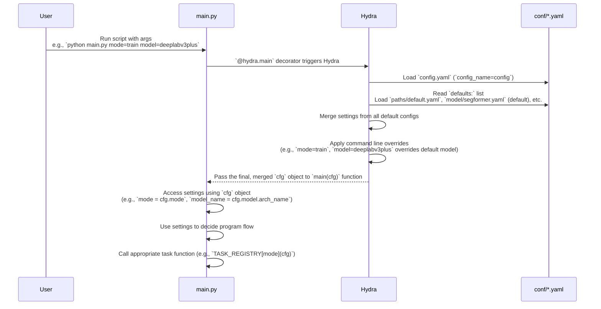

# Chapter 1: Hydra Configuration System

Welcome to the `SemiF-Segmentation` tutorial! This first chapter introduces you to a powerful tool used in this project: the **Hydra Configuration System**.

Imagine you have a complex machine with lots of knobs and buttons to control how it works. In a software project like this one, running different experiments (like training a new model, analyzing data, or making predictions) requires changing many settings – things like which model to use, where your data is, how many times to train the model (epochs), etc.

Without a good system, you'd have to dig into the code and change numbers or settings directly. This quickly gets messy:
1.  It's hard to remember which settings you used for a specific experiment.
2.  It's easy to make mistakes when changing code.
3.  Sharing your exact setup with someone else is difficult.

This is where Hydra comes in!

## What is Hydra? (Your Project's Control Panel)

Hydra is like the **central control panel** for the `SemiF-Segmentation` project. Instead of changing settings *inside* your Python code, you define all your settings in **configuration files**, specifically YAML (`.yaml`) files located primarily in the `conf/` folder.

When you run the main script (`main.py`), it uses Hydra to read these configuration files. The settings are then neatly organized and available to the rest of the code.

This system offers several great benefits:
*   **Organization:** Keep all your settings separate from your code.
*   **Experimentation:** Easily switch between different sets of settings (e.g., train a small model vs. a large model) by simply changing which config files are loaded or by providing arguments directly on the command line.
*   **Reproducibility:** The exact settings for any run are captured, making it easy to reproduce results later.

## Configuration Files (.yaml)

Configuration files are written in a simple format called YAML. It's mostly just key-value pairs, similar to dictionaries in Python.

Look inside the `conf/` folder. You'll see files like `config.yaml`, and subfolders like `conf/model/`, `conf/train/`, etc., each containing more `.yaml` files.

The main file, `conf/config.yaml`, acts as the *primary* entry point for Hydra. It typically doesn't contain *all* settings itself, but rather points to *other* configuration files that contain specific groups of settings. This is done using the `defaults:` list.

Let's look at a simplified `conf/config.yaml`:

```yaml
defaults:
  - paths: default           # Default paths config
  - model: segformer         # Default model config (segformer, deeplabv3plus)
  - train: default         # Default train config
  # ... other default configs

mode: ??? # required argument for command line. Either sync, query, preprocess, train, or inference

# ... other global settings
```

In this `defaults:` section, `config.yaml` is telling Hydra: "Also load the settings from `conf/paths/default.yaml`, `conf/model/segformer.yaml`, and `conf/train/default.yaml`." Hydra combines all these settings into a single, large configuration object.

This hierarchical structure (configs including other configs) is super helpful! You can have separate files for `model` settings, `train` settings, `paths`, etc., keeping everything modular.

For example, here's a snippet from `conf/model/segformer.yaml`:

```yaml
arch_name: Segformer
encoder_name: resnet152
encoder_weights: imagenet
in_channels: 3
out_classes: ${train.out_classes} # <-- Reads a value from the 'train' config!
# ... other model settings
```

And `conf/model/deeplabv3plus.yaml`:

```yaml
arch_name: DeepLabV3Plus
encoder_name: resnet152
encoder_weights: imagenet
in_channels: 3
out_classes: ${train.out_classes} # <-- Reads a value from the 'train' config!
# ... other model settings
```

Notice how `conf/model/segformer.yaml` and `conf/model/deeplabv3plus.yaml` define different `arch_name`s but might share other settings or even reference values from other config files (like `${train.out_classes}`).

The `defaults:` list in `conf/config.yaml` decides *which* model configuration (or any other configuration group) is loaded by default. If `defaults:` has `- model: segformer`, then `conf/model/segformer.yaml` is loaded.

## Accessing Configuration in Code (`cfg`)

Now, how does the code actually *use* these settings?

Look at the `main.py` file. The core entry point is decorated with `@hydra.main`:

```python
import hydra
from omegaconf import DictConfig
# ... other imports and code ...

@hydra.main(version_base="1.3", config_path="conf", config_name="config")
def main(cfg: DictConfig) -> None:
    # cfg is the merged configuration object!
    # Access settings like this:
    mode = cfg.mode 
    log.info(f"Starting {mode}")

    # ... rest of the code uses cfg to control behavior ...
    if mode not in TASK_REGISTRY:
        log.error(f"Task {mode} not found in task registry")
        return
    
    TASK_REGISTRY[mode](cfg) # Pass the config to the specific task function

# ... if __name__ == "__main__": main() ...
```

The `@hydra.main` decorator tells Hydra:
*   Where to find configuration files (`config_path="conf"`).
*   Which is the main config file to start with (`config_name="config"`).
*   The `version_base` helps manage Hydra versions.

When you run `main.py`, Hydra does its magic (loading defaults, merging files) and then passes the resulting complete configuration object as the `cfg` argument to the `main` function.

Inside `main`, `cfg` is an `omegaconf.DictConfig` object, which works very much like a Python dictionary or an object with attributes. You can access settings using dot notation (e.g., `cfg.mode`, `cfg.model.arch_name`) or dictionary access (e.g., `cfg['mode']`, `cfg['model']['arch_name']`).

The `main` function in `main.py` uses `cfg.mode` to figure out which main task (`sync`, `query`, `preprocess`, `train`, or `inference`) to run. It then calls the corresponding function from the `TASK_REGISTRY` and, importantly, passes the entire `cfg` object to that function. This means every part of the project (`src/train.py`, `src/inference.py`, etc.) gets access to the full set of configuration settings.

You can see this pattern in other main task files, like `src/train.py`:

```python
# ... imports ...
@hydra.main(version_base="1.3", config_path="../conf", config_name="config")
def main(cfg: DictConfig):
    # cfg contains ALL merged settings, including train specific ones
    epochs = cfg.train.epochs
    batch_size = cfg.train.batch_size
    model_name = cfg.model.arch_name # Accessing model settings

    log.info(f"Training for {epochs} epochs with batch size {batch_size}")
    log.info(f"Using model: {model_name}")
    
    # ... rest of train logic using cfg ...
```
Notice `src/train.py` also has an `@hydra.main` decorator. This allows you to potentially run `train.py` directly if needed (though the primary way is usually through `main.py`), but the key point is that *any* function decorated with `@hydra.main` receives the full, merged `cfg` object. The `config_path="../conf"` is adjusted here because `src/train.py` is in a subdirectory relative to the `conf/` folder.

## Command Line Overrides

One of Hydra's most powerful features is overriding settings directly from the command line. This is how you can easily run the *same* script with *different* configurations without changing *any* files.

The syntax is simple: `python your_script.py key=value`.

Let's go back to our main use case: running different modes or using different models.

1.  **Running the default training mode:**
    Assuming `conf/config.yaml` has `mode: ???` (meaning it's a required argument) and `defaults:` includes `- model: segformer`:

    ```bash
    python main.py mode=train
    ```

    *   **What happens:** Hydra loads `conf/config.yaml`, sees `mode=???` and gets `train` from the command line. It loads the defaults, including `conf/model/segformer.yaml`. The `cfg` object passed to `main` will have `cfg.mode = 'train'` and `cfg.model.arch_name = 'Segformer'`. The `main` function then calls the `train` task.

2.  **Running the inference mode:**

    ```bash
    python main.py mode=inference
    ```

    *   **What happens:** Similar to above, `cfg.mode` becomes `'inference'`. The `main` function calls the `inference` task ([Inference Pipeline](09_inference_pipeline_.md)). Other settings (like the model) are still loaded from the defaults unless overridden.

3.  **Running training with a different model:**

    ```bash
    python main.py mode=train model=deeplabv3plus
    ```

    *   **What happens:** Hydra loads `conf/config.yaml`. The command line sets `cfg.mode = 'train'`. The command line *also* overrides the `model` default. Even though `conf/config.yaml` might say `- model: segformer` in its `defaults:`, the command line `model=deeplabv3plus` tells Hydra to load `conf/model/deeplabv3plus.yaml` *instead*. The `cfg` object passed to `main` will have `cfg.mode = 'train'` and `cfg.model.arch_name = 'DeepLabV3Plus'`. The `train` task will then be executed using the DeepLabV3+ model configuration.

You can override multiple settings at once:

```bash
python main.py mode=train model=deeplabv3plus train.epochs=10 train.batch_size=8
```

This command would:
*   Set `cfg.mode` to `'train'`.
*   Load the `deeplabv3plus` model config (`cfg.model.arch_name` will be 'DeepLabV3Plus').
*   Override the default `epochs` setting in the `train` config to `10` (`cfg.train.epochs` will be 10).
*   Override the default `batch_size` setting in the `train` config to `8` (`cfg.train.batch_size` will be 8).

This command line override capability makes running experiments incredibly flexible!

## How it Works Under the Hood (Simplified)

Let's trace what happens when you run a command like `python main.py mode=train model=deeplabv3plus`:



Here's a slightly more detailed look at the code pieces involved in `main.py`:

1.  **The `@hydra.main` decorator:** This is the entry point. It tells Hydra to initialize and process the configuration before running the decorated function (`main`).
    ```python
    @hydra.main(version_base="1.3", config_path="conf", config_name="config")
    def main(cfg: DictConfig) -> None:
        # ... function body ...
    ```

2.  **The `cfg` argument:** The `main` function receives the final, processed configuration as the `cfg` object (specifically, an `omegaconf.DictConfig`, which is like a super-powered dictionary).
    ```python
    def main(cfg: DictConfig) -> None: # cfg holds all the settings
        # ... use cfg ...
    ```

3.  **Accessing settings:** You use dot notation (`cfg.section.key`) or dictionary notation (`cfg['section']['key']`) to get specific values from the configuration.
    ```python
    def main(cfg: DictConfig) -> None:
        cfg = OmegaConf.create(cfg) # Sometimes you'll see this for safety/features
        mode = cfg.mode # Get the mode setting
        log.info(f"Starting {mode}")
        
        # Check the mode and call the right function
        if mode not in TASK_REGISTRY:
            log.error(f"Task {mode} not found in task registry")
            return
        
        TASK_REGISTRY[mode](cfg) # Pass the config along!
    ```
    The `TASK_REGISTRY` maps the string `mode` (like "train", "inference") to the actual Python function (`src.train.main`, `src.inference.main`). When `TASK_REGISTRY[mode](cfg)` is called, the *entire* `cfg` object is passed to the relevant main function (e.g., `src/train.py`'s `main` function), which is also set up to receive a `cfg` object. This ensures that all parts of the project have access to the global configuration settings.

## Conclusion

You've learned that Hydra acts as the configuration control panel for the `SemiF-Segmentation` project, using `.yaml` files in the `conf/` directory to define settings. The `main.py` script uses `@hydra.main` to load these settings into a `cfg` object, which is then passed to different parts of the code. You can easily switch configurations and run experiments by using command line overrides like `key=value`.

This system keeps your code clean, makes experiments organized and reproducible, and allows you to control complex behaviors by simply modifying configuration files or command-line arguments.

In the next chapter, [Main Task Runner](02_main_task_runner_.md), we'll dive deeper into how the `main.py` script uses this `cfg` object to decide *which* main task (like training, preprocessing, etc.) to execute, effectively running the different modes you just saw configured by Hydra.

Ready to see how `main.py` orchestrates the different workflows?

[Next Chapter: Main Task Runner](02_main_task_runner_.md)

---

Generated by [AI Codebase Knowledge Builder](https://github.com/The-Pocket/Tutorial-Codebase-Knowledge)