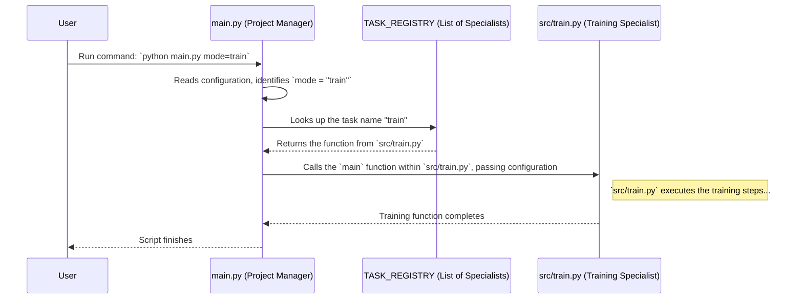

# Chapter 1: Task Orchestration (`main.py`)

Welcome to the SemiF-Segmentation project tutorial! We're excited to guide you through how this project works.

Imagine you're working on a big project, like building a model car. There are several steps: gathering the parts, assembling the body, painting, adding details, etc. You wouldn't want to do *everything* every single time you work on it. Sometimes you just want to paint, other times you just want to assemble. How do you manage these different tasks easily?

In our project, `SemiF-Segmentation`, we have similar steps for processing images and training models: preparing data (`preprocess`), training the model (`train`), using the model to make predictions (`inference`), and a few others. Trying to manage all this in one giant script would be messy!

This is where `main.py` comes in. Think of it as the **Project Manager** or a **Central Dispatcher**.

## What Problem Does `main.py` Solve?

`main.py` solves the problem of **organization and control**. It provides a single, simple way to tell the project *which specific task* you want to perform right now, without needing to dig through different files or run complicated commands.

**Use Case:** Let's say you've already prepared your data and now you just want to **train** your segmentation model. Instead of finding and running `src/train.py` directly (and maybe forgetting some setup steps), you can simply tell `main.py` what you want to do.

## Key Concepts

1.  **The Conductor (`main.py`):** This is the main script you interact with from your command line. It's the single entry point for most operations.
2.  **The Task (`mode`):** This is a special instruction you give to `main.py` to specify *what* you want to do. Examples include `train`, `preprocess`, `inference`, `query`, `sync`. You provide this `mode` when you run the script.
3.  **The Specialists (e.g., `src/train.py`, `src/preprocess.py`):** These are separate Python scripts, each designed to perform one specific task very well. `main.py` (the conductor) knows about these specialists and calls the correct one based on the `mode` you provide.

## How to Use `main.py`

Using `main.py` is straightforward. You run it from your terminal and tell it the `mode` you want.

**Example: Running Training**

To run the training task, you would open your terminal, navigate to the project's root directory, and type:

```bash
python main.py mode=train
```

*   `python main.py`: This tells Python to execute the `main.py` script.
*   `mode=train`: This is the crucial part! You're telling `main.py` that the task (mode) you want to run is `train`.

**What Happens?**

When you run this command:
1.  `main.py` starts up.
2.  It reads the `mode=train` instruction.
3.  It looks up which "specialist" script handles the `train` task (it knows this is `src/train.py`).
4.  It then calls the main function inside `src/train.py`, effectively starting the training process.

Similarly, if you wanted to run the preprocessing task, you would use:

```bash
python main.py mode=preprocess
```

This keeps things neat and tidy. You always interact with `main.py`, and it handles directing the work to the correct place.

## Under the Hood: How `main.py` Orchestrates Tasks

Let's peek behind the curtain to see how `main.py` works as the dispatcher.

**The Workflow (Analogy):**

1.  **You (User):** You decide you want to train the model. You go to the Project Manager (`main.py`).
2.  **You tell the Manager:** "I want to run the 'train' task." (You type `python main.py mode=train`).
3.  **Project Manager (`main.py`):** "Okay, 'train'. Let me check my list of specialists."
4.  **Manager looks at List (`TASK_REGISTRY`):** The manager has a list mapping task names to the specialist scripts. It finds the entry: `"train": train_function_from_train_py`.
5.  **Manager calls Specialist (`train.py`):** The manager finds the Training Specialist (`train.py`) and says, "Here are the project settings (the configuration `cfg`), please start the training process."
6.  **Training Specialist (`train.py`):** Gets the instructions and configuration, and starts its work (loading data, training the model).
7.  **Completion:** Once the specialist finishes, control returns to the manager, and the overall process ends.

**Visualizing the Flow:**

Here's a simple diagram showing the sequence:



## Diving Deeper into the Code (`main.py`)

Let's look at the key parts of the `main.py` script.

**1. Importing the Specialists:**

First, `main.py` needs to know *where* the code for each task lives. It imports the main function from each specialist script.

```python
# File: main.py

# Import the main functions from specialist scripts
from src.preprocess import main as preprocess  # Function for preprocessing
from src.inference import main as inference    # Function for inference
from src.train import main as train          # Function for training
from src.query import main as query          # Function for data querying
from src.sync import main as sync            # Function for file syncing

# ... other necessary imports like logging, hydra ...
```

*   **Explanation:** This code imports the `main` function from each task-specific Python file (like `src/train.py`) and gives them convenient names (`preprocess`, `inference`, `train`, etc.) within `main.py`.

**2. The List of Specialists (`TASK_REGISTRY`):**

`main.py` uses a Python dictionary to keep track of which task name corresponds to which imported function.

```python
# File: main.py

# Define a registry (like an address book) of tasks
TASK_REGISTRY = {
    "sync": sync,             # If mode is "sync", call the sync function
    "preprocess": preprocess, # If mode is "preprocess", call the preprocess function
    "train": train,           # If mode is "train", call the train function
    "inference": inference,   # If mode is "inference", call the inference function
    "query": query,           # If mode is "query", call the query function
    # Add more tasks here if needed
}
```

*   **Explanation:** This `TASK_REGISTRY` acts like the project manager's contact list. It maps the string you provide in the `mode` (e.g., `"train"`) to the actual Python function that should be executed (e.g., the `train` function we imported from `src/train.py`).

**3. The Main Orchestration Function:**

This is the core function that runs when you execute `python main.py`.

```python
# File: main.py
import logging
import hydra
from omegaconf import DictConfig # Used for configuration

log = logging.getLogger(__name__)

@hydra.main(version_base="1.3", config_path="conf", config_name="config")
def main(cfg: DictConfig) -> None:
    # 1. Get the 'mode' from the configuration (provided via command line)
    mode = cfg.mode
    log.info(f"Starting mode: {mode}")

    # 2. Check if the requested mode is valid (is it in our registry?)
    if mode not in TASK_REGISTRY:
        log.error(f"Task '{mode}' not found in task registry!")
        return # Stop if the mode is unknown

    # 3. Look up the correct specialist function using the mode
    task_function = TASK_REGISTRY[mode]

    # 4. Call the specialist function, passing the configuration to it
    log.info(f"Executing task: {mode}")
    task_function(cfg)

    log.info(f"Finished task: {mode}")

# This standard Python construct makes the script runnable
if __name__ == "__main__":
    main()
```

*   **Explanation:**
    *   The `@hydra.main(...)` line is a decorator. It uses a library called Hydra to handle loading configuration settings (like the `mode`). We'll learn more about this in the [next chapter](02_hydra_configuration_management_.md). For now, just know it magically provides the `cfg` object containing all settings, including the `mode`.
    *   `mode = cfg.mode` retrieves the task name you specified (e.g., "train").
    *   It checks if this `mode` exists as a key in our `TASK_REGISTRY`.
    *   If valid, `TASK_REGISTRY[mode]` fetches the correct specialist function (e.g., the `train` function).
    *   `task_function(cfg)` is the moment the dispatcher calls the specialist! It passes the configuration (`cfg`) so the specialist knows all the necessary details (like file paths, model settings, etc.).

**4. Setting the `mode` (in `conf/config.yaml`):**

How does Hydra know about the `mode`? It's defined in the configuration files, typically `conf/config.yaml`.

```yaml
# File: conf/config.yaml
defaults:
  # ... other configuration defaults ...
  - _self_

project:
  name: grasses_001

# This 'mode' must be provided when running main.py
mode: ??? # required argument for command line. Either sync, preprocess, train, or inference

# ... other settings ...
```

*   **Explanation:** The `mode: ???` line signifies that `mode` is a required setting. You *must* provide it on the command line when you run `main.py` (e.g., `python main.py mode=train`). Hydra takes care of reading this command-line argument and putting it into the `cfg` object used in `main.py`.

**5. The Specialist Scripts (Example: `src/train.py`):**

Each specialist script also has a `main` function that expects the configuration (`cfg`) as input.

```python
# File: src/train.py (Simplified structure)
import hydra
from omegaconf import DictConfig
# ... other imports needed for training ...

# This function is the entry point for the 'train' task
@hydra.main(version_base="1.3", config_path="../conf", config_name="config")
def main(cfg: DictConfig):
    print(f"--- Starting Training for project: {cfg.project.name} ---")
    # Access settings from cfg, e.g., cfg.train.batch_size
    
    # --- Add actual training code here ---
    # Load data (using paths from cfg.paths)
    # Define model (using settings from cfg.model)
    # Run training loop (using settings from cfg.train)
    # --- End of actual training code ---
    
    print("--- Training Finished ---")

# This part is usually only relevant if running train.py directly,
# but our primary way is via main.py mode=train
# if __name__ == "__main__":
#     main()
```

*   **Explanation:** Notice that `src/train.py` (and other specialists like [Preprocessing Pipeline (`preprocess.py` & `src/preprocessing/`)](04_preprocessing_pipeline___preprocess_py_____src_preprocessing____.md), [Inference Pipeline (`inference.py`)](08_inference_pipeline___inference_py___.md), etc.) has its own `main(cfg: DictConfig)` function. This is the function that `main.py` calls when `mode=train`. It receives the same configuration object `cfg`, allowing it to access all the settings it needs for its specific task.

## Conclusion

Congratulations! You've learned about the role of `main.py` as the central **Task Orchestrator** in the `SemiF-Segmentation` project.

*   It acts like a **project manager**, providing a single entry point to run different tasks.
*   You tell it which task to run using the `mode=` argument (e.g., `mode=train`).
*   It uses a `TASK_REGISTRY` to find the correct "specialist" script (like `src/train.py`) for the requested `mode`.
*   It calls the specialist script, passing along all necessary configuration settings.

This design keeps the project well-organized, making it easy to manage and execute different stages like data preparation, training, and inference.

You might be wondering how all those settings (`cfg`) are managed and passed around. That's handled by a powerful tool called Hydra. In the next chapter, we'll dive into how configuration works in this project.

Ready to learn more? Let's move on to [Chapter 2: Hydra Configuration Management](02_hydra_configuration_management_.md)!

---

Generated by [AI Codebase Knowledge Builder](https://github.com/The-Pocket/Tutorial-Codebase-Knowledge)