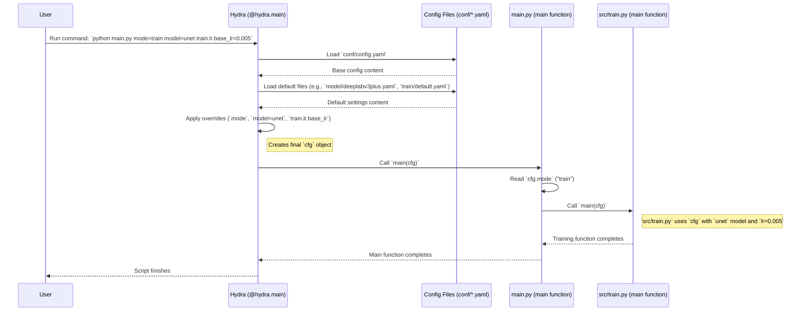

# Chapter 2: Hydra Configuration Management

In the [previous chapter](01_task_orchestration___main_py___.md), we learned how `main.py` acts as the project manager, directing tasks like `train` or `preprocess`. We saw that `main.py` passes a mysterious `cfg` object to these tasks, containing all the necessary settings. But where do these settings come from, and how can we easily change them?

That's where **Hydra** comes in!

## What Problem Does Hydra Solve?

Imagine you're baking a cake. You have a recipe book (`conf/`) filled with different recipes (configuration files). One recipe might be for a vanilla cake with specific ingredients and baking times. Another might be for a chocolate cake.

Now, imagine you want to bake the vanilla cake, but instead of using regular sugar, you want to use brown sugar. Or maybe you want to double the amount of vanilla extract.

**Without Hydra:** You might have to scribble directly on the recipe page in the book, making it messy and hard to remember the original recipe. In code, this is like *hardcoding* values directly into your Python scripts (`src/train.py`, `src/preprocess.py`). If you want to change the learning rate for training, you'd have to find the line in `src/train.py` and edit it. This gets complicated quickly, especially when you want to try many different variations (experiments).

**With Hydra:** Hydra acts like a master chef's assistant. It reads the recipes from your recipe book (`conf/`). If you want to change an ingredient (like the learning rate) or even swap the entire recipe (like switching from a `DeepLabV3Plus` model to a `UNet` model), you just tell the assistant *before* starting. You can do this easily through the command line or by creating a new, clean recipe variation. Hydra keeps everything organized, making it easy to run experiments and know *exactly* what settings were used each time.

**Use Case:** Let's say you want to train your segmentation model. The default recipe uses the `DeepLabV3Plus` model with a learning rate of `0.001`. But you want to try training with a `UNet` model instead, and also experiment with a different learning rate, say `0.005`. Hydra lets you do this without touching the main code, just by changing instructions when you run the script.

## Key Concepts

1.  **Configuration Files (`conf/`):** This directory is like your recipe book. It contains `.yaml` files (YAML is a human-friendly way to structure data). These files define all the settings for the project – file paths, model types, training parameters, etc.
    *   `conf/config.yaml`: The main recipe file. It often includes other, more specific recipe files.
    *   `conf/model/`: A folder for different model recipes (e.g., `deeplabv3plus.yaml`, `unet.yaml`).
    *   `conf/train/`: A folder for different training parameter recipes (e.g., `default.yaml`).
    *   And so on...

2.  **Hydra Decorator (`@hydra.main`):** This is a special instruction (a "decorator") you put above your main Python functions (like `main` in `main.py` or `src/train.py`). It tells Python: "Hey, before you run this function, use Hydra to read the recipes from the `conf/` directory and prepare the settings."

    ```python
    # File: main.py (Simplified)
    import hydra
    from omegaconf import DictConfig

    # This decorator activates Hydra
    @hydra.main(version_base="1.3", config_path="conf", config_name="config")
    def main(cfg: DictConfig) -> None:
        # Hydra automatically creates 'cfg' based on the YAML files
        print(f"Project Name: {cfg.project.name}")
        # ... rest of the code uses cfg ...
    ```

3.  **Configuration Object (`cfg`):** When Hydra reads the YAML files, it bundles all the settings into a special Python object, typically called `cfg`. This object acts like a neatly organized list of all your settings, which you can easily access in your code (e.g., `cfg.project.name`, `cfg.model.encoder_name`, `cfg.train.lr.base_lr`).

4.  **Command-Line Overrides:** This is one of Hydra's superpowers! You can easily change specific settings directly from your terminal when you run the script, without editing any files. Hydra automatically merges these changes into the final `cfg` object.

## How to Use Hydra

Let's see how we can manage our settings using Hydra.

**1. The Configuration Files (`.yaml`)**

Take a peek inside the `conf/` directory. You'll find files structured like this:

```yaml
# File: conf/config.yaml (Simplified)

# Include settings from other files by default
defaults:
  - model: deeplabv3plus  # Use the settings from conf/model/deeplabv3plus.yaml
  - train: default      # Use the settings from conf/train/default.yaml
  - paths: default      # Use the settings from conf/paths/default.yaml
  - _self_             # Allows overriding values defined here

# Settings specific to this main config file
project:
  name: grasses_001

# The task to run (must be provided via command line)
mode: ???
```

*   **Explanation:** This main `config.yaml` sets up the default "recipe". The `defaults` section tells Hydra to load settings from other files (like recipes for the model, training, paths). It also defines a `project.name`. Notice `mode: ???` - Hydra knows this setting *must* be provided when you run the script.

Let's look at a model recipe:

```yaml
# File: conf/model/deeplabv3plus.yaml (Simplified)

arch_name: DeepLabV3Plus   # The type of model architecture
encoder_name: resnet152  # The "backbone" of the model
encoder_weights: imagenet # Start with pre-trained weights
```

*   **Explanation:** This file defines settings specifically for the `DeepLabV3Plus` model. When `defaults` in `config.yaml` includes `model: deeplabv3plus`, these settings become part of the final `cfg`.

And the training recipe:

```yaml
# File: conf/train/default.yaml (Simplified)

epochs: 50          # How many times to loop through the data
batch_size: 8       # How many images to process at once
lr:
  base_lr: 0.001  # The starting learning rate
```

*   **Explanation:** This defines default training parameters like the number of epochs, batch size, and learning rate.

**2. Accessing Settings in Python (`cfg`)**

The `@hydra.main` decorator makes the `cfg` object available inside the decorated function. You access settings using dot notation, mirroring the structure in the YAML files.

```python
# File: src/train.py (Simplified Snippet)
import hydra
from omegaconf import DictConfig
import logging

log = logging.getLogger(__name__)

@hydra.main(version_base="1.3", config_path="../conf", config_name="config")
def main(cfg: DictConfig):
    log.info("--- Starting Training ---")

    # Access settings from the cfg object
    model_architecture = cfg.model.arch_name # Gets 'DeepLabV3Plus' (from conf/model/deeplabv3plus.yaml)
    learning_rate = cfg.train.lr.base_lr    # Gets 0.001 (from conf/train/default.yaml)
    num_epochs = cfg.train.epochs           # Gets 50 (from conf/train/default.yaml)

    log.info(f"Using model: {model_architecture}")
    log.info(f"Learning Rate: {learning_rate}")
    log.info(f"Training for {num_epochs} epochs.")

    # --- Actual training code would use these variables ---
    # model = create_model(architecture=model_architecture, ...)
    # optimizer = create_optimizer(lr=learning_rate, ...)
    # run_training_loop(epochs=num_epochs, ...)
    # ---

    log.info("--- Training Finished ---")

# Note: We run this via 'python main.py mode=train', not directly.
```

*   **Explanation:** Inside the `main` function of `src/train.py`, we can easily get values like `cfg.model.arch_name` or `cfg.train.lr.base_lr`. Hydra automatically assembled these from the specified YAML files.

**3. Overriding Settings from the Command Line**

This is where Hydra shines for experiments! Let's tackle our use case: running `train` mode, but switching the model to `unet` (assuming we have a `conf/model/unet.yaml` file) and changing the learning rate to `0.005`.

You simply add these changes to the command line:

```bash
python main.py mode=train model=unet train.lr.base_lr=0.005
```

*   `python main.py`: Run the main script.
*   `mode=train`: Set the task to `train`.
*   `model=unet`: **Override!** Instead of using the default `model: deeplabv3plus` from `config.yaml`, Hydra will now load settings from `conf/model/unet.yaml`.
*   `train.lr.base_lr=0.005`: **Override!** Change the learning rate defined in `conf/train/default.yaml` (or `conf/train/unet.yaml` if it exists and defines it) to `0.005`.

**What Happens?** Hydra sees these command-line arguments. It first loads the default configuration (`config.yaml`, which includes `deeplabv3plus.yaml`, `train/default.yaml`, etc.). Then, it *overrides* the model setting to use `unet.yaml` instead and specifically changes the `base_lr` value within the `train.lr` group to `0.005`. The final `cfg` object passed to the `train` function will reflect these changes. Your code in `src/train.py` doesn't need to change at all!

## Under the Hood: How Hydra Builds the Configuration

Let's trace the steps when you run `python main.py mode=train model=unet train.lr.base_lr=0.005`:

1.  **Command Execution:** You run the command in your terminal.
2.  **Hydra Intercepts:** The `@hydra.main` decorator in `main.py` catches the execution *before* the `main` function runs.
3.  **Load Base Config:** Hydra looks for `conf/config.yaml` (because `config_path="conf"` and `config_name="config"` were specified in the decorator).
4.  **Process Defaults:** It reads the `defaults` list in `config.yaml`.
    *   It sees `model: deeplabv3plus` (the default).
    *   It sees `train: default`.
    *   It loads the corresponding YAML files (`conf/model/deeplabv3plus.yaml`, `conf/train/default.yaml`, etc.) and merges their settings.
5.  **Apply Overrides:** Hydra processes the command-line arguments.
    *   `mode=train`: It sets `cfg.mode` to `"train"`.
    *   `model=unet`: It *replaces* the previously loaded `model` settings (from `deeplabv3plus.yaml`) with the settings from `conf/model/unet.yaml`.
    *   `train.lr.base_lr=0.005`: It finds the `base_lr` setting under `train.lr` and changes its value to `0.005`.
6.  **Create `cfg` Object:** Hydra assembles the final, merged, and overridden settings into the `cfg` object.
7.  **Call Function:** Hydra calls the actual `main` function in `main.py`, passing the fully prepared `cfg` object to it.
8.  **Task Dispatch:** `main.py` reads `cfg.mode` ("train"), finds the `train` function from `src/train.py` in its `TASK_REGISTRY`, and calls it, passing the *same* `cfg` object.
9.  **Task Execution:** The `train` function in `src/train.py` runs, using the settings provided in `cfg` (which now reflect the `unet` model and the `0.005` learning rate).

**Visualizing the Flow:**



## Diving Deeper into the Code

**1. The Hydra Decorator (`@hydra.main`)**

```python
# File: main.py (or src/train.py, etc.)

import hydra
from omegaconf import DictConfig

# Decorator tells Python to use Hydra before running 'main'
@hydra.main(version_base="1.3", config_path="conf", config_name="config")
def main(cfg: DictConfig) -> None:
    # 'cfg' is automatically populated by Hydra
    # ... function code ...
```

*   **Explanation:**
    *   `@hydra.main(...)`: The magic trigger for Hydra.
    *   `version_base="1.3"`: Specifies Hydra version compatibility.
    *   `config_path="conf"`: Tells Hydra where to find the configuration directory relative to *this* Python file. If the script is in the root, it's `conf`. If it's in `src/`, it needs to be `../conf`.
    *   `config_name="config"`: Specifies the name of the main configuration file to load (`config.yaml`).

**2. Composition using `defaults`**

```yaml
# File: conf/config.yaml

defaults:
  - paths: default           # Load conf/paths/default.yaml
  - query: default           # Load conf/query/default.yaml
  - preprocess: default      # Load conf/preprocess/default.yaml
  - model: deeplabv3plus     # Load conf/model/deeplabv3plus.yaml
  - train: default         # Load conf/train/default.yaml
  # ... other defaults ...
  - _self_                   # Important: Allows overriding values in *this* file
                             # from the command line or other included files.
```

*   **Explanation:** The `defaults` list is Hydra's way of building the configuration from smaller, reusable pieces. Each item tells Hydra which file to load for a specific configuration *group* (e.g., `paths`, `model`, `train`). The order matters - later items can override earlier ones if they define the same keys. `_self_` ensures that settings defined directly in `config.yaml` can also be overridden.

**3. Accessing Nested Values**

YAML files allow nested structures, which translate directly to the `cfg` object.

```yaml
# File: conf/train/default.yaml (Partial)
lr:
  base_lr: 0.001
```

```python
# File: src/train.py (Partial)
def main(cfg: DictConfig):
    # Access the nested learning rate value
    learning_rate = cfg.train.lr.base_lr # Accesses 0.001
    print(learning_rate)
```

*   **Explanation:** The nested structure `lr:` followed by `base_lr:` in the YAML file is accessed in Python using `cfg.train.lr.base_lr`. Hydra handles this mapping automatically.

## Conclusion

You've now learned about **Hydra**, the configuration management system used in `SemiF-Segmentation`.

*   Hydra uses simple **YAML files** (`conf/`) to define all project settings, like a recipe book.
*   It keeps settings separate from the code, making the code cleaner and the settings easier to manage.
*   The **`@hydra.main` decorator** automatically loads these settings into a `cfg` object.
*   You can easily **override** settings from the **command line**, perfect for running experiments without changing files.
*   This makes the project highly **flexible**, **organized**, and ensures your experiments are **reproducible**.

Think of Hydra as the control panel for the entire project. Instead of rewiring things (editing code), you just flip switches or turn dials (change YAML files or use command-line overrides).

In the next chapter, we'll look at the first specific task that uses these configurations: how the project queries and samples data based on criteria defined in the Hydra config files.

Let's move on to [Chapter 3: Data Querying & Sampling (`query.py`)](03_data_querying___sampling___query_py___.md)!

---

Generated by [AI Codebase Knowledge Builder](https://github.com/The-Pocket/Tutorial-Codebase-Knowledge)