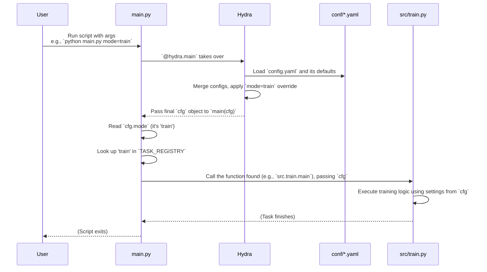

# Chapter 2: Main Task Runner

Welcome back to the `SemiF-Segmentation` tutorial! In [Chapter 1: Hydra Configuration System](01_hydra_configuration_system_.md), you learned how Hydra acts as the project's control panel, allowing you to define settings in `.yaml` files and load them into a `cfg` object using `@hydra.main`. You also saw how to control *which* settings are used via command-line arguments, like specifying `mode=train` or `model=deeplabv3plus`.

Now that we know *how* the project reads its instructions (via `cfg`), the next question is: *how* does the project decide *what* to do with those instructions? For example, if you set `mode=train`, how does the project know to start the training process instead of, say, preprocessing data?

This is where the **Main Task Runner** comes in.

## What is the Main Task Runner? (The Project's Switchboard)

Think of the `main.py` file as the project's **central switchboard** or a **project manager**. When you run the script (e.g., `python main.py ...`), `main.py` is the first piece of code that gets executed.

Its primary job is very simple but crucial:
1.  Receive the complete configuration (`cfg`) from Hydra.
2.  Look at the `mode` setting within `cfg` (e.g., `cfg.mode`).
3.  Based on that `mode`, figure out *which specific task* (like training, inference, preprocessing, etc.) you want to perform.
4.  Call the appropriate code function designed for that specific task.

It's like the main desk at a large building: someone comes in, says they're here for "Department A" (that's the `mode`), and the person at the desk directs them to the correct department's office (that's the specific task function).

## How to Tell the Runner What to Do

As you saw in Chapter 1, you tell the runner what to do by setting the `mode` configuration value. This is typically done on the command line when you run `main.py`:

```bash
python main.py mode=train
```

Here, you are telling the `main.py` runner: "Please run the 'train' task."

```bash
python main.py mode=inference
```

And here you're saying: "Please run the 'inference' task."

The `main.py` script reads this `mode` from the `cfg` object that Hydra provides and then takes action based on it.

## How it Works Inside `main.py` (The Switchboard Logic)

Let's look at the core parts of `main.py` that make this happen.

First, the script needs to know about all the possible tasks it can run. Each major task (like training, inference, etc.) is implemented in its own Python file (e.g., `src/train.py`, `src/inference.py`). The `main.py` file imports the main function from each of these task files:

```python
# --- Snippet from main.py ---
import logging
import hydra
from omegaconf import DictConfig
from omegaconf import OmegaConf

# Import the task functions
from src.preprocess import main as preprocess # Renamed to 'preprocess'
from src.inference import main as inference   # Renamed to 'inference'
from src.train import main as train         # Renamed to 'train'
from src.query import main as query         # Renamed to 'query'
from src.sync import main as sync           # Renamed to 'sync'

# ... rest of main.py
```

Here, `main.py` is importing the `main` function from each of the task-specific files (`src/preprocess.py`, `src/inference.py`, etc.) and giving them simpler names (`preprocess`, `inference`, etc.) just within the `main.py` script. This is like knowing the names of all the "specialist teams" available.

Next, `main.py` needs a way to quickly find the correct task function based on the `mode` string it gets from `cfg`. It uses a **registry** for this. A registry is just a fancy name for a Python dictionary that maps strings (the mode names) to the functions imported earlier.

```python
# --- Snippet from main.py ---
# ... imports ...

log = logging.getLogger(__name__)

# Define a registry of tasks - Maps mode names (strings) to functions
TASK_REGISTRY = {
    "sync": sync,         # If mode is 'sync', call the 'sync' function (from src.sync)
    "preprocess": preprocess, # If mode is 'preprocess', call the 'preprocess' function (from src.preprocess)
    "train": train,       # If mode is 'train', call the 'train' function (from src.train)
    "inference": inference,   # If mode is 'inference', call the 'inference' function (from src.inference)
    "query": query,         # If mode is 'query', call the 'query' function (from src.query)
    # Add more tasks here as needed
}

# ... rest of main.py
```

This `TASK_REGISTRY` dictionary is the heart of the switchboard. If the `mode` is "train", `TASK_REGISTRY["train"]` will give you the `train` function (which was imported from `src/train.py`).

Now, let's look at the `main` function itself, which is where the `@hydra.main` decorator gives us the `cfg` object:

```python
# --- Snippet from main.py ---
# ... imports and TASK_REGISTRY ...

@hydra.main(version_base="1.3", config_path="conf", config_name="config")
def main(cfg: DictConfig) -> None:
    # 1. Get the configuration from Hydra (Hydra does this via the decorator)
    # cfg is the complete configuration object

    # Optional: Create a copy or ensure writability (common practice)
    cfg = OmegaConf.create(cfg) 
    
    # 2. Read the 'mode' from the configuration
    mode = cfg.mode
    log.info(f"Starting {mode}") # Log which mode is starting

    # 3. Look up the mode in the registry and call the corresponding function
    if mode not in TASK_REGISTRY:
        # Handle the case where the mode is not recognized
        log.error(f"Task {mode} not found in task registry")
        return
    
    # *** This is the crucial step! ***
    # Find the function using the mode and call it, passing the config (cfg)
    TASK_REGISTRY[mode](cfg) 

# ... if __name__ == "__main__": main() ...
```

Let's walk through that key part `TASK_REGISTRY[mode](cfg)`:

*   `mode`: This variable holds the string value of the mode you specified (e.g., "train").
*   `TASK_REGISTRY[mode]`: This looks up the value associated with the `mode` string in the `TASK_REGISTRY` dictionary. If `mode` is "train", this resolves to the `train` function (which came from `src.train.main`).
*   `(cfg)`: This calls the function that was found and passes the *entire* configuration object (`cfg`) to it.

This single line of code is the "switch": it directs the program flow to the correct task function based on the `mode` setting and gives that task function all the necessary settings via the `cfg` object.

## The Workflow in Action (Simplified)

Here's a simple flow of what happens when you run `python main.py mode=train`:



As you can see, the `main.py` script, with the help of Hydra and the `TASK_REGISTRY`, acts as the central director, receiving instructions (`cfg.mode`) and handing off the work to the correct specialist function (like the one in `src/train.py`), ensuring that the specialist function also gets all the necessary instructions (`cfg`).

Every main task ([Data Synchronization (Sync)](03_data_synchronization__sync__.md), [Database Querying & Sampling (Query)](04_database_querying___sampling__query__.md), [Data Preprocessing Pipeline](05_data_preprocessing_pipeline_.md), [Segmentation Model Module (Training/Validation)](08_segmentation_model_module__training_validation__.md), [Inference Pipeline](09_inference_pipeline_.md)) has its own entry in the `TASK_REGISTRY` and its own main function that receives the `cfg` object to perform its specific job.

## Conclusion

The Main Task Runner, implemented primarily in `main.py`, is the project's core orchestrator. It uses the `mode` setting from the Hydra configuration to look up the appropriate task function in a `TASK_REGISTRY` and execute it, passing along the full configuration (`cfg`). This simple pattern keeps `main.py` clean and allows you to easily add new tasks or switch between existing ones by just changing the `mode` configuration value.

Now that you understand how the project decides *what* to do, let's start exploring the specific tasks! The first task often needed is ensuring your data is in the right place.

[Next Chapter: Data Synchronization (Sync)](03_data_synchronization__sync__.md)

---

Generated by [AI Codebase Knowledge Builder](https://github.com/The-Pocket/Tutorial-Codebase-Knowledge)