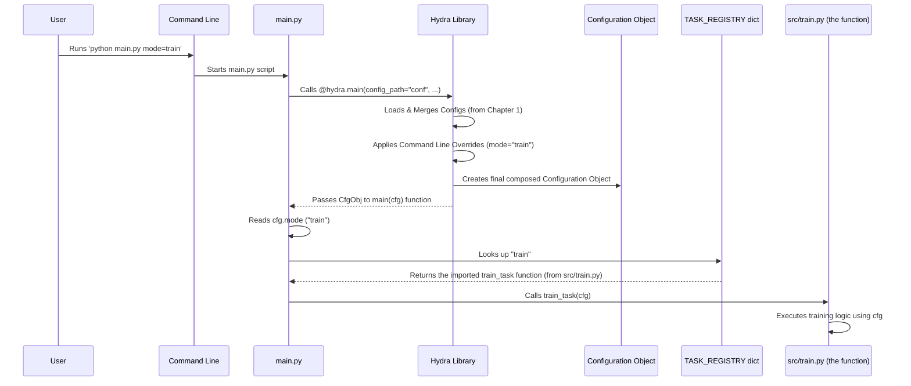

# Chapter 2: Task Orchestration

Welcome back! In [Chapter 1: Hydra Configuration](01_hydra_configuration_.md), we learned how the SemiF-Segmentation project uses Hydra to manage all its settings in a structured way, and how you can even change those settings from the command line. We saw that the `mode` parameter in `conf/config.yaml` (and controllable via the command line like `mode=train`) seems important.

Now, let's see how the project uses this configuration to decide *what* to do. Think of it like this: Hydra provides the detailed instructions (the musical score), but something needs to read that score and tell the right musicians (the different task components) when and how to play.

## The Challenge: Directing the Show

The SemiF-Segmentation project can do several different things:

*   `query`: Find specific images in a database based on criteria.
*   `preprocess`: Prepare raw image data (crop, split, calculate stats).
*   `train`: Train a machine learning model.
*   `inference`: Use a trained model to make predictions on new images.
*   `sync`: Synchronize important project files (like the database) with a remote source.

How does the project know which of these jobs you want it to do *right now*? And how does it start that specific job with all the correct settings from the configuration?

Putting a huge `if/elif/else` block directly in your main script that checks the `mode` and then manually sets up everything for that task can quickly become messy and hard to manage as the project grows.

## The Solution: Task Orchestration

This is where **Task Orchestration** comes in. It's the system that acts as the **conductor** for your project. Its main job is simple: read the desired `mode` from the configuration and delegate the work to the specific part of the project responsible for that task.

In the SemiF-Segmentation project, the main entry point, `main.py`, is the orchestrator. It's the central hub that directs traffic.

## How it Works: The Conductor and the Registry

Let's look at a simplified view of `main.py` again.

```python
# --- File: main.py (Simplified) ---
import logging
import hydra
from omegaconf import DictConfig
from omegaconf import OmegaConf

# 1. Import the functions for each task
from src.preprocess import main as preprocess_task
from src.inference import main as inference_task
from src.train import main as train_task
from src.query import main as query_task
from src.sync import main as sync_task


log = logging.getLogger(__name__)

# 2. Define a registry (a dictionary) mapping mode names to the task functions
TASK_REGISTRY = {
    "sync": sync_task,
    "query": query_task,
    "preprocess": preprocess_task,
    "train": train_task,
    "inference": inference_task,
    # Add more tasks here as needed
}

@hydra.main(version_base="1.3", config_path="conf", config_name="config")
def main(cfg: DictConfig) -> None:
    # Hydra gives us the complete configuration object here (from Chapter 1)
    cfg = OmegaConf.create(cfg) # Ensure it's modifiable

    # 3. Read the desired mode from the configuration
    mode = cfg.mode
    log.info(f"Starting {mode}")

    # 4. Look up the mode in the registry and call the corresponding function
    if mode not in TASK_REGISTRY:
        log.error(f"Task {mode} not found in task registry")
        return

    # Call the function, passing the entire configuration object
    TASK_REGISTRY[mode](cfg)

if __name__ == "__main__":
    main()
```

Let's break down the key parts:

1.  **Importing Task Functions:** At the top, `main.py` imports the *specific functions* from other files (`src/train.py`, `src/preprocess.py`, etc.) that are responsible for carrying out each task. Notice the `as ..._task` aliases – this is just to avoid naming conflicts if multiple imported functions were named `main`.
2.  **The Task Registry:** The `TASK_REGISTRY` is a Python dictionary. Its keys are the simple strings you use for the `mode` parameter (like `"train"`, `"preprocess"`). Its values are the *actual Python functions* that were imported in step 1. This registry acts like a lookup table: "If the user wants 'train', call the `train_task` function."
3.  **Reading the Mode:** After Hydra has loaded the configuration and provided it as the `cfg` object (thanks to the `@hydra.main` decorator we saw in [Chapter 1: Hydra Configuration](01_hydra_configuration_.md)), `main.py` simply reads the value of `cfg.mode`.
4.  **Looking Up and Calling:** This is the core orchestration logic. `main.py` checks if the value of `mode` exists as a key in the `TASK_REGISTRY` dictionary. If it does, it retrieves the corresponding function (`TASK_REGISTRY[mode]`) and calls that function, passing the entire `cfg` object along.

This simple structure makes `main.py` very clean. It doesn't need to know the details of *how* training works or *how* data is preprocessed. It just needs to know *which* function to call for a given `mode`, and it delegates the rest.

## Running Different Tasks

Because `main.py` uses the `mode` from the configuration, and we know from [Chapter 1: Hydra Configuration](01_hydra_configuration_.md) that we can override configuration values from the command line, running different tasks is straightforward.

To run the `train` task:

```bash
python main.py mode=train
```

When you run this:
1.  Hydra loads the configuration.
2.  It sees `mode=train` on the command line and sets `cfg.mode` to `"train"`.
3.  Hydra calls the `main(cfg)` function in `main.py`.
4.  `main.py` reads `cfg.mode`, which is `"train"`.
5.  It looks up `"train"` in `TASK_REGISTRY`.
6.  It finds the function imported as `train_task` (which comes from `src/train.py`).
7.  It calls `train_task(cfg)`, passing the configuration. The training process begins!

To run the `preprocess` task instead:

```bash
python main.py mode=preprocess
```

This works exactly the same way, but because `cfg.mode` is now `"preprocess"`, `main.py` looks up `"preprocess"` in the `TASK_REGISTRY` and calls the `preprocess_task(cfg)` function (from `src/preprocess.py`).

You can see how this provides a clean, consistent interface for running any part of the project.

## Inside a Task Function

What does a function like `train_task` (or the `main` function inside `src/train.py` that `main.py` imported) look like?

Each task function also receives the full configuration `cfg` as an argument. This allows it to access all the settings relevant to its specific job.

Here's a tiny peek at the start of the `main` function inside `src/train.py`:

```python
# --- File: src/train.py (Snippet) ---
import logging
import hydra # Note: This file also uses Hydra, but main.py calls its function directly
from omegaconf import DictConfig

log = logging.getLogger(__name__)

# ... other imports and setup ...

# This is the function that main.py imports and calls
# It receives the same cfg object
# @hydra.main(...) # This decorator is here if you wanted to run train.py *directly*, but main.py doesn't use it.
def main(cfg: DictConfig):
    print("Hello from the training task!") # We are inside the training logic now
    print(f"Training for {cfg.train.epochs} epochs") # Accessing training config

    # ... the rest of the training setup and execution ...

    pass # Placeholder for the actual training code

# if __name__ == "__main__":
#     main() # This part runs ONLY if you execute train.py directly, not when main.py calls it
```

As you can see, the `main` function inside `src/train.py` (which `main.py` calls as `train_task`) expects the `cfg` object and uses it to get training-specific parameters like `cfg.train.epochs`. The other task files (`src/preprocess.py`, `src/inference.py`, etc.) have similar `main(cfg)` functions that access their relevant parts of the configuration.

## Internal Workflow Diagram

Let's visualize the flow when you run `python main.py mode=train`:



This diagram shows how `main.py` sits in the middle, receiving the configuration from Hydra and then using it to decide which specific task module to hand off the execution to.

## Summary

In this chapter, we explored **Task Orchestration**, which is the job of `main.py` in the SemiF-Segmentation project. We learned that `main.py` acts as a central conductor:

1.  It uses the configuration object (`cfg`) provided by Hydra (as discussed in [Chapter 1: Hydra Configuration](01_hydra_configuration_.md)).
2.  It reads the desired `mode` from `cfg.mode` (usually specified via the command line).
3.  It uses a `TASK_REGISTRY` dictionary to look up the specific Python function responsible for that `mode`.
4.  It calls the found task function (e.g., `train(cfg)`, `preprocess(cfg)`), passing the entire configuration object to it.

This creates a clean, modular structure where `main.py` handles *what* task to run, and the individual task files (`src/train.py`, `src/preprocess.py`, etc.) handle *how* to perform that task, using the provided configuration.

Now that you know how the project decides *what* to do, let's look at the first major step in many machine learning pipelines: getting the data you need.

[Chapter 3: Data Querying](03_data_querying_.md)

---

Generated by [AI Codebase Knowledge Builder](https://github.com/The-Pocket/Tutorial-Codebase-Knowledge)