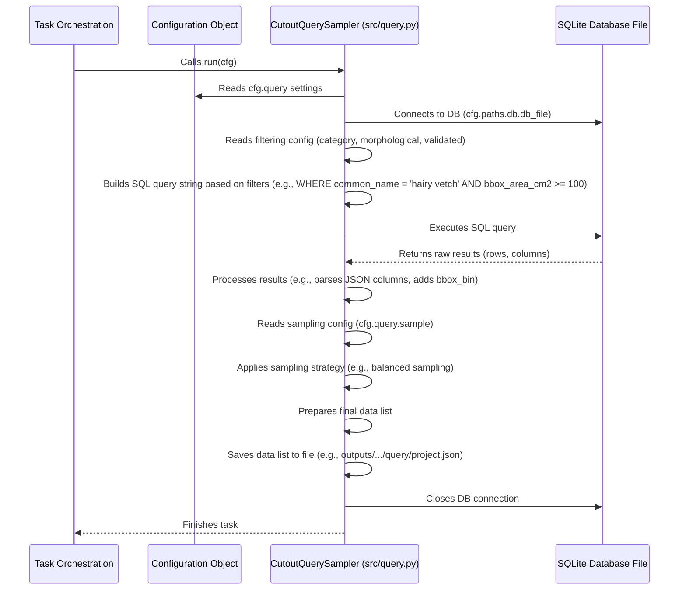

# Chapter 3: Data Querying

Welcome back to the tutorial! In [Chapter 1: Hydra Configuration](01_hydra_configuration_.md), we learned how Hydra manages all the project settings using configuration files. Then, in [Chapter 2: Task Orchestration](02_task_orchestration_.md), we saw how the `main.py` script uses the `mode` parameter from the configuration to decide *which* task to run (like `train`, `preprocess`, or `query`).

Now, let's dive into the `query` task itself. Before we can train a model or preprocess data, we first need to find the specific data we want to work with from our potentially large collection.

## The Challenge: Finding Needles in a Haystack

Imagine you have a massive database containing information about millions of image "cutouts" (small crops of interesting objects found in larger images), along with details like what species is in the cutout, its size, whether it's been checked by a human (validated), and so on.

You don't usually want to use *all* the data for every task. For example:

*   You might only want to train a model on specific **species**.
*   You might want to filter out very **small or very large objects** based on their bounding box size.
*   You might only want to use data that has been **validated**.
*   You might only need a **random sample** of a certain size, or a **balanced sample** across different categories.

Manually sifting through a database to find records that match multiple criteria is tedious and error-prone. You need an automated way to search, filter, and select exactly the data records you need for your current task.

## The Solution: Data Querying

This is the job of the **Data Querying** component (`src/query.py`) in the SemiF-Segmentation project. It acts like your personal librarian for the image database. You give it a list of criteria (defined in the configuration), and it finds all the matching "books" (data records or "cutouts").

Its main responsibilities are:

1.  **Connect to the database:** The project uses a SQLite database to store metadata about the cutouts.
2.  **Read criteria from configuration:** It looks at the settings in the `query` section of your Hydra configuration.
3.  **Build a query:** It translates your configuration criteria into a database query (specifically, an SQL query).
4.  **Execute the query:** It runs the SQL query on the database to get the results.
5.  **Process results:** It takes the database results and prepares them for the next steps in the pipeline.
6.  **Sample data:** If configured, it selects a subset of the results based on a specific sampling strategy.
7.  **Save the list:** It saves the final list of selected data records to a file (usually JSON or CSV) so subsequent tasks (like preprocessing or training) know which data records to load.

## How to Use Data Querying

As we learned in [Chapter 2: Task Orchestration](02_task_orchestration_.md), you tell the project which task to run using the `mode` parameter from the command line. To perform data querying, you set `mode=query`.

The *criteria* for the query are defined in the configuration files, specifically in the `conf/query` directory. The `conf/config.yaml` file includes `- query: default` by default, meaning it loads settings from `conf/query/default.yaml`.

Let's look at a simplified `conf/query/default.yaml`:

```yaml
# --- File: conf/query/default.yaml (Simplified) ---

# --- Section 1: Sampling Strategy ---
sample:
  multi_domain_balanced:
    enabled: true
    domains: [category.common_name, bbox_bin] # How to group data for balancing
    samples_per_unique_domain: 500 # How many samples per group
    replace: false # Allow duplicates?

  random:
    enabled: false
    dataset_size: 1000 # How many random samples
    replace: false

  random_state: 42 # For reproducibility

# --- Section 2: Filtering Criteria ---
validated: # Filter by validation status (true, false, null/any)

category:
  enabled: true
  common_name:
    # List specific species you want to include
    - hairy vetch
    # - common ragweed
    # - common sunflower

morphological:
  bbox_area_cm2:
    enabled: true
    default:
      min: 100 # Minimum bounding box area in cm2
      max: 10000 # Maximum bounding box area in cm2
    # common_name_ranges: You could override min/max per species here (more advanced)

  extends_border: # Filter if bounding box touches image edge
    enabled: false
    status: false

  is_primary: # Filter for primary object in cutout
    enabled: false
    status: false

  # ... other potential filters like blur_effect, num_components ...

```

This configuration file has two main parts for querying:

1.  **`sample`:** Defines *how* to select the final list of records from the results of the database query. You can choose `multi_domain_balanced` (get a specific number of samples for each combination of categories and bbox sizes found) or `random` (just get a fixed number of random samples). You enable one by setting `enabled: true`.
2.  **Filtering Criteria (`validated`, `category`, `morphological`):** These sections define the *initial* criteria used to filter records directly in the database query.
    *   `validated`: If set to `true` or `false`, it filters records based on the `validated` column in the database.
    *   `category`: Filters based on categorical information (like species `common_name`).
    *   `morphological`: Filters based on properties derived from the object's shape or appearance (like `bbox_area_cm2`).

**Our Use Case:** Let's say we want to get a balanced sample of up to 500 'hairy vetch' cutouts with a bounding box area between 100 and 10000 cm², using the default sampling strategy. The `default.yaml` shown above already configures this!

To run the query task with this configuration:

```bash
python main.py mode=query
```

**What happens when you run this:**

1.  You run `main.py`.
2.  [Hydra Configuration](01_hydra_configuration_.md) loads the configuration, including the settings from `conf/query/default.yaml` because of `- query: default` in `conf/config.yaml`.
3.  [Task Orchestration](02_task_orchestration_.md) reads `mode=query` from the command line.
4.  `main.py` looks up `"query"` in its `TASK_REGISTRY` and calls the `query_task` function (which is `main` inside `src/query.py`), passing the full configuration (`cfg`).
5.  The `query_task` (in `src/query.py`) takes the `cfg`, connects to the database, builds an SQL query based on the `cfg.query` settings (filtering for `common_name` 'hairy vetch' and `bbox_area_cm2` range), executes it, processes the results, applies the `multi_domain_balanced` sampling strategy, and saves the final list of selected data records to a file.

The output of this command won't be visible directly in the console as a list of data (though logs will show progress), but it will create a file containing the list of data records selected by the query. This file is typically saved in a project-specific directory, often under `outputs/<date>/<time>/query/<project_name>.json` and `.csv`, controlled by your `cfg.paths`.

For example, after running the command, you might find a file like `outputs/2023-10-27/10-30-00/query/test_synthetic.json` and `test_synthetic.csv`. These files contain rows of data, where each row represents a selected cutout, including information like its `image_id`, `cutout_filepath`, `mask_filepath`, category details, morphological properties, etc. This list is exactly what the next steps (like preprocessing) will use.

**Overriding Query Settings:** Just like with other Hydra settings, you can override query configuration values directly from the command line without changing `conf/query/default.yaml`.

Want to query for a different species?

```bash
python main.py mode=query query.category.common_name=["common ragweed", "common sunflower"]
```

This command overrides the `query.category.common_name` list to include 'common ragweed' and 'common sunflower' instead of 'hairy vetch' for this specific run.

Want a smaller random sample instead of balanced?

```bash
python main.py mode=query query.sample.multi_domain_balanced.enabled=false query.sample.random.enabled=true query.sample.random.dataset_size=500
```

This powerful overriding capability allows you to quickly test different filtering and sampling strategies.

## How it Works Internally (Simplified)

Let's peek under the hood at what happens inside the `query` task (`src/query.py`) when it's called by `main.py`. The main logic resides in the `CutoutQuerySampler` class and its `run` method.

Here's a simplified flow:



Let's look at some simplified code snippets from `src/query.py` to see parts of this:

First, the `CutoutQuerySampler` initializes by reading configuration and setting up the database path:

```python
# --- File: src/query.py (Simplified) ---
import sqlite3
import logging
import json
from pathlib import Path
from typing import Any

import pandas as pd
from omegaconf import DictConfig

log = logging.getLogger(__name__)

class CutoutQuerySampler:
    def __init__(self, cfg: DictConfig, table_name: str = "semif_cutouts", inference: bool = False):
        self.cfg = cfg
        # Read database path and output directory from config
        self.db_path = Path(cfg.paths.db.db_file)
        self.output_dir = Path(cfg.paths.project_query_dir) # or inference dir
        self.project_name = cfg.project.name
        self.table_name = table_name # Name of the table in the DB

        self.connection = None
        self.cursor = None
        self.conditions = [] # List to build the WHERE clause of the SQL query
        self.params = []     # List to hold values for the query parameters

        self.setup_sampling_config() # Read sampling strategy from config

    # ... methods to connect/close DB, add conditions, build/execute query, process, sample, save ...
```

The `setup_sampling_config` method reads the `cfg.query.sample` part of the configuration:

```python
# --- File: src/query.py (Simplified) ---
# ... CutoutQuerySampler class ...

    def setup_sampling_config(self):
        sample_cfg = self.cfg.query.sample # Access the 'sample' section of the query config
        self.random_state = sample_cfg.random_state

        self.strategy = None
        self.domains = None
        self.samples_per_unique_domain = None
        self.dataset_size = None
        self.replace = False

        # Check which sampling strategy is enabled and read its parameters
        if sample_cfg.multi_domain_balanced.enabled:
            self.strategy = "balanced"
            self.domains = sample_cfg.multi_domain_balanced.domains
            self.samples_per_unique_domain = sample_cfg.multi_domain_balanced.samples_per_unique_domain
            self.replace = sample_cfg.multi_domain_balanced.replace
        elif sample_cfg.random.enabled:
            self.strategy = "random"
            self.dataset_size = sample_cfg.random.dataset_size
            self.replace = sample_cfg.random.replace

    # ... rest of the class ...
```

Methods like `add_category_condition` and `add_morphological_conditions` read the filtering configuration and build parts of the SQL query's `WHERE` clause and the corresponding parameters:

```python
# --- File: src/query.py (Simplified) ---
# ... CutoutQuerySampler class ...

    def add_category_condition(self):
        category_cfg = self.cfg.query.category # Access the 'category' section
        if category_cfg.enabled and category_cfg.common_name:
            names = [name.lower().strip() for name in category_cfg.common_name]
            # Create placeholders like ?, ?, ? for the SQL IN clause
            placeholders = ", ".join("?" for _ in names)
            # Build the condition string
            condition = f"LOWER(TRIM(json_extract(category, '$.common_name'))) IN ({placeholders})"
            self.conditions.append(condition) # Add to the list of conditions
            self.params.extend(names)         # Add the species names to parameters

    def add_morphological_conditions(self):
        morph = self.cfg.query.morphological # Access the 'morphological' section

        # Example: BBox area condition
        if morph.bbox_area_cm2.enabled:
            default = morph.bbox_area_cm2.default
            # Add conditions for min and max area
            self.add_condition("json_extract(cutout_props, '$.bbox_area_cm2')", ">=", default.min)
            self.add_condition("json_extract(cutout_props, '$.bbox_area_cm2')", "<=", default.max)

        # ... add conditions for other morphological filters similarly ...

    def add_condition(self, column: str, operator: str, value: Any):
        # Helper method to format a single condition and its parameter
        condition = f"{column} {operator} ?"
        self.conditions.append(condition)
        self.params.append(value)
        # Logs help track which conditions are added
        log.info("Added condition: %s with value: %s", condition, value)

    # ... rest of the class ...
```

The `build_query` method combines all the collected conditions into a single SQL query string:

```python
# --- File: src/query.py (Simplified) ---
# ... CutoutQuerySampler class ...

    def build_query(self) -> str:
        base_query = f"SELECT *, LOWER(TRIM(json_extract(category, '$.common_name'))) AS common_name FROM {self.table_name}"
        if self.conditions:
            # Join all conditions with ' AND '
            where_clause = " AND ".join(self.conditions)
            query = f"{base_query} WHERE {where_clause}"
        else:
            # If no conditions, select all rows
            query = base_query
        log.info(f"Built SQL Query: {query}")
        return query

    # ... rest of the class ...
```

After `execute_query` runs the SQL and gets the results as a list of rows, methods like `parse_json_columns`, `unnest_json_columns`, and `add_bbox_bin_column` clean up and enhance the data in a Pandas DataFrame. The `sample_data` method then applies the chosen sampling strategy:

```python
# --- File: src/query.py (Simplified) ---
# ... CutoutQuerySampler class ...

    def sample_data(self, df: pd.DataFrame) -> pd.DataFrame:
        # df is a Pandas DataFrame containing results from the SQL query

        if self.strategy == "random":
            sampled_df = df.sample(
                n=min(len(df), self.dataset_size), # Sample up to dataset_size rows
                random_state=self.random_state,
                replace=self.replace # Allow or disallow sampling same row multiple times
            ).reset_index(drop=True)
            log.info(f"Randomly sampled {len(sampled_df)} rows.")
            return sampled_df

        elif self.strategy == "balanced":
            # Group data by the specified domains (e.g., species and bbox bin)
            grouped = df.groupby(list(self.domains), group_keys=False)
            sampled_groups = []

            # For each group (e.g., 'hairy vetch' and 'medium' bbox), sample a fixed number
            for name, group in grouped:
                n = self.samples_per_unique_domain
                # Adjust n if 'replace' is false and group is smaller than samples_per_unique_domain
                if not self.replace:
                    n = min(len(group), self.samples_per_unique_domain)

                sampled = group.sample(n=n, random_state=self.random_state, replace=self.replace)
                sampled_groups.append(sampled)

            # Combine samples from all groups
            sampled_df = pd.concat(sampled_groups).reset_index(drop=True)
            log.info(f"Balanced sampled {len(sampled_df)} rows across domains {self.domains}.")
            return sampled_df
        else:
            # Should not happen if setup_sampling_config works correctly
            raise ValueError(f"Unknown sampling strategy: {self.strategy}")

    # ... rest of the class including save_samples method ...
```

Finally, the `save_samples` method takes the resulting DataFrame and saves it as a JSON and CSV file in the designated output directory (`cfg.paths.project_query_dir`), making the selected data list available for the next step in the pipeline.

This internal structure shows how the code reads the configuration, translates those abstract settings into concrete database operations, and processes the results before saving. The use of the `conditions` and `params` lists makes it flexible to add different filters based on what's enabled in the configuration.

## Summary

In this chapter, we explored **Data Querying**, the component responsible for selecting specific data records (cutouts) from the project's SQLite database.

*   We learned that it addresses the challenge of needing only a subset of data based on various criteria (species, size, validation status, etc.).
*   Configuration settings in `conf/query/*.yaml` define these criteria and the desired sampling strategy.
*   You execute the query task by running `python main.py mode=query`, optionally overriding settings from the command line.
*   The output is a file (JSON/CSV) listing the data records that matched the criteria and sampling.
*   Internally, the `src/query.py` script reads the query configuration, builds and executes an SQL query, processes the results (parsing JSON, adding helper columns), applies the configured sampling strategy, and saves the final list.

Now that we know how to select the data records we want, the next step is to prepare the actual image and mask files associated with these records for use in training or inference.

[Chapter 4: Preprocessing Pipeline](04_preprocessing_pipeline_.md)

---

Generated by [AI Codebase Knowledge Builder](https://github.com/The-Pocket/Tutorial-Codebase-Knowledge)