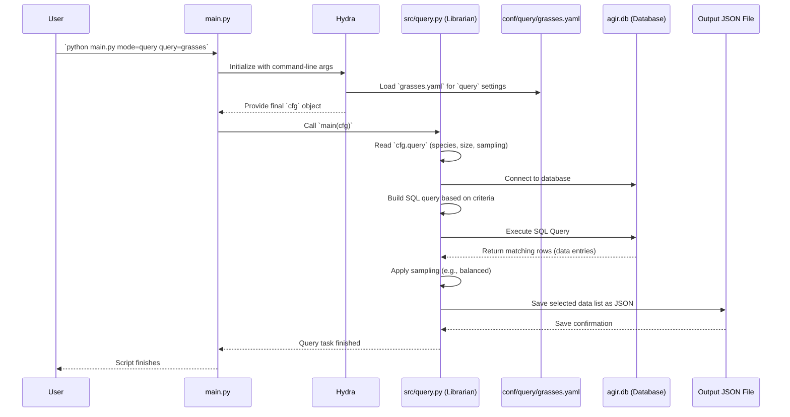

# Chapter 3: Data Querying & Sampling (`query.py`)

In [Chapter 2: Hydra Configuration Management](02_hydra_configuration_management_.md), we saw how Hydra lets us manage all our project settings using simple `.yaml` files and command-line overrides. Now, let's see how we use those settings for a specific task: selecting the *exact* data we want for our experiments.

## What Problem Does `query.py` Solve?

Imagine you have a massive library filled with thousands of pictures of plants (`agir.db` - our database). For your current project, you don't need *all* the pictures. Maybe you only want pictures of specific types of grass, like 'barley' or 'wheat'. Or perhaps you only want pictures where the plant is a certain size. How do you efficiently find and gather *only* the pictures that match your specific needs?

Searching manually would take forever! This is the problem `query.py` solves.

Think of `query.py` as a **Specialized Librarian** for our image database.

**Use Case:** You decide you want to train a model specifically on images of certain grass types (let's say those defined in a "grasses" list) and only focus on plants that aren't too small or too large (e.g., between 200 and 5000 cm² in bounding box area). You need a way to tell the system: "Go find all image cutouts in the database that are on my 'grasses' list AND fit within this size range."

`query.py` does exactly this. It uses instructions you provide (via Hydra configuration files) to search the database and create a precise list of the data you requested.

## Key Concepts

1.  **The Database (`agir.db`):** This is our central "library". It's a database file containing information about many different image cutouts – what species they are, their size, where the original image is stored, and other details.
2.  **Query Configuration (`conf/query/*.yaml`):** These files are your instructions to the librarian (`query.py`). They tell the librarian exactly what kind of data you're looking for. For example, `conf/query/grasses.yaml` might specify:
    *   List of plant species (common names) to include.
    *   Minimum and maximum size (bounding box area) allowed.
    *   How to sample the data if you find too many matches (e.g., randomly, or ensuring a balance across different species/sizes).
3.  **The Query Script (`src/query.py`):** This is the Python code for our librarian. It reads your instructions (the query config file), connects to the database (`agir.db`), performs the search (builds and runs an SQL query), and potentially selects a subset using a sampling strategy.
4.  **Sampling Strategies:** Sometimes, the query might find thousands of matching images, but you only need a smaller, representative set for your experiment. `query.py` can use different strategies:
    *   **Random Sampling:** Pick a specified number of items randomly from the results.
    *   **Balanced Sampling:** Try to pick an equal number of items from different categories (e.g., ensure you get a similar number of 'barley' images and 'wheat' images, or a similar number of small, medium, and large plants). This is often useful to prevent the model from being biased towards categories with more data.
5.  **Output File List (`<project_name>.json`):** The final result! After finding and sampling the data, `query.py` saves a list of the selected image cutout details into a JSON file (e.g., `grasses_experiment_01.json`). This file acts as a precise "shopping list" for the next stage: [Preprocessing Pipeline (`preprocess.py` & `src/preprocessing/`)](04_preprocessing_pipeline___preprocess_py_____src_preprocessing____.md).

## How to Use `query.py`

Remember our Project Manager, `main.py`, from [Chapter 1: Task Orchestration (`main.py`)](01_task_orchestration___main_py___.md)? We use it to run the querying task.

**Example: Running the "grasses" query**

Let's say you've defined your criteria for grass species and sizes in the file `conf/query/grasses.yaml`. To run this specific query, you use the command line:

```bash
python main.py mode=query query=grasses
```

*   `python main.py`: Execute the main project manager script.
*   `mode=query`: Tell the manager you want to run the "query" task. This makes `main.py` call the `main` function inside `src/query.py`.
*   `query=grasses`: This is a Hydra override! It tells Hydra: "Instead of using the default query settings (likely from `conf/query/default.yaml`), use the settings defined in `conf/query/grasses.yaml`."

**What Happens?**

1.  `main.py` starts and sees `mode=query`.
2.  Hydra loads the configuration, specifically applying the `grasses.yaml` settings for the `query` part of the configuration.
3.  `main.py` calls the `main` function in `src/query.py`, passing the configuration (`cfg`) which now includes the "grasses" criteria.
4.  `src/query.py` (our librarian) reads the `cfg.query` settings.
5.  It connects to `agir.db`.
6.  It searches the database for entries matching the species and size criteria from `grasses.yaml`.
7.  It might apply a sampling strategy (like balanced sampling) defined in `grasses.yaml`.
8.  It saves the final list of selected data items to a JSON file. The exact path is determined by your `paths` configuration (see `conf/paths/default.yaml`), but it will likely be inside your project directory under a `query` subfolder, named something like `<your_project_name>.json`.

This JSON file now contains all the information needed (like file paths and IDs) for the next step to actually load and process these specific image cutouts.

## Under the Hood: The Librarian at Work

Let's follow the librarian (`query.py`) step-by-step after you run the command `python main.py mode=query query=grasses`.

1.  **Receive Instructions:** `query.py` receives the configuration object `cfg` from `main.py`. It looks specifically at `cfg.query`, which contains the settings loaded from `conf/query/grasses.yaml`.
2.  **Connect to Library:** It establishes a connection to the database file (`agir.db`), specified in `cfg.paths.db.db_file`.
3.  **Formulate the Search:** It reads the criteria from `cfg.query`:
    *   Which species? (`cfg.query.category.common_name`)
    *   What size range? (`cfg.query.morphological.bbox_area_cm2`)
    *   It translates these criteria into an SQL query (a specific language for asking databases questions). For example: `SELECT * FROM semif_cutouts WHERE common_name IN ('barley', 'wheat', ...) AND bbox_area_cm2 >= 200 AND bbox_area_cm2 <= 5000;` (This is simplified).
4.  **Perform the Search:** It executes the SQL query against the database. The database returns all rows (records) that match the criteria.
5.  **Apply Sampling (Optional):** If the configuration specifies a sampling strategy (e.g., `cfg.query.sample.multi_domain_balanced.enabled: true`), `query.py` takes the list of results and selects a subset according to the rules (e.g., pick 20 examples for each species+size combination).
6.  **Save the List:** It takes the final list of selected data entries (after sampling) and saves it as a JSON file (e.g., `your_project_name.json`) in the location specified by `cfg.paths.project_query_dir`.

**Visualizing the Flow:**



## Diving Deeper into the Code

Let's look at simplified examples of the configuration and the script.

**1. Query Configuration (`conf/query/grasses.yaml`)**

This file contains the instructions for our "grasses" query.

```yaml
# File: conf/query/grasses.yaml (Simplified)

# Sampling strategy: Use balanced sampling
sample:
    multi_domain_balanced:
      enabled: true
      # Balance across species AND size bin
      domains: [category.common_name, bbox_bin]
      # Try to get 20 samples for each unique combination
      samples_per_unique_domain: 20
      replace: false # Don't pick the same item twice if possible
    random_state: 42 # For reproducibility

# Species criteria
category:
  enabled: true
  common_name:
  - barley         # Include barley
  - barnyardgrass
  # ... other grass names ...
  - winter wheat
  - yellow foxtail

# Size criteria
morphological:
  bbox_area_cm2:
    enabled: true # Apply this filter
    default:
      min: 200    # Minimum bounding box area
      max: 5000   # Maximum bounding box area
```

*   **Explanation:** This YAML file clearly defines the "shopping list" for our librarian.
    *   `sample`: Specifies using the `multi_domain_balanced` strategy, aiming for 20 samples per unique combination of common name and size bin (`bbox_bin` is a category like "small", "medium", "large" calculated from `bbox_area_cm2`).
    *   `category.common_name`: Lists the exact plant species we are interested in.
    *   `morphological.bbox_area_cm2`: Defines the acceptable size range using `min` and `max` values.

**2. Query Script (`src/query.py`)**

Here are some simplified snippets from the librarian script:

```python
# File: src/query.py (Simplified Snippets)
import sqlite3
import logging
import json
from pathlib import Path
import pandas as pd
from omegaconf import DictConfig

log = logging.getLogger(__name__)

class CutoutQuerySampler:
    def __init__(self, cfg: DictConfig, table_name: str = "semif_cutouts"):
        self.cfg = cfg # Store the configuration
        # Get paths from config (set by Hydra from conf/paths/default.yaml)
        self.db_path = Path(cfg.paths.db.db_file)
        self.output_dir = Path(cfg.paths.project_query_dir)
        self.project_name = cfg.project.name
        self.table_name = table_name

        self.connection = None
        self.cursor = None
        # These lists will store parts of the SQL query
        self.conditions = [] # e.g., "bbox_area_cm2 >= ?"
        self.params = []     # e.g., [200]

        # Read sampling settings from config
        self.setup_sampling_config() # <-- Reads cfg.query.sample

    def connect_db(self):
        # Standard code to connect to the SQLite database
        try:
            self.connection = sqlite3.connect(self.db_path)
            self.cursor = self.connection.cursor()
            log.info(f"Connected to database: {self.db_path}")
        except sqlite3.Error as e: # Handle potential errors
            log.error(f"Database connection error: {e}")
            raise

    # --- Method to add conditions based on config ---
    def add_category_condition(self):
        category_cfg = self.cfg.query.category # Get category settings
        if category_cfg.enabled and category_cfg.common_name:
            # Get the list of names from config
            names = [name.lower().strip() for name in category_cfg.common_name]
            # Create SQL placeholders (?, ?, ...) for the names
            placeholders = ", ".join("?" for _ in names)
            # Build the SQL condition string
            condition = f"LOWER(TRIM(json_extract(category, '$.common_name'))) IN ({placeholders})"
            # Add the condition and parameters
            self.conditions.append(condition)
            self.params.extend(names)

    def add_morphological_conditions(self):
        morph_cfg = self.cfg.query.morphological # Get morphological settings
        # Add condition for bounding box area
        if morph_cfg.bbox_area_cm2.enabled:
            min_val = morph_cfg.bbox_area_cm2.default.min
            max_val = morph_cfg.bbox_area_cm2.default.max
            # Add "col >= ?" condition and parameter
            self.conditions.append("json_extract(cutout_props, '$.bbox_area_cm2') >= ?")
            self.params.append(min_val)
            # Add "col <= ?" condition and parameter
            self.conditions.append("json_extract(cutout_props, '$.bbox_area_cm2') <= ?")
            self.params.append(max_val)
        # ... potentially add other morphological conditions ...

    def build_query(self) -> str:
        # Start with selecting all columns from the table
        base_query = f"SELECT *, LOWER(TRIM(json_extract(category, '$.common_name'))) AS common_name FROM {self.table_name}"
        if self.conditions: # If we added any conditions...
            # Join them with "AND"
            where_clause = " AND ".join(self.conditions)
            # Append the WHERE clause to the base query
            query = f"{base_query} WHERE {where_clause}"
        else: # If no conditions were added
            query = base_query
        log.info(f"Built SQL Query: {query}")
        return query

    def execute_query(self) -> pd.DataFrame:
        query = self.build_query()
        log.info(f"Executing query with params: {self.params}")
        # Use pandas to easily execute the query and get results as a DataFrame
        df = pd.read_sql_query(query, self.connection, params=self.params)
        log.info(f"Query returned {len(df)} rows.")
        return df

    # --- Methods for sampling and saving ---
    def sample_data(self, df: pd.DataFrame) -> pd.DataFrame:
        # (Simplified logic - actual code handles different strategies)
        if self.strategy == "balanced":
             # Logic to group data by 'domains' and sample 'samples_per_unique_domain'
             # from each group using pandas groupby() and sample()
             log.info(f"Balanced sampling applied...")
             # sampled_df = ... complicated pandas sampling ...
             sampled_df = df.head(100) # Placeholder for simplicity
             return sampled_df
        elif self.strategy == "random":
             # Logic to randomly sample 'dataset_size' items
             log.info(f"Random sampling applied...")
             # sampled_df = df.sample(...)
             sampled_df = df.head(100) # Placeholder for simplicity
             return sampled_df
        else: # If no sampling or unknown strategy
             log.info("No sampling applied or strategy unknown.")
             return df

    def save_samples(self, df: pd.DataFrame):
        self.output_dir.mkdir(parents=True, exist_ok=True)
        # Define the output file path using project name
        output_path = self.output_dir / f"{self.project_name}.json"
        # Save the selected data (as pandas DataFrame) to JSON
        df.to_json(output_path, orient="records", indent=4)
        log.info(f"Saved samples to {output_path}")
        # Also save as CSV for easy viewing
        # df_unnested = self.unnest_json_columns(df.copy()) # Helper to make CSV readable
        # df_unnested.to_csv(self.output_dir / f"{self.project_name}.csv", index=False)


    def run(self):
        # Main execution flow
        self.connect_db()
        try:
            # Build the query based on config
            self.add_category_condition()
            self.add_morphological_conditions()
            # Execute and get results
            df_results = self.execute_query()
            # --- Additional steps like parsing JSON data in columns ---
            # df_results = self.parse_json_columns(df_results)
            # df_results = self.unnest_json_columns(df_results) # Expand JSON for easier filtering/sampling
            # df_results = self.add_bbox_bin_column(df_results) # Create size category
            # Apply sampling
            sampled_df = self.sample_data(df_results)
            # --- Potentially re-nest columns before saving ---
            # sampled_df = self.renest_json_columns(sampled_df)
            # Save the final list
            self.save_samples(sampled_df)
        finally:
            # Always close the database connection
            self.close_db()

# --- Hydra decorator for the main entry point ---
@hydra.main(version_base="1.2", config_path="../conf", config_name="config")
def main(cfg: DictConfig) -> None:
    # Create the librarian instance
    sampler = CutoutQuerySampler(cfg)
    # Run the process
    sampler.run()

# Standard Python entry point check
if __name__ == "__main__":
    main()

```

*   **Explanation:**
    *   The `CutoutQuerySampler` class holds the logic.
    *   `__init__` gets the paths and sampling strategy from the `cfg` object provided by Hydra.
    *   `add_category_condition` and `add_morphological_conditions` translate the settings from `cfg.query` into SQL conditions stored in `self.conditions` and `self.params`.
    *   `build_query` assembles these conditions into a complete SQL query string.
    *   `execute_query` runs the query against the database using the `pandas` library for convenience.
    *   `sample_data` applies the chosen sampling strategy (random or balanced) to the results.
    *   `save_samples` writes the final list of selected data to the output JSON file.
    *   The `run` method orchestrates these steps.
    *   The `@hydra.main` decorator ensures that when we run `python main.py mode=query ...`, this `main` function in `query.py` gets called with the correct configuration loaded by Hydra.

## Conclusion

Well done! You've learned how `SemiF-Segmentation` uses `src/query.py` to select specific data for experiments.

*   `query.py` acts like a **Specialized Librarian**, finding data in the `agir.db` database based on your criteria.
*   You provide these criteria using **Hydra configuration files** (`conf/query/*.yaml`), specifying things like species, size, and sampling methods.
*   You run the query using `main.py` with `mode=query` and potentially specifying a query config like `query=grasses`.
*   The script translates your criteria into an **SQL query**, executes it, **samples** the results if needed, and saves a list of selected data items into a **JSON file**.

This querying step is crucial because it allows you to precisely define the dataset for each experiment, ensuring that your model training or analysis is focused on the exact data you care about. The output JSON file produced by `query.py` is the key input for the next stage.

Now that we have our curated list of data, what's next? We need to prepare these selected images and their corresponding masks for the model. Let's move on to [Chapter 4: Preprocessing Pipeline (`preprocess.py` & `src/preprocessing/`)](04_preprocessing_pipeline___preprocess_py_____src_preprocessing____.md)!

---

Generated by [AI Codebase Knowledge Builder](https://github.com/The-Pocket/Tutorial-Codebase-Knowledge)