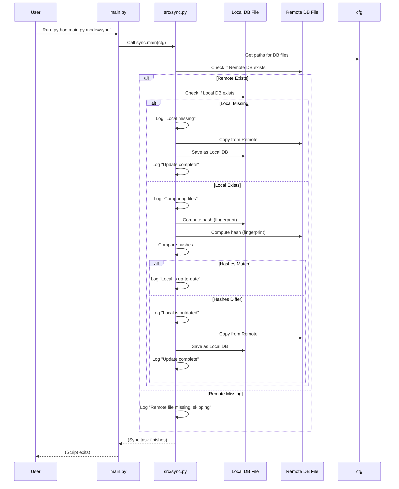

# Chapter 3: Data Synchronization (Sync)

Welcome back! In [Chapter 1: Hydra Configuration System](01_hydra_configuration_system_.md), you learned how `SemiF-Segmentation` uses Hydra and `.yaml` files to manage all its settings, like which model to use or where data is located. Then, in [Chapter 2: Main Task Runner](02_main_task_runner_.md), you saw how the `main.py` script acts as a central switchboard, using the `mode` setting from the configuration (`cfg`) to figure out *which* main task you want to run (like training, inference, etc.) and directing the flow to the right part of the code.

Now, let's dive into one of those specific tasks: **Data Synchronization**, often just called **Sync**.

## What Problem Does Sync Solve? (Keeping Your Data Fresh)

Imagine you're working on a project that relies on some shared, important files. In the case of `SemiF-Segmentation`, two very important files are:

1.  **The database file (`agir.db`):** This file likely contains crucial information about images, annotations, and their locations.
2.  **The species information file (`species_info.json`):** This file probably lists the different species you're working with and related details.

These files might live in a central, long-term storage location that multiple people or processes might update. When you want to run a task like querying the database ([Database Querying & Sampling (Query)](04_database_querying___sampling__query__.md)) or training a model ([Segmentation Model Module (Training/Validation)](08_segmentation_model_module__training_validation__.md)), you need to be sure you're using the *latest version* of these files. What if your local copy is missing or outdated?

Trying to manually check and copy these files every time would be tedious and prone to errors. This is where the **Sync task** comes in handy!

## What is Data Synchronization (Sync)? (Your Data's Personal Assistant)

The Sync task acts like a **data custodian** or a **personal assistant** for key data files. Its job is to make sure the important local files you need (like the database and species info) are exactly the same as the versions stored in a trusted remote, long-term storage location.

Here's the basic idea:

1.  **Identify key files:** The Sync task knows which local files are important to check (e.g., your local database file, your local species info file).
2.  **Find their remote copies:** It also knows where the *official*, latest versions of these files live in remote storage.
3.  **Check if local is missing:** Does the local file even exist? If not, it definitely needs the remote version.
4.  **Check if local is outdated:** If the local file *does* exist, is it the same as the remote version? How do you check this without reading the whole file? You use a **digital fingerprint** or **hash**! If the fingerprints of the local and remote files don't match, the local file is outdated or different.
5.  **Update if needed:** If the local file is missing or its fingerprint doesn't match the remote one, the Sync task automatically downloads or copies the remote version to replace the local one.

This ensures that before you run any task that relies on these files, you are working with the most current and correct data setup.

## How to Run the Sync Task

Just like other main tasks, you tell the `SemiF-Segmentation` project to run the Sync task by setting the `mode` configuration value on the command line when you run `main.py`.

To run the Sync task, you use:

```bash
python main.py mode=sync
```

When you run this command, based on what you learned in [Chapter 2: Main Task Runner](02_main_task_runner_.md), `main.py` will read `mode=sync` from the command line, look up "sync" in its `TASK_REGISTRY`, and call the function associated with it (which is the main function inside `src/sync.py`).

## How Sync Gets File Locations (Using `cfg`)

Remember how [Chapter 1: Hydra Configuration System](01_hydra_configuration_system_.md) explained that the entire configuration is loaded into the `cfg` object? The Sync task uses this `cfg` object to know *where* the local and remote files are located.

Look at the `conf/paths/default.yaml` snippet provided in the context:

```yaml
db:
  # path to db directory
  db_dir: ${paths.data_dir}/db # Local directory for DB

  # path to db file
  db_file: ${paths.db.db_dir}/agir.db # Local DB file path
  lts_db_file: ${paths.tertiary_storage}/semifield-database/agir.db # Remote DB file path

# Species information
species_info_dir: ${paths.semif_utils_dir}/species_information # Local directory for species info
species_info_file: ${paths.species_info_dir}/species_info.json # Local species info file path
lts_species_info: ${paths.tertiary_storage}/semifield-utils/species_information/species_info.json # Remote species info file path
```

This configuration clearly defines `db.db_file` and `species_info_file` for the local paths, and `db.lts_db_file` and `lts_species_info` for the remote paths (note the `lts` prefix often stands for "Long Term Storage").

Inside the `src/sync.py` code, the `main` function (which receives the `cfg` object) accesses these paths like this:

```python
# --- Snippet from src/sync.py main function ---
def main(cfg: DictConfig) -> None:
    # ... setup logger ...

    # Define the files to sync using paths from cfg
    model_files = {
        "db": {
            "local": Path(cfg.paths.db.db_file),      # Get local DB path from cfg
            "remote": Path(cfg.paths.db.lts_db_file),  # Get remote DB path from cfg
        },
        "species_info": {
            "local": Path(cfg.paths.species_info_file), # Get local species info path from cfg
            "remote": Path(cfg.paths.lts_species_info), # Get remote species info path from cfg
        }
    }
    # ... rest of the sync logic ...
```

This snippet shows how the `src/sync.py` code easily gets the necessary file paths directly from the `cfg` object provided by Hydra. This makes the sync process configurable without changing the code!

## How Sync Works Under the Hood (Simplified)

Let's look at the main steps within `src/sync.py`.

When you run `python main.py mode=sync`, the [Main Task Runner](02_main_task_runner_.md) calls the `main` function in `src/sync.py`. This function then iterates through the list of important files it needs to check (currently, the database and species info file, as defined in the snippet above).

For *each* file pair (local and remote), it performs these checks:

1.  **Check if the remote file exists:** It's the source of truth, so if it's not there, there's nothing to sync *from*.
2.  **Check if the local file exists:**
    *   If the local file is *missing*, it logs a warning and immediately downloads/copies the remote file to the local location.
    *   If the local file *exists*, it proceeds to compare them.
3.  **Compare the files:**
    *   It calculates a **SHA-256 hash** (a unique digital fingerprint) for *both* the local and remote files.
    *   It compares the two hashes.
    *   If the hashes are the *same*, the files are identical and up-to-date. It logs an info message.
    *   If the hashes are *different*, the local file is outdated. It logs a warning and downloads/copies the remote file to replace the local one.

Here's a look at the core functions in `src/sync.py` that perform these actions:

**1. Calculating the Digital Fingerprint (`compute_file_hash`)**

```python
# --- Snippet from src/sync.py ---
import hashlib
from pathlib import Path

def compute_file_hash(filepath: Path, chunk_size: int = 65536) -> str:
    """Compute SHA-256 hash (digital fingerprint) for a file."""
    hash_func = hashlib.sha256()
    with filepath.open("rb") as f: # Open the file
        while chunk := f.read(chunk_size): # Read piece by piece
             hash_func.update(chunk) # Update the fingerprint with the piece
    return hash_func.hexdigest() # Return the final fingerprint as text
```

This function reads the file in chunks (so it works for very large files without using too much memory) and feeds each chunk into a special function (`hashlib.sha256`) that generates the unique fingerprint.

**2. Comparing Files Using Fingerprints (`files_are_identical`)**

```python
# --- Snippet from src/sync.py ---
# ... imports and compute_file_hash ...

def files_are_identical(local_file: Path, remote_file: Path) -> bool:
    """Compare fingerprints of local and remote files."""
    if not local_file.exists() or not remote_file.exists():
        # Can't compare if either is missing (should be handled before calling this)
        return False

    local_hash = compute_file_hash(local_file) # Get local fingerprint
    remote_hash = compute_file_hash(remote_file) # Get remote fingerprint
    
    return local_hash == remote_hash # Are the fingerprints the same?
```

This function simply calls `compute_file_hash` on both files and checks if the results are equal.

**3. Updating the Local File (`update_file`)**

```python
# --- Snippet from src/sync.py ---
import shutil # Module for file operations
# ... imports and hash functions ...

def update_file(local_file: Path, remote_file: Path):
    """Replace the local file with the remote file."""
    log.info(f"Updating {local_file} from {remote_file}")
    # Make sure the local directory exists before copying
    local_file.parent.mkdir(parents=True, exist_ok=True) 
    shutil.copy2(remote_file, local_file) # Copy the remote file over the local one
    log.info(f"Update complete: {local_file}")
```

This function uses Python's built-in `shutil` module to copy the remote file to the local destination, effectively replacing the old or missing local file. It also makes sure the directory where the local file should go actually exists.

Here's a simplified flow of the sync process for *one* file (e.g., the database):



The Sync task repeats this process for all defined files (like the species info file after the database file).

This automated check and update process is critical because it ensures that when you move on to tasks like querying data or training models, you can trust that the foundational data files are correct and current, without you having to remember to copy them manually.

## Conclusion

You've learned that the Data Synchronization (Sync) task is a vital step in `SemiF-Segmentation` that acts as a data custodian. By running `python main.py mode=sync`, you trigger a process that checks key local files (like the database and species information) against their remote, long-term storage versions using digital fingerprints (hashes). If a local file is missing or outdated, it's automatically updated from the remote source. This ensures you're always working with the correct and latest foundational data.

Now that you can make sure your database is up-to-date, the next logical step is to learn how to actually *get* data from that database to use for your project.

[Next Chapter: Database Querying & Sampling (Query)](04_database_querying___sampling__query__.md)

---

Generated by [AI Codebase Knowledge Builder](https://github.com/The-Pocket/Tutorial-Codebase-Knowledge)