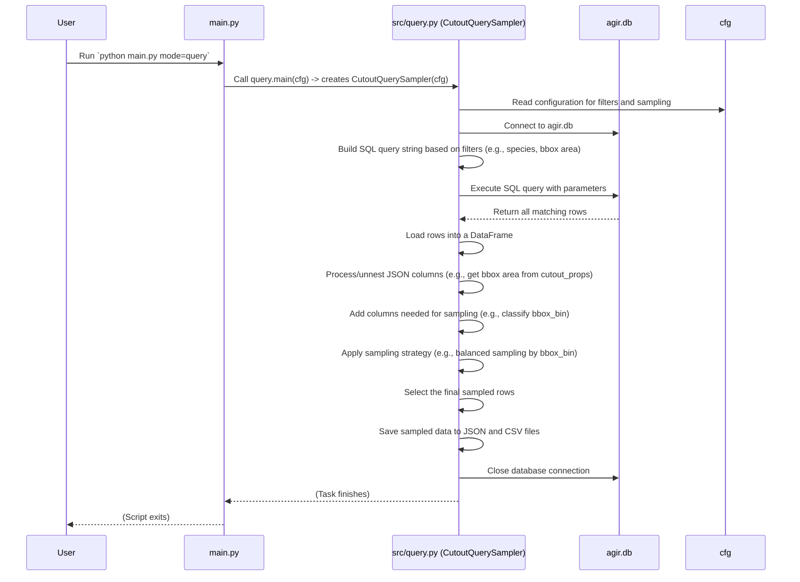

# Chapter 4: Database Querying & Sampling (Query)

Welcome back to the `SemiF-Segmentation` tutorial! In the last chapter, [Data Synchronization (Sync)](03_data_synchronization__sync__.md), you learned how to make sure your project's essential data files, like the `agir.db` database, are up-to-date using the Sync task. Now that you have a reliable, current database, the next step is to actually *get* the specific data you need from it!

Imagine your database is a huge library containing millions of records (called "cutouts" in this project). Each record has lots of details: what species it is, how big the plant in the cutout is, where the original image is located on your computer, and much more. When you want to train a model, you don't usually want to use *all* the data. You might only want data for certain species, of a specific size, or with particular characteristics.

Finding and picking out exactly the right records from this massive library is a big challenge. This is where the **Database Querying & Sampling (Query)** task comes in.

## What is Database Querying & Sampling? (Your Smart Data Selector)

The Query task is essentially a **smart data selector** for your database. It performs two main jobs:

1.  **Querying (Filtering):** This is like telling the library catalog: "Show me *only* the records that meet certain criteria." You define these criteria (filters) based on the information stored in the database, such as:
    *   Which species you want (e.g., only 'hairy vetch').
    *   How large the bounding box around the plant should be (e.g., area between 100 and 10000 cm²).
    *   Other properties of the cutout (like blurriness, whether it touches the image border, etc.).
    This filtering process gives you a potentially smaller, but still possibly large, list of relevant cutouts.

2.  **Sampling (Picking a Subset):** After filtering, you might still have thousands or even millions of matching records. You often don't need *all* of them, and you might want to pick a smaller, manageable subset. Sampling is the process of selecting these records from the filtered list. You can use different strategies:
    *   **Random Sampling:** Just pick a certain number of records completely randomly from the filtered list.
    *   **Balanced Sampling:** This is more sophisticated. You can tell the system to pick a specific number of samples *for each unique value* within a certain "domain" or category. For example, if you filtered for 'hairy vetch', you might want to ensure you get a balanced number of samples from different size categories (small, medium, large) of 'hairy vetch'. This prevents your dataset from being skewed towards the most common types of data.

The Query task combines these steps. It first filters the database according to your criteria and then applies your chosen sampling strategy to the filtered results. Finally, it saves the details of the selected cutouts into easy-to-use files (JSON and CSV), which serve as the input for later steps like [Data Preprocessing Pipeline](05_data_preprocessing_pipeline_.md).

## How to Use the Query Task

To perform database querying and sampling, you use the `main.py` script, just like with other tasks. You tell the [Main Task Runner](02_main_task_runner_.md) that you want to run the 'query' mode:

```bash
python main.py mode=query
```

As you learned in [Chapter 1: Hydra Configuration System](01_hydra_configuration_system_.md), the behavior of this task is controlled entirely by the configuration (`cfg`). The settings specific to querying and sampling are primarily found in `conf/query/default.yaml`, which is usually loaded by default via `conf/config.yaml`.

Let's look at a simple use case and how to configure it:

**Use Case:** Get a balanced sample of 'hairy vetch' cutouts for training. We want the cutouts to have a bounding box area between 100 cm² and 10000 cm², and we want to get 500 samples *for each different bounding box size bin* (`bbox_bin`) within that filtered group.

Here's how you would configure `conf/query/default.yaml` (or override settings on the command line):

```yaml
# --- Snippet from conf/query/default.yaml ---

sample: # Settings for how to sample the filtered data
    multi_domain_balanced:
      enabled: true # We want balanced sampling
      domains: [bbox_bin] # Balance across different bbox size bins
      samples_per_unique_domain: 500 # Try to get 500 samples for EACH unique bbox_bin found
      replace: false # Do not sample the same row multiple times

    random: # Other sampling strategies are disabled
      enabled: false
    
    random_state: 42 # Seed for reproducibility

validated: # Filter by validation status (disabled by default)

category: # Filters based on category information (like species)
  enabled: true # Enable category filtering
  common_name: # Filter by common name
    - hairy vetch # Specify the species we want

morphological: # Filters based on physical properties (like bbox size)
  bbox_area_cm2:
    enabled: true # Enable bbox area filtering
    default:
      min: 100 # Minimum area in cm²
      max: 10000 # Maximum area in cm²
    # common_name_ranges: (Disabled, using default range for all filtered species)

  extends_border: enabled: false # Other morphological filters disabled
  is_primary: enabled: false
  # ... other disabled filters ...
```

When you run `python main.py mode=query` with this configuration:

1.  The Query task will read the `cfg` object provided by Hydra.
2.  It will apply the filters:
    *   Only select cutouts where the `common_name` is 'hairy vetch'.
    *   Only select cutouts where the `bbox_area_cm2` is between 100 and 10000.
3.  From the resulting list of 'hairy vetch' cutouts in that size range, it will then apply the sampling strategy.
4.  It will determine the `bbox_bin` for each filtered cutout (e.g., is it 'medium_large', 'large', etc., based on its area).
5.  It will group the filtered cutouts by their `bbox_bin`.
6.  From *each* group (each bin), it will randomly select up to 500 samples (or fewer if a bin has less than 500 matching cutouts, because `replace: false`).
7.  It will combine all the selected samples from the different bins into one final list.
8.  This final list of selected cutouts (containing all their database information) is saved to files named `YOUR_PROJECT_NAME.json` and `YOUR_PROJECT_NAME.csv` in the `outputs/YOUR_DATE/YOUR_TIME/query/data/` directory (or the inference directory if `inference=True` is passed via config/CLI, as seen in the inference code snippet).

The output files will contain all the columns from the database table for the *sampled* rows. These files essentially become your curated dataset manifest, ready to be processed further.

## How Querying & Sampling Works Under the Hood

Let's look at what happens inside the `src/query.py` file when you run the Query task.

As you learned in [Chapter 2: Main Task Runner](02_main_task_runner_.md), `main.py` calls the `main` function in `src/query.py`, passing it the full `cfg` object. The `src/query.py` script uses a class called `CutoutQuerySampler` to manage the process.

Here's a simplified flow:



Let's peek at some simplified code snippets from `src/query.py` to see how these steps are implemented.

**1. Initialization and Configuration Reading:**

```python
# --- Snippet from src/query.py ---
import sqlite3
import pandas as pd
# ... other imports ...

class CutoutQuerySampler:
    def __init__(self, cfg: DictConfig, table_name: str = "semif_cutouts", inference: bool = False):
        self.cfg = cfg # Store the config object
        self.db_path = Path(cfg.paths.db.db_file) # Get DB path from config
        # Determine output directory based on config/mode
        self.output_dir = Path(cfg.paths.project_query_dir) if not inference else Path(cfg.paths.project_inference_dir) / "data"
        self.project_name = cfg.project.name # Get project name for output files
        self.table_name = table_name # The database table to query

        self.connection = None
        self.cursor = None
        self.conditions = [] # List to build SQL WHERE clauses
        self.params = []     # List to hold values for SQL parameters

        self.setup_sampling_config() # Load sampling settings from config

    def setup_sampling_config(self):
        sample_cfg = self.cfg.query.sample # Access the 'sample' section of the query config
        self.random_state = sample_cfg.random_state

        # Determine which sampling strategy is enabled and load its settings
        if sample_cfg.multi_domain_balanced.enabled:
            self.strategy = "balanced"
            self.domains = sample_cfg.multi_domain_balanced.domains
            self.samples_per_unique_domain = sample_cfg.multi_domain_balanced.samples_per_unique_domain
            self.replace = sample_cfg.multi_domain_balanced.replace
        elif sample_cfg.random.enabled:
            self.strategy = "random"
            self.dataset_size = sample_cfg.random.dataset_size
            self.replace = sample_cfg.random.replace
        # ... handle errors if no strategy is enabled ...
```

The `CutoutQuerySampler` class is initialized with the `cfg` object. Its `__init__` method and `setup_sampling_config` method read the necessary paths and sampling settings directly from the configuration provided by Hydra.

**2. Adding Filter Conditions:**

The database stores information like `category` and `cutout_props` as JSON strings within columns. To filter based on values *inside* this JSON, SQLite uses `json_extract`.

```python
# --- Snippet from src/query.py ---
# ... imports and CutoutQuerySampler.__init__ ...

    def add_condition(self, column: str, operator: str, value: Any):
        """Adds a single condition (like 'column > value') to the query."""
        condition = f"{column} {operator} ?" # Use ? as a placeholder for safety
        self.conditions.append(condition)
        self.params.append(value) # Store the actual value separately
        log.info("Added condition: %s with value: %s", condition, value)

    def add_category_condition(self):
        """Adds filters based on the category section in the config."""
        category_cfg = self.cfg.query.category
        if category_cfg.enabled and category_cfg.common_name:
            names = [name.lower().strip() for name in category_cfg.common_name] # Get the list of species names
            placeholders = ", ".join("?" for _ in names) # Create placeholders for the IN clause (e.g., ?, ?)
            # SQL to select if the lower-cased common_name from JSON is IN the list of names
            condition = f"LOWER(TRIM(json_extract(category, '$.common_name'))) IN ({placeholders})"
            self.conditions.append(condition)
            self.params.extend(names) # Add all names as parameters

    def add_morphological_conditions(self):
        """Adds filters based on the morphological section in the config."""
        morph = self.cfg.query.morphological

        # BBox area filter
        if morph.bbox_area_cm2.enabled:
            default = morph.bbox_area_cm2.default # Get the min/max values
            # Add condition: bbox_area_cm2 >= min_value
            self.add_condition("json_extract(cutout_props, '$.bbox_area_cm2')", ">=", default.min)
            # Add condition: bbox_area_cm2 <= max_value
            self.add_condition("json_extract(cutout_props, '$.bbox_area_cm2')", "<=", default.max)

        # Add other morphological filters similarly (blur_effect, is_primary, etc.)
        # ... (simplified, see full src/query.py for all)
```

These methods read the specific filter settings from `cfg` and use the `add_condition` helper to build lists of SQL condition strings (`self.conditions`) and their corresponding values (`self.params`). Using `?` and storing parameters separately is a security measure against SQL injection.

**3. Building and Executing the Query:**

```python
# --- Snippet from src/query.py ---
# ... imports and add_conditions ...

    def build_query(self) -> str:
        """Combines the conditions to form the final SQL query."""
        base_query = f"SELECT *, LOWER(TRIM(json_extract(category, '$.common_name'))) AS common_name FROM {self.table_name}"
        if self.conditions:
            where_clause = " AND ".join(self.conditions) # Join all conditions with AND
            query = f"{base_query} WHERE {where_clause}" # Add the WHERE clause
        else:
            query = base_query # No conditions, select all rows
        log.info(f"Built SQL Query: {query}")
        return query

    def execute_query(self) -> pd.DataFrame:
        """Executes the built query and returns results as a Pandas DataFrame."""
        query = self.build_query()
        log.info(f"Executing query with params: {self.params}")
        # Use the connection to execute the query with the parameters
        # pandas.read_sql is a convenient way to get a DataFrame directly
        df = pd.read_sql_query(query, self.connection, params=self.params)
        log.info(f"Query returned {len(df)} rows.")
        return df
```

The `build_query` method simply joins the collected conditions with `AND` to form the complete `WHERE` clause. The `execute_query` method uses `pd.read_sql_query` (a useful Pandas function) to run the query with the saved parameters and directly load the results into a DataFrame. This DataFrame contains all the rows from the database that matched *all* your filter criteria.

**4. Processing Data for Sampling:**

The sampling strategy (`balanced`) in our example use case relies on the `bbox_bin` column. This column doesn't exist in the original database; it needs to be calculated *after* fetching the data. Also, the JSON columns need to be "unpacked" to access nested values like `bbox_area_cm2` easily.

```python
# --- Snippet from src/query.py ---
# ... imports and execute_query ...
import json # To parse JSON strings

    def unnest_json_columns(self, df: pd.DataFrame) -> pd.DataFrame:
        """Expands JSON columns (cutout_props, category) into separate columns."""
        for col in ["cutout_props", "category"]:
            if col in df.columns and df[col].dtype == 'object': # Check if column exists and is string/object type
                try:
                    # Parse JSON strings into dictionaries first if they aren't already
                    df[col] = df[col].apply(lambda x: json.loads(x) if isinstance(x, str) else x)
                    # Use json_normalize to create new columns from the dictionaries
                    expanded = pd.json_normalize(df[col])
                    # Rename new columns (e.g., 'bbox_area_cm2' becomes 'cutout_props.bbox_area_cm2')
                    expanded.columns = [f"{col}.{subcol}" for subcol in expanded.columns]
                    # Drop the original JSON column and add the new expanded columns
                    df = df.drop(columns=[col]).join(expanded)
                    log.info(f"Expanded {col} into {len(expanded.columns)} columns.")
                except Exception as e:
                    log.error(f"Error processing JSON column {col}: {e}")
                    # Handle errors, maybe leave column as is or drop
        return df

    def add_bbox_bin_column(self, df: pd.DataFrame) -> pd.DataFrame:
        """Adds a 'bbox_bin' column based on the 'cutout_props.bbox_area_cm2' value."""
        def classify_bbox(area):
            if pd.isna(area): return None # Handle missing values
            # Define bin boundaries and return the corresponding bin name
            if area < 0.1: return "very_small"
            elif area < 1: return "small"
            elif area < 10: return "medium"
            elif area < 100: return "medium_large"
            elif area < 1000: return "large"
            else: return "very_large"

        # Ensure the necessary column exists after unnesting
        if "cutout_props.bbox_area_cm2" not in df.columns:
            raise ValueError("Missing bbox area column after unnesting.")

        # Apply the classification function to create the new column
        df["bbox_bin"] = df["cutout_props.bbox_area_cm2"].apply(classify_bbox)
        log.info("Added bbox_bin classification.")
        return df

# Note: The 'parse_json_columns' method is an alternative/precursor to unnest,
# just turning strings into dicts. 'unnest_json_columns' does this and creates new columns.
```

These methods prepare the DataFrame by extracting nested data from JSON columns and adding new calculated columns like `bbox_bin` that are needed for specific sampling strategies.

**5. Sampling the Data:**

Now that the DataFrame is ready and contains the columns needed for sampling domains (like `bbox_bin`), the sampling logic can be applied.

```python
# --- Snippet from src/query.py ---
# ... imports and data processing ...

    def sample_data(self, df: pd.DataFrame) -> pd.DataFrame:
        """Applies the chosen sampling strategy to the DataFrame."""
        if self.strategy == "random":
            # Random sampling: simply take N samples
            sampled_df = df.sample(
                n=min(len(df), self.dataset_size), # Ensure we don't ask for more rows than available
                random_state=self.random_state,
                replace=self.replace # Allow or disallow sampling same row multiple times
            ).reset_index(drop=True)
            log.info(f"Randomly sampled {len(sampled_df)} rows.")
            return sampled_df

        elif self.strategy == "balanced":
            # Balanced sampling: group by domains and sample from each group
            # self.domains is a list from config, e.g., ['bbox_bin'] or ['common_name', 'bbox_bin']
            grouped = df.groupby(list(self.domains), group_keys=False)
            sampled_groups = []

            for name, group in grouped: # Iterate through each unique group (e.g., 'bbox_bin' = 'large')
                n = self.samples_per_unique_domain # Target number of samples per group
                if not self.replace:
                    n = min(len(group), self.samples_per_unique_domain) # Don't take more than available if no replacement

                # Sample 'n' rows from the current group
                sampled = group.sample(n=n, random_state=self.random_state, replace=self.replace)
                sampled_groups.append(sampled)

            # Combine all sampled groups back into one DataFrame
            sampled_df = pd.concat(sampled_groups).reset_index(drop=True)
            log.info(f"Balanced sampled {len(sampled_df)} rows across domains {self.domains}.")
            return sampled_df

        else:
            raise ValueError(f"Unknown sampling strategy: {self.strategy}")
```

This method implements the logic for both random and balanced sampling using Pandas functions like `sample` and `groupby`. For balanced sampling, it groups the data by the specified domains (e.g., `bbox_bin`) and samples independently from each group.

**6. Saving the Results:**

```python
# --- Snippet from src/query.py ---
# ... imports and sampling ...
import json # Needed if using to_json with orient='records' and indent

    def save_samples(self, df: pd.DataFrame):
        """Saves the sampled DataFrame to JSON and CSV files."""
        self.output_dir.mkdir(parents=True, exist_ok=True) # Make sure output directory exists
        output_json_path = self.output_dir / f"{self.project_name}.json"
        output_csv_path = self.output_dir / f"{self.project_name}.csv"

        # Save to JSON - orient='records' makes it a list of objects
        df.to_json(output_json_path, orient="records", indent=4)
        log.info(f"Saved sampled data to {output_json_path}")

        # Before saving to CSV, it's sometimes helpful to unnest the JSON columns
        # so they are visible in the CSV. The save_samples method in src/query.py
        # *does* unnest for the CSV export, but re-nests for the JSON.
        # Let's show a simplified save that just saves the final DataFrame as is.
        # (The actual code does more sophisticated JSON handling).
        df.to_csv(output_csv_path, index=False) # Save to CSV
        log.info(f"Saved sampled data to {output_csv_path}")

        log.info(f"{df['image_id'].nunique()} unique images in the dataset.") # Log useful info
```

The `save_samples` method takes the final DataFrame containing the sampled cutouts and saves it as two different file formats: JSON and CSV. These files contain all the information from the database for the selected cutouts and are typically used by the next steps in the pipeline.

**7. Running the Process (`run` method):**

Finally, the `CutoutQuerySampler` class has a `run` method that orchestrates all the steps:

```python
# --- Snippet from src/query.py ---
# ... all the methods above ...

    def run(self):
        """Executes the full query and sampling pipeline."""
        self.connect_db() # Connect to the database
        try:
            # Add filter conditions based on config
            self.add_category_condition()
            self.add_morphological_conditions()

            df = self.execute_query() # Execute the query to get filtered data
            
            # Process the DataFrame
            df = self.unnest_json_columns(df) # Unnest JSON columns
            df = self.add_bbox_bin_column(df) # Add bbox_bin column (if needed for sampling)

            sampled_df = self.sample_data(df) # Apply sampling
            
            # The saved JSON format might need the original nested structure
            # The original code re-nests before saving JSON, but unnests for CSV.
            # We'll skip showing re-nesting here for simplicity, just mention it.
            # sampled_df = self.renest_json_columns(sampled_df) # Re-nest for JSON save

            self.save_samples(sampled_df) # Save the final sampled data
        finally:
            self.close_db() # Always close the database connection
```

The `run` method puts it all together, ensuring the database is connected and closed properly and calling the filtering, querying, processing, sampling, and saving steps in order.

By combining configurable filtering criteria defined in YAML with different sampling strategies, the Query task provides a flexible and automated way to select exactly the subset of data needed for any given task in the `SemiF-Segmentation` project.

## Conclusion

You've learned that the Database Querying & Sampling (Query) task is your tool for intelligently selecting data from the `agir.db` database. It allows you to define specific filters (like species and bounding box size) in your configuration and then apply sampling strategies (like random or balanced) to get a manageable and representative subset of data. The result is a set of JSON and CSV files detailing the selected cutouts, ready for the next steps.

Now that you have a curated list of cutouts, you often need to prepare the actual image data (the cutout images and their corresponding masks) based on this list. This involves locating the original files, potentially cropping them, and saving them in a standard format.

[Next Chapter: Data Preprocessing Pipeline](05_data_preprocessing_pipeline_.md)

---

Generated by [AI Codebase Knowledge Builder](https://github.com/The-Pocket/Tutorial-Codebase-Knowledge)