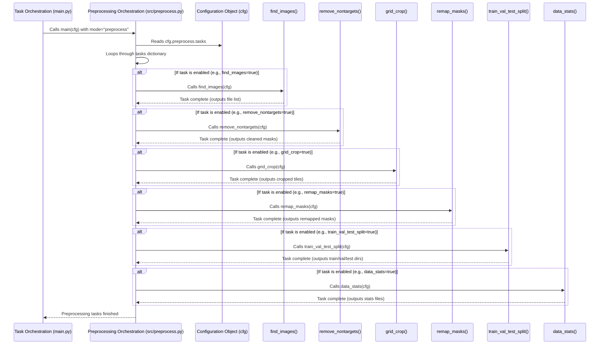

# Chapter 4: Preprocessing Pipeline

Welcome back to the tutorial! In the previous chapters, we've learned how the SemiF-Segmentation project is controlled by [Chapter 1: Hydra Configuration](01_hydra_configuration_.md), how [Chapter 2: Task Orchestration](02_task_orchestration_.md) directs the project to perform a specific task like `query`, and how [Chapter 3: Data Querying](03_data_querying_.md) selects the specific data records (cutouts) we want from the database and saves their details to a list.

Now that we have our curated list of data records, we can't usually just feed the raw image files directly into a segmentation model for training. The data needs to be cleaned, adjusted, and organized first. This is where the **Preprocessing Pipeline** comes in.

## The Challenge: Raw Data Isn't Ready

Think of the data querying step as picking out all the ingredients you need from a giant pantry (the database). You have a list of ingredients (the query result). But before you can cook (train the model), you need to prepare those ingredients: wash the vegetables, chop them, maybe mix some things, and measure everything out.

Raw image data often has similar issues:

*   **Full images are too big:** Segmentation models often work best on smaller, consistent image sizes. Original images might be very large field photos.
*   **Unwanted objects:** The images might contain things you *don't* want the model to learn (like a color checker, or non-target weeds you want to ignore).
*   **Confusing mask values:** The original masks might have many different pixel values, representing very specific sub-categories (e.g., `pixel value 15` for 'Giant Foxtail Grass', `pixel value 20` for 'Yellow Foxtail Grass'). Your model might just need to distinguish between `background` and `grass` (a single value for all grass types).
*   **Data isn't split:** For machine learning, you need separate sets of data for training, testing how well the model learns (validation), and evaluating the final performance (testing).

Manually performing these steps for thousands of images would be impossible and inconsistent. We need an automated, configurable way to process the data.

## The Solution: The Preprocessing Pipeline

The Preprocessing Pipeline is the project's automated **data preparation area**. It takes the raw image data associated with the records selected by the query and applies a series of steps to make it ready for the model.

This pipeline is flexible. It's not one fixed process, but a sequence of **optional** steps. You decide which steps to run and how to configure them, all through the Hydra configuration system.

The main tasks often performed by the preprocessing pipeline include:

1.  **Finding Image/Mask Files:** Locating the actual image and mask files on disk based on the list from the query.
2.  **Removing Unwanted Objects:** Modifying masks to set pixels belonging to specific unwanted categories (like color checkers or non-target weeds) to the background value.
3.  **Cropping Images/Masks:** Dividing large full images and their corresponding masks into smaller, fixed-size tiles. This is often necessary to create data samples that fit into model memory and have a consistent input size.
4.  **Remapping Mask Values:** Changing the pixel values in the masks to map multiple original classes into a smaller, standardized set of target classes required by your model.
5.  **Splitting Data:** Organizing the processed images and masks into distinct directories for training, validation, and testing datasets.
6.  **Calculating Data Statistics:** Computing things like the mean and standard deviation of pixel values across the dataset (needed for image normalization during training) and analyzing the distribution of classes in the masks.

## How to Use the Preprocessing Pipeline

Just like the `query` task, you initiate the preprocessing pipeline using the `mode` parameter via the command line. You set `mode=preprocess`.

```bash
python main.py mode=preprocess
```

This command tells the [Task Orchestration](02_task_orchestration_.md) (`main.py`) to execute the preprocessing logic. The specific steps the pipeline runs and how they are configured are defined in the Hydra configuration files, primarily in the `conf/preprocess` directory. The `conf/config.yaml` loads the default preprocessing configuration via `- preprocess: default`.

Let's look at a simplified `conf/preprocess/default.yaml`:

```yaml
# --- File: conf/preprocess/default.yaml (Simplified) ---
tasks:
  find_images: true           # Step 1: Locate image/mask paths from query result
  remove_nontargets: true     # Step 2: Clean masks (e.g., remove color checker)
  grid_crop: true             # Step 3: Crop images into tiles
  remap_masks: true           # Step 4: Remap mask pixel values
  train_val_test_split: true  # Step 5: Split data into train/val/test
  data_stats: true            # Step 6: Calculate dataset statistics
  viz_results: false          # Optional: Visualize some results (often done separately or later)

# --- Configuration for specific steps (if enabled above) ---

remove_nontargets:
  remove_colorchecker: True # Setting specific to remove_nontargets

grid_crop:
  crop_height: 2048 # Tile height in pixels
  crop_width: 2048  # Tile width in pixels

remap_masks:
  group_name: group # Use the 'group' mapping (e.g., monocot/dicot/background)
  process_concurrently: True # Speed up mask remapping using multiple processes

train_val_test_split:
  val_size: 0.1   # 10% for validation
  test_size: 0.1  # 10% for testing
  seed: 42        # For reproducible splits
  use_concurrency: True # Speed up file copying
  remove_cropped_data: True # Clean up intermediate cropped files after splitting

data_stats:
  ignore_background: False # Include background class in stats calculation
```

This configuration controls the pipeline:

*   The `tasks` section lists the available preprocessing steps. Setting a task name to `true` enables it, `false` skips it.
*   Below the `tasks` section, there are separate sections (`remove_nontargets`, `grid_crop`, `remap_masks`, etc.) with parameters specific to each step. These parameters are only relevant if the corresponding task is enabled.

**Our Use Case:** Let's say we want to preprocess the data selected by our query (from Chapter 3). We want to find the files, remove color checkers from masks, crop the images into 2048x2048 tiles, remap the mask values using the 'group' mapping, split the data 80/10/10 into train/val/test, and calculate the dataset statistics. The `default.yaml` shown above configures exactly this!

To run this specific preprocessing pipeline:

```bash
python main.py mode=preprocess
```

**What happens when you run this:**

1.  You run `main.py`.
2.  [Hydra Configuration](01_hydra_configuration_.md) loads the configuration, including settings from `conf/preprocess/default.yaml`.
3.  [Task Orchestration](02_task_orchestration_.md) reads `mode=preprocess` and calls the `preprocess_task` function (which is `main` inside `src/preprocess.py`), passing the full configuration (`cfg`).
4.  The `preprocess_task` (in `src/preprocess.py`) reads the `cfg.preprocess.tasks` dictionary.
5.  It then iterates through the tasks listed in that dictionary and, for each task that is `enabled: true`, it calls the corresponding function (like `find_images(cfg)`, `remove_nontargets(cfg)`, `grid_crop(cfg)`, `remap_masks(cfg)`, `train_val_test_split(cfg)`, `data_stats(cfg)`).
6.  Each of these individual functions performs its specific job, reading its own parameters from the `cfg` (e.g., `cfg.preprocess.grid_crop.crop_height`) and usually saving intermediate or final results to directories specified in `cfg.paths`.

The output of this command will be various directories containing the processed images and masks, organized into train/val/test splits, along with data statistics files. These are typically saved under `outputs/<date>/<time>/preprocess/<project_name>/data/split`, controlled by your `cfg.paths`.

For example, after running the command, you might find directories like:
*   `outputs/2023-10-27/10-30-00/preprocess/test_synthetic/data/split/train/images/`
*   `outputs/2023-10-27/10-30-00/preprocess/test_synthetic/data/split/train/masks/`
*   `outputs/2023-10-27/10-30-00/preprocess/test_synthetic/data/split/val/images/`
*   ...and so on for validation and test sets.
*   You might also find a `data_stats` directory containing files like `rgb_mean_std.json` and class distribution plots.

This structured output is the input for the [Chapter 7: Data Loading & Augmentation](07_data_loading___augmentation_.md) and [Chapter 5: Segmentation Model & Training](05_segmentation_model___training_.md) steps.

**Overriding Preprocessing Settings:** You can override any preprocessing setting from the command line using Hydra's capabilities.

Want to disable cropping?

```bash
python main.py mode=preprocess preprocess.tasks.grid_crop=false
```

Want to change the crop size?

```bash
python main.py mode=preprocess mode=preprocess preprocess.grid_crop.crop_height=1024 preprocess.grid_crop.crop_width=1024
```

This allows for great flexibility in defining different preprocessing workflows for different experiments or datasets.

## Internal Workflow (Simplified)

Let's look at how the `preprocess_task` (in `src/preprocess.py`) orchestrates the individual steps.



This diagram shows that `src/preprocess.py` doesn't do the work itself, but acts as an orchestrator, calling out to specific functions (`find_images`, `grid_crop`, etc.) located in separate files within the `src/preprocessing/` directory. Each of these functions is responsible for a single, well-defined step.

## Inside the Code (Simplified)

Let's look at the `main` function inside `src/preprocess.py` to see how it uses the `TASK_REGISTRY` (similar to `main.py`'s orchestration in [Chapter 2: Task Orchestration](02_task_orchestration_.md)).

```python
# --- File: src/preprocess.py (Simplified Main Function) ---
import logging
import hydra
from omegaconf import DictConfig
from pathlib import Path

# Import the functions for each preprocessing task
from src.preprocessing.grid_crop import main as grid_crop
from src.preprocessing.train_val_test_split import main as train_val_test_split
from src.preprocessing.remap_masks import main as remap_masks
from src.preprocessing.data_stats import main as data_stats
# ... import other task functions ...

log = logging.getLogger(__name__)

# Define a registry mapping task names from config to the task functions
TASK_REGISTRY = {
    "find_images": None, # Placeholder for find_images function
    "remove_nontargets": None, # Placeholder for remove_nontargets function
    "grid_crop": grid_crop,
    "remap_masks": remap_masks,
    "train_val_test_split": train_val_test_split,
    "data_stats": data_stats
    # Add more tasks here as needed
}

# Note: @hydra.main is here because you *could* run preprocess.py directly,
# but main.py calls its 'main' function directly.
# @hydra.main(version_base="1.3", config_path="../conf", config_name="config")
def main(cfg: DictConfig) -> None:
    """ Main entry point for the preprocessing tasks """
    log.info(f"Starting preprocessing tasks...")

    # Get the dictionary of tasks and their enabled status from config
    task_dict = cfg.preprocess.tasks

    # Iterate through the tasks defined in the configuration
    for task_name, enabled in task_dict.items():

        if enabled:
            log.info(f"Checking task {task_name}")

            # Look up the task name in the registry and call the function
            if task_name in TASK_REGISTRY and TASK_REGISTRY[task_name] is not None:
                log.info(f"Running task: {task_name}")
                TASK_REGISTRY[task_name](cfg) # Pass the full configuration to the task function
                # Optional: copy config specific to this task run
                # copy_hydra_config_to_subfolder(cfg, task_name)

            elif task_name not in TASK_REGISTRY:
                 log.error(f"Task {task_name} not found in preprocessing task registry")
                 # Decide if this should stop the pipeline or just log error

            else: # Task found in registry but value is None
                 log.warning(f"Task function for '{task_name}' is not imported or registered.")

        else:
            log.info(f"Skipping task {task_name}. Enabled: {enabled}")

    log.info("Preprocessing complete.")

# if __name__ == "__main__":
#     main() # This part runs ONLY if you execute src/preprocess.py directly
```

This snippet shows how `src/preprocess.py` reads which tasks are enabled from `cfg.preprocess.tasks` and then calls the corresponding imported function for each enabled task, passing the entire configuration `cfg`.

Now let's peek inside one of the specific preprocessing task files, for example, `src/preprocessing/remap_masks.py`, to see how it uses the configuration and performs its job.

```python
# --- File: src/preprocessing/remap_masks.py (Simplified Snippets) ---
import cv2
import numpy as np
from pathlib import Path
import hydra
from omegaconf import DictConfig
import logging

log = logging.getLogger(__name__)

# Assume CLASSGROUPS is imported from src/utils/class_groupings.py
# CLASSGROUPS defines mappings like "group": {"background": {...}, "monocot": {...}, "dicot": {...}}

class MaskProcessor:
    def __init__(self, cfg: DictConfig):
        # Read the specific configuration for mask remapping
        self.group_name = cfg.preprocess.remap_masks.group_name # e.g., "group"
        self.species_map = CLASSGROUPS[self.group_name] # Get the actual mapping dictionary

        # Determine the input directory for masks based on previous steps' output
        # This assumes grid_crop output is used, or initial masks if no cropping
        if Path(cfg.paths.cropped_mask_dir).exists():
             self.mask_dir = Path(cfg.paths.cropped_mask_dir)
        # ... add checks for other possible input mask directories ...
        else:
             # Fallback or error if expected input dir not found
             raise FileNotFoundError("Could not find input mask directory.")

        # Define the output directory for the remapped masks
        self.remapped_mask_dir = Path(str(self.mask_dir) + "_remapped") # e.g., adds "_remapped" to the folder name
        self.remapped_mask_dir.mkdir(parents=True, exist_ok=True) # Ensure output dir exists

    def remap_mask(self, image: np.ndarray, image_path: str) -> np.ndarray:
        """
        Remap the given image mask based on the species_map.
        """
        # Create a lookup table from the species_map
        # Maps original pixel values (class_ids) to new pixel values (values)
        lookup_table = np.zeros(256, dtype=np.uint8) # Assuming mask values are 0-255

        for class_group, mapping in self.species_map.items():
            class_ids = mapping["class_ids"] # List of original IDs (e.g., [5, 6, 7, 8, ...])
            new_value = mapping["values"]   # The new ID (e.g., 1 for monocot)
            lookup_table[class_ids] = new_value # Map original IDs to the new value

        # Apply the lookup table to the input mask array
        remapped_image = lookup_table[image]
        return remapped_image

    def process(self):
        """
        Find all masks in the input directory, remap them, and save to output directory.
        """
        # Get list of all mask files to process
        mask_paths = [str(p) for p in self.mask_dir.glob("*.png")]

        # Process each mask file
        for mask_path_str in mask_paths:
             mask_path = Path(mask_path_str)
             # Load the original mask
             mask = cv2.imread(str(mask_path), cv2.IMREAD_GRAYSCALE)

             if mask is None:
                 log.error(f"Could not load mask {mask_path}. Skipping.")
                 continue

             # Remap the mask pixels
             remapped_mask = self.remap_mask(mask, mask_path_str)

             # Define output path and save the remapped mask
             output_path = self.remapped_mask_dir / mask_path.name
             cv2.imwrite(str(output_path), remapped_mask)
             log.debug(f"Remapped and saved {mask_path.name}")

# This is the function that src/preprocess.py calls
# @hydra.main(...) # Again, decorator is for direct execution, not used by parent caller
def main(cfg: DictConfig):
    log.info("Starting mask remapping...")

    # Initialize the processor, which reads its specific config
    processor = MaskProcessor(cfg)

    # Run the processing logic
    processor.process()

    log.info("Mask remapping complete.")

# if __name__ == "__main__":
#     main()
```

This simplified code shows:

1.  The `MaskProcessor` class in `src/preprocessing/remap_masks.py` is initialized with the full `cfg`.
2.  It reads its specific parameters like `group_name` from `cfg.preprocess.remap_masks`.
3.  It determines its input directory (where to find masks to remap) and its output directory (where to save the results) using `cfg.paths`.
4.  The `remap_mask` method contains the core logic: it builds a lookup table based on the `CLASSGROUPS` defined in `src/utils/class_groupings.py` (an example is shown in the code references) and the chosen `group_name` from the config. It then applies this table to the mask data.
5.  The `process` method finds all input mask files, calls `remap_mask` for each, and saves the output to the specified directory.
6.  The `main(cfg)` function in this file is the entry point called by `src/preprocess.py`. It initializes the `MaskProcessor` and runs its `process` method.

Each preprocessing task file (`grid_crop.py`, `train_val_test_split.py`, etc.) follows a similar pattern: they define a class or functions that take the `cfg` as input, read their relevant settings from `cfg.preprocess`, perform their specific data manipulation step, and save results to paths defined in `cfg.paths`.

## Summary

In this chapter, we learned about the **Preprocessing Pipeline**, which prepares the data selected by the query for model training or inference.

*   It acts like a data preparation area, applying configurable steps to raw images and masks.
*   Common steps include finding files, removing unwanted objects, cropping, remapping mask values, splitting data, and calculating statistics.
*   You control which steps run and how they are configured via `conf/preprocess/*.yaml` and command-line overrides.
*   The pipeline is executed by running `python main.py mode=preprocess`.
*   Internally, `src/preprocess.py` acts as an orchestrator, reading the `cfg.preprocess.tasks` list and calling separate functions in `src/preprocessing/` for each enabled task.
*   Each individual task file reads its specific configuration from the `cfg` and performs its defined data manipulation, saving the results to directories specified in `cfg.paths`.

The output of the preprocessing pipeline is typically a set of directories containing cleaned, formatted, and split image and mask files, along with necessary statistics. This data is now ready for the core task: training the segmentation model.

[Chapter 5: Segmentation Model & Training](05_segmentation_model___training_.md)

---

Generated by [AI Codebase Knowledge Builder](https://github.com/The-Pocket/Tutorial-Codebase-Knowledge)