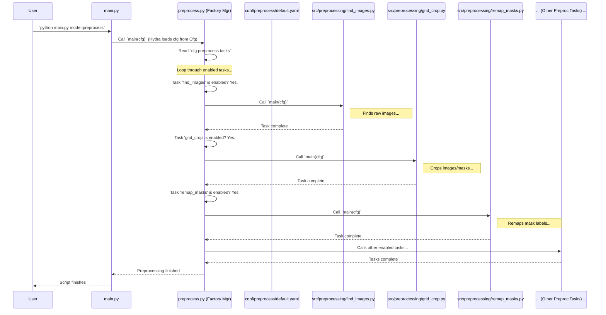

# Chapter 4: Preprocessing Pipeline (`preprocess.py` & `src/preprocessing/`)

In the [previous chapter](03_data_querying___sampling___query_py___.md), we learned how `query.py` acts like a librarian, finding the specific image records we need from our database and saving the list to a JSON file. Now that we have our "shopping list" of images, are they ready to be used for training a machine learning model? Not quite!

Raw images and their corresponding masks (which show where the objects are) often need some preparation before a model can learn from them effectively. This is where the **Preprocessing Pipeline** comes in.

## What Problem Does the Preprocessing Pipeline Solve?

Imagine you've gathered all the raw ingredients for a recipe (like the images and masks found by `query.py`). You wouldn't just throw them all into a pot! You need to wash the vegetables, chop them into smaller pieces, maybe group certain ingredients together, and measure everything out.

The Preprocessing Pipeline does something similar for our image data. It acts like an **assembly line** in a factory, taking the raw data and performing a series of steps to make it clean, consistent, and ready for the next stage (training).

**Use Case:** Let's say our librarian (`query.py`) gave us a list of very large images of different grasses. Our model, however, works best with smaller, square images (e.g., 1024x1024 pixels). Also, the original masks might label every single different grass species with a unique number, but we only want to train our model to distinguish between broad categories like "grass" and "background". Finally, we need to divide our prepared data into separate sets for training the model, checking its performance during training (validation), and testing it afterwards.

The Preprocessing Pipeline handles all these steps automatically, based on instructions we give it.

## Key Concepts

1.  **The Orchestrator (`preprocess.py`):** Think of this as the **Factory Manager**. It doesn't do the individual tasks itself but oversees the entire assembly line. It reads the instructions (configuration) to know which steps to run and in what order.
2.  **The Assembly Line Stations (`src/preprocessing/`):** This directory contains several Python scripts, each acting like a specialized station on the assembly line. Each station performs one specific task:
    *   `find_images.py`: Locates the actual image and mask files on disk based on the list from `query.py`.
    *   `remove_nontargets.py`: Cleans up masks by removing labels for things we don't care about (like color checkers or weeds marked as 'non-target').
    *   `grid_crop.py`: Chops large images and masks into smaller, uniform tiles (like dicing vegetables).
    *   `remap_masks.py`: Changes the label numbers in the masks to match the simplified categories we want (like grouping different types of carrots together).
    *   `train_val_test_split.py`: Divides the prepared data into training, validation, and test sets (like portioning ingredients).
    *   `data_stats.py`: Calculates useful statistics about the prepared dataset, like the average color values (mean) and variation (standard deviation), which helps during training.
3.  **The Blueprint (`conf/preprocess/default.yaml`):** This configuration file is the blueprint for our assembly line. It tells the Factory Manager (`preprocess.py`) *which* stations (`src/preprocessing/` tasks) should be turned **on** (`true`) or **off** (`false`) and provides specific settings for each active station (e.g., the desired tile size for `grid_crop.py`).
4.  **Input:**
    *   The JSON file created by [Chapter 3: Data Querying & Sampling (`query.py`)](03_data_querying___sampling___query_py___.md) (our shopping list).
    *   The actual raw image and mask files stored somewhere on our disk.
    *   The configuration in `conf/preprocess/default.yaml`.
5.  **Output:**
    *   Processed images and masks (e.g., cropped, remapped), neatly organized into `train`, `val`, and `test` folders.
    *   Dataset statistics (e.g., `rgb_mean_std.json`).
    *   These outputs are ready for the next step: [Chapter 5: Data Loading & Augmentation (`datasets.py`, `augs.py`)](05_data_loading___augmentation___datasets_py____augs_py___.md).

## How to Use the Preprocessing Pipeline

Using the preprocessing pipeline is straightforward, thanks to our Project Manager (`main.py`) from [Chapter 1: Task Orchestration (`main.py`)](01_task_orchestration___main_py___.md).

**Example: Running the Default Preprocessing**

1.  **Configure:** First, you might check or edit the `conf/preprocess/default.yaml` file to make sure the tasks you want are enabled (`true`) and have the right settings. For instance, make sure `grid_crop: true` and set the `crop_height` and `crop_width`.

    ```yaml
    # File: conf/preprocess/default.yaml (Snippet)
    tasks:
      find_images: true          # Find the raw images from the query list
      remove_nontargets: true  # Clean up unwanted labels in masks
      grid_crop: true          # Chop large images into tiles
      remap_masks: true        # Remap mask labels to desired groups
      train_val_test_split: true # Split data into train/val/test
      data_stats: true         # Calculate dataset mean/std

    grid_crop:
      crop_height: 1024        # Set desired tile height
      crop_width: 1024         # Set desired tile width

    remap_masks:
      group_name: vegetation   # Remap all plant types to a single 'vegetation' class
    ```

2.  **Run:** Open your terminal, navigate to the project's root directory, and run:

    ```bash
    python main.py mode=preprocess
    ```

    *   `python main.py`: Execute the main project manager script.
    *   `mode=preprocess`: Tell the manager you want to run the "preprocess" task. This makes `main.py` call the `main` function inside `src/preprocess.py`. Hydra automatically loads the configuration, including the settings from `conf/preprocess/default.yaml` into the `cfg` object.

**What Happens?**

1.  `main.py` starts and sees `mode=preprocess`.
2.  It calls the `main` function in `src/preprocess.py` (the Factory Manager), passing the configuration (`cfg`).
3.  `preprocess.py` looks at `cfg.preprocess.tasks` in the configuration.
4.  It goes through the list of tasks (`find_images`, `remove_nontargets`, `grid_crop`, etc.).
5.  For each task marked as `true`, it finds the corresponding Python script in `src/preprocessing/` and runs its `main` function, passing the `cfg` so the script knows its specific settings (like crop size).
6.  The tasks run in sequence, each step preparing the data further.
7.  Finally, you'll have folders like `data/processed/train/images/`, `data/processed/train/masks/`, `data/processed/val/images/`, etc., filled with the prepared data, plus a statistics file. (The exact output path is determined by `cfg.paths`).

## Under the Hood: The Assembly Line in Action

Let's visualize the workflow when you run `python main.py mode=preprocess`:

1.  **Dispatch:** `main.py` identifies `mode=preprocess` and calls the main function in `src/preprocess.py`.
2.  **Read Blueprint:** `preprocess.py` reads the list of tasks and their enabled status from `cfg.preprocess.tasks`.
3.  **Task Loop:** It iterates through the tasks defined in the blueprint.
4.  **Check & Call:** For each task:
    *   Is it enabled (`true`) in the config?
    *   If yes: Look up the function for this task (e.g., `find_images` function from `src/preprocessing/find_images.py`).
    *   Call that function, passing the full `cfg` object.
    *   The specialist script (e.g., `find_images.py`) runs, performs its specific job using settings from `cfg`, and finishes.
5.  **Next Task:** Move to the next enabled task in the list and repeat step 4.
6.  **Completion:** Once all enabled tasks are finished, the preprocessing is complete.

**Visualizing the Flow:**



## Diving Deeper into the Code

Let's look at simplified snippets of the key files.

**1. The Orchestrator (`src/preprocess.py`)**

This script manages the execution of the sub-tasks.

```python
# File: src/preprocess.py (Simplified)
import logging
import hydra
from omegaconf import DictConfig
# Import the main functions from each preprocessing 'station'
from src.preprocessing.find_images import main as find_images
from src.preprocessing.remove_nontargets import main as remove_nontargets
from src.preprocessing.grid_crop import main as grid_crop
from src.preprocessing.remap_masks import main as remap_masks
from src.preprocessing.train_val_test_split import main as train_val_test_split
from src.preprocessing.data_stats import main as data_stats
# ... potentially others ...

log = logging.getLogger(__name__)

# A registry mapping task names (from config) to the imported functions
TASK_REGISTRY = {
    "find_images": find_images,
    "remove_nontargets": remove_nontargets,
    "grid_crop": grid_crop,
    "remap_masks": remap_masks,
    "train_val_test_split": train_val_test_split,
    "data_stats": data_stats,
    # Add more tasks here if they exist in src/preprocessing/
}

@hydra.main(version_base="1.3", config_path="../conf", config_name="config")
def main(cfg: DictConfig) -> None:
    log.info(f"Starting preprocessing tasks...")

    # Get the dictionary of tasks from the config (e.g., {'grid_crop': True, ...})
    task_dict = cfg.preprocess.tasks

    # Loop through each task defined in the config
    for task_name, enabled in task_dict.items():
        if enabled: # Check if the task is turned on (true)
            log.info(f"Running task: {task_name}")
            if task_name in TASK_REGISTRY:
                # Look up the function in our registry
                task_function = TASK_REGISTRY[task_name]
                # Call the function, passing the whole config object
                task_function(cfg)
                # (Code to copy config for logging might be here)
            else:
                log.error(f"Task '{task_name}' enabled but not found in registry!")
        else:
            log.info(f"Skipping task {task_name}. Enabled: {enabled}")

    log.info("Preprocessing complete.")

if __name__ == "__main__":
    main()
```

*   **Explanation:**
    *   It imports the `main` function from each script in `src/preprocessing/`.
    *   `TASK_REGISTRY` acts like a phonebook, mapping the task name (string) from the config file to the actual Python function.
    *   The `main` function receives the `cfg` object from Hydra.
    *   It loops through `cfg.preprocess.tasks`.
    *   If a task is `enabled`, it looks up the corresponding function in the `TASK_REGISTRY` and executes it, passing `cfg`.

**2. The Blueprint (`conf/preprocess/default.yaml`)**

This file controls which tasks run and their settings.

```yaml
# File: conf/preprocess/default.yaml (Simplified)

# --- Control which tasks run ---
tasks:
  find_images: true          # Step 1: Locate raw files
  remove_nontargets: true  # Step 2: Clean masks (e.g., remove colorcheckers)
  grid_crop: true          # Step 3: Crop images/masks into smaller tiles
  remap_masks: true        # Step 4: Change mask labels to target groups
  train_val_test_split: true # Step 5: Split data into train/val/test sets
  data_stats: true         # Step 6: Calculate mean/std, class frequencies

# --- Settings for specific tasks ---
remove_nontargets:
  remove_colorchecker: True # Tell remove_nontargets to remove colorchecker labels

grid_crop:
  crop_height: 1024         # Tell grid_crop the desired tile height
  crop_width: 1024          # Tell grid_crop the desired tile width

remap_masks:
  # Tell remap_masks which grouping to use from src/utils/class_groupings.py
  group_name: vegetation    # Options: family, order, genus, vegetation, etc.
  process_concurrently: true # Use multiple CPU cores if available

train_val_test_split:
  val_size: 0.1             # Use 10% of data for validation
  test_size: 0.1            # Use 10% of data for testing (remaining is training)
  seed: 42                  # For reproducible random splits

data_stats:
  ignore_background: false  # Include background class (pixel value 0) in stats

# ... other settings ...
```

*   **Explanation:**
    *   The `tasks` section acts as the main control panel, turning assembly line stations on (`true`) or off (`false`).
    *   Each subsequent section (e.g., `grid_crop`, `remap_masks`) provides the specific parameters needed by that particular task if it's enabled. These parameters are accessed within the task's script via the `cfg` object (e.g., `cfg.preprocess.grid_crop.crop_height`).

**3. Example Station: Cropping (`src/preprocessing/grid_crop.py`)**

This script cuts large images and masks into smaller tiles.

```python
# File: src/preprocessing/grid_crop.py (Highly Simplified Snippet)
import logging
import cv2
from pathlib import Path
from omegaconf import DictConfig
# ... other imports like ProcessPoolExecutor for speed ...

log = logging.getLogger(__name__)

# (Imagine a class 'CropProcessor' exists that uses cfg)
class CropProcessor:
    def __init__(self, cfg: DictConfig):
        # Read settings from the config object
        self.crop_h = cfg.preprocess.grid_crop.crop_height # Get 1024
        self.crop_w = cfg.preprocess.grid_crop.crop_width  # Get 1024
        # Get input/output paths from cfg.paths
        self.input_image_list_file = Path(cfg.paths.project_mode_dir) / "data" / "images.txt"
        self.output_image_dir = Path(cfg.paths.cropped_image_dir)
        self.output_mask_dir = Path(cfg.paths.cropped_mask_dir)
        # ... setup input/output directories ...

    def process_one_image(self, image_path_str: str):
        image_path = Path(image_path_str)
        # Construct the corresponding mask path (logic might be more complex)
        mask_path = image_path.parent.parent / "meta_masks/semantic_masks" / f"{image_path.stem}.png"
        # Or maybe check local masks path from cfg

        image = cv2.imread(str(image_path))
        mask = cv2.imread(str(mask_path), cv2.IMREAD_GRAYSCALE)

        if image is None or mask is None:
            log.warning(f"Skipping {image_path.stem}, missing image or mask.")
            return

        # --- The core cropping logic ---
        img_h, img_w = image.shape[:2]
        crop_count = 0
        # Loop through the image in steps of crop_h and crop_w
        for y in range(0, img_h, self.crop_h):
            for x in range(0, img_w, self.crop_w):
                img_tile = image[y:y+self.crop_h, x:x+self.crop_w]
                mask_tile = mask[y:y+self.crop_h, x:x+self.crop_w]

                # Check if tile is the correct size and has relevant content
                if img_tile.shape[:2] == (self.crop_h, self.crop_w) and mask_tile.shape[:2] == (self.crop_h, self.crop_w):
                   # Save the image and mask tile with a unique name
                   # e.g., save to self.output_image_dir / f"{image_path.stem}_crop_{crop_count}.jpg"
                   #      save to self.output_mask_dir / f"{image_path.stem}_crop_{crop_count}.png"
                   crop_count += 1
        # --- End of core logic ---
        log.debug(f"Processed {image_path.stem}, created {crop_count} crops.")


    def run_cropping(self):
        # Read list of images to process from self.input_image_list_file
        # Loop through image list and call self.process_one_image for each
        # (Often uses multiprocessing/threading for speed)
        log.info("Cropping finished.")


# This is the main function called by preprocess.py
@hydra.main(version_base="1.3", config_path="../../conf", config_name="config") # Adjust path!
def main(cfg: DictConfig):
    log.info(f"Starting grid cropping with size {cfg.preprocess.grid_crop.crop_height}x{cfg.preprocess.grid_crop.crop_width}...")
    processor = CropProcessor(cfg)
    processor.run_cropping() # Start the actual work
    log.info("Grid cropping complete.")

# Standard Python entry point check (for potential direct execution)
if __name__ == "__main__":
    main()
```

*   **Explanation:**
    *   The script defines logic (likely within a class) to handle cropping.
    *   It reads its specific settings (`crop_height`, `crop_width`, paths) directly from the `cfg` object passed into its `main` function.
    *   The core logic involves loading an image and its mask, looping through them in steps defined by the crop size, and saving the resulting tiles.

**4. Example Station: Remapping Masks (`src/preprocessing/remap_masks.py`)**

This script changes the numerical labels in the mask files.

```python
# File: src/preprocessing/remap_masks.py (Highly Simplified Snippet)
import logging
import cv2
import numpy as np
from pathlib import Path
from omegaconf import DictConfig
# Import the predefined class groupings
from src.utils.class_groupings import CLASSGROUPS
# ... other imports ...

log = logging.getLogger(__name__)

class MaskRemapper:
    def __init__(self, cfg: DictConfig):
        # Get the desired grouping name (e.g., "vegetation") from config
        self.group_name = cfg.preprocess.remap_masks.group_name
        # Look up the specific mapping rules in CLASSGROUPS
        self.mapping_rules = CLASSGROUPS[self.group_name]

        # Get input/output paths from cfg.paths
        # Input dir might be the output of grid_crop (e.g., cfg.paths.cropped_mask_dir)
        self.input_mask_dir = Path(cfg.paths.cropped_mask_dir) # Or maybe the non-cropped masks dir
        # Output dir will store remapped masks (e.g., input_mask_dir + "_remapped")
        self.output_mask_dir = Path(str(self.input_mask_dir) + "_remapped")
        self.output_mask_dir.mkdir(exist_ok=True)

        # Create a lookup table for fast remapping
        self.lookup_table = self.create_lookup_table()

    def create_lookup_table(self):
        # Create an array mapping old values (0-255) to new values
        table = np.zeros(256, dtype=np.uint8)
        for group_info in self.mapping_rules.values():
            original_ids = group_info["class_ids"]
            new_value = group_info["values"]
            table[original_ids] = new_value # Set new value for all original IDs in this group
        return table

    def remap_one_mask(self, mask_path: Path):
        mask = cv2.imread(str(mask_path), cv2.IMREAD_GRAYSCALE)
        if mask is None: return

        # Apply the lookup table efficiently
        remapped_mask = self.lookup_table[mask]

        # Save the remapped mask to the output directory
        output_path = self.output_mask_dir / mask_path.name
        cv2.imwrite(str(output_path), remapped_mask)

    def run_remapping(self):
        # Find all mask files in self.input_mask_dir
        # Loop through them and call self.remap_one_mask for each
        # (Often uses multiprocessing/threading)
        log.info("Mask remapping finished.")

# Main function called by preprocess.py
@hydra.main(version_base="1.3", config_path="../../conf", config_name="config") # Adjust path!
def main(cfg: DictConfig):
    log.info(f"Starting mask remapping using group: {cfg.preprocess.remap_masks.group_name}...")
    remapper = MaskRemapper(cfg)
    remapper.run_remapping()
    log.info("Mask remapping complete.")

if __name__ == "__main__":
    main()
```

*   **Explanation:**
    *   This script reads the desired `group_name` from `cfg.preprocess.remap_masks`.
    *   It uses the `CLASSGROUPS` dictionary (from `src/utils/class_groupings.py`) to find the mapping rules for that group.
    *   It creates an efficient `lookup_table` to quickly convert old pixel values to new ones.
    *   For each mask file, it loads the mask, applies the lookup table, and saves the result.

## Conclusion

Congratulations! You've learned about the **Preprocessing Pipeline** in `SemiF-Segmentation`, orchestrated by `preprocess.py` and configured via `conf/preprocess/default.yaml`.

*   It acts like an **assembly line** to prepare raw data (images and masks) for model training.
*   `preprocess.py` is the **manager**, reading the configuration and calling individual task scripts.
*   The `src/preprocessing/` directory contains the **specialist stations** (scripts) that perform tasks like finding files, cropping, remapping labels, splitting data, and calculating stats.
*   The `conf/preprocess/default.yaml` file is the **blueprint**, allowing you to easily enable/disable tasks and configure their settings.
*   You run the entire pipeline using `python main.py mode=preprocess`.

This pipeline ensures that the data fed into the model is clean, consistent, and correctly formatted, which is essential for successful training.

Now that our data is perfectly prepared and split into train, validation, and test sets, how do we efficiently load it during training and maybe even apply some random transformations (augmentations) to help the model generalize better? That's exactly what we'll cover next!

Let's move on to [Chapter 5: Data Loading & Augmentation (`datasets.py`, `augs.py`)](05_data_loading___augmentation___datasets_py____augs_py___.md)!

---

Generated by [AI Codebase Knowledge Builder](https://github.com/The-Pocket/Tutorial-Codebase-Knowledge)