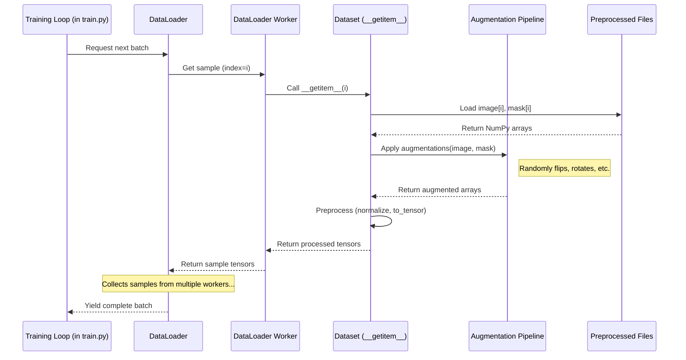

# Chapter 5: Data Loading & Augmentation (`datasets.py`, `augs.py`)

In the [previous chapter](04_preprocessing_pipeline___preprocess_py_____src_preprocessing____.md), we saw how the Preprocessing Pipeline acts like an assembly line, taking our raw data and preparing it into neat folders of images and masks (`train/`, `val/`, `test/`) ready for our model.

But how does the model actually *get* this prepared data during training? And can we make our dataset seem even larger and more varied without collecting more images? This is where **Data Loading** and **Data Augmentation** come into play, handled primarily by `src/utils/datasets.py` and `src/utils/augs.py`.

## What Problem Do `datasets.py` and `augs.py` Solve?

Imagine you're the chef (our machine learning model) ready to cook (train). You need ingredients (images and masks) brought to your cooking station efficiently. You can't just grab one image at a time from the pantry (`data/processed/` folders) – that would be too slow! You need someone to bring you batches of ingredients. Furthermore, maybe you want the kitchen staff to randomly spice up the ingredients differently each time (e.g., chop the carrots differently, add a pinch of salt here, pepper there) to practice cooking with variety.

This is what `datasets.py` and `augs.py` do:

*   **`datasets.py` (The Recipe Card & Pantry Runner):** Defines *how* to find and load a single image and its corresponding mask from the preprocessed folders. It acts like a recipe card explaining how to fetch one serving. PyTorch's `DataLoader` then uses this recipe card with multiple runners to fetch ingredients in batches efficiently.
*   **`augs.py` (The Spice & Garnish Station):** Defines pipelines of random transformations (like flipping, rotating, changing brightness/contrast). It takes the loaded image and mask and applies these random changes *on-the-fly* before they reach the model. This is **Data Augmentation**.
*   **`conf/augment/*.yaml` (The Spice Rack):** Configuration files that tell `augs.py` *which* spices (augmentations) to use and how strongly.

**Use Case:** During training, we need to feed batches of, say, 8 images and 8 masks to our model in each step. We want these images and masks to be loaded quickly from the `data/processed/train/` directory. Critically, we also want each batch to be slightly different. For example, *some* images in the batch might be randomly flipped horizontally, others might have their brightness slightly adjusted, and others might be rotated a little. This helps the model learn to recognize the objects (e.g., grass) regardless of these variations, making it more robust.

## Key Concepts

1.  **PyTorch `Dataset` (`src/utils/datasets.py`):** This is a special Python class required by PyTorch. It needs two main methods:
    *   `__init__`: Sets up the dataset, finding all the image and mask file paths in the specified directories (e.g., `train/images/`, `train/masks/`) and storing the list. It also accepts an augmentation pipeline object.
    *   `__getitem__(index)`: Defines how to get the *single* data sample at a given `index`. It loads the image and mask files for that index, applies the augmentation pipeline (if provided), preprocesses them (like normalizing pixel values and converting to PyTorch Tensors), and returns the processed image and mask.

2.  **PyTorch `DataLoader`:** This is a utility provided by PyTorch (used within `src/train.py`). You give it a `Dataset` object. It automatically handles:
    *   Fetching multiple samples from the `Dataset` using `__getitem__`.
    *   Collating these samples into a **batch** (a group of images and masks).
    *   Using multiple background workers (like parallel pantry runners) to speed up loading.
    *   Shuffling the data order in each training epoch (optional).

3.  **Data Augmentation (`src/utils/augs.py` & `albumentations`):** The process of applying random transformations to the training data. `augs.py` uses a popular library called `albumentations` to define these transformations. Examples include:
    *   Geometric: Flipping, rotating, scaling, cropping.
    *   Color: Changing brightness, contrast, saturation, hue.
    *   Noise: Adding random noise.
    *   Blurring/Sharpening.

4.  **Augmentation Pipelines:** `augs.py` defines functions (like `train_aug` and `val_aug`) that read the configuration from `conf/augment/*.yaml` (via the `cfg` object) and create an `albumentations.Compose` object. This object chains together the selected augmentations. When called on an image/mask pair, it applies the enabled transformations randomly based on their configured probabilities.

5.  **Configuration (`conf/augment/*.yaml`):** These files control which augmentations are applied and their parameters. For example, `conf/augment/default.yaml` might only enable horizontal flips with a low probability, while `conf/augment/heavy_color.yaml` might enable many strong color and geometric distortions. You choose which "spice rack" to use via the Hydra configuration (e.g., `python main.py mode=train augment=heavy_color`).

## How to Use Data Loading & Augmentation

You typically don't run `datasets.py` or `augs.py` directly. They are used internally by the [Training Orchestration (`train.py`)](07_training_orchestration___train_py___.md) script. Here's how it works:

1.  **Choose Augmentation Config:** When you run training, you specify which augmentation configuration to use (or use the default). This is often set in `conf/train/default.yaml` or overridden on the command line:
    ```bash
    # Use augmentations defined in conf/augment/default.yaml
    python main.py mode=train

    # Use augmentations defined in conf/augment/heavy_color.yaml
    python main.py mode=train augment=heavy_color
    ```
    Hydra puts this choice into the `cfg.augment` section of the configuration object.

2.  **Create Augmentation Pipelines:** Inside `src/train.py`, the `train_aug(cfg)` and `val_aug(cfg)` functions from `src/utils/augs.py` are called. They read the settings from `cfg.augment` (which points to the chosen YAML file, e.g., `heavy_color.yaml`) and create the corresponding `albumentations` pipelines.

    ```python
    # File: src/train.py (Simplified Snippet)
    from src.utils.datasets import Dataset # Import the Dataset class
    from src.utils.augs import train_aug, val_aug # Import augmentation functions

    # ... inside the main(cfg) function ...

    # Create the training augmentation pipeline based on config
    training_augmentations = train_aug(cfg)

    # Create the validation augmentation pipeline (usually less intense)
    validation_augmentations = val_aug(cfg)
    ```
    *   **Explanation:** `train_aug` looks at `cfg.augment.train` and builds a pipeline. `val_aug` looks at `cfg.augment.val`.

3.  **Create Datasets:** The `Dataset` class from `src/utils/datasets.py` is instantiated for the training and validation sets, passing the directories containing the preprocessed images/masks and the augmentation pipelines created in the previous step.

    ```python
    # File: src/train.py (Simplified Snippet)
    from pathlib import Path

    # Get paths from config (set by Hydra from conf/paths/default.yaml)
    split_data_dir = Path(cfg.paths.split_dir)
    train_image_dir = split_data_dir / "train" / "images"
    train_mask_dir = split_data_dir / "train" / "masks"
    val_image_dir = split_data_dir / "val" / "images"
    val_mask_dir = split_data_dir / "val" / "masks"
    # (Also load mean/std for normalization if enabled)
    # mean, std = load_stats(...)

    # Create the training Dataset instance
    train_dataset = Dataset(
        images_dir=train_image_dir,
        masks_dir=train_mask_dir,
        augmentation=training_augmentations, # Pass the train aug pipeline
        normalize_image=cfg.train.dataset.normalize, # Read from config
        # mean=mean, # Pass stats if normalizing
        # std=std
    )

    # Create the validation Dataset instance
    val_dataset = Dataset(
        images_dir=val_image_dir,
        masks_dir=val_mask_dir,
        augmentation=validation_augmentations, # Pass the val aug pipeline
        normalize_image=cfg.train.dataset.normalize,
        # mean=mean,
        # std=std
    )
    ```
    *   **Explanation:** We create two `Dataset` objects. `train_dataset` knows where the training images/masks are and will apply `training_augmentations`. `val_dataset` knows about the validation data and will apply `validation_augmentations`.

4.  **Create DataLoaders:** Finally, PyTorch `DataLoader` objects are created, wrapping the `Dataset` instances. The `DataLoader` will handle batching, shuffling, and parallel loading.

    ```python
    # File: src/train.py (Simplified Snippet)
    from torch.utils.data import DataLoader

    # Create the DataLoader for training
    train_loader = DataLoader(
        dataset=train_dataset,
        batch_size=cfg.train.batch_size, # How many samples per batch
        shuffle=True, # Shuffle data each epoch for training
        num_workers=cfg.train.dataset.workers, # Use multiple processes to load
        pin_memory=True, # Speeds up data transfer to GPU
        drop_last=True # Drop last incomplete batch if dataset size not divisible by batch size
    )

    # Create the DataLoader for validation
    val_loader = DataLoader(
        dataset=val_dataset,
        batch_size=cfg.train.batch_size,
        shuffle=False, # No need to shuffle validation data
        num_workers=cfg.train.dataset.workers
    )
    ```
    *   **Explanation:** `train_loader` will now provide batches of augmented training data. `val_loader` will provide batches of (usually less or non-augmented) validation data. These loaders are then used directly in the training loop.

## Under the Hood: How a Batch is Loaded and Augmented

Let's trace what happens when the training loop asks `train_loader` for one batch of data:

1.  **Request Batch:** The training process (managed by PyTorch Lightning's `Trainer` in `src/train.py`) asks `train_loader` for the next batch.
2.  **Dispatch Workers:** `train_loader` uses its `num_workers` (e.g., 16) background processes. It asks each worker to fetch one or more individual samples from `train_dataset`.
3.  **Get Item:** For each sample requested, a worker calls the `train_dataset.__getitem__(index)` method.
4.  **Load Raw:** `__getitem__` reads the image file (e.g., `image_0123.jpg`) and mask file (e.g., `image_0123.png`) corresponding to the given `index` from the disk (`data/processed/train/...`). These are usually loaded as NumPy arrays.
5.  **Augment:** `__getitem__` calls the `training_augmentations` pipeline (the `albumentations.Compose` object) with the loaded image and mask.
    *   The pipeline iterates through its defined augmentations (e.g., `HorizontalFlip`, `RandomBrightnessContrast`).
    *   For each augmentation, it decides randomly (based on the probability `p` set in the config) whether to apply it.
    *   If applied, it modifies the image and/or mask NumPy array(s). *This happens randomly for each sample independently.*
6.  **Preprocess:** `__getitem__` performs final preprocessing:
    *   Scales image pixel values (e.g., divides by 255.0 to be in [0, 1]).
    *   Normalizes the image if enabled (subtracts `mean`, divides by `std`).
    *   Transposes the image array from HWC (Height, Width, Channel) to CHW (Channel, Height, Width) format, which PyTorch prefers.
    *   Converts the final image and mask NumPy arrays into PyTorch Tensors.
7.  **Return Sample:** `__getitem__` returns the processed image tensor and mask tensor.
8.  **Collate Batch:** `train_loader` collects the processed tensors returned by the workers for all samples in the batch. It stacks them together to form batch tensors (e.g., an image tensor of shape `[batch_size, channels, height, width]` and a mask tensor of shape `[batch_size, 1, height, width]`).
9.  **Yield Batch:** `train_loader` yields the complete batch to the training loop.

**Visualizing the Flow (Simplified):**



## Diving Deeper into the Code

**1. `src/utils/datasets.py` (Simplified `Dataset` class)**

```python
# File: src/utils/datasets.py (Simplified)
import cv2
import numpy as np
from torch.utils.data import Dataset as BaseDataset
import torch
from pathlib import Path
import os

class Dataset(BaseDataset):
    def __init__(
        self,
        images_dir, # Path to images folder (e.g., data/processed/train/images)
        masks_dir,  # Path to masks folder (e.g., data/processed/train/masks)
        augmentation=None, # The albumentations pipeline object
        normalize_image=False,
        mean=None,
        std=None
    ):
        # Find all images, assume masks have same stem name but .png extension
        self.images_fps = sorted(list(Path(images_dir).glob("*.jpg")))
        self.masks_fps = [Path(masks_dir) / f"{img.stem}.png" for img in self.images_fps]

        self.augmentation = augmentation
        self.normalize_image = normalize_image
        self.mean = np.array(mean) if mean is not None else np.array([0.0, 0.0, 0.0])
        self.std = np.array(std) if std is not None else np.array([1.0, 1.0, 1.0])

    def __len__(self):
        # Returns the total number of samples
        return len(self.images_fps)

    def __getitem__(self, idx):
        # 1. Load image and mask for the given index 'idx'
        image = cv2.imread(str(self.images_fps[idx]))
        image = cv2.cvtColor(image, cv2.COLOR_BGR2RGB) # BGR to RGB
        mask = cv2.imread(str(self.masks_fps[idx]), cv2.IMREAD_GRAYSCALE) # Load as grayscale

        # 2. Apply augmentations (if any)
        if self.augmentation:
            # This calls the albumentations pipeline
            augmented = self.augmentation(image=image, mask=mask)
            image, mask = augmented["image"], augmented["mask"]

        # 3. Preprocess image (Normalize, ToTensor)
        image = image / 255.0 # Scale to [0, 1]
        if self.normalize_image:
            image = (image - self.mean) / self.std # Normalize
        image = image.transpose(2, 0, 1) # HWC -> CHW for PyTorch
        image_tensor = torch.from_numpy(image).float()

        # 4. Preprocess mask (ToTensor)
        # Add channel dim if needed: HW -> 1HW
        if mask.ndim == 2: mask = np.expand_dims(mask, axis=0)
        mask_tensor = torch.from_numpy(mask).long() # Masks often use LongTensor

        # 5. Return the processed tensors and the original stem name
        return image_tensor, mask_tensor, self.images_fps[idx].stem
```

*   **Explanation:**
    *   `__init__` finds the file paths and stores the augmentation object and normalization parameters.
    *   `__len__` tells the `DataLoader` how many samples are available.
    *   `__getitem__` implements the core logic: load -> augment -> preprocess -> return tensors. It's called by the `DataLoader` for each sample needed in a batch.

**2. `src/utils/augs.py` (Simplified Augmentation Builder)**

```python
# File: src/utils/augs.py (Simplified)
import albumentations as A # Import the library

def train_aug(cfg):
    """Builds training augmentations based on config."""
    # Get the 'train' section of the augmentation config
    aug_cfg = cfg.augment.train
    train_transform = [] # Start with an empty list of transforms

    # Check config flags and add corresponding albumentations transforms
    if aug_cfg.horizontal_flip.enable:
        train_transform.append(
            A.HorizontalFlip(p=aug_cfg.horizontal_flip.p) # Add horizontal flip
        )

    if aug_cfg.vertical_flip.enable:
        train_transform.append(
            A.VerticalFlip(p=aug_cfg.vertical_flip.p) # Add vertical flip
        )

    # Example: Add brightness/contrast adjustments if enabled
    if aug_cfg.hue_saturation.enable:
        hs_cfg = aug_cfg.hue_saturation
        if "RandomBrightnessContrast" in hs_cfg.transforms:
             train_transform.append(
                 A.RandomBrightnessContrast(
                    brightness_limit=hs_cfg.brightness_limit,
                    contrast_limit=hs_cfg.contrast_limit,
                    p=hs_cfg.p # Probability for applying this specific transform
                 )
             )
        # ... Add other hue/saturation transforms similarly ...

    # ... Add checks for other augmentations like rotate, scale, noise etc. ...

    # Combine all enabled transformations into a single pipeline
    return A.Compose(train_transform)


def val_aug(cfg):
    """Builds validation augmentations (usually minimal)."""
    aug_cfg = cfg.augment.val
    val_transform = []

    # Example: Maybe only PadIfNeeded for validation if enabled
    if aug_cfg.padding.enable:
        val_transform.append(
            A.PadIfNeeded(
                min_height=aug_cfg.img_hw[0],
                min_width=aug_cfg.img_hw[1],
                p=aug_cfg.padding.p
            )
        )

    return A.Compose(val_transform)
```

*   **Explanation:**
    *   These functions take the Hydra configuration (`cfg`) as input.
    *   They look inside `cfg.augment.train` or `cfg.augment.val`.
    *   Based on which augmentations are set to `enable: true` in the corresponding `.yaml` file (e.g., `conf/augment/default.yaml`), they add `albumentations` transforms (like `A.HorizontalFlip`) to a list.
    *   `A.Compose(transform_list)` creates the final pipeline object that will be passed to the `Dataset`.

**3. `conf/augment/default.yaml` (Example Configuration)**

```yaml
# File: conf/augment/default.yaml (Snippet)
train:
  # Target image size after potential cropping/padding
  img_hw: ["${preprocess.grid_crop.crop_height}", "${preprocess.grid_crop.crop_width}"]

  horizontal_flip:
    enable: true   # Apply horizontal flips? Yes.
    p: 0.1         # Probability of applying flip to any given image (10%)

  vertical_flip:
    enable: false  # Apply vertical flips? No.
    p: 0.0

  # ... other augmentations (affine, optical, noise, etc.) set to enable: false ...

  hue_saturation:
    enable: true   # Apply some hue/saturation adjustments? Yes.
    transforms:
      - RandomBrightnessContrast # Which specific adjustment? This one.
    brightness_limit: [-0.1, 0.1] # How much brightness can change (+/- 10%)
    contrast_limit: [-0.1, 0.1]   # How much contrast can change (+/- 10%)
    # hue, sat, val shifts disabled here
    p: 0.05        # Probability of applying brightness/contrast (5%)

# Validation augmentations (often minimal or none)
val:
  img_hw: ${augment.train.img_hw} # Keep same size target
  padding:
    enable: false # No padding for validation by default
    p: 0.0
```

*   **Explanation:** This YAML file acts as the control panel for `augs.py`. The `enable: true/false` flags turn specific augmentations on or off. The `p` value controls the probability, and other keys (like `brightness_limit`) configure the intensity of the augmentation. `augs.py` reads this file (via `cfg`) to build the correct `A.Compose` pipeline.

## Conclusion

Fantastic! You've now learned how `SemiF-Segmentation` handles getting prepared data to the model efficiently and how it uses data augmentation to improve training.

*   **`src/utils/datasets.py`** defines a PyTorch `Dataset` class that knows how to load a single preprocessed image and mask.
*   **`src/utils/augs.py`** defines functions (`train_aug`, `val_aug`) that build data augmentation pipelines using the `albumentations` library based on configuration.
*   **`conf/augment/*.yaml`** files provide the configurations to control which augmentations are used.
*   PyTorch's **`DataLoader`** (used in `src/train.py`) leverages the `Dataset` and augmentation pipeline to provide shuffled, batched, and augmented data efficiently during training.

This combination ensures that the model receives data quickly and sees varied versions of the input images, helping it learn more robust features.

Now that we know how the data is prepared and fed, what about the "chef" itself? What kind of model are we actually training?

Let's move on to the heart of the project: [Chapter 6: Segmentation Model Module (`model.py`)](06_segmentation_model_module___model_py___.md)!

---

Generated by [AI Codebase Knowledge Builder](https://github.com/The-Pocket/Tutorial-Codebase-Knowledge)