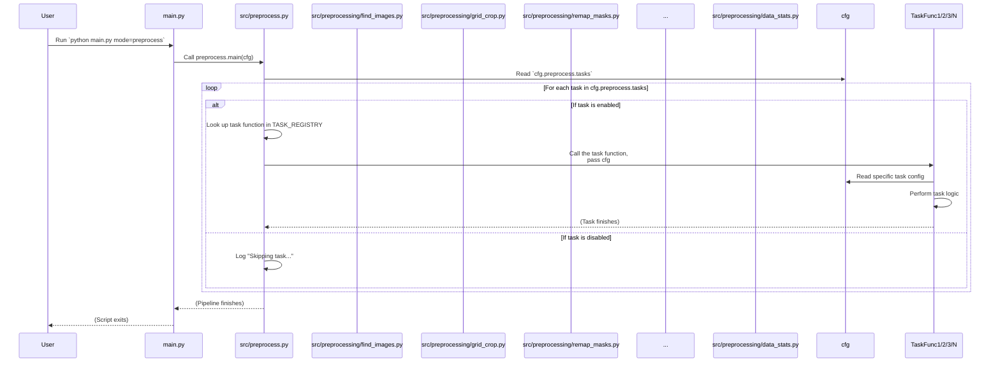

# Chapter 5: Data Preprocessing Pipeline

Welcome back! In our previous chapters, you learned how to use Hydra for configuration ([Chapter 1: Hydra Configuration System](01_hydra_configuration_system_.md)), how `main.py` runs different tasks based on your settings ([Chapter 2: Main Task Runner](02_main_task_runner_.md)), how to keep essential data files updated ([Chapter 3: Data Synchronization (Sync)](03_data_synchronization__sync__.md)), and how to pick the exact data records you need from the database ([Chapter 4: Database Querying & Sampling (Query)](04_database_querying___sampling__query__.md)).

Now that you've used the Query task to get a list (a JSON or CSV file) of the specific plant cutouts you want to work with, you have the *information* about the data. But you don't yet have the actual image files and their corresponding masks in a format ready for training a machine learning model.

Think of the database query output as a shopping list of ingredients. The **Data Preprocessing Pipeline** is the kitchen where you take those raw ingredients (the full-sized images and their masks identified by the query) and prepare them by washing, chopping, sorting, and standardizing them according to your recipe (your configuration settings).

## What is the Data Preprocessing Pipeline? (Your Data Preparation Factory)

The Data Preprocessing Pipeline is a collection of automated steps designed to take the raw image and mask files associated with the cutouts selected by the Query task and transform them into a clean, standardized dataset suitable for training or inference.

It's not just one action, but a sequence of individual *tasks* that are performed one after the other. You can enable or disable specific tasks and configure how each one should behave, making the pipeline very flexible.

Some common tasks in this pipeline include:

*   **Finding the actual image and mask files:** Locating the full-sized files on your storage based on the paths identified in the database query results.
*   **Removing unwanted objects:** Cleaning up masks by removing areas that represent things you don't want the model to learn (like color checkers or non-target weeds).
*   **Cropping into tiles:** Breaking large images and masks into smaller, fixed-size pieces ("tiles") which are often better suited for segmentation models.
*   **Remapping mask values:** Changing the pixel values in the masks to a new set of standardized numbers that represent broader classes (e.g., mapping several specific weed species IDs to a single "weed" class ID).
*   **Splitting data:** Dividing the prepared images and masks into standard training, validation, and testing sets.
*   **Calculating statistics:** Figuring out the average color (mean) and color variation (standard deviation) of your dataset, which is often needed for normalizing images during training.

By running these tasks, the pipeline takes your selected data from its raw state to a structured dataset ready for the next steps, like data augmentation ([Data Augmentation](06_data_augmentation_.md)) and model training ([Segmentation Model Module (Training/Validation)](08_segmentation_model_module__training_validation__.md)).

## How to Use the Preprocessing Pipeline

Like other main tasks in the project, you trigger the Data Preprocessing Pipeline using the `main.py` script with the `mode=preprocess` command-line argument:

```bash
python main.py mode=preprocess
```

The specific tasks that run and how they behave are entirely controlled by the configuration, primarily found in `conf/preprocess/default.yaml`. Let's look at how this configuration works.

### Enabling and Disabling Tasks

The heart of the preprocessing configuration is the `tasks:` section. It's a simple list of tasks with a boolean value (`true` or `false`) indicating whether that task should run:

```yaml
# --- Snippet from conf/preprocess/default.yaml ---
tasks:
  find_images: false # Will skip finding images
  remove_nontargets: false 
  grid_crop: false 
  remap_masks: false 
  train_val_test_split: true # Will run the train/val/test split task  
  data_stats: true # Will run the data stats calculation task
  viz_results: false
  # ... other tasks ...
```

When you run `python main.py mode=preprocess`, the pipeline will iterate through this `tasks:` list and execute only those tasks marked as `true`.

### Configuring Individual Tasks

Each task can have its own settings defined within the `preprocess` section of the configuration. For example, the `grid_crop` task needs to know what size to make the cropped tiles:

```yaml
# --- Snippet from conf/preprocess/default.yaml ---
# ... tasks section ...

grid_crop: # Settings for the grid_crop task
  crop_height: 2048 # Make tiles 2048 pixels tall
  crop_width: 2048  # Make tiles 2048 pixels wide

# ... other task configurations ...
```

The `remap_masks` task needs to know which class grouping definition to use from `src/utils/class_groupings.py`:

```yaml
# --- Snippet from conf/preprocess/default.yaml ---
# ... other task configurations ...

remap_masks: # Settings for the remap_masks task
  group_name: group # Use the 'group' definition for remapping
  process_concurrently: False

# ... other task configurations ...
```

The `train_val_test_split` task needs to know the desired ratios for the splits and a random seed for reproducibility:

```yaml
# --- Snippet from conf/preprocess/default.yaml ---
# ... other task configurations ...

train_val_test_split: # Settings for the train_val_test_split task
  train_size:  # not used directly, calculated from val/test
  val_size: 0.1 # 10% for validation
  test_size: 0.1 # 10% for testing
  seed: 42     # Ensure the split is the same each time it's run with this seed
  use_concurrency: True
  remove_cropped_data: True
  
  model_testing: # Optional settings for quick testing (usually disabled)
    status: false
    factor: 0.01
```

By adjusting these settings in `conf/preprocess/default.yaml` (or overriding them on the command line), you can customize exactly how the data is processed for your specific needs.

## How the Preprocessing Pipeline Works Under the Hood

When you run `python main.py mode=preprocess`, the [Main Task Runner](02_main_task_runner_.md) calls the `main` function located in `src/preprocess.py`.

This `main` function acts as the orchestrator for the entire pipeline. It reads the `tasks:` configuration and calls the appropriate function for each enabled task, passing the full configuration object (`cfg`) to each one.

Here's a simplified look at the flow:



Let's look at some key components and example task implementations within `src/preprocess.py` and its submodules (`src/preprocessing/`).

### The Preprocessing Task Registry (`src/preprocess.py`)

Just like the main `TASK_REGISTRY` in `main.py` ([Chapter 2: Main Task Runner](02_main_task_runner_.md)), `src/preprocess.py` has its own registry mapping task names to their specific functions:

```python
# --- Snippet from src/preprocess.py ---
# Import the task functions
from src.preprocessing.grid_crop import main as grid_crop
from src.preprocessing.train_val_test_split import main as train_val_test_split
from src.preprocessing.remap_masks import main as remap_masks
from src.preprocessing.data_stats import main as data_stats
# ... other imports ...

# Define a registry of tasks
TASK_REGISTRY = {
    "find_images": find_images, # Maps "find_images" to the find_images function
    "grid_crop": grid_crop,     # Maps "grid_crop" to the grid_crop function
    "train_val_test_split": train_val_test_split,
    "remap_masks": remap_masks,
    "data_stats": data_stats,
    # ... other tasks ...
}

# ... main function below ...
```

The `main` function in `src/preprocess.py` reads the `cfg.preprocess.tasks` dictionary and uses this `TASK_REGISTRY` to find and call the correct function for each enabled task:

```python
# --- Snippet from src/preprocess.py ---
@hydra.main(...) # Hydra provides the cfg object
def main(cfg: DictConfig) -> None:
    log.info(f"Starting preprocessing tasks...")
    
    task_dict = cfg.preprocess.tasks # Get the dictionary of tasks from config

    # Loop through each task defined in the config
    for task, enabled in task_dict.items():

        if enabled: # Check if the task is enabled
            log.info(f"Running task {task}")

            if task in TASK_REGISTRY: # Check if the task name exists in our registry
                TASK_REGISTRY[task](cfg) # Call the task function and pass the config!
                # copy_hydra_config_to_subfolder(cfg, task) # (Simplified: Skipping config backup)

            else:
                log.error(f"Task {task} not found in preprocessing task registry")
                return
        else:
            log.info(f"Skipping task {task}. Enabled: {enabled}")
    
    log.info("Preprocessing complete.")
```

This loop is the core of the pipeline's control flow. It iterates through the configured tasks, checks if each is enabled, and if so, calls the corresponding function from the `TASK_REGISTRY`, ensuring the configuration (`cfg`) is passed along for the task to use.

Now let's look at a couple of example task implementations.

### Example Task: Finding Images (`src/preprocessing/find_images.py`)

The Query task produced a list of desired cutouts. The `find_images` task uses this list to locate the *full-sized* image and mask files that contain these cutouts. It searches in the configured storage locations ([Chapter 3: Data Synchronization (Sync)](03_data_synchronization__sync__.md)).

```python
# --- Snippet from src/preprocessing/find_images.py ---
import json
from pathlib import Path
import hydra
from omegaconf import DictConfig
# ... other imports ...

class DatasetManager:
    def __init__(self, cfg: DictConfig, inference: bool = False):
        # Get paths from cfg, including where the query result is
        self.query_result = Path(cfg.paths.project_query_dir) / f"{cfg.project.name}.json"
        # Get storage locations from cfg
        self.primary_storage = Path(cfg.paths.primary_storage, "semifield-developed-images")
        self.secondary_storage = Path(cfg.paths.secondary_storage, "semifield-developed-images")
        self.tertiary_storage = Path(cfg.paths.tertiary_storage, "semifield-developed-images")
        # ... setup output directory ...

    def load_data(self) -> list:
        """Load the dataset from the JSON query result."""
        with self.query_result.open('r') as file:
            data = json.load(file)
            # Return the list of cutouts (each cutout links back to an image_id)
            return data["cutouts"] if "cutouts" in data else data

    def collect_paths(self) -> tuple:
        """Collect file paths for images, masks, and metadata."""
        images, masks, metadata = [], [], []
        storage_paths = [self.primary_storage, self.secondary_storage, self.tertiary_storage]
        data = self.load_data() # Load the query results
        
        for record in data: # Loop through each cutout record from the query
            image_id = record["image_id"] # Get the image_id
            
            # Try finding the corresponding files in each storage location
            for storage in storage_paths:
                image_path = storage / record["batch_id"] / "images" / f"{image_id}.jpg"
                mask_path = storage / record["batch_id"] / "meta_masks/semantic_masks" / f"{image_id}.png"
                metadata_path = storage / record["batch_id"] / "metadata" / f"{image_id}.json"

                if image_path.exists() and mask_path.exists() and metadata_path.exists():
                    # If found, add to the list and stop searching storages for this image_id
                    images.append(image_path)
                    masks.append(mask_path)
                    metadata.append(metadata_path)
                    break # Move to the next record

        # Ensure unique paths and sort them
        unique_images = sorted(list(set(images)), key=lambda x: x.stem)
        # Masks/metadata should correspond, so sort them based on image stem
        unique_masks = sorted([m for m in masks if m.stem in {img.stem for img in unique_images}], key=lambda x: x.stem)
        # ... similar for metadata ...

        return unique_images, unique_masks, unique_metadata # Return the lists of paths

    def write_data_2_text_file(self, data_paths: list, file_path: Path):
        """Write the list of paths to a text file."""
        with file_path.open('w') as f:
            for item in data_paths:
                f.write(f"{item}\n")

# The main function orchestrates these steps
@hydra.main(...)
def main(cfg: DictConfig):
    log.info("Finding full-sized images and masks...")
    manager = DatasetManager(cfg)
    # Collect the paths
    images, masks, metadata = manager.collect_paths()
    log.info(f"Found {len(images)} unique full-sized images.")
    # Save the list of image paths to a text file for subsequent tasks
    output_path = manager.destination_dir / "images.txt"
    manager.write_data_2_text_file(images, output_path)
    log.info(f"Saved image paths to {output_path}")
    # (Simplified: The original code also copies masks/metadata or saves their paths)

# ... if __name__ == "__main__": main() ...
```

This task reads the list of cutouts from the query result, uses the `image_id` from each cutout to find the corresponding full-sized image, mask, and metadata files in the configured storage locations, and saves the list of paths (especially the image paths) to a file (`images.txt`). This `images.txt` becomes the input for many subsequent preprocessing tasks.

### Example Task: Cropping into Tiles (`src/preprocessing/grid_crop.py`)

Once the pipeline has the list of full-sized images and masks (from `images.txt` and potentially copied masks), the `grid_crop` task can break them into smaller, manageable tiles.

```python
# --- Snippet from src/preprocessing/grid_crop.py ---
import cv2
import numpy as np
from pathlib import Path
import hydra
from omegaconf import DictConfig
# ... other imports ...

class CropProcessor:
    def __init__(self, cfg: DictConfig):
        # Get settings from cfg.preprocess.grid_crop
        self.crop_height = cfg.preprocess.grid_crop.crop_height
        self.crop_width = cfg.preprocess.grid_crop.crop_width
        
        # Get input and output directories from cfg.paths
        self.image_list_path = Path(cfg.paths.project_mode_dir) / "data" / "images.txt"
        self.image_list = [Path(x) for x in self._get_images_paths()] # Load image paths
        # Assume masks are in a known location relative to images or defined in cfg
        self.mask_folder = Path(cfg.paths.project_preprocess_dir) / "data" / "masks" # Example mask path

        self.output_cropped_image_folder = Path(cfg.paths.cropped_image_dir)
        self.output_cropped_mask_folder = Path(cfg.paths.cropped_mask_dir)

        # Ensure output directories exist
        self.output_cropped_image_folder.mkdir(parents=True, exist_ok=True)
        self.output_cropped_mask_folder.mkdir(parents=True, exist_ok=True)

    def _get_images_paths(self) -> list:
        """Read image paths from the images.txt file."""
        with open(self.image_list_path, "r") as f:
            return [line.strip() for line in f.readlines()]

    def process_file(self, image_path: Path) -> int:
        """Process a single full-sized image and its mask, creating crops."""
        # Derive mask path from image path (needs to be robust based on pipeline)
        # This logic is simplified; actual path derivation depends on prior tasks
        mask_path = self.mask_folder / f"{image_path.stem}.png" 
        
        image = cv2.imread(str(image_path)) # Load color image
        mask = cv2.imread(str(mask_path), cv2.IMREAD_GRAYSCALE) # Load mask (grayscale)
        
        if mask is None or image is None or mask.shape[:2] != image.shape[:2]:
            log.error(f"Skipping {image_path}: couldn't load or size mismatch.")
            return 0

        height, width = mask.shape
        crop_count = 0

        # Slide a window across the image/mask
        for y in range(0, height, self.crop_height):
            for x in range(0, width, self.crop_width):
                # Extract the tile for both image and mask
                mask_crop = mask[y:y + self.crop_height, x:x + self.crop_width]
                image_crop = image[y:y + self.crop_height, x:x + self.crop_width]

                # Check if the crop is the desired size AND contains any non-zero mask pixels
                if mask_crop.shape[:2] == (self.crop_height, self.crop_width) and np.any(mask_crop > 0):
                    # Define output paths for this specific tile
                    crop_name = f"{image_path.stem}_crop_{crop_count}"
                    crop_image_path = self.output_cropped_image_folder / f"{crop_name}.jpg"
                    crop_mask_path = self.output_cropped_mask_folder / f"{crop_name}.png"

                    # Save the cropped image and mask
                    cv2.imwrite(str(crop_image_path), image_crop) # Use appropriate flags/quality
                    cv2.imwrite(str(crop_mask_path), mask_crop)

                    crop_count += 1
        return crop_count

    def process_all(self):
        """Process all images listed in images.txt, potentially in parallel."""
        total_crops = 0
        # Use ProcessPoolExecutor for speed (multiprocessing)
        with ProcessPoolExecutor(max_workers=28) as executor: # Number of parallel processes
            # Submit processing job for each image path
            futures = [executor.submit(self.process_file, img_path) for img_path in self.image_list]
            # Collect results (number of crops created per image)
            for future in futures:
                 total_crops += future.result()
        log.info(f"Total crops created: {total_crops}")

# The main function sets up and runs the processor
@hydra.main(...)
def main(cfg: DictConfig):
    log.info("Cropping images and masks")
    processor = CropProcessor(cfg) # Initialize with config
    processor.process_all() # Run the process for all files
    log.info("Cropping complete")

# ... if __name__ == "__main__": main() ...
```

This task reads the list of images from the file created by `find_images`, loads each full-sized image and its corresponding mask, and then uses a sliding window approach based on the configured `crop_height` and `crop_width`. For each window, it checks if the resulting mask tile contains any plant pixels (`np.any(mask_crop > 0)`). If it does, the image and mask tiles are saved to the configured cropped data directories. This step significantly reduces the memory needed for training by working with smaller tiles.

### Example Task: Remapping Masks (`src/preprocessing/remap_masks.py`)

After cropping (or if you skip cropping and work with full images), you might need to standardize the pixel values in your masks. The `remap_masks` task handles this.

```python
# --- Snippet from src/preprocessing/remap_masks.py ---
import cv2
import numpy as np
from pathlib import Path
import hydra
from omegaconf import DictConfig
import logging
from src.utils.class_groupings import CLASSGROUPS # Import class definitions

log = logging.getLogger(__name__)

class MaskProcessor:
    """Class to process and remap image masks."""

    def __init__(self, cfg: DictConfig):
        # Get group name from config
        self.group_name = cfg.preprocess.remap_masks.group_name
        # Get the mapping dictionary from CLASSGROUPS using the group name
        self.species_map = CLASSGROUPS[self.group_name]

        # Determine input mask directory (might be cropped or full-sized)
        self.mask_dir = Path(cfg.paths.cropped_mask_dir) # Example: assumes cropped masks are input
        # If not cropped, need logic to find original or processed full masks
        # elif Path(cfg.paths.project_mode_dir, "data", "masks").exists(): ...

        # Define output directory for remapped masks
        self.remapped_mask_dir = Path(str(self.mask_dir) + "_remapped")
        self.remapped_mask_dir.mkdir(parents=True, exist_ok=True)

    def remap_mask(self, mask_image: np.ndarray, image_path: str) -> np.ndarray:
        """Remap the given image mask based on the mapping group."""
        # Create a lookup table based on the species_map
        # Assumes input mask values are 0-255
        lookup_table = np.zeros(256, dtype=np.uint8)
        # Iterate through defined class groups (e.g., 'Background', 'Weed', 'Crop')
        for class_group, mapping in self.species_map.items():
            # Get the original class IDs and the new target value
            class_ids = mapping["class_ids"]
            new_value = mapping["values"]
            # Set the corresponding entries in the lookup table
            lookup_table[class_ids] = new_value

        # Apply the lookup table to the mask image
        # This is very efficient in NumPy
        remapped_image = lookup_table[mask_image]
        return remapped_image

    def process_image(self, image_path: Path):
        """Load, remap, and save a single mask file."""
        # Load the mask as grayscale
        mask = cv2.imread(str(image_path), cv2.IMREAD_GRAYSCALE)

        if mask is None:
            log.error(f"Error reading mask {image_path}. Skipping.")
            return

        # Remap the mask
        remapped_mask = self.remap_mask(mask, str(image_path))

        # Save the processed mask
        output_path = self.remapped_mask_dir / image_path.name
        cv2.imwrite(str(output_path), remapped_mask)
        log.debug(f"Remapped and saved {image_path.name}")

    def process_all(self):
        """Find all mask files and process them."""
        mask_paths = list(self.mask_dir.glob("*.png"))
        log.info(f"Found {len(mask_paths)} masks to remap.")
        
        # Process masks (can use concurrency based on config)
        # if self.process_concurrently: ... Use Executor ...
        # else:
        for mask_path in mask_paths:
            self.process_image(mask_path) # Process sequentially

# The main function sets up and runs the processor
@hydra.main(...)
def main(cfg: DictConfig):
    log.info("Starting mask remapping.")
    processor = MaskProcessor(cfg) # Initialize with config
    processor.process_all() # Run the process for all files
    log.info("Mask remapping complete.")

# ... if __name__ == "__main__": main() ...
```

This task uses the `group_name` from the configuration to look up a predefined mapping in `src/utils/class_groupings.py`. It then loads each mask file (usually the cropped ones), creates a lookup table based on the mapping, and applies this table to change the pixel values in the mask. For example, if the original masks had values 1, 5, 10 (representing different weed species) and the configured group maps all these to a single "weed" class with value 1, this task changes all pixels with value 1, 5, or 10 in the input mask to 1 in the output remapped mask. These remapped masks are saved to a new directory (`_remapped`). This is essential for standardizing mask labels before training.

### Other Tasks

The other tasks enabled in the configuration follow a similar pattern:

*   `train_val_test_split`: Reads the list of prepared images and masks (e.g., from the cropped/remapped directories), uses a library like `scikit-learn` to randomly divide the list of filenames into train, validation, and test sets based on the configured ratios, and then copies the corresponding files into dedicated `train`, `val`, and `test` subdirectories within the `split` folder defined in `cfg.paths`.
*   `data_stats`: Reads the images and masks from the newly created `train`, `val`, and `test` split directories. It calculates the mean and standard deviation of pixel values across all training images (needed for image normalization during training) and counts the frequency of each class pixel value in the masks across the splits (useful for understanding dataset composition and weighting classes during training). It saves/plots these statistics.
*   `remove_nontargets`: This task typically runs early in the pipeline. It takes the original masks and metadata (or data generated by `find_images`), reads the metadata for annotations like 'non_target_weed' or checks for specific `category_class_id` values (like the color checker), and sets the corresponding pixel values in the mask to 0 (background). It then saves the modified masks.

Each task is a self-contained module that reads its specific settings from the `cfg` object and performs its transformation step on the data files, often using the output of a previous task as its input.

## Conclusion

You've learned that the Data Preprocessing Pipeline in `SemiF-Segmentation` is a configurable sequence of tasks that prepares your selected raw data (full-sized images and masks) for use in model training or inference. By setting `mode=preprocess` and adjusting the `tasks:` list and individual task settings in `conf/preprocess/default.yaml`, you can define a custom workflow including finding files, cleaning masks, cropping, remapping, splitting, and calculating statistics. Each task is implemented as a separate module that receives the global configuration (`cfg`) and performs its specific data transformation step, making the pipeline modular and flexible.

With your data now preprocessed, standardized, and split, the next step is often to increase the size and variability of your dataset to improve model training, which is where Data Augmentation comes in.

[Next Chapter: Data Augmentation](06_data_augmentation_.md)

---

Generated by [AI Codebase Knowledge Builder](https://github.com/The-Pocket/Tutorial-Codebase-Knowledge)