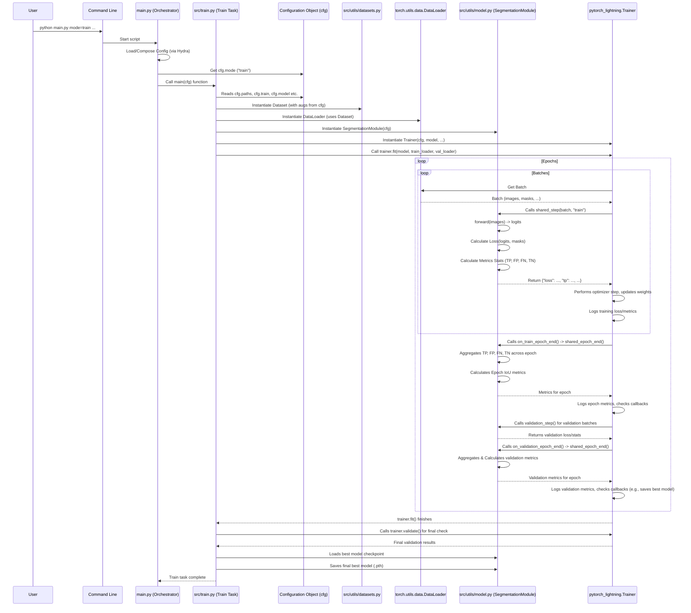

# Chapter 5: Segmentation Model & Training

Welcome back! In [Chapter 4: Preprocessing Pipeline](04_preprocessing_pipeline_.md), we took the list of data records identified by the query and processed the actual image and mask files – cleaning them up, cropping them into tiles, remapping mask values, and splitting them into train/validation/test sets. We now have all the ingredients prepared and sorted.

This chapter is where we bring those ingredients together to perform the core task of the project: **training a segmentation model**. This is the step where we teach a computer to look at an image and figure out which pixels belong to which category (like background, grass, or hairy vetch).

## The Challenge: Teaching a Computer to "See"

Imagine showing a child pictures of different objects and telling them, "Color the grass green, the flowers red, and leave the ground brown." That's essentially what we want our segmentation model to do! But instead of a child, we have a complex mathematical function (a neural network), and instead of crayons, it adjusts billions of internal "weights" and "biases" to learn the coloring rules.

Training a model involves several key challenges:

*   **Defining the "Brain":** What kind of neural network architecture is good at this pixel-coloring task? (e.g., UNet, DeepLabV3+).
*   **Showing Examples:** How do we feed the network our prepared images and their corresponding correct "colorings" (the masks)?
*   **Measuring "Wrongness":** How do we numerically quantify how bad the network's current "coloring" is compared to the correct mask? This is the **Loss Function**.
*   **Learning from Mistakes:** How does the network use the "wrongness" score to adjust its internal weights and get better over time? This involves **Optimization**.
*   **Tracking Progress:** How do we monitor how well the network is learning, not just on the training data, but on unseen validation data? This requires **Evaluation Metrics** like IoU.
*   **Managing the Process:** How do we handle the repetitive loop of showing data batches, calculating loss, updating weights, and evaluating, potentially across many epochs (full passes through the dataset) and across multiple GPUs?

Doing all this from scratch is complex and requires a lot of boilerplate code.

## The Solution: `SegmentationModule` and PyTorch Lightning Trainer

The SemiF-Segmentation project addresses this using two main components for training:

1.  **`SegmentationModule` (`src/utils/model.py`):** This defines the actual **neural network model** itself. It's built using the powerful `segmentation_models_pytorch` (smp) library, which provides pre-built, high-performance architectures like UNet and DeepLabV3+. This module also knows how to take an image batch (`forward pass`) and calculate the `loss` and `metrics` for a given batch of data compared to the correct masks. Think of this as the model's "brain" that knows how to process images and evaluate its own performance on a small scale.
2.  **PyTorch Lightning Trainer (`src/train.py`):** This is a high-level library that simplifies the training process. It takes the `SegmentationModule` and your data (via DataLoaders, which we'll cover in [Chapter 7: Data Loading & Augmentation](07_data_loading___augmentation_.md)) and handles the entire training loop automatically. It manages epochs, batches, optimization steps, logging, checking performance on the validation set periodically, saving checkpoints, and even distributing training across multiple GPUs. Think of the Trainer as the model's "coach" that manages the practice sessions and game performance.

`src/train.py` orchestrates the training process by setting up the data, the model (using `SegmentationModule`), and the PyTorch Lightning Trainer, and then telling the Trainer to start the training.

## Key Concepts

Let's break down the core ideas:

### The Segmentation Model (`SegmentationModule`)

At its heart, the `SegmentationModule` is a wrapper around a neural network model from the `segmentation_models_pytorch` library.

```python
# Simplified snippet from src/utils/model.py
import segmentation_models_pytorch as smp
import pytorch_lightning as pl
import torch

class SegmentationModule(pl.LightningModule):
    def __init__(self, cfg):
        super().__init__()
        self.cfg = cfg
        # Read model parameters from configuration
        arch_name = cfg.model.arch_name # e.g., 'DeepLabV3Plus'
        encoder_name = cfg.model.encoder_name # e.g., 'resnet152'
        out_classes = cfg.model.out_classes # e.g., 3 (background, grass, vetch)
        in_channels = cfg.model.in_channels # e.g., 3 (for RGB)

        # Create the actual segmentation model using smp library
        self.model = smp.create_model(
            arch_name,
            encoder_name=encoder_name,
            encoder_weights="imagenet", # Use pre-trained weights
            in_channels=in_channels,
            classes=out_classes,
        )

        # ... other setup for loss, metrics, etc. ...

    def forward(self, image):
        """
        This is the forward pass. It takes an input image batch
        and returns the model's output (logits).
        """
        # print(f"Input image shape: {image.shape}") # Example: Batch x Channels x Height x Width
        output = self.model(image)
        # print(f"Model output shape: {output.shape}") # Example: Batch x Classes x Height x Width
        return output

    # ... training_step, validation_step, etc. methods ...

```
*   The `__init__` method reads the desired model architecture (`arch_name`), encoder (`encoder_name`), input channels (`in_channels`), and output classes (`out_classes`) from the `cfg.model` section of the configuration.
*   It then uses `smp.create_model` to instantiate the specific model architecture (like DeepLabV3+ or Segformer) with the chosen encoder. Encoders like ResNet152 are often pre-trained on large datasets like ImageNet to give the model a good starting point for understanding visual features.
*   The `forward(image)` method is the core prediction logic. When the model is given an `image` tensor, it passes it through the network layers and returns the raw output (`logits`). These logits are then typically converted into class probabilities or predictions.

### Loss Function

The loss function tells the model "how wrong" its prediction is for a given input image and its correct mask. A lower loss means a better prediction. During training, the model adjusts its parameters to minimize this loss.

```python
# Simplified snippet from src/utils/model.py
import torch.nn as nn
import segmentation_models_pytorch.losses as smp_losses
# Assuming DiceBCELoss, DiceFocalLoss, etc. are defined elsewhere or imported

class SegmentationModule(pl.LightningModule):
    def __init__(self, cfg):
        # ... model initialization ...
        self.mode = cfg.model.mode # 'binary' or 'multiclass'
        self.ignore_index = cfg.model.ignore_index

        # Configure loss function based on configuration
        self.loss_fn = self.configure_loss() # Calls a helper method

    def configure_loss(self):
        """
        Selects and configures the loss function from config.
        """
        loss_name = self.cfg.train.loss.name # e.g., 'smpDiceLoss' or 'DiceBCELoss'

        if self.mode == "binary":
            # Handle different binary loss options from config
            if loss_name == "smpDiceLoss":
                 # smp.losses.DiceLoss is a common choice
                 return smp_losses.DiceLoss(smp_losses.BINARY_MODE, from_logits=True, ignore_index=self.ignore_index)
            # ... other binary loss options like DiceBCELoss, DiceFocalLoss ...
            # Example: if loss_name == "DiceBCELoss": return DiceBCELoss()
        elif self.mode == "multiclass":
             # Handle different multiclass loss options from config
             if loss_name == "smpDiceLoss":
                 return smp_losses.DiceLoss(smp_losses.MULTICLASS_MODE, from_logits=True, ignore_index=self.ignore_index)
             # ... other multiclass loss options like DiceCrossEntropy ...
        else:
            raise ValueError("Invalid mode.")

    # ... forward, training_step, validation_step, etc. methods ...
```
*   The `configure_loss` method reads the desired `loss.name` from the `cfg.train` configuration.
*   Based on the `mode` (binary or multiclass) and the chosen `loss.name`, it creates and returns the appropriate loss function object.
*   Popular choices like `smp.losses.DiceLoss` are directly from the `segmentation_models_pytorch` library. The project might also define custom losses (like `DiceBCELoss`, `DiceFocalLoss`, `DiceWithBoundaryLoss`) if needed, as seen in the full `src/utils/model.py` file.
*   The `from_logits=True` argument is common when the model outputs raw scores (logits) before activation functions like sigmoid or softmax. The loss function handles the conversion internally.

### Evaluation Metrics

While loss guides the optimization, metrics provide a more interpretable measure of performance. Intersection over Union (IoU) is a standard metric for segmentation.

```python
# Simplified snippet from src/utils/model.py
import segmentation_models_pytorch as smp
import torch

class SegmentationModule(pl.LightningModule):
    # ... __init__, forward, configure_loss ...

    def shared_step(self, batch, stage):
        """
        Shared logic for training, validation, and test steps.
        """
        images, masks, _ = batch # Unpack data batch
        masks = masks.long() # Ensure mask is correct type

        # Handle mask shape for multiclass
        if self.mode == "multiclass" and masks.ndim == 4 and masks.shape[1] == 1:
            masks = masks.squeeze(1) # (B, 1, H, W) -> (B, H, W)

        # Forward pass: get model predictions (logits)
        logits = self.forward(images)

        # Compute the loss for this batch
        loss = self.loss_fn(logits, masks)

        # Convert logits to predicted masks
        if self.mode == "binary":
            prob_masks = torch.sigmoid(logits)
            pred_masks = (prob_masks > self.threshold).long() # Apply threshold for binary
        elif self.mode == "multiclass":
            # Apply softmax (or similar) and get the class with highest score per pixel
            prob_masks = torch.softmax(logits, dim=1)
            pred_masks = prob_masks.argmax(keepdim=True, dim=1)

        # Calculate True Positives (TP), False Positives (FP), False Negatives (FN),
        # and True Negatives (TN) needed for IoU calculation
        tp, fp, fn, tn = smp.metrics.get_stats(
            pred_masks,
            masks,
            mode=self.mode,
            num_classes=self.out_classes,
            ignore_index=self.ignore_index # Ignore pixels with this value if specified
        )

        # Return loss and stats needed for metrics
        return {"loss": loss, "tp": tp, "fp": fp, "fn": fn, "tn": tn}

    def shared_epoch_end(self, outputs, stage):
        """
        Aggregates results from all steps in an epoch and computes metrics.
        """
        # Concatenate TP, FP, FN, TN from all batches in the epoch
        tp = torch.cat([x["tp"] for x in outputs])
        fp = torch.cat([x["fp"] for x in outputs])
        fn = torch.cat([x["fn"] for x in outputs])
        tn = torch.cat([x["tn"] for x in outputs])

        # Calculate IoU metrics
        per_image_iou = smp.metrics.iou_score(tp, fp, fn, tn, reduction="micro-imagewise")
        dataset_iou = smp.metrics.iou_score(tp, fp, fn, tn, reduction="micro")

        # Log metrics using PyTorch Lightning's logging system
        self.log(f"{stage}_per_image_iou", per_image_iou, on_epoch=True, prog_bar=False)
        self.log(f"{stage}_dataset_iou", dataset_iou, on_epoch=True, prog_bar=True)

        # ... Log other metrics or class-wise IoU ...

    # training_step, validation_step, test_step call shared_step
    # on_train_epoch_end, on_validation_epoch_end, on_test_epoch_end call shared_epoch_end

```
*   The `shared_step` method (used by `training_step`, `validation_step`, etc.) performs the forward pass, calculates the loss, converts the model's raw output (`logits`) into predicted mask labels, and then calculates the basic statistics (TP, FP, FN, TN) needed for metrics.
*   The `shared_epoch_end` method (used by `on_train_epoch_end`, `on_validation_epoch_end`, etc.) collects the statistics (TP, FP, FN, TN) from *all* batches processed during that epoch. It then uses `smp.metrics.iou_score` to calculate metrics like Mean IoU or Dataset IoU from the aggregated statistics.
*   `self.log(...)` is PyTorch Lightning's way of automatically logging these metrics, which can then be viewed in various tools (like TensorBoard or CSV files).

### The PyTorch Lightning Trainer (`src/train.py`)

This script brings everything together. It's the entry point for the training task (called by `main.py` when `mode=train`). It sets up the data loaders, the `SegmentationModule`, any necessary callbacks (like saving the best model), and the PyTorch Lightning `Trainer`.

```python
# Simplified snippet from src/train.py
import hydra
from omegaconf import DictConfig
from pytorch_lightning import Trainer
from pytorch_lightning.loggers import CSVLogger
from pytorch_lightning.callbacks import ModelCheckpoint
from torch.utils.data import DataLoader
from src.utils.datasets import Dataset # Assuming Dataset from Chapter 7
from src.utils.model import SegmentationModule # The module we discussed

# Note: @hydra.main is here because you *could* run train.py directly,
# but main.py calls its 'main' function directly.
# @hydra.main(version_base="1.3", config_path="../conf", config_name="config")
def main(cfg: DictConfig):
    print("Starting training task!") # We are inside the training logic now

    # 1. Load Data Statistics (e.g., mean/std for normalization)
    # These are typically saved by the preprocessing pipeline
    stats_file = Path(cfg.paths.project_preprocess_dir) / "data/data_stats/rgb_mean_std.json"
    mean, std = load_stats(stats_file) # Assume load_stats is defined

    # 2. Setup Logging (e.g., save logs to a CSV file)
    logger = CSVLogger(save_dir=cfg.paths.project_mode_dir, name=None)

    # 3. Define Data Directories (output from preprocessing)
    split_data_dir = Path(cfg.paths.split_dir)
    train_image_dir = split_data_dir / "train" / "images"
    train_mask_dir = split_data_dir / "train" / "masks"
    val_image_dir = split_data_dir / "val" / "images"
    val_mask_dir = split_data_dir / "val" / "masks"
    # ... test directories ...

    # 4. Create Datasets and DataLoaders (Detailed in Chapter 7)
    train_dataset = Dataset(train_image_dir, train_mask_dir, normalize_image=cfg.train.dataset.normalize, mean=mean, std=std)
    val_dataset = Dataset(val_image_dir, val_mask_dir, normalize_image=cfg.train.dataset.normalize, mean=mean, std=std)
    train_loader = DataLoader(train_dataset, batch_size=cfg.train.batch_size, shuffle=True, num_workers=cfg.train.dataset.workers)
    val_loader = DataLoader(val_dataset, batch_size=cfg.train.batch_size, shuffle=False, num_workers=cfg.train.dataset.workers)

    # 5. Instantiate the Segmentation Module (the model)
    model = SegmentationModule(cfg) # Pass the full config to the model

    # 6. Setup Callbacks (e.g., save best model based on validation IoU)
    best_checkpoint = ModelCheckpoint(
        dirpath=Path(logger.log_dir, "checkpoints"), # Where to save checkpoints
        monitor=cfg.train.callbacks.monitor, # Metric to watch (e.g., 'valid_dataset_iou')
        mode=cfg.train.callbacks.mode,       # 'max' to maximize IoU
        save_top_k=cfg.train.callbacks.save_top_k, # Save the single best model
        filename="best",
    )
    # ... setup other callbacks like save_last ...

    # 7. Setup the PyTorch Lightning Trainer
    trainer = Trainer(
        **cfg.train.trainer, # Load trainer specific args like max_epochs, etc. from config
        callbacks=[best_checkpoint], # Add defined callbacks
        logger=logger, # Add the logger
        # strategy=cfg.train.train_strategy # Configure for single or multiple GPUs
    )

    # 8. Start the Training Process!
    print("Trainer fit starting...")
    trainer.fit(model, train_loader, val_loader)
    print("Trainer fit finished!")

    # 9. Post-training steps (Validation, Save final model, Sample inference)
    val_result = trainer.validate(model, val_loader, verbose=False)
    print(f"Validation IoU: {val_result[0][cfg.train.callbacks.monitor]}")

    # Load and save the best model found during training
    best_model_ckpt_path = best_checkpoint.best_model_path
    if best_model_ckpt_path:
        best_model = SegmentationModule.load_from_checkpoint(cfg=cfg, checkpoint_path=best_model_ckpt_path)
        model_dir = Path(logger.log_dir, "model")
        best_model.save_model(model_dir, "best_model")
        print(f"Best model saved to {model_dir}")

    # ... Run sample inference using the best model ...

# if __name__ == "__main__":
#     main() # This part runs ONLY if you execute train.py directly
```
*   This `main` function is called by `main.py` ([Chapter 2: Task Orchestration](02_task_orchestration_.md)) with the full configuration `cfg`.
*   It uses the `cfg.paths` to find the training and validation data directories created by the [Chapter 4: Preprocessing Pipeline](04_preprocessing_pipeline_.md).
*   It loads data statistics (`mean`, `std`) needed for normalization (also from preprocessing output).
*   It sets up a `CSVLogger` to record metrics during training.
*   It instantiates the training and validation `Dataset` and `DataLoader` objects ([Chapter 7: Data Loading & Augmentation](07_data_loading___augmentation_.md)).
*   Crucially, it creates the `SegmentationModule`, passing the `cfg` so the module knows which model to build and which loss to use.
*   It defines `ModelCheckpoint` callbacks to automatically save the model with the best validation performance.
*   It initializes the PyTorch Lightning `Trainer`, passing in configuration settings from `cfg.train.trainer` (like `max_epochs`), the defined callbacks, the logger, and potentially distributed training strategy (`cfg.train.train_strategy`).
*   Finally, it calls `trainer.fit(model, train_loader, val_loader)`, which is the command that starts the entire training loop managed by PyTorch Lightning.
*   After `trainer.fit` completes, it performs a final validation run and loads and saves the best model found during training.

## How to Use: Running the Training Task

As with other tasks, you trigger the training process by setting the `mode` parameter when running `main.py`.

```bash
python main.py mode=train
```

This command will:
1.  Start `main.py`.
2.  [Chapter 1: Hydra Configuration](01_hydra_configuration_.md) loads the configurations from `conf/config.yaml` and its defaults, including `conf/train/default.yaml` and a model configuration like `conf/model/segformer.yaml` (or `deeplabv3plus.yaml`).
3.  [Chapter 2: Task Orchestration](02_task_orchestration_.md) sees `mode=train`, looks up `"train"` in its `TASK_REGISTRY`, and calls the `main` function inside `src/train.py`, passing the full composed configuration `cfg`.
4.  `src/train.py` sets up the data, creates the `SegmentationModule`, configures the PyTorch Lightning Trainer, and starts the training loop.

**Configuration for Training:**

The training process is primarily controlled by the settings in `conf/train/default.yaml` and the selected model configuration (e.g., `conf/model/segformer.yaml` or `conf/model/deeplabv3plus.yaml`).

Let's look at parts of `conf/train/default.yaml` again:

```yaml
# --- File: conf/train/default.yaml (Relevant Parts) ---
mode: train
epochs: 50         # How many times to iterate over the full training dataset
batch_size: 4      # How many images to process at once in each step
seed: 42           # For reproducibility
augment: default   # Which data augmentation config to use (Chapter 7)
class_mode: multiclass # multiclass or binary classification
out_classes: 3     # Number of output classes (e.g., Background, Monocot, Dicot)

loss:
  name: smpDiceLoss # Which loss function to use (corresponds to options in SegmentationModule)

lr:
  base_lr: 0.001 # Base learning rate for the optimizer

cuda_visible_devices: [5,6] # Which GPUs to use (if available)

dataset:
  normalize: true # Apply dataset mean/std normalization
  workers: 16     # How many processes to use for loading data (Chapter 7)

trainer: # Settings passed directly to PyTorch Lightning Trainer
  max_epochs: ${train.epochs} # Link back to the main epochs setting
  enable_progress_bar: true
  log_every_n_steps: 1
  enable_model_summary: true
  num_sanity_val_steps: 0
  deterministic: true # Set to true for reproducibility if possible

callbacks: # Settings for PyTorch Lightning callbacks (like ModelCheckpoint)
  monitor: valid_dataset_iou # Metric to monitor for saving the best model
  mode: max                  # Monitor for maximum value of the metric
  save_top_k: 1              # Save only the best model
  save_last: true            # Save the model after the last epoch

sample_inference: [...] # Paths for running sample inference after training
```

And the model configuration, e.g., `conf/model/segformer.yaml`:

```yaml
# --- File: conf/model/segformer.yaml ---
arch_name: Segformer # The name of the architecture from smp
encoder_name: resnet152 # The specific encoder backbone
encoder_weights: imagenet # Use pre-trained weights
in_channels: 3 # Number of input channels (RGB)
out_classes: ${train.out_classes} # Link to the out_classes from train config
mode: ${train.class_mode} # Link to the class_mode from train config
ignore_index: null # Whether to ignore a specific class index in loss/metrics
# ... other architecture-specific parameters ...
```
These YAML files define all the crucial hyperparameters and settings for the training run.

**Overriding Training Settings:** You can easily change any of these settings from the command line:

```bash
# Train for only 10 epochs with a batch size of 8
python main.py mode=train train.epochs=10 train.batch_size=8

# Use DeepLabV3+ model with a resnet50 encoder instead of default
python main.py mode=train model=deeplabv3plus model.encoder_name=resnet50
```
This is incredibly powerful for quickly trying different model configurations, learning rates, batch sizes, or the number of epochs.

**Expected Output:** When you run the training command, you'll see output in your console showing the progress managed by PyTorch Lightning (epoch number, batch progress, loss, metric values). The project also saves output files, typically in a directory under `outputs/<date>/<time>/train/<project_name>`.

This output directory will contain:
*   A `version_0` (or similar) subdirectory created by the CSVLogger.
*   Inside the logger directory:
    *   `metrics.csv`: A file logging the training and validation loss and IoU metrics after each epoch.
    *   `hparams.yaml`: A file saving the full configuration used for this run.
    *   `checkpoints/`: A directory containing the saved model checkpoints (e.g., `best.ckpt`, `last.ckpt`).
    *   `metrics.png`: A plot visualizing the training and validation metrics over epochs, generated automatically by `src/utils/model.py`.
    *   `sample_predictions/`: A directory containing visualizations of model predictions on a few validation images.
    *   `sample_inference/`: A directory containing visualizations of model predictions on the sample unlabeled images specified in `cfg.train.sample_inference`.
    *   `model/`: A directory containing the final saved best model weights in a `.pth` file format.

This structured output allows you to track your experiments, compare different runs, and easily load the trained models later for inference.

## Internal Workflow Diagram

Let's visualize the key interactions during the training process orchestrated by `src/train.py`:



This diagram illustrates how `src/train.py` orchestrates the process by setting up the key components (DataLoaders, Model, Trainer) and then handing control to the PyTorch Lightning `Trainer` via the `trainer.fit()` call. The `Trainer` then runs the core training loop, interacting with the `SegmentationModule` to process batches, calculate loss and metrics, and update the model.

## Summary

In this chapter, we explored the core machine learning training process in the SemiF-Segmentation project.

*   We learned that training involves defining a neural network model (`SegmentationModule`), feeding it data, measuring its errors (`Loss Function`), evaluating its performance (`Metrics` like IoU), and managing the iterative learning process.
*   The `SegmentationModule` in `src/utils/model.py` uses the `segmentation_models_pytorch` library to define the model architecture and contains the logic for the forward pass, loss calculation, and metric computation for a single batch.
*   The `src/train.py` script acts as the training orchestrator. It sets up the data loaders (using data prepared by the [Chapter 4: Preprocessing Pipeline](04_preprocessing_pipeline_.md)), instantiates the `SegmentationModule`, and uses the PyTorch Lightning `Trainer` to manage the entire training loop, including epochs, batches, optimization, validation, and logging, all driven by the Hydra configuration from `conf/train/*.yaml` and `conf/model/*.yaml`.
*   You initiate training by running `python main.py mode=train`, optionally overriding configuration settings from the command line.
*   The output includes logs, metrics, and the trained model weights saved to files.

With a trained model in hand, the next step is to use it to make predictions on new, unseen images.

[Chapter 6: Inference Pipeline](06_inference_pipeline_.md)

---

Generated by [AI Codebase Knowledge Builder](https://github.com/The-Pocket/Tutorial-Codebase-Knowledge)