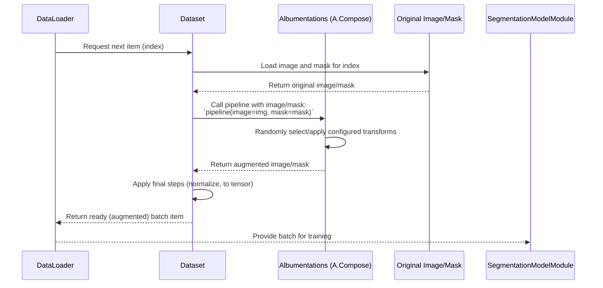

# Chapter 6: Data Augmentation

Welcome back! In [Chapter 5: Data Preprocessing Pipeline](05_data_preprocessing_pipeline_.md), you learned how to take the raw data selected by the query ([Database Querying & Sampling (Query)](04_database_querying___sampling__query__.md)) and transform it into a standardized format ready for machine learning. This included steps like cropping images and masks into tiles, remapping mask values, and splitting the data into training, validation, and test sets.

Even with perfectly preprocessed and split data, you might still face a common challenge in machine learning: the model "memorizes" the exact images it sees during training and struggles to recognize the same objects if they appear slightly differently (e.g., a bit tilted, under different light, slightly blurred). This is called **overfitting**.

How can we make our model more robust and less prone to overfitting? By showing it many variations of the *same* original images and masks! This is where **Data Augmentation** comes in.

## What is Data Augmentation? (Giving Your Data New Looks)

Imagine you have a picture of a specific plant. Data augmentation is the technique of creating *new*, slightly altered versions of that picture and its corresponding mask by applying various random transformations. These transformations simulate variations that might occur in real-world data collection, such as:

*   **Geometric changes:** Rotating the image, flipping it horizontally or vertically, slightly stretching or squeezing it, applying small distortions.
*   **Photometric changes:** Adjusting brightness, contrast, color saturation, adding noise, blurring.

For example, one original image of a hairy vetch plant might be used to generate augmented versions that are:
*   The original image, flipped horizontally.
*   The original image, rotated by 15 degrees.
*   The original image, with brightness slightly increased and some noise added.
*   The original image, rotated *and* color-shifted *and* slightly distorted.

Crucially, when an image is transformed, its corresponding mask is transformed in *exactly* the same way so that the pixel labels still align correctly with the objects in the image.

By training the model on these diverse variations, it learns to recognize the core features of the objects (like the shape of a leaf or the texture of a stem) regardless of minor changes in orientation, lighting, or image quality. This makes the model much more likely to perform well on *new, unseen* images.

The `SemiF-Segmentation` project uses a powerful library called **Albumentations** to apply these transformations efficiently.

## How to Use Data Augmentation

Unlike the preprocessing steps you saw in [Chapter 5](05_data_preprocessing_pipeline_.md), Data Augmentation is *not* typically a separate task you run to create and save new image files before training. Instead, it's applied **on-the-fly** during the training process. Each time the training code needs an image and mask, the data loading system fetches an original image and mask and then *randomly* applies a sequence of configured augmentations *before* feeding them to the model.

This means you only need to store the original preprocessed data (e.g., your cropped and remapped images and masks). The augmented versions are generated randomly *every time* they are loaded for a training batch, ensuring maximum variability without needing massive storage space.

The specific augmentations applied and their parameters are controlled entirely by the **configuration files**, located primarily in the `conf/augment/` directory. These configurations are loaded via the Hydra system ([Chapter 1: Hydra Configuration System](01_hydra_configuration_system_.md)) and passed to the training code.

Let's look at the structure of an augmentation configuration file, like `conf/augment/default.yaml`:

```yaml
# --- Snippet from conf/augment/default.yaml ---
train: # Settings for training data augmentation
  img_hw: ["${preprocess.grid_crop.crop_height}", "${preprocess.grid_crop.crop_width}"] # Image size

  geometrics_transforms: # Group of transformations related to geometry (shape/position)
    enable: true # Enable this group
    
    some_of: # Apply a random subset of the transforms below
      p: 1.0 # Always try to apply a subset
      n: 4 # Pick 4 random transforms from the list below
      replace: false # Don't pick the same transform twice in the subset
    
    horizontal_flip: # An individual geometric transform
      enable: true # Enable this specific transform
      p: 0.5 # Apply with 50% probability
    
    vertical_flip:
      enable: true
      p: 0.3 # Apply with 30% probability

    affine: # Another geometric transform
      enable: true
      p: 0.8 # Apply with 80% probability
      scale: 1.0 # No scaling
      rotate: [-20, 20] # Rotate between -20 and +20 degrees
      shear: [-10, 10]
      translate_percent: [-0.03, 0.03]
      
    elastic_transform: # Elastic distortions
      enable: true
      p: 0.5 # Apply with 50% probability
      alpha: 120
      sigma: 8
    
    # ... many other geometric transforms (grid_distortion, optical_distortion, perspective, etc.) ...

  photometrics_transforms: # Group of transformations related to color/light
    enable: true # Enable this group
    some_of: # Apply a random subset of transforms below
      p: 1.0 # Always try to apply a subset
      n: 1 # Pick 1 random transform from the list below
      replace: false
    
    rgb_shift:
      enable: false # DISABLED by default (too aggressive color shift)
      p: 1.0
      r_shift_limit: 20 # Max shift in Red channel
    
    random_gamma:
      enable: true
      p: 0.5 # Apply with 50% probability
      gamma_limit: [90, 110] # Adjust gamma slightly
      
    color_jitter:
      enable: true
      p: 0.25 # Apply with 25% probability
    
    brightness_contrast:
      enable: true
      p: 0.7 # Apply with 70% probability
    
    # ... other photometric transforms (clahe, equalize, etc.) ...
      
  noise_transforms: # Group of transformations adding noise or compression
    enable: true
    some_of: # Apply a random subset
      p: 1.0
      n: 1
      replace: false
      
    MultiplicativeNoise:
      enable: true
      p: 0.2 # Apply with 20% probability
      multiplier: [0.95, 1.05] # Multiply pixels by a random value in this range
         
    ISONoise:
      enable: true
      p: 0.2 # Apply with 20% probability
      # ... parameters ...
          
    ImageCompression:
      enable: true
      p: 0.3 # Apply with 30% probability
      quality_range: [50,90] # Simulate JPEG compression artifacts
      
val: # Settings for validation data (usually minimal or no augmentation)
  img_hw: ${augment.train.img_hw} # Use the same image size as training
  padding:
    enable: false # Usually no padding augmentation for validation
    p: 0.0
```

Here's how you interpret this configuration:

1.  **`train:` section:** This defines the augmentation pipeline used for the training dataset.
2.  **`img_hw:`:** This specifies the expected input image dimensions. It often pulls the cropped dimensions from the preprocessing configuration using Hydra's `${...}` syntax.
3.  **Transformation Groups (`geometrics_transforms`, `photometrics_transforms`, `noise_transforms`):** Augmentations are grouped logically. Each group can be enabled (`enable: true`) or disabled (`enable: false`).
4.  **`some_of:`:** Within each group, the `some_of` section defines that a random *subset* of the transformations listed below it should be applied. `n: 4` means pick 4 random transformations from the geometric list (if enabled), `n: 1` means pick 1 from the photometric and noise lists. `p: 1.0` means this "some of" operation always attempts to run.
5.  **Individual Transforms (`horizontal_flip`, `affine`, `random_gamma`, etc.):** Each specific transformation has its own entry.
    *   `enable: true` means this transform *can* be included in the `some_of` pool for this group. If `enable: false`, it's skipped entirely.
    *   `p:` is the probability *within the `some_of` pool* that this specific transform will be selected *if* the group's `some_of` is triggered. (Note: Albumentations probability logic can be slightly nuanced with `SomeOf`, but `p` here broadly relates to the chance of it being *part* of the chosen subset or applied if not in a `SomeOf`). In simple terms, `enable: true` makes it available, `p` influences its chance of being picked/applied *when the group is active*.
    *   Other parameters (like `rotate: [-20, 20]`) control the specific intensity or range of the transformation.
6.  **`val:` section:** This defines augmentation for the validation dataset. Notice that typically very few (if any) augmentations are enabled for validation. This is because we want to evaluate the model's performance on data that is representative of the *real, untransformed* world, not on distorted versions. Often, the validation "augmentation" only includes necessary resizing or padding to ensure the images are the correct size for the model.

You can create different augmentation configurations (like `color_invariant.yaml` which has much more aggressive color transformations) and switch between them by changing the default in `conf/config.yaml` or using command-line overrides ([Chapter 1: Hydra Configuration System](01_hydra_configuration_system_.md)), for example:

```bash
# Run training with default augmentations
python main.py mode=train

# Run training with the 'color_invariant' augmentations
python main.py mode=train augment=color_invariant 
```

This flexibility allows you to easily experiment with different data augmentation strategies.

## How Data Augmentation Works Under the Hood

The Data Augmentation magic happens within the data loading process, specifically orchestrated by functions in `src/utils/augs.py` and applied by the `Dataset` class (which we'll cover in [Chapter 7: Dataset Loader](07_dataset_loader_.md)).

When the training code in `src/train.py` prepares to load data, it creates `Dataset` objects for the training and validation sets. Importantly, it passes the relevant augmentation configuration (`cfg.augment.train` for training, `cfg.augment.val` for validation) to functions (`train_aug` and `val_aug` in `src/utils/augs.py`) that build the Albumentations pipelines:

```python
# --- Snippet from src/train.py ---
# ... imports ...
from src.utils.datasets import Dataset # The dataset class
from src.utils.augs import train_aug, val_aug # Functions to build augmentation pipelines
# ... other training setup ...

@hydra.main(...)
def main(cfg: DictConfig):
    # ... setup logger, directories, callbacks ...

    # Load mean/std for normalization (often calculated in preprocessing)
    stats_file = Path(cfg.paths.project_preprocess_dir) / "data/data_stats/rgb_mean_std.json"
    mean, std = load_stats(stats_file)
    
    # Create train dataset, passing the augmentation pipeline built from config
    train_dataset = Dataset(
        train_image_dir,
        train_mask_dir,
        augmentation=train_aug(cfg), # <<< Build train augmentation pipeline here
        normalize_image=cfg.train.dataset.normalize,
        mean=mean,
        std=std,
    )

    # Create validation dataset, passing the augmentation pipeline built from config
    val_dataset = Dataset(
        val_image_dir,
        val_mask_dir,
        augmentation=val_aug(cfg), # <<< Build validation augmentation pipeline here
        normalize_image=cfg.train.dataset.normalize,
        mean=mean,
        std=std,
    )

    # ... create DataLoaders and train the model ...
```

Notice how `train_aug(cfg)` and `val_aug(cfg)` are called, and their results (the Albumentations transformation pipelines) are passed to the `Dataset` constructor via the `augmentation` argument.

Let's look at simplified versions of these functions in `src/utils/augs.py`.

**1. Building Transforms from Configuration (`build_transforms_from_config`)**

This helper function reads a section of the config (like `geometrics_transforms`) and converts the enabled transforms into Albumentations objects.

```python
# --- Snippet from src/utils/augs.py ---
import albumentations as A
from typing import List, Callable, Dict, Any
from omegaconf import DictConfig # Need this type hint

# Map config keys to Albumentations class names
GEOMETRIC_MAP = {
    "horizontal_flip": A.HorizontalFlip,
    "vertical_flip": A.VerticalFlip,
    "affine": A.Affine,
    # ... other geometric transforms ...
}

PHOTOMETRIC_MAP = {
    "rgb_shift": A.RGBShift,
    "random_gamma": A.RandomGamma,
    # ... other photometric transforms ...
}

# ... similar map for noise transforms ...

def build_transforms_from_config(cfg_section: DictConfig, albumentations_class_map: Dict[str, type], extra_args: Dict[str, Any] = None) -> List[A.BasicTransform]:
    """
    Reads a config section and builds a list of Albumentations transforms.
    """
    transforms = []
    # Iterate through the map (e.g., GEOMETRIC_MAP)
    for key, albumentations_class in albumentations_class_map.items():
        # Check if the transform is in the config section AND is enabled
        if key in cfg_section and getattr(cfg_section[key], 'enable', False):
            params = cfg_section[key] # Get parameters for this transform
            # Create a dictionary of parameters, excluding 'enable'
            cfg_dict = {k: v for k, v in params.items() if k != 'enable'}
            
            # Add any extra arguments needed by the transform (e.g., image size)
            if extra_args and key in extra_args:
                cfg_dict.update(extra_args[key])

            try:
                # Create the Albumentations transform object using parameters from config
                transforms.append(albumentations_class(**cfg_dict))
            except Exception as e:
                 log.error(f"Error creating transform {key} with params {cfg_dict}: {e}")

    return transforms # Return a list of created transform objects
```

This function iterates through a mapping of config keys to Albumentations classes. If a key is enabled in the provided config section (`cfg_section`), it extracts the parameters for that key and uses them to create an instance of the corresponding Albumentations class, adding it to a list.

**2. Grouping Transforms with `SomeOf` (`some_of_transforms`)**

This helper function wraps a list of transforms within Albumentations' `A.SomeOf` container if configured to do so.

```python
# --- Snippet from src/utils/augs.py ---
# ... imports and build_transforms_from_config ...

def some_of_transforms(transforms: List[A.BasicTransform], some_cfg: DictConfig) -> A.BasicTransform | None:
    """
    Wraps a list of transforms in A.SomeOf if SomeOf is enabled in config.
    Returns the SomeOf object or None if list is empty or SomeOf disabled/not configured.
    """
    if not transforms or not getattr(some_cfg, 'enable', False):
        return None
    
    # Create the SomeOf container with parameters from config (n, p, replace)
    return A.SomeOf(transforms, n=some_cfg.n, replace=some_cfg.replace, p=some_cfg.p)

```

This function takes a list of Albumentations transforms (like the ones built by `build_transforms_from_config`) and the configuration for the `some_of` behavior within that group. If `some_of` is enabled, it creates an `A.SomeOf` object that, when called, will randomly apply `n` transformations from the provided list with probability `p`.

**3. The Main Augmentation Builders (`train_aug`, `val_aug`)**

These functions orchestrate the process for the training and validation pipelines.

```python
# --- Snippet from src/utils/augs.py ---
# ... all helper functions and maps ...
import random # Needed for random.shuffle

def train_aug(cfg: DictConfig) -> A.Compose:
    """
    Builds the full Albumentations augmentation pipeline for training.
    """
    t_cfg = cfg.augment.train # Get the train augmentation config section
    # img_hw = tuple(t_cfg.img_hw) # Get image size (optional, some transforms need it)

    transforms = [] # List to hold the main stages of the pipeline

    # 1. Build Geometric Transforms and wrap in SomeOf if enabled
    # get_geometric_transforms function uses build_transforms_from_config internally
    geo_transforms = get_geometric_transforms(t_cfg, None) # Pass img_hw if needed by specific transforms
    geo_some = some_of_transforms(geo_transforms, t_cfg.geometrics_transforms.some_of)
    if geo_some:
        transforms.append(geo_some) # Add the SomeOf geometric group

    # 2. Build Photometric Transforms and wrap in SomeOf if enabled
    photo_transforms = get_photometric_transforms(t_cfg) # get_photometric_transforms uses build_transforms_from_config
    photo_some = some_of_transforms(photo_transforms, t_cfg.photometrics_transforms.some_of)
    if photo_some:
        transforms.append(photo_some) # Add the SomeOf photometric group

    # 3. Build Noise Transforms and wrap in SomeOf if enabled
    noise_transforms = get_noise_transforms(t_cfg) # get_noise_transforms uses build_transforms_from_config
    noise_some = some_of_transforms(noise_transforms, t_cfg.noise_transforms.some_of)
    if noise_some:
        transforms.append(noise_some) # Add the SomeOf noise group

    # Optional: Shuffle the order of the transform groups (Geometric, Photometric, Noise)
    random.shuffle(transforms) 
    
    # Combine all the groups (or individual transforms if no SomeOf) into a single pipeline
    return A.Compose(transforms, p=1.0) # p=1.0 means the pipeline is always applied

def val_aug(cfg: DictConfig) -> A.Compose:
    """
    Builds the minimal Albumentations augmentation pipeline for validation.
    """
    v_cfg = cfg.augment.val # Get the validation augmentation config section
    img_hw = tuple(v_cfg.img_hw)

    val_transform_list = []
    
    # Add validation-specific transforms like padding if enabled
    if getattr(v_cfg.padding, 'enable', False):
         val_transform_list.append(A.PadIfNeeded(min_height=img_hw[0], min_width=img_hw[1], p=v_cfg.padding.p))
    
    # Return a pipeline (even if empty)
    return A.Compose(val_transform_list, p=1.0)
```

These functions read the relevant config section (`cfg.augment.train` or `cfg.augment.val`). They use the helper functions (`get_..._transforms`, which internally use `build_transforms_from_config`) to get lists of Albumentations objects for each group (geometric, photometric, noise). They then potentially wrap these lists in `A.SomeOf` objects using `some_of_transforms`. Finally, they combine all the resulting transform objects (either individual transforms or `SomeOf` containers) into a single `A.Compose` pipeline object. This `A.Compose` object is what gets passed to the `Dataset`.

**4. Applying Augmentation in the Dataset (Preview)**

The `Dataset` class (which we'll explore fully in [Chapter 7](07_dataset_loader_.md)) has a method (usually `__getitem__`) that is called every time the training loop requests an image and mask. If an `augmentation` pipeline object was passed to the `Dataset` constructor (which `train_aug(cfg)` provides), the `Dataset` calls this pipeline object on the loaded image and mask:

```python
# --- Concept Preview (Simplified Dataset getitem) ---
import cv2 # For loading images
import numpy as np # For mask handling

class Dataset:
    def __init__(self, image_dir, mask_dir, augmentation=None, ...):
        self.image_files = sorted(list(Path(image_dir).glob("*.jpg")))
        self.mask_files = sorted(list(Path(mask_dir).glob("*.png")))
        self.augmentation = augmentation # Store the A.Compose object
        # ... other init ...

    def __getitem__(self, index: int):
        # Load the original image and mask
        image_path = self.image_files[index]
        mask_path = self.mask_files[index]
        image = cv2.imread(str(image_path))
        mask = cv2.imread(str(mask_path), cv2.IMREAD_GRAYSCALE)

        # Check if augmentation is provided
        if self.augmentation:
            # Apply the augmentation pipeline to the image and mask
            augmented = self.augmentation(image=image, mask=mask)
            image = augmented['image'] # Get the augmented image
            mask = augmented['mask']   # Get the augmented mask (correctly transformed)

        # ... Perform other processing like normalization, converting to PyTorch tensors ...

        # Return the (potentially augmented) image, mask, and identifier
        return image, mask, image_path.stem

    def __len__(self):
        return len(self.image_files)
```

This is the core loop: The `Dataset` loads an original image/mask pair, passes them to the `A.Compose` object (`self.augmentation`), and gets back a transformed image/mask pair. This augmented pair is then sent to the model for training. Because the transformations (especially within `SomeOf`) are random, each time the same original image is loaded during training, it will likely look slightly different, providing the model with a huge variety of examples.

Here's a simple sequence diagram illustrating this data flow during training:



This on-the-fly augmentation during data loading is a standard and effective practice for increasing dataset size and variability in deep learning.

## Conclusion

You've learned that Data Augmentation is a technique used during model training to create synthetic variations of your existing data. This helps the model become more robust to real-world changes and prevents overfitting. `SemiF-Segmentation` uses the Albumentations library, configured via `conf/augment/*.yaml` files, to define these transformations. Instead of saving new files, augmentations are applied randomly on-the-fly by the Dataset loader each time a training sample is requested, providing immense data variability efficiently. The augmentation pipeline is built from the configuration using functions in `src/utils/augs.py` and passed to the `Dataset` class.

Now that you understand how data is preprocessed and augmented, the next step is to see how this prepared data is actually loaded and fed into the training loop using the Dataset Loader.

[Next Chapter: Dataset Loader](07_dataset_loader_.md)

---

Generated by [AI Codebase Knowledge Builder](https://github.com/The-Pocket/Tutorial-Codebase-Knowledge)