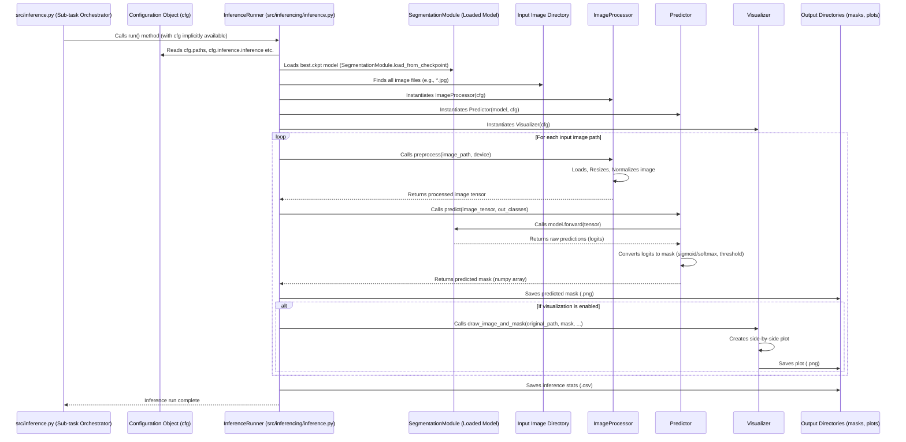

# Chapter 6: Inference Pipeline

Welcome back! In [Chapter 5: Segmentation Model & Training](05_segmentation_model___training_.md), we successfully trained our segmentation model using the prepared data. We now have a model file (a "checkpoint") that has learned to distinguish between different categories of pixels.

But the goal isn't just to train a model; it's to *use* that model to analyze *new* images. This is where the **Inference Pipeline** comes in.

## The Challenge: Putting the Trained Model to Work

Imagine you have a trained expert (your segmentation model) who knows how to identify plants in pictures. Now you have a new batch of field photos taken today. You need a process to:

1.  Find these new photos.
2.  Give them to the expert.
3.  Get the expert's analysis (the segmentation masks).
4.  Store the analysis results.
5.  Maybe even create some easy-to-understand pictures showing the original photo alongside the expert's analysis.

The photos might be different sizes than what the model was trained on, or they might need other minor adjustments before being fed into the model. Doing this manually for hundreds or thousands of new images is impractical. We need an automated, efficient way to run the trained model.

## The Solution: The Inference Pipeline

The **Inference Pipeline** (`src/inference.py` and `src/inferencing/inference.py`) is the project's system for using a trained model to predict segmentation masks on new, unseen images. It takes the trained model checkpoint, finds the images you want to process, prepares them, runs the model prediction, and saves the results.

Its main jobs are:

1.  **Load the Trained Model:** It knows where to find the saved model file (the checkpoint) from a previous training run and loads it into memory, ready for use.
2.  **Find Input Images:** It needs to know which images you want to segment. This can be a specific directory of images you point it to.
3.  **Process Images:** It prepares each input image for the model. This often involves resizing the image to a size the model expects and applying the same normalization (adjusting pixel values based on mean and standard deviation) that was used during training.
4.  **Run Prediction:** It feeds the processed image through the loaded model to get the raw model output (logits).
5.  **Generate Mask:** It converts the model's raw output into the final segmentation mask (an image where each pixel's value represents a class, like 'background' or 'vetch').
6.  **Save Output:** It saves the resulting segmentation mask as an image file (e.g., a PNG).
7.  **Visualize Results (Optional):** It can generate helpful images that show the original image and the predicted mask side-by-side, or overlays of the mask on the original image.

## How to Use the Inference Pipeline

You tell the project to run the inference pipeline using the `mode` parameter, just like with other tasks.

```bash
python main.py mode=inference
```

This command tells the [Chapter 2: Task Orchestration](02_task_orchestration_.md) (`main.py`) to execute the inference logic. The specific configuration for *how* inference is run (which model to load, where to find images, how to process them, what to save) is defined in the Hydra configuration files, specifically in `conf/inference/default.yaml`. The main `conf/config.yaml` includes `- inference: default` to load these settings.

Let's look at a simplified `conf/inference/default.yaml`:

```yaml
# --- File: conf/inference/default.yaml (Simplified) ---

tasks:
  get_dataset: false # An optional task within inference mode to query/collect images first
  inference: true    # The main task: run prediction on images

inference: # Configuration for the main 'inference' task
  explicit_img_dir:
    enable: true # Set to true to process images from a specific directory
    img_dir: data/rye_vetch/biomass-data/images # The path to the directory with images to segment
  # bbox_crop: false # Option to run inference on individual bounding box crops (often complex, set to false for simplicity)

  inference_subname: test_run # A name used in output paths to distinguish runs
  version: 2 # Often used to identify a specific model version/training run output directory

  rescale_factor: 1.0 # Resize images by this factor before prediction (1.0 means no resizing)
  threshold: 0.5      # For binary models, probability threshold to decide foreground (e.g., > 0.5 is foreground)
  use_normalization: true # Apply normalization using mean/std from training

  cuda_visible_devices: [0] # Which GPU device to use (use [] for CPU)
  seed: 422 # For reproducibility if any randomness is involved

  plot: # Visualization options
    overlays: false
    comparisons: false
    image_and_mask: true # Save side-by-side original image and predicted mask

  mean: # Fallback mean/std if not found from preprocessing stats
    - 0.3429
    - 0.3214
    - 0.2834
  std:
    - 0.1894
    - 0.1925
    - 0.1707

```

This configuration controls the inference process:

*   The `tasks` section in the main part of `conf/inference/default.yaml` lists optional sub-tasks within the overall `mode=inference`. `get_dataset` could be used to query the database first (similar to [Chapter 3: Data Querying](03_data_querying_.md)) to get a list of images, but typically for new images, you use `explicit_img_dir`. `inference: true` enables the main prediction logic.
*   The `inference` section (under the main `inference` key) contains parameters for the prediction task itself.
    *   `explicit_img_dir.enable: true` and `explicit_img_dir.img_dir` tell the script to load images from the specified folder.
    *   `rescale_factor` lets you resize images.
    *   `use_normalization` ensures the same preprocessing normalization is applied.
    *   `plot.image_and_mask: true` enables saving side-by-side plots.

**Our Use Case:** Let's say we want to use our trained model (saved from `project.name=test_synthetic`, `version=2`, as specified in `conf/config.yaml` and potentially updated via command line) to predict masks for all images in a directory called `data/new_images_to_segment`. We want to resize them by 50% (`rescale_factor=0.5`) and save the side-by-side visualizations.

To run this inference task, we'd combine the base command with command-line overrides:

```bash
python main.py mode=inference \
    inference.inference.explicit_img_dir.img_dir=data/new_images_to_segment \
    inference.inference.rescale_factor=0.5 \
    inference.inference.plot.image_and_mask=true
```

**What happens when you run this:**

1.  You run `main.py`.
2.  [Chapter 1: Hydra Configuration](01_hydra_configuration_.md) loads the configuration, including settings from `conf/inference/default.yaml`. The command-line overrides update `cfg.inference.inference.explicit_img_dir.img_dir`, `cfg.inference.inference.rescale_factor`, and `cfg.inference.inference.plot.image_and_mask`. It also loads the model configuration (e.g., `conf/model/segformer.yaml`) because it's a default in `conf/config.yaml` and the inference needs to know the model architecture, number of classes, etc.
3.  [Chapter 2: Task Orchestration](02_task_orchestration_.md) reads `mode=inference` and calls the `main` function inside `src/inference.py`, passing the full configuration (`cfg`).
4.  The `main` function in `src/inference.py` reads `cfg.inference.tasks`. It sees `inference: true` (from the default config).
5.  It looks up `"inference"` in its `TASK_REGISTRY` (defined within `src/inference.py` for its own sub-tasks) and calls the `inference` function (which is `main` inside `src/inferencing/inference.py`), passing the `cfg`.
6.  The `main` function in `src/inferencing/inference.py` (which is the core `InferenceRunner`) reads its specific settings from `cfg.inference.inference`, loads the trained model from the path derived from `cfg.paths` and the model `version` from config, finds all images in `data/new_images_to_segment`, processes each image (resizing by 0.5, normalizing), runs the model prediction, saves the mask to `cfg.paths.inference_output_dir/results/masks/`, and saves the side-by-side visualization to `cfg.paths.inference_output_dir/results/sidebyside/`.

The output will be files saved in a directory structure derived from `cfg.paths`, typically under `outputs/<date>/<time>/inference/<project_name>/<inference_subname>/results/`.

For example, after running the command, you might find:
*   `outputs/2023-10-27/11-00-00/inference/test_synthetic/test_run/results/masks/` containing the predicted mask images.
*   `outputs/2023-10-27/11-00-00/inference/test_synthetic/test_run/results/sidebyside/` containing the side-by-side visualizations.
*   `outputs/2023-10-27/11-00-00/inference/test_synthetic/test_run/results/inference_times.csv` containing information about processing time per image.

## Internal Workflow (Simplified)

Let's visualize the core steps when the main `inference` task (managed by `src/inferencing/inference.py`) is run:



This diagram shows that `src/inferencing/inference.py`'s `InferenceRunner` is the main orchestrator for the prediction loop. It loads the model and then processes images one by one, using `ImageProcessor` for input preparation, `Predictor` for running the model, and `Visualizer` for saving outputs and plots.

## Inside the Code (Simplified)

Let's look at snippets from `src/inferencing/inference.py` to see how it works. The main logic is within the `InferenceRunner` class.

First, the `main` function in `src/inferencing/inference.py` (which is called by the `main` function in `src/inference.py`) simply initializes and runs the `InferenceRunner`:

```python
# --- File: src/inferencing/inference.py (Simplified Main Function) ---
import hydra
from omegaconf import DictConfig
import os
import random
# ... other imports ...

# This is the function called by src/inference.py
# @hydra.main(...) # Decorator for direct execution, not used when called by parent orchestrator
def main(cfg: DictConfig):
    # Set CUDA_VISIBLE_DEVICES based on config - useful for controlling GPU visibility
    os.environ['CUDA_VISIBLE_DEVICES'] = ",".join(map(str, cfg.inference.inference.cuda_visible_devices))
    # Set seed for reproducibility
    random.seed(cfg.inference.inference.seed)

    log.info("Starting core inference runner...")
    # Initialize and run the main inference logic class
    InferenceRunner(cfg).run()
    log.info("Core inference runner complete.")

# if __name__ == "__main__":
#     main() # This part runs ONLY if you execute src/inferencing/inference.py directly
```
This simple `main` function shows that the core work is done by the `InferenceRunner` class.

Next, let's look at how `InferenceRunner` is initialized and how it loads the model:

```python
# --- File: src/inferencing/inference.py (Simplified InferenceRunner __init__) ---
import torch
from pathlib import Path
# ... other imports ...
from src.utils.model import SegmentationModule # Import the model class

class InferenceRunner:
    def __init__(self, cfg: DictConfig):
        self.cfg = cfg
        # Path to the best model checkpoint saved during training
        # Assumes checkpoint is in outputs/<train_date>/<train_time>/train/<project_name>/version_X/checkpoints/best.ckpt
        # This path is constructed based on cfg.paths and model version/project name
        # The logic for finding the exact checkpoint path might be more complex in reality,
        # but it's conceptually loading a specific .ckpt file.
        self.model_ckpt = Path(cfg.paths.inference.checkpoints) / "best.ckpt" # Simplified path reference

        # Determine where to find input images based on config
        if cfg.inference.inference.explicit_img_dir.enable:
             self.image_dir = Path(cfg.inference.inference.explicit_img_dir.img_dir)
        # ... handle other ways to specify input images (e.g., from query result) ...
        else:
             raise ValueError("No input image directory specified in config.")

        # Define output directories based on config
        self.output_dir = Path(cfg.paths.inference_output_dir) / "results"
        self.output_mask_dir = self.output_dir / "masks"
        self.output_dir.mkdir(parents=True, exist_ok=True)
        self.output_mask_dir.mkdir(parents=True, exist_ok=True)

        # Load data statistics (mean/std) for normalization
        # Tries to load from preprocessing output first, falls back to config values
        self.mean, self.std = self._load_stats()

        # Determine which device (CPU/GPU) to use
        self.device = torch.device(f"cuda:{cfg.inference.inference.cuda_visible_devices[0]}" if torch.cuda.is_available() and cfg.inference.inference.cuda_visible_devices else "cpu")
        log.info(f"Using device: {self.device}")

        # Number of output classes the model predicts
        self.out_classes = cfg.model.out_classes # Loaded from model config default

    def _load_stats(self):
        # Simplified - loads mean/std saved by preprocessing
        stats_file = Path(self.cfg.paths.project_preprocess_dir) / "data/data_stats/rgb_mean_std.json"
        if stats_file.exists():
            log.info(f"Loading stats from {stats_file}")
            with open(stats_file) as f:
                data = json.load(f)
                return np.array(data['mean']), np.array(data['std'])
        else:
             log.warning(f"Stats file not found at {stats_file}. Using default values from inference config.")
             return np.array(self.cfg.inference.inference.mean), np.array(self.cfg.inference.inference.std)


    def run(self):
        # Load the trained model from the checkpoint
        # SegmentationModule.load_from_checkpoint handles recreating the model
        model = SegmentationModule.load_from_checkpoint(
            checkpoint_path=self.model_ckpt,
            cfg=self.cfg, # Pass config so model knows its architecture etc.
        ).to(self.device) # Move the model to the selected device

        # Initialize the helper classes
        processor = ImageProcessor(self.mean, self.std, self.cfg)
        predictor = Predictor(model, self.cfg.inference.inference.threshold)
        visualizer = Visualizer(self.output_dir, self.cfg.inference.inference.plot)

        # ... loop through images, process, predict, save, visualize ...
        pass # Placeholder
```
This snippet shows how the `InferenceRunner` reads configuration for paths, device, and parameters, finds the model checkpoint, and loads the `SegmentationModule` using a special PyTorch Lightning method `load_from_checkpoint`. It also initializes the `ImageProcessor`, `Predictor`, and `Visualizer` objects.

Now, let's look at simplified versions of the helper classes used within the `run` method's loop:

```python
# --- File: src/inferencing/inference.py (Simplified ImageProcessor) ---
import cv2
import numpy as np
import torch
from pathlib import Path

class ImageProcessor:
    def __init__(self, mean, std, cfg):
        self.cfg = cfg
        self.mean = mean
        self.std = std
        self.rescale_factor = cfg.inference.inference.rescale_factor
        self.use_normalization = cfg.inference.inference.use_normalization
        # ... other params like bbox_crop ...

    def preprocess(self, image_path: Path, device: torch.device) -> torch.Tensor:
        """Loads, resizes, normalizes, and converts image to tensor."""
        image = cv2.imread(str(image_path))
        if image is None:
            log.warning(f"Failed to load image {image_path}")
            return None # Indicate failure

        image = cv2.cvtColor(image, cv2.COLOR_BGR2RGB) # Convert to RGB

        # === Resize image ===
        # Calculate new size based on rescale_factor and make it divisible by 32
        height, width = image.shape[:2]
        new_height = int(height * self.rescale_factor)
        new_width = int(width * self.rescale_factor)
        new_height = max((new_height // 32) * 32, 32) # Ensure dimensions are mult of 32 (common requirement for models)
        new_width = max((new_width // 32) * 32, 32)
        image = cv2.resize(image, (new_width, new_height))

        # === Normalize and convert to Tensor (CHW format) ===
        image = image.astype(np.float32) / 255.0 # Convert to float [0, 1]
        if self.use_normalization and self.mean is not None and self.std is not None:
            image = (image - self.mean) / self.std # Apply normalization

        image = np.transpose(image, (2, 0, 1)) # HWC -> CHW
        tensor = torch.tensor(image, dtype=torch.float32, device=device)

        return tensor # Shape: [C, H, W]
    # ... other helper methods ...
```
The `ImageProcessor` handles loading the image, resizing it according to the `rescale_factor` from the config (making sure dimensions are suitable for the model, e.g., divisible by 32), applying normalization if configured, and converting it to a PyTorch tensor in the correct format (Channels First, `[C, H, W]`).

Next, the `Predictor` uses the loaded model:

```python
# --- File: src/inferencing/inference.py (Simplified Predictor) ---
import torch
import numpy as np

class Predictor:
    def __init__(self, model, threshold=0.5):
        self.model = model # The loaded SegmentationModule
        self.threshold = threshold # For binary prediction
        self.out_classes = model.out_classes # Get out_classes from the model

    def predict(self, image_tensor: torch.Tensor) -> np.ndarray:
        """Feeds tensor through model and converts output to mask."""
        self.model.eval() # Set model to evaluation mode
        with torch.no_grad(): # Disable gradient calculation (not needed for inference)
            outputs = self.model(image_tensor.unsqueeze(0)) # Add batch dimension [1, C, H, W]

            # Convert model outputs (logits) to predicted mask pixels
            if self.out_classes == 1: # Binary case
                probs = torch.sigmoid(outputs) # Get probabilities [0, 1]
                # Apply threshold: > threshold becomes 1, <= threshold becomes 0
                preds = (probs > self.threshold).float()
            else: # Multiclass case
                # Get the class index with the highest score for each pixel
                preds = torch.argmax(outputs, dim=1) # Shape [1, H, W]

            # Remove batch dimension and convert to numpy array (HxW, uint8)
            mask = preds.squeeze(0).cpu().numpy().astype(np.uint8)

            return mask # Shape: [H, W]
```
The `Predictor` takes the processed image tensor, adds a batch dimension (as models expect batches, even if it's a batch of 1), passes it through the `self.model` (which calls the `forward` method of the `SegmentationModule`), converts the raw model output (`outputs`) into discrete pixel class labels using `sigmoid` and `threshold` for binary or `argmax` for multiclass, and finally converts the result to a NumPy array which is suitable for saving as an image file.

Finally, the `Visualizer` saves the outputs and creates plots based on the configuration:

```python
# --- File: src/inferencing/inference.py (Simplified Visualizer) ---
import cv2
import numpy as np
import matplotlib.pyplot as plt
from pathlib import Path

class Visualizer:
    def __init__(self, output_dir: Path, plot_cfg):
        self.output_dir = Path(output_dir)
        self.plot_cfg = plot_cfg
        self.image_and_mask_dst = self.output_dir / "sidebyside"
        # Create directory if plotting is enabled
        if plot_cfg.image_and_mask:
             self.image_and_mask_dst.mkdir(parents=True, exist_ok=True)

        # Example class colors - these might be defined elsewhere or loaded from config
        self.class_colors = {
            0: [0, 0, 0],      # Background (Black)
            1: [255, 182, 193],  # Class 1 (Pink)
            2: [173, 216, 230],  # Class 2 (Light Blue)
            # ... define colors for all expected classes ...
        }


    def draw_image_and_mask(self, image_path: Path, mask: np.ndarray, out_classes: int):
        """Loads original image, colorizes mask, and saves side-by-side plot."""
        if not self.plot_cfg.image_and_mask:
            return # Skip if disabled in config

        image = cv2.imread(str(image_path))
        if image is None:
            log.warning(f"Failed to load image for visualization {image_path}")
            return
        image = cv2.cvtColor(image, cv2.COLOR_BGR2RGB) # Convert to RGB

        # Resize original image to match mask size if needed (due to rescale_factor)
        if image.shape[:2] != mask.shape:
             image = cv2.resize(image, (mask.shape[1], mask.shape[0]))


        # === Create a color representation of the mask ===
        color_mask = np.zeros((mask.shape[0], mask.shape[1], 3), dtype=np.uint8)
        # Loop through possible class IDs up to out_classes
        for cls_idx in range(out_classes):
            # Get the color for this class, default to black if not defined
            cls_color = self.class_colors.get(cls_idx, [0, 0, 0])
            # Set pixels in the color mask where the predicted mask has this class ID
            color_mask[mask == cls_idx] = cls_color


        # === Plot side-by-side using matplotlib ===
        fig, axs = plt.subplots(1, 2, figsize=(12, 6)) # Adjust figsize as needed

        axs[0].imshow(image)
        axs[0].set_title("Original Image")
        axs[0].axis('off')

        axs[1].imshow(color_mask)
        axs[1].set_title("Predicted Mask")
        axs[1].axis('off')

        # Define output path and save the plot
        out_path = self.image_and_mask_dst / f"{image_path.stem}_sidebyside.png"
        plt.tight_layout() # Adjust layout to prevent titles/labels overlapping
        plt.savefig(out_path, bbox_inches='tight', pad_inches=0)
        plt.close(fig) # Close the figure to free memory

    # ... methods for draw_overlay, draw_comparison ...
```
The `Visualizer` class reads the visualization configuration, creates output directories, and provides methods like `draw_image_and_mask`. This method loads the original image, creates a color image from the predicted mask using a color mapping (potentially defined based on your classes), and uses Matplotlib to plot them side-by-side and save the figure.

The `InferenceRunner.run()` method then uses these classes within its loop over input images:

```python
# --- File: src/inferencing/inference.py (Simplified InferenceRunner.run loop) ---
# ... __init__, _load_stats ...

    def run(self):
        # ... model, processor, predictor, visualizer initialized ...

        paths = sorted(self.image_dir.glob("*.jpg")) # Find all jpg images in the input directory

        log.info(f"Found {len(paths)} images to process.")

        stats = [] # List to store timing stats
        for path in tqdm(paths, desc="Running Inference"): # Use tqdm for progress bar
            # Process the image
            tensor_result = processor.preprocess(path, self.device)
            if tensor_result is None or tensor_result[0] is None:
                continue # Skip if preprocessing failed

            # If not bbox_crop, tensor_result is (image_tensor, rescaled_size, original_size, load_time, prep_time)
            # If bbox_crop enabled, tensor_result structure is different, handled in full code
            image_tensor, rescaled_size, original_size, load_time, prep_time = tensor_result # Assuming single image case

            # Run prediction
            mask, inf_time = predictor.predict(image_tensor) # Returns numpy mask and inference time

            # Save the predicted mask (e.g., as a grayscale PNG)
            # For binary, multiply by 255 to save as 0 or 255 (black/white)
            mask_to_save = mask * 255 if self.out_classes == 1 else mask
            mask_path = self.output_mask_dir / f"{path.stem}.png"
            cv2.imwrite(str(mask_path), mask_to_save)

            # Generate and save visualizations
            visualizer.draw_image_and_mask(path, mask, self.out_classes)
            # visualizer.draw_overlay(...) # Call other visualization methods if enabled

            # Record stats for this image
            stats.append({
                "image_name": path.name,
                "image_size": original_size,
                "rescaled_size": rescaled_size,
                "load_time_s": round(load_time, 4),
                "preprocess_time_s": round(prep_time, 4),
                "inference_time_s": round(inf_time, 4),
                # ... add model name, device etc. ...
            })

        # Save all collected stats to a CSV file after the loop finishes
        pd.DataFrame(stats).to_csv(self.output_dir / "inference_times.csv", index=False)
        log.info(f"Inference completed for {len(paths)} images.")

# ... main function below ...
```
This snippet shows the core loop. It finds all images, iterates through them, calls the `processor` to prepare the image, calls the `predictor` to get the mask, saves the mask using OpenCV (`cv2.imwrite`), calls the `visualizer` to create plots, and collects timing information in a list of dictionaries, which is finally saved to a CSV file.

This structured approach, using separate classes for processing, predicting, and visualizing, makes the inference code modular and easier to understand and modify.

## Summary

In this chapter, we explored the **Inference Pipeline**, the component responsible for using a trained segmentation model to predict masks on new images.

*   We learned that it addresses the challenge of applying a trained model to unseen data efficiently.
*   Configuration settings in `conf/inference/*.yaml` control the process, specifying the input image location, resizing, normalization, model threshold, and visualization options.
*   You execute the inference task by running `python main.py mode=inference`, optionally overriding settings from the command line.
*   The output includes saved predicted masks, visualizations (like side-by-side image/mask plots), and performance statistics (like processing times) saved to files.
*   Internally, the `src/inference.py` script acts as a sub-task orchestrator for inference mode, calling the main logic within `src/inferencing/inference.py`.
*   The core inference is handled by the `InferenceRunner` class in `src/inferencing/inference.py`, which loads the model checkpoint and uses helper classes (`ImageProcessor`, `Predictor`, `Visualizer`) to process images, run predictions, and save results in a loop.

With the inference pipeline understood, you know how to train a model and then apply it to segment new images. Next, let's step back slightly and dive into the details of how the data is loaded and augmented during the training process.

[Chapter 7: Data Loading & Augmentation](07_data_loading___augmentation_.md)

---

Generated by [AI Codebase Knowledge Builder](https://github.com/The-Pocket/Tutorial-Codebase-Knowledge)