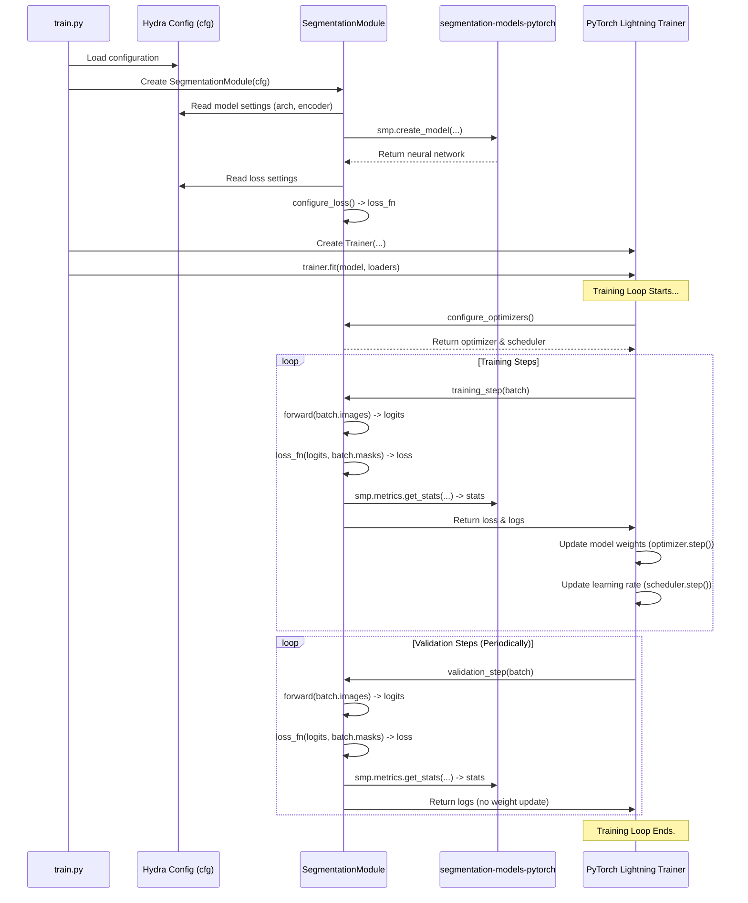

# Chapter 6: Segmentation Model Module (`model.py`)

In the [previous chapter](05_data_loading___augmentation___datasets_py____augs_py___.md), we learned how `datasets.py` and `augs.py` prepare our image data and feed it efficiently in batches, even applying random augmentations to make our dataset seem bigger. We have the ingredients ready and the delivery system in place. Now, we need the "chef" – the actual brain that will learn to perform the image segmentation task.

This is where the **Segmentation Model Module (`model.py`)** comes in.

## What Problem Does `model.py` Solve?

Imagine you're building a robot chef. You've got the system to bring ingredients (`datasets.py`), but now you need the core programming for the robot's brain. This brain needs to know:

1.  **What kind of chef is it?** (e.g., a pizza chef, a sushi chef). In our case, what kind of segmentation architecture are we using? (e.g., UNet, DeepLabV3+)
2.  **How does it learn?** When it makes a mistake (e.g., puts pepperoni on the wrong side of the pizza), how does it measure that mistake (loss function) and adjust its technique (optimizer)?
3.  **How do we track its progress?** How do we score its performance during practice sessions (training) and evaluations (validation)? (e.g., Intersection over Union - IoU metric)

`model.py` defines this core learning component. It bundles together the model architecture, the learning rules, and the performance tracking into a single, organized module.

**Use Case:** We want to train a model to segment grass in images. We need to choose a suitable architecture, like `DeepLabV3+`. We need to tell it how to measure its errors using a loss function like `DiceFocalLoss`. We need to tell it how to update itself using an optimizer like `Adam`. And we need to track its accuracy using the `IoU` metric. `model.py` provides the blueprint for this learning "brain".

## Key Concepts

1.  **Segmentation Architecture (The Brain's Design):** `model.py` doesn't usually implement the complex neural network architectures from scratch. Instead, it uses pre-built, well-tested architectures from a fantastic library called `segmentation-models-pytorch` (often imported as `smp`). Think of this like choosing a standard, high-quality engine design (like a UNet or DeepLabV3+) instead of designing one yourself. You select the architecture type and its "backbone" (a feature extractor, often borrowed from image classification models like ResNet) using the Hydra configuration files (e.g., `conf/model/deeplabv3plus.yaml`).

    ```yaml
    # File: conf/model/deeplabv3plus.yaml (Example Selection)
    arch_name: DeepLabV3Plus   # Choose the DeepLabV3+ architecture
    encoder_name: resnet152  # Use ResNet152 as the feature extractor
    encoder_weights: imagenet # Start with weights pre-trained on ImageNet
    # ... other model settings ...
    ```

2.  **PyTorch Lightning Module (`pl.LightningModule`):** Building, training, and evaluating models involves a lot of boilerplate code (setup, loops, moving data to GPU, logging). `pytorch-lightning` is a library that simplifies this! `model.py` defines a class called `SegmentationModule` that inherits from `pl.LightningModule`. This makes our code much cleaner by providing a standard structure for the training process. Think of it as a standardized control panel and wiring system for our robot chef, making it easier to manage.

3.  **Key Methods in `SegmentationModule`:** The `pl.LightningModule` structure organizes the essential parts of the learning process into specific methods:
    *   `__init__(self, cfg)`: The constructor. It reads the configuration (`cfg`) to know which architecture (`cfg.model.arch_name`), loss function (`cfg.train.loss.name`), learning rate (`cfg.train.lr.base_lr`), etc., to use. It then uses `smp.create_model()` to build the actual neural network.
    *   `forward(self, image)`: Defines how an input image flows *through* the model to produce an output (the predicted segmentation mask). This is the core prediction logic.
    *   `configure_optimizers(self)`: Specifies *how* the model learns. It sets up the optimizer (e.g., Adam) which adjusts the model's internal parameters (weights) based on the errors, and a learning rate scheduler which adjusts the learning speed during training.
    *   `training_step(self, batch, batch_idx)`: Defines what happens during *one* step of training with a single batch of data. It takes the batch, runs it through `forward()`, calculates the loss (how wrong the prediction was) using the chosen loss function, calculates metrics (like IoU), and logs them.
    *   `validation_step(self, batch, batch_idx)`: Similar to `training_step`, but for the validation data. This happens periodically to check how well the model is generalizing to data it hasn't trained on directly. No learning (parameter updates) happens here.
    *   `(Optional) test_step`: Similar again, but for the final test set after training is complete.

4.  **Loss Function (The Error Signal):** This function calculates a score telling the model *how wrong* its prediction was compared to the true mask. Lower scores are better. Different loss functions emphasize different aspects of the error. `model.py` allows selecting different loss functions (like `DiceLoss`, `FocalLoss`, or combinations like `DiceFocalLoss`) via the configuration (`cfg.train.loss.name`). Analogy: The judge scoring the robot chef's pizza based on specific criteria.

    ```yaml
    # File: conf/train/default.yaml (Example Selection)
    loss:
      name: DiceFocalLoss # Choose the combined Dice and Focal loss
    ```

5.  **Optimizer & Scheduler (The Learning Mechanism):**
    *   **Optimizer (e.g., Adam):** The algorithm that actually updates the model's weights based on the loss score, trying to reduce the error. Analogy: The mechanism that fine-tunes the robot chef's movements.
    *   **Scheduler (e.g., OneCycleLR):** Adjusts the *learning rate* (how big the adjustments are) during training. Often, we start with a higher rate and decrease it over time. Analogy: Controlling how aggressively the robot chef adjusts its technique.
    These are set up inside the `configure_optimizers` method, often using values from the config (`cfg.train.lr`).

6.  **Metrics (The Performance Scoreboard):** These are scores calculated during training and validation to tell us how well the model is performing in human-understandable terms. The primary metric for segmentation is usually **Intersection over Union (IoU)**, which measures the overlap between the predicted mask and the true mask. Higher is better. These are calculated within the `training_step` and `validation_step` and logged.

## How to Use `model.py`

You typically don't interact with `model.py` directly. It's used by the [Training Orchestration (`train.py`)](07_training_orchestration___train_py___.md) script. Your main way of controlling the model is through the Hydra configuration files:

1.  **Select Architecture:** Choose your desired model architecture and encoder in a `conf/model/*.yaml` file (e.g., `unetplusplus.yaml`, `segformer.yaml`).
2.  **Select Loss:** Choose your loss function in `conf/train/default.yaml` under the `loss:` section.
3.  **Set Learning Rate:** Set the base learning rate in `conf/train/default.yaml` under the `lr:` section.
4.  **Run Training:** Execute the training process using `main.py`:
    ```bash
    # Use the default model (specified in config.yaml's defaults)
    python main.py mode=train

    # Override the model to use unetplusplus
    python main.py mode=train model=unetplusplus loss.name=DiceBCELoss lr.base_lr=0.0005
    ```

**What Happens During Training (`src/train.py`):**

1.  `train.py` starts, and Hydra loads the configuration (`cfg`), incorporating your choices for `model`, `loss`, `lr`, etc.
2.  It creates an instance of the `SegmentationModule`:
    ```python
    # File: src/train.py (Simplified Snippet)
    from src.utils.model import SegmentationModule

    # ... inside main(cfg) ...

    # Create the model module instance using the loaded configuration
    model = SegmentationModule(cfg)

    # (The rest of train.py sets up DataLoaders and the PyTorch Lightning Trainer)
    # trainer = Trainer(...)
    # trainer.fit(model, train_loader, val_loader)
    ```
3.  The PyTorch Lightning `Trainer` object (also created in `train.py`) takes over. It automatically calls the necessary methods of your `model` object (`configure_optimizers`, `training_step`, `validation_step`, etc.) to run the training loop.

## Under the Hood: Inside the SegmentationModule

Let's trace the key steps when the `Trainer` uses the `SegmentationModule`:

1.  **Initialization:** `train.py` creates `model = SegmentationModule(cfg)`.
    *   The `__init__` method reads `cfg.model` (e.g., `arch_name='DeepLabV3Plus'`, `encoder_name='resnet152'`).
    *   It calls `smp.create_model(...)` to build the neural network architecture.
    *   It reads `cfg.train.loss.name` (e.g., `'DiceFocalLoss'`) and calls `self.configure_loss()` to create the loss function object.
2.  **Optimizer Setup:** The `Trainer` calls `model.configure_optimizers()`.
    *   This method reads learning rates from `cfg.train.lr`.
    *   It creates the `Adam` optimizer, possibly assigning different learning rates to the encoder and decoder parts of the model.
    *   It creates a learning rate scheduler.
3.  **Training Step:** For each batch in the `train_loader`:
    *   The `Trainer` moves the batch data (images, masks) to the GPU.
    *   It calls `model.training_step(batch, batch_idx)`.
        *   Inside `training_step`, the batch is passed to `model.forward(images)` to get the raw predictions (logits).
        *   The `loss_fn` (e.g., `DiceFocalLoss`) is called with the `logits` and true `masks` to calculate the error (`loss`).
        *   The predictions are converted to probability masks (e.g., using `sigmoid` for binary cases) and then thresholded to get final predicted masks (`pred_masks`).
        *   Metrics (like True Positives, False Positives, etc. needed for IoU) are calculated using `smp.metrics.get_stats(pred_masks, masks, ...)`.
        *   The `loss` and metrics are logged.
        *   The `loss` is returned to the `Trainer`.
    *   The `Trainer` uses the `loss` and the `optimizer` to update the model's weights (this is the learning part!).
    *   The `scheduler` might update the learning rate.
4.  **Validation Step:** Periodically (usually after each epoch), for each batch in the `val_loader`:
    *   The `Trainer` calls `model.validation_step(batch, batch_idx)`.
    *   This runs the same forward pass, loss calculation, and metric calculation as `training_step`, but *without* updating the model weights.
    *   Results are logged.
5.  **Epoch End:** At the end of training and validation epochs, methods like `on_train_epoch_end` and `on_validation_epoch_end` are called.
    *   These aggregate the metrics from all steps in the epoch (e.g., calculate the overall validation IoU).
    *   They log the aggregated epoch metrics.
    *   (`model.py` also includes a helper to plot metrics).

**Visualizing the Interaction (Simplified):**



## Diving Deeper into the Code (`src/utils/model.py`)

Let's look at simplified snippets of the `SegmentationModule`.

**1. Initialization (`__init__`)**

```python
# File: src/utils/model.py (Simplified __init__)
import pytorch_lightning as pl
import segmentation_models_pytorch as smp
import torch
# Import custom loss classes defined in the same file
from .losses import DiceFocalLoss, DiceBCELoss, DiceWithBoundaryLoss # Assuming losses are in src/utils/losses.py

class SegmentationModule(pl.LightningModule):
    def __init__(self, cfg, **kwargs):
        super().__init__()
        # Save config to access it later (like in configure_optimizers)
        self.save_hyperparameters(cfg) # Saves cfg attributes as self.hparams
        # Or store needed parts explicitly: self.cfg = cfg

        # --- 1. Create the Model Architecture ---
        self.model = smp.create_model(
            arch=cfg.model.arch_name, # e.g., "DeepLabV3Plus"
            encoder_name=cfg.model.encoder_name, # e.g., "resnet152"
            encoder_weights=cfg.model.encoder_weights, # e.g., "imagenet"
            in_channels=cfg.model.in_channels, # e.g., 3 for RGB
            classes=cfg.model.out_classes, # e.g., 1 for binary (grass vs background)
            # **kwargs allows passing extra model-specific args if needed
        )

        # --- 2. Select and Configure the Loss Function ---
        self.loss_strategy = cfg.train.loss.name # e.g., "DiceFocalLoss"
        self.loss_fn = self.configure_loss() # Call helper method below

        # --- 3. Set other parameters ---
        self.mode = cfg.model.mode # "binary" or "multiclass"
        self.threshold = 0.5 # Threshold for converting probabilities to binary masks
        self.base_lr = cfg.train.lr.base_lr # Store base learning rate

        # (Metrics aggregation lists are initialized here too)
        self.training_step_outputs = []
        self.validation_step_outputs = []

    def configure_loss(self):
        """Helper to select the loss function based on config."""
        if self.mode == "binary":
            if self.loss_strategy == "DiceFocalLoss":
                # Use weights if defined, otherwise default (e.g., 0.5, 0.5)
                return DiceFocalLoss(mode="binary")
            elif self.loss_strategy == "DiceBCELoss":
                return DiceBCELoss()
            elif self.loss_strategy == "DiceWithBoundaryLoss":
                return DiceWithBoundaryLoss()
            else:
                 raise ValueError(f"Unknown binary loss: {self.loss_strategy}")
        elif self.mode == "multiclass":
            # Example for multiclass (can add more options)
             return smp.losses.DiceLoss(mode="multiclass", from_logits=True)
        else:
            raise ValueError(f"Invalid mode: {self.mode}")
```

*   **Explanation:**
    *   The `__init__` method receives the Hydra configuration `cfg`.
    *   `smp.create_model` dynamically builds the requested neural network architecture (like DeepLabV3+ with a ResNet encoder).
    *   `configure_loss` is a helper function that looks at `cfg.train.loss.name` and returns the corresponding loss function object (e.g., an instance of `DiceFocalLoss`).

**2. Forward Pass (`forward`)**

```python
# File: src/utils/model.py (Simplified forward)

class SegmentationModule(pl.LightningModule):
    # ... (init and other methods) ...

    def forward(self, image):
        """Runs the input image through the neural network."""
        # Simply call the underlying smp model
        return self.model(image)
```

*   **Explanation:** The `forward` method is very simple. It just passes the input `image` tensor to the actual `smp` model (`self.model`) created in `__init__` and returns the output (raw logits).

**3. Configuring Optimizers (`configure_optimizers`)**

```python
# File: src/utils/model.py (Simplified configure_optimizers)
import torch

class SegmentationModule(pl.LightningModule):
    # ... (init and other methods) ...

    def configure_optimizers(self):
        """Sets up the optimizer and learning rate scheduler."""
        # Set different learning rates for different parts of the model
        encoder_lr = self.base_lr * 0.1 # Often use lower LR for pre-trained encoder
        decoder_lr = self.base_lr
        head_lr = self.base_lr # Learning rate for the final classification layer

        # Group parameters
        params = [
            {"params": self.model.encoder.parameters(), "lr": encoder_lr},
            {"params": self.model.decoder.parameters(), "lr": decoder_lr},
        ]
        # Add segmentation head params if they exist
        if hasattr(self.model, 'segmentation_head') and self.model.segmentation_head:
             params.append({"params": self.model.segmentation_head.parameters(), "lr": head_lr})

        # Create the Adam optimizer
        optimizer = torch.optim.Adam(params)

        # Create a learning rate scheduler (e.g., OneCycleLR)
        scheduler = torch.optim.lr_scheduler.OneCycleLR(
            optimizer,
            max_lr=[encoder_lr * 10, decoder_lr * 10, head_lr * 10], # Target LRs
            epochs=self.trainer.max_epochs, # Total epochs from Trainer
            steps_per_epoch=len(self.trainer.datamodule.train_dataloader()), # Steps per epoch
        )

        # Return config for Lightning Trainer
        return {
            "optimizer": optimizer,
            "lr_scheduler": {
                "scheduler": scheduler,
                "interval": "step", # Update LR every step
                "frequency": 1
            }
        }

```

*   **Explanation:**
    *   This method defines how the model learns.
    *   It sets up the `Adam` optimizer, often applying different learning rates (`lr`) to the encoder (feature extractor) and the decoder (segmentation part).
    *   It also sets up a `OneCycleLR` scheduler to adjust the learning rate dynamically during training based on the total number of epochs and steps.
    *   PyTorch Lightning uses the returned dictionary to manage the optimizer and scheduler.

**4. Shared Step Logic (`shared_step`, used by `training_step` and `validation_step`)**

```python
# File: src/utils/model.py (Simplified shared_step)
import torch
import segmentation_models_pytorch as smp

class SegmentationModule(pl.LightningModule):
    # ... (init and other methods) ...

    def shared_step(self, batch, stage): # 'stage' is 'train' or 'valid'
        """Common logic for training and validation steps."""
        images, masks, _ = batch # Unpack batch (image, mask, filename_stem)
        masks = masks.long() # Ensure masks are LongTensor for loss/metrics

        # 1. Forward pass: Get model predictions (logits)
        logits = self.forward(images)

        # 2. Calculate loss
        loss = self.loss_fn(logits, masks)

        # 3. Calculate predictions and metrics (IoU)
        # Convert logits to probabilities and then to predicted class masks
        if self.mode == "binary":
            probs = torch.sigmoid(logits)
            preds = (probs > self.threshold).long()
        else: # multiclass
            probs = torch.softmax(logits, dim=1) # Apply softmax along class dimension
            preds = torch.argmax(probs, dim=1) # Get the class with highest probability

        # Calculate True Positive, False Positive, False Negative, True Negative stats
        # These are needed to compute IoU later at the end of the epoch
        tp, fp, fn, tn = smp.metrics.get_stats(
            preds, masks, mode=self.mode, num_classes=self.hparams.model.out_classes
        )

        # Return loss and stats for aggregation
        return {"loss": loss, "tp": tp, "fp": fp, "fn": fn, "tn": tn}

    def training_step(self, batch, batch_idx):
        # Call shared logic
        result = self.shared_step(batch, "train")
        # Log the training loss for this step/epoch
        self.log("train_loss", result["loss"], on_step=False, on_epoch=True, prog_bar=True)
        # Store results for epoch end calculation
        self.training_step_outputs.append(result)
        # Return the loss for the optimizer step
        return result["loss"] # Crucial: return only the loss here

    def validation_step(self, batch, batch_idx):
        # Call shared logic
        result = self.shared_step(batch, "valid")
        # Log the validation loss for this step/epoch
        self.log("valid_loss", result["loss"], on_step=False, on_epoch=True, prog_bar=True)
        # Store results for epoch end calculation
        self.validation_step_outputs.append(result)
        return result # Return the full dict here is fine

    # --- Methods for epoch end (shared_epoch_end, on_train_epoch_end, ...) ---
    # These aggregate the stats (tp, fp, fn, tn) from the steps
    # and compute overall IoU, logging the final epoch metrics.
    # See full code for details.
```

*   **Explanation:**
    *   `shared_step` contains the core logic performed on each batch during both training and validation.
    *   It gets predictions (`logits`) from `forward`.
    *   It calculates the `loss` using the chosen `loss_fn`.
    *   It converts `logits` into final predicted masks (`preds`) based on the `mode` (binary/multiclass).
    *   It uses `smp.metrics.get_stats` to compute TP, FP, FN, TN, which are essential for calculating IoU.
    *   `training_step` and `validation_step` call `shared_step`, log the step loss, store the stats, and return the loss (for training) or the full result dictionary (for validation).
    *   Other methods (like `shared_epoch_end`, not shown simplified here) aggregate these stats at the end of an epoch to calculate and log overall metrics like dataset IoU.

## Conclusion

Great job! You've now explored the core "brain" of our segmentation project: the **Segmentation Model Module (`model.py`)**.

*   It defines the **structure** of our learning component using `pytorch-lightning`.
*   It leverages powerful, pre-built **segmentation architectures** (like UNet, DeepLabV3+) from the `segmentation-models-pytorch` library.
*   It specifies how the model **learns** by defining the **loss function** (the error signal) and the **optimizer/scheduler** (the learning mechanism).
*   It defines how performance is **measured** using **metrics** like Intersection over Union (IoU).
*   You configure the model's architecture, loss, and learning rate easily through **Hydra configuration files**.

This module encapsulates the heart of the machine learning process. Now that we have the data loading pipeline and the model definition ready, how do we actually put them together and run the training process?

Let's move on to the next chapter to see how training is orchestrated: [Chapter 7: Training Orchestration (`train.py`)](07_training_orchestration___train_py___.md)!

---

Generated by [AI Codebase Knowledge Builder](https://github.com/The-Pocket/Tutorial-Codebase-Knowledge)