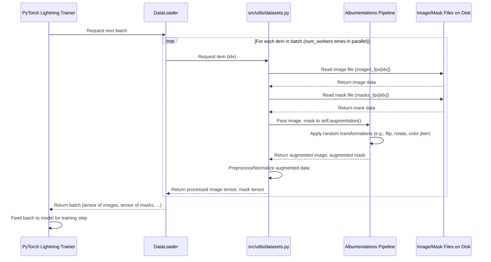

# Chapter 7: Data Loading & Augmentation

Welcome back to the SemiF-Segmentation tutorial! In [Chapter 5: Segmentation Model & Training](05_segmentation_model___training_.md), we used our prepared data (from [Chapter 4: Preprocessing Pipeline](04_preprocessing_pipeline_.md)) to train a powerful segmentation model. But how exactly did the training process get the images and masks from their saved locations on disk into the model's memory, ready to be processed? And how did we make the training more robust by showing the model slightly varied versions of the same images?

This chapter dives into the essential concepts of **Data Loading** and **Data Augmentation**, explaining how the project efficiently reads your processed data and applies helpful random transformations on-the-fly during training.

## The Challenge: Feeding Data to the Model Efficiently

Imagine you have thousands of processed images and masks neatly organized into `train`, `val`, and `test` folders (thanks to the [Chapter 4: Preprocessing Pipeline](04_preprocessing_pipeline_.md)). Your segmentation model, however, doesn't look at one image at a time. It learns best when processing data in **batches** – a group of images and their corresponding masks presented together.

Feeding data efficiently during training poses several challenges:

*   **Reading from Disk:** Images and masks need to be read from storage (like an SSD or hard drive). This can be slow, especially for large datasets.
*   **Batching:** Individual images and masks need to be grouped into tensors of a fixed size (the `batch_size` from our configuration) before being passed to the model.
*   **Shuffling:** For training, it's crucial to process data in a random order in each epoch to prevent the model from learning the order of the data instead of the features within the images.
*   **Variety is Key:** Showing the model the *exact* same image repeatedly during training can lead to overfitting – the model becomes too good at recognizing the specific training examples but struggles with new, slightly different images (e.g., the same plant viewed from a slightly different angle, or under different lighting).

Manually handling file reading, batching, shuffling, and applying random transformations for every training step would be complex and slow.

## The Solution: Datasets, DataLoaders, and Augmentation Pipelines

The SemiF-Segmentation project leverages standard PyTorch components and a powerful augmentation library (`albumentations`) to solve these challenges:

1.  **Dataset (`src/utils/datasets.py`):** This object represents your collection of data files (images and masks) on disk for a specific split (like training, validation, or testing). It knows where the files are located and, importantly, how to **load a single pair** of image and mask when asked. Think of it as a list that, when you access an item, doesn't just give you a file path, but actually reads the file and gives you the image and mask data.
2.  **DataLoader (`torch.utils.data.DataLoader`):** This object wraps a `Dataset`. Its job is to take the raw data loaded by the `Dataset`, organize it into **batches**, potentially **shuffle** the data order (crucial for training), and handle loading data in parallel using multiple worker processes (`num_workers`) to speed things up. This is the workhorse that feeds data batches to the model during training.
3.  **Data Augmentation (`albumentations` and `src/utils/augs.py`):** This is a set of techniques that apply **random transformations** to the images and masks *each time* they are loaded by the `Dataset`. Transformations can include things like random flips, rotations, scaling, changes in brightness or contrast, adding noise, etc. This creates slightly different versions of your training images on-the-fly, making the model more robust and helping it generalize better to unseen data. It's important that the *same* transformation is applied to both the image and its corresponding mask to keep them perfectly aligned.

These components work together to efficiently and dynamically prepare data batches for the model.

## Key Concepts

Let's look at these components in more detail:

### The Dataset: `src/utils/datasets.py`

The `Dataset` class (specifically the `Dataset` class, not `SegmentationDataset` or `DatasetOLD` which are older versions or examples in the code) in `src/utils/datasets.py` is a custom implementation that inherits from PyTorch's `BaseDataset`.

```python
# Simplified snippet from src/utils/datasets.py
import os
from pathlib import Path
import cv2
import numpy as np
from torch.utils.data import Dataset as BaseDataset
import torch
from typing import Optional, List, Union

class Dataset(BaseDataset):
    def __init__(
        self, 
        images_dir: Union[Path, List[Path]], 
        masks_dir: Union[Path, List[Path]], 
        augmentation=None, 
        normalize_image=False, 
        mean=None, 
        std=None
    ):
        # --- Initialization ---
        if isinstance(images_dir, list):
            # If images_dir is a list, assume masks_dir is also a list
            self.images_fps = images_dir # File paths for images
            self.masks_fps = masks_dir   # File paths for masks
        elif images_dir.is_dir() and masks_dir.is_dir():
            # If they are directories, find all JPG images and corresponding PNG masks
            self.images_fps = list(Path(images_dir).glob("*.jpg"))
            self.masks_fps = [Path(masks_dir, f"{img.stem}.png") for img in self.images_fps]
        else:
            # Handle invalid input
            raise ValueError(...)

        self.augmentation = augmentation # This will hold our augmentation pipeline
        self.normalize_image = normalize_image
        self.mean = np.array(mean) if mean is not None else np.array([0.0, 0.0, 0.0])
        self.std = np.array(std) if std is not None else np.array([1.0, 1.0, 1.0])

    def __getitem__(self, idx):
        """
        This method is called by the DataLoader to get a single item (image/mask pair).
        """
        # --- Load Image ---
        image = cv2.imread(str(self.images_fps[idx]))
        image = cv2.cvtColor(image, cv2.COLOR_BGR2RGB)  # OpenCV loads BGR, convert to RGB

        # --- Load Mask ---
        mask = cv2.imread(str(self.masks_fps[idx]), cv2.IMREAD_GRAYSCALE) # Load as grayscale (single channel)

        # --- Apply Augmentations (if any) ---
        if self.augmentation:
            # Augmentation object takes image and mask, returns transformed versions
            augmented = self.augmentation(image=image, mask=mask)
            image, mask = augmented["image"], augmented["mask"]

        # --- Preprocess/Normalize and Convert to Tensor ---
        # These helper methods handle scaling pixel values, normalization,
        # and changing image format (HWC to CHW)
        image = self._preprocess_image(image)
        mask = self._preprocess_mask(mask)

        # Return the processed image tensor, mask tensor, and the file stem (name)
        return image, mask, self.masks_fps[idx].stem

    def __len__(self):
        """
        This method is called by the DataLoader to know how many items are in the dataset.
        """
        return len(self.images_fps)

    def _preprocess_image(self, image: np.ndarray) -> torch.Tensor:
        """ Scale, Normalize, and Convert HWC numpy array to CHW tensor. """
        image = image / 255.0  # Scale pixel values to [0, 1]
        if self.normalize_image:
            image = (image - self.mean) / self.std # Apply dataset mean/std normalization
        image = image.transpose(2, 0, 1)  # Change from HeightxWidthxChannels to ChannelsxHeightxWidth
        return torch.from_numpy(image).float() # Convert to PyTorch tensor

    def _preprocess_mask(self, mask: np.ndarray) -> torch.Tensor:
        """ Convert HW numpy array to tensor, add channel if needed. """
        if mask.ndim == 2:  # Add channel dimension if single-channel mask
            mask = np.expand_dims(mask, axis=0)
        return torch.from_numpy(mask).long() # Convert to PyTorch tensor
```
*   The `__init__` method receives the paths to the image and mask directories (or lists of paths) and the optional `augmentation` object. It builds lists of file paths (`images_fps`, `masks_fps`).
*   The `__len__` method simply returns the total number of image files found.
*   The crucial `__getitem__(self, idx)` method is what the `DataLoader` calls. It reads the image and mask file at the given `idx`, applies the provided `augmentation` function (if any), preprocesses them (scaling, normalization), converts them into PyTorch tensors, and returns them along with the file name.

### The DataLoader: `torch.utils.data.DataLoader`

The `DataLoader` is a standard PyTorch class. It takes an instance of our `Dataset` and handles the logistics of fetching data.

```python
# Simplified snippet from src/train.py
from torch.utils.data import DataLoader
from src.utils.datasets import Dataset # Our custom dataset

# ... inside main(cfg) function ...

# Create Dataset instances for training and validation
train_dataset = Dataset(
    train_image_dir, # Path to training images from config
    train_mask_dir,  # Path to training masks from config
    augmentation=train_aug(cfg), # Pass the training augmentation pipeline
    normalize_image=cfg.train.dataset.normalize, # Normalize images?
    mean=mean, # Dataset mean (from preprocessing)
    std=std,   # Dataset std (from preprocessing)
)

val_dataset = Dataset(
    val_image_dir,   # Path to validation images
    val_mask_dir,    # Path to validation masks
    augmentation=val_aug(cfg), # Pass the validation augmentation pipeline (usually simple/none)
    normalize_image=cfg.train.dataset.normalize,
    mean=mean,
    std=std,
)

# Create DataLoader instances
train_loader = DataLoader(
    train_dataset,           # The dataset to load data from
    batch_size=cfg.train.batch_size, # How many items per batch (from config)
    shuffle=True,            # Shuffle training data each epoch
    num_workers=cfg.train.dataset.workers, # How many processes to use for loading (from config)
    pin_memory=True,         # Helps transfer data to GPU faster
    drop_last=True           # Drop the last batch if its size is less than batch_size
)

val_loader = DataLoader(
    val_dataset,             # The validation dataset
    batch_size=cfg.train.batch_size, # Same batch size
    shuffle=False,           # Do NOT shuffle validation data (need consistent evaluation)
    num_workers=cfg.train.dataset.workers,
    pin_memory=True
)

# The Trainer (from Chapter 5) will use these DataLoaders:
# trainer.fit(model, train_loader, val_loader)
```
*   In `src/train.py`, `DataLoader` instances are created for the training and validation `Dataset` objects.
*   The `batch_size` parameter controls how many image/mask pairs are grouped into a single batch tensor returned by the `DataLoader`. This comes directly from `cfg.train.batch_size`.
*   `shuffle=True` is essential for the training `DataLoader` to randomize the data order in each epoch. `shuffle=False` is used for validation/test `DataLoader`s.
*   `num_workers` (from `cfg.train.dataset.workers`) specifies how many separate processes the `DataLoader` should use to load data in the background while the GPU is busy training. This significantly speeds up training by preventing the GPU from waiting for data.
*   Notice that the `augmentation` objects (`train_aug(cfg)` and `val_aug(cfg)`) are passed to the `Dataset` instances, which then apply the augmentations within their `__getitem__` method.

### Data Augmentation: `albumentations` and `src/utils/augs.py`

The project uses the `albumentations` library, a popular and efficient library for image augmentation, especially for tasks like segmentation where transformations must be applied identically to both the image and its mask.

The `src/utils/augs.py` file contains helper functions, primarily `train_aug(cfg)` and `val_aug(cfg)`, which build the `albumentations` transformation pipelines based on your configuration.

The configuration for augmentation is in `conf/augment/`. By default, `conf/config.yaml` loads `conf/augment/default.yaml`.

Let's look at relevant parts of `conf/augment/default.yaml`:

```yaml
# --- File: conf/augment/default.yaml (Relevant Parts) ---
train: # Augmentations applied during training
  img_hw: ["${preprocess.grid_crop.crop_height}", "${preprocess.grid_crop.crop_width}"] # Expected image size
  
  geometrics_transforms: # Transformations affecting shape/position
    enable: true # Enable this category of transforms?
    some_of: # Apply a random subset of the transforms below
      p: 1.0 # Probability of applying the 'some_of' block
      n: 4   # Apply exactly 4 random transforms from the list below
      replace: false # Don't pick the same transform twice
    
    horizontal_flip: # Example: Flip image horizontally
      enable: true   # Enable this specific transform?
      p: 0.5         # Probability of applying horizontal flip (if 'some_of' picks it or if not using 'some_of')
    
    vertical_flip: # Example: Flip image vertically
      enable: true
      p: 0.3
      
    affine: # Example: Random scaling, rotation, shear, translation
      enable: true
      p: 0.8
      rotate: [-20, 20] # Rotate randomly between -20 and +20 degrees
      # ... other affine parameters ...
      
    elastic_transform: # Example: Distort the image grid
      enable: true
      p: 0.5
      # ... other elastic parameters ...
      
    # ... many other geometric transforms ...

  photometrics_transforms: # Transformations affecting color/brightness
    enable: true
    some_of:
      p: 1.0
      n: 1 # Apply exactly 1 random photometric transform
      replace: false
    
    random_gamma: # Example: Adjust image gamma
      enable: true
      p: 0.5
      gamma_limit: [90, 110] # Randomly adjust gamma within this range (as %)
      
    brightness_contrast: # Example: Randomly adjust brightness and contrast
      enable: true
      p: 0.7
      # ... parameters ...
      
    # ... many other photometric transforms ...

  noise_transforms: # Transformations adding noise/artifacts
    enable: true
    some_of:
      p: 1.0
      n: 1 # Apply exactly 1 random noise transform
      replace: false
      
    MultiplicativeNoise: # Example: Multiply pixel values by random amount
      enable: true
      p: 0.2
      multiplier: [0.95, 1.05]
      
    # ... other noise transforms ...
      
val: # Augmentations applied during validation (usually minimal or none)
  img_hw: ${augment.train.img_hw}
  padding: # Often validation data is padded to a fixed size if needed
    enable: false # Disabled by default
    p: 0.0
```

*   The config is split into `train` and `val` sections, as you typically apply aggressive random augmentations *only* during training. Validation data should represent the "real world" data distribution without random distortions.
*   Within each section, transformations are grouped (geometrics, photometrics, noise).
*   Each transform has an `enable: true/false` flag and a `p:` (probability) parameter.
*   Blocks like `some_of` allow you to apply a random *subset* of the transforms listed below them. For example, in `geometrics_transforms`, `n: 4` under `some_of` means for any given training image, `albumentations` will randomly pick exactly 4 geometric transforms from the enabled list and apply them.
*   The `src/utils/augs.py` code reads this configuration and uses `albumentations` to build the transformation pipeline.

```python
# Simplified snippet from src/utils/augs.py
import albumentations as A
from typing import List
import random

# --- Helper function to build a list of transforms from a config section ---
def build_transforms_from_config(cfg_section, albumentations_class_map, extra_args=None) -> List[A.BasicTransform]:
    transforms = []
    # Iterate through the possible transform names and their Albumentations classes
    for key, albumentations_class in albumentations_class_map.items():
        # Check if this transform is defined and enabled in the config
        if key in cfg_section and getattr(cfg_section[key], 'enable', False):
            # Get the parameters for this transform from the config
            params = cfg_section[key]
            # Convert config parameters to a dictionary, excluding 'enable'
            cfg_dict = {k: v for k, v in params.items() if k != 'enable'}
            
            # Add the Albumentations class instance with parameters to the list
            transforms.append(albumentations_class(**cfg_dict))
            
    return transforms

# --- Function to build the full training augmentation pipeline ---
def train_aug(cfg):
    # Read config specific to train augmentation
    t_cfg = cfg.augment.train

    transforms = [] # List to hold the final sequence of transforms

    # === Build Geometric Transforms ===
    # Define map from config key to Albumentations class
    geometric_map = {
        "horizontal_flip": A.HorizontalFlip,
        "vertical_flip": A.VerticalFlip,
        "affine": A.Affine,
        # ... other geometric transforms ...
    }
    # Build the list of enabled geometric transforms
    geo_transforms = build_transforms_from_config(t_cfg.geometrics_transforms, geometric_map)
    # Wrap them in A.SomeOf if configured
    geo_some = A.SomeOf(geo_transforms, n=t_cfg.geometrics_transforms.some_of.n, p=t_cfg.geometrics_transforms.some_of.p) # Simplified SomeOf call
    if geo_some:
        transforms.append(geo_some)

    # === Build Photometric Transforms (similar process) ===
    # Define map...
    photometric_map = {
        "random_gamma": A.RandomGamma,
        "brightness_contrast": A.RandomBrightnessContrast,
        # ... other photometric transforms ...
    }
    photo_transforms = build_transforms_from_config(t_cfg.photometrics_transforms, photometric_map)
    photo_some = A.SomeOf(photo_transforms, n=t_cfg.photometrics_transforms.some_of.n, p=t_cfg.photometrics_transforms.some_of.p) # Simplified SomeOf call
    if photo_some:
        transforms.append(photo_some)

    # === Build Noise Transforms (similar process) ===
    # Define map...
    noise_map = {
        "MultiplicativeNoise": A.MultiplicativeNoise,
        # ... other noise transforms ...
    }
    noise_transforms = build_transforms_from_config(t_cfg.noise_transforms, noise_map)
    noise_some = A.SomeOf(noise_transforms, n=t_cfg.noise_transforms.some_of.n, p=t_cfg.noise_transforms.some_of.p) # Simplified SomeOf call
    if noise_some:
        transforms.append(noise_some)

    # === Compose all transforms ===
    # Albumentations.Compose applies the list of transforms sequentially to image/mask pairs
    return A.Compose(transforms)

# --- Function to build the validation augmentation pipeline ---
def val_aug(cfg):
    # Read config specific to validation augmentation
    val_transform = []
    # Validation augs are usually just resizing/padding if needed
    # ... build validation specific transforms based on cfg.augment.val ...
    return A.Compose(val_transform) # Return empty Compose if no val augs enabled

```
*   The `build_transforms_from_config` helper iterates through a config section, checks if a transform is enabled, reads its parameters, and creates an instance of the corresponding `albumentations` class.
*   `train_aug` and `val_aug` use this helper to build lists of transforms for each category (geometric, photometric, noise) based on the `cfg.augment.train` and `cfg.augment.val` sections.
*   They wrap these lists using `A.SomeOf` if specified in the config, allowing random subsets of transforms to be applied.
*   Finally, `A.Compose(transforms)` is used to create a single augmentation object. When this object is called (like `self.augmentation(image=image, mask=mask)` in the `Dataset`), it applies the sequence of defined transformations to both the image and the mask simultaneously, ensuring they remain aligned.

## How to Use: Configuring Data Loading and Augmentation

As we saw in [Chapter 5: Segmentation Model & Training](05_segmentation_model___training_.md), the `src/train.py` script automatically sets up the `Dataset` and `DataLoader` instances based on the training configuration (`cfg.train`) and the augmentation configuration (`cfg.augment`).

The default setup in `conf/config.yaml` uses:
*   `- train: default`: Loads training parameters like `batch_size` and `dataset.workers` from `conf/train/default.yaml`.
*   `- augment: default`: Loads augmentation parameters from `conf/augment/default.yaml`.

To run training with the default data loading and augmentation settings:

```bash
python main.py mode=train
```

This command triggers `src/train.py`, which will:
1.  Read `cfg.train.batch_size` and `cfg.train.dataset.workers` to configure the `DataLoader`.
2.  Read `cfg.augment.train` and `cfg.augment.val` (from `conf/augment/default.yaml`) and pass the resulting `albumentations.Compose` objects to the `train_dataset` and `val_dataset` instances.
3.  The `DataLoader`s then use these `Dataset`s to load batches during training, applying the configured augmentations randomly to each training image/mask pair *every time* it's fetched.

**Configuring Augmentation:** You can customize which augmentations are applied and with what probability by editing `conf/augment/default.yaml`. You can enable/disable specific transforms or change their parameters and probabilities (`p:`).

For example, to make horizontal flipping happen only 25% of the time instead of 50% (as in the default config snippet shown), you would change:
```yaml
# In conf/augment/default.yaml, under train.geometrics_transforms
horizontal_flip:
  enable: true
  p: 0.25 # Changed from 0.5
```

**Selecting a Different Augmentation Profile:** The project might have multiple augmentation configuration files in `conf/augment/` (e.g., `color_invariant.yaml` as shown in the code snippets). You can select a different profile using Hydra overrides:

```bash
python main.py mode=train augment=color_invariant
```

This command tells Hydra to load `conf/augment/color_invariant.yaml` instead of `conf/augment/default.yaml` for the `augment` part of the configuration, completely changing the set of augmentations used during training.

**Expected Output:** You won't see a separate output file specifically for data loading or augmentation. Their output is the batches of data fed to the model during training. However, the training logs (saved by the PyTorch Lightning Trainer, as discussed in [Chapter 5: Segmentation Model & Training](05_segmentation_model___training_.md)) implicitly reflect the effect of these components – efficient loading contributes to faster training, and effective augmentation contributes to better model performance on validation data.

During training startup, `src/train.py` might also save a visualization of a sample batch *after* augmentation has been applied (if configured in the viz_batch function), allowing you to visually inspect what the augmented data looks like.

## Internal Workflow Diagram

Let's visualize the flow of data from disk to the model during a training step:



This diagram shows how the `DataLoader` coordinates with the `Dataset`, which loads the raw files, passes them through the `Albumentations` augmentation pipeline, preprocesses the result, and returns the tensors to the `DataLoader` to form a batch. This process happens efficiently in parallel thanks to `num_workers`.

## Summary

In this chapter, we explored **Data Loading & Augmentation**, the components that efficiently feed data to the model during training and improve model robustness.

*   We learned that the `Dataset` object (in `src/utils/datasets.py`) represents the data collection and knows how to load individual image/mask pairs from disk.
*   The `DataLoader` (a standard PyTorch component) wraps the `Dataset` to create batches, shuffle data (for training), and load data efficiently in parallel using `num_workers`, controlled by `cfg.train.batch_size` and `cfg.train.dataset.workers`.
*   **Data Augmentation** (using `albumentations` and configured via `conf/augment/*.yaml`) applies random transformations to image/mask pairs on-the-fly within the `Dataset`'s `__getitem__` method. This increases data variety and helps the model generalize.
*   You control the specific augmentations applied via the configuration files, and can select different augmentation profiles or override specific settings using Hydra.

With this understanding of how data is dynamically prepared and fed to the model, you have a complete picture of the core pipeline steps from data selection ([Chapter 3: Data Querying](03_data_querying_.md)), through preparation ([Chapter 4: Preprocessing Pipeline](04_preprocessing_pipeline_.md)), training ([Chapter 5: Segmentation Model & Training](05_segmentation_model___training_.md)) which uses data loading/augmentation, and inference ([Chapter 6: Inference Pipeline](06_inference_pipeline_.md)).

The final chapter covers a utility that helps manage your project files, especially in collaborative or remote environments.

[Chapter 8: File Synchronization](08_file_synchronization_.md)

---

Generated by [AI Codebase Knowledge Builder](https://github.com/The-Pocket/Tutorial-Codebase-Knowledge)