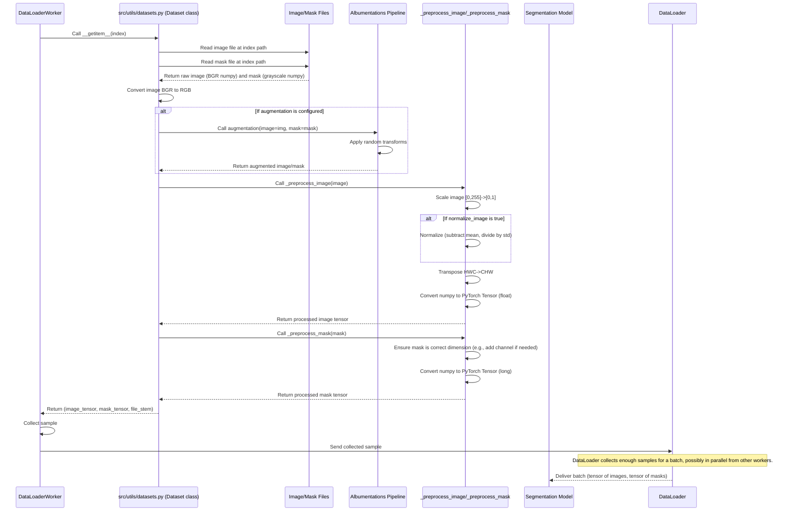

# Chapter 7: Dataset Loader

Welcome back! In the last chapter, [Data Augmentation](06_data_augmentation_.md), you learned how to create synthetic variations of your images and masks *on-the-fly* during training using the Albumentations library, configured via Hydra. Before that, you saw how the [Data Preprocessing Pipeline](05_data_preprocessing_pipeline_.md) takes your raw data and prepares it by cropping, remapping masks, and splitting it into training, validation, and testing sets.

Now you have a folder structure with images and masks ready for use, potentially needing on-the-fly augmentation. But how does this data actually get fed into the machine learning model during training? The model doesn't just magically know how to read your folders, load the images, apply transformations, and arrange them into batches.

This is where the **Dataset Loader** components come in.

## What is the Dataset Loader? (Your Data Delivery System)

Think of your preprocessed and potentially augmented data as ingredients stored neatly in different boxes (folders for train, val, test). A machine learning model needs these ingredients delivered in a specific way:

1.  **One item at a time:** The model processes individual image/mask pairs.
2.  **Prepared format:** The data needs to be in the right numerical format (like numbers between 0 and 1, or normalized), in the correct color order (RGB, not BGR), and arranged as PyTorch tensors (a special data structure PyTorch understands).
3.  **Grouped into batches:** Models train much faster if you feed them several image/mask pairs at once (a "batch").
4.  **Efficiently:** Loading data from disk can be slow. You need to do it quickly, maybe even using multiple processor cores, so the model isn't waiting around.
5.  **Randomized:** For training, you want to shuffle the data each time through the dataset to help the model generalize better.

The **Dataset Loader** system in `SemiF-Segmentation` handles all this. It consists of two main parts from the PyTorch library:

*   **`Dataset`:** This object represents the *collection* of all your individual data samples (image/mask pairs). It knows *where* all the images and masks are and, when asked, can load and prepare *one* specific image/mask pair according to the necessary steps (color conversion, apply augmentation, normalize, convert to tensor). The `src/utils/datasets.py` file contains the project's custom `Dataset` class tailored for image segmentation.
*   **`DataLoader`:** This object wraps a `Dataset`. Its job is to efficiently fetch multiple samples from the `Dataset` object, group them into batches, shuffle them (for training), and can even load them in parallel using multiple worker processes. This is what actually feeds batches of data to the model.

Together, these form the data delivery system for your model.

## How to Use the Dataset Loader

You don't explicitly run the "Dataset Loader" as a `mode` like `sync` or `preprocess`. Instead, `Dataset` and `DataLoader` objects are created and used *within* the `train`, `val`, and `inference` tasks whenever they need to load data.

The most common place you'll see them used is in the `src/train.py` file ([Segmentation Model Module (Training/Validation)](08_segmentation_model_module__training_validation__.md)). Here's how the provided code snippet from `src/train.py` sets them up:

```python
# --- Snippet from src/train.py ---
# ... other imports ...
from src.utils.datasets import Dataset # Import our custom Dataset class
from src.utils.augs import train_aug, val_aug # Functions to build augmentation pipelines
# ... other training setup code ...

@hydra.main(...) # Hydra provides the cfg object
def main(cfg: DictConfig):
    # ... setup logger, directories ...

    # Load mean/std for normalization (calculated during preprocessing)
    stats_file = Path(cfg.paths.project_preprocess_dir) / "data/data_stats/rgb_mean_std.json"
    mean, std = load_stats(stats_file) # Helper function to load stats

    # Directories where preprocessed/split data is located
    split_data_dir = Path(cfg.paths.split_dir)
    train_image_dir = split_data_dir / "train" / "images"
    train_mask_dir = split_data_dir / "train" / "masks"
    val_image_dir = split_data_dir / "val" / "images"
    val_mask_dir = split_data_dir / "val" / "masks"
    # ... test image/mask directories ...
    
    # --- Create Dataset Objects ---
    train_dataset = Dataset(
        images_dir=train_image_dir, # Directory for training images
        masks_dir=train_mask_dir,   # Directory for training masks
        augmentation=train_aug(cfg), # >>> Pass the training augmentation pipeline
        normalize_image=cfg.train.dataset.normalize, # Should images be normalized? (From config)
        mean=mean,                 # Mean for normalization (loaded from stats)
        std=std,                   # Std dev for normalization (loaded from stats)
    )

    val_dataset = Dataset(
        images_dir=val_image_dir, # Directory for validation images
        masks_dir=val_mask_dir,   # Directory for validation masks
        augmentation=val_aug(cfg), # >>> Pass the validation augmentation pipeline (usually minimal)
        normalize_image=cfg.train.dataset.normalize, # Normalization setting
        mean=mean,                 # Mean for normalization
        std=std,                   # Std dev for normalization
    )

    # ... create test_dataset similarly ...

    # --- Create DataLoader Objects ---
    train_loader = DataLoader(
        dataset=train_dataset,     # Use the training dataset
        batch_size=cfg.train.batch_size, # How many samples per batch? (From config)
        shuffle=True,              # Shuffle the data each epoch (important for training!)
        num_workers=cfg.train.dataset.workers, # How many parallel processes for loading? (From config)
        pin_memory=True,           # Helps speed up data transfer to GPU
        drop_last=True             # Drop the last batch if it's smaller than batch_size
    )
    
    val_loader = DataLoader(
        dataset=val_dataset,       # Use the validation dataset
        batch_size=cfg.train.batch_size, # Use same batch size for validation
        shuffle=False,             # Don't shuffle validation data (order doesn't matter, reproducibility)
        num_workers=cfg.train.dataset.workers # Parallel workers
        # pin_memory=True # Optional for validation
        # drop_last=False # Often keep the last batch in validation
        )
    
    # ... create test_loader similarly ...

    # Model and Trainer are created and use these DataLoaders:
    model = SegmentationModule(cfg)
    trainer = Trainer(...) # PyTorch Lightning Trainer
    
    # Trainer uses the DataLoaders to get data batches
    trainer.fit(model, train_loader, val_loader) 
    # trainer.validate(model, val_loader)
    # trainer.test(model, test_loader)

    # ... rest of train.py ...
```

This snippet shows that:

1.  You create a `Dataset` object for *each* split (train, val, test).
2.  You tell each `Dataset` where its images and masks are located (using paths derived from the configuration `cfg.paths`).
3.  You pass the appropriate augmentation pipeline function (`train_aug(cfg)` or `val_aug(cfg)`) to the `Dataset` so it knows which transformations to apply.
4.  You pass normalization settings (`normalize_image`, `mean`, `std`) to the `Dataset`.
5.  You then create a `DataLoader` object for each `Dataset`.
6.  You tell the `DataLoader` the desired `batch_size` and how many `num_workers` to use for parallel loading (again, from `cfg.train.batch_size` and `cfg.train.dataset.workers`).
7.  For the training `DataLoader`, you set `shuffle=True`. For validation/testing, `shuffle=False`.
8.  Finally, these `DataLoader` objects (`train_loader`, `val_loader`) are passed to the PyTorch Lightning `Trainer` (which we'll see in [Chapter 8: Segmentation Model Module (Training/Validation)](08_segmentation_model_module__training_validation__.md)). The Trainer then repeatedly asks the `train_loader` for batches of data during training epochs and the `val_loader` for batches during validation steps.

This configuration in `conf/train/default.yaml` controls these aspects:

```yaml
# --- Snippet from conf/train/default.yaml ---
epochs: 50
batch_size: 16 # Batch size used by DataLoaders

dataset: # Settings specific to the Dataset and DataLoader
  normalize: true # Whether to normalize images
  workers: 8 # Number of workers for DataLoaders

# ... other train settings ...
```

By modifying `batch_size`, `normalize`, and `workers` in your training configuration, you directly control how the data is loaded and prepared by the Dataset and DataLoader.

## How the Dataset Loader Works Under the Hood

Let's look at the internal workings of the `Dataset` class and how the `DataLoader` interacts with it.

When the PyTorch Lightning `Trainer` needs a batch of training data, it asks the `train_loader`. The `train_loader` then, possibly using multiple `num_workers`, calls the `__getitem__` method of the `train_dataset` multiple times (once for each item it needs for the batch). The `__getitem__` method is where the magic happens for a *single* data sample.

Here's a simplified flow of how a single data sample is processed by the `Dataset`'s `__getitem__` method when requested by a `DataLoader` worker:



Let's look at simplified code snippets from the `Dataset` class in `src/utils/datasets.py` to see how this happens.

**1. Initialization (`__init__`)**

This method sets up the dataset by finding the list of image and mask files and storing the configuration settings needed for processing.

```python
# --- Snippet from src/utils/datasets.py ---
import os
from pathlib import Path
import cv2 # Used for reading images
import numpy as np
from torch.utils.data import Dataset as BaseDataset # Inherit from PyTorch's Dataset
import torch
from typing import Optional, List, Union

import logging
log = logging.getLogger(__name__)

class Dataset(BaseDataset): # Our custom class inherits from PyTorch's base
    def __init__(
        self, 
        images_dir: Union[Path, List[Path]], # Can accept a directory path or a list of paths
        masks_dir: Union[Path, List[Path]], 
        augmentation=None, # The augmentation pipeline (Albumentations A.Compose object)
        normalize_image=False, 
        mean=None, 
        std=None
    ):
        """
        Dataset for image segmentation tasks.
        """
        # --- Find image and mask files ---
        if isinstance(images_dir, list): # If given lists of paths
            self.images_fps = images_dir # File Paths
            self.masks_fps = masks_dir
        elif images_dir.is_dir() and masks_dir.is_dir(): # If given directories
            self.images_fps = list(Path(images_dir).glob("*.jpg")) # Find all jpgs in images_dir
            # Assuming mask names match image names (stem) but with .png extension in masks_dir
            self.masks_fps = [Path(masks_dir, f"{img.stem}.png") for img in self.images_fps]
        else:
            raise ValueError(f"images_dir and masks_dir must either be lists or valid directories not {images_dir} and {masks_dir}")

        # --- Store processing settings ---
        self.augmentation = augmentation # Store the augmentation pipeline
        self.normalize_image = normalize_image
        # Store mean and std as numpy arrays, provide defaults if None
        self.mean = np.array(mean) if mean is not None else np.array([0.0, 0.0, 0.0])
        self.std = np.array(std) if std is not None else np.array([1.0, 1.0, 1.0])

        log.info(f"Initialized Dataset with {len(self.images_fps)} images.")

    # ... __getitem__ and __len__ methods below ...
```

The `__init__` method handles the first step: getting the list of file paths. It also stores the Albumentations `augmentation` pipeline object and the normalization parameters (`normalize_image`, `mean`, `std`) which were determined by the configuration (`cfg`) and passed in during creation in `src/train.py`.

**2. Getting the Number of Samples (`__len__`)**

The `DataLoader` needs to know how many total samples are available in the dataset to determine the number of batches and track progress. This is the job of the `__len__` method.

```python
# --- Snippet from src/utils/datasets.py ---
# ... __init__ method above ...

    def __len__(self):
        """Returns the total number of samples in the dataset."""
        return len(self.images_fps) # The number of images is the number of samples

    # ... __getitem__ method below ...
```

Simple enough! It just returns the number of image file paths found during initialization.

**3. Loading and Processing a Single Sample (`__getitem__`)**

This is the core method called by the `DataLoader` to get a single sample given its `index`.

```python
# --- Snippet from src/utils/datasets.py ---
# ... __init__ and __len__ methods above ...

    def __getitem__(self, idx):
        """
        Loads, processes, and returns a single image/mask pair at the given index.
        """
        # --- Step 1: Load image and mask ---
        # Read image (OpenCV reads as BGR numpy array)
        image = cv2.imread(str(self.images_fps[idx])) 
        image = cv2.cvtColor(image, cv2.COLOR_BGR2RGB)  # Convert BGR to RGB (models expect RGB)

        # Read mask in grayscale mode (OpenCV reads as grayscale numpy array)
        mask = cv2.imread(str(self.masks_fps[idx]), cv2.IMREAD_GRAYSCALE)

        # --- Step 2: Apply augmentations ---
        # If an augmentation pipeline was provided
        if self.augmentation:
            # Apply the pipeline to the image and mask together
            augmented = self.augmentation(image=image, mask=mask)
            image, mask = augmented["image"], augmented["mask"] # Get the transformed results

        # --- Step 3: Normalize and convert to tensors ---
        # Use helper methods for preprocessing
        image_tensor = self._preprocess_image(image)
        mask_tensor = self._preprocess_mask(mask)

        # --- Step 4: Return processed sample ---
        # Return the image tensor, mask tensor, and the base filename (stem)
        return image_tensor, mask_tensor, self.masks_fps[idx].stem

    # ... _preprocess_image and _preprocess_mask methods below ...
```

This method does exactly what was described in the flow diagram: load, convert color, apply augmentation (if configured), and then call helper methods to handle normalization and conversion to PyTorch tensors. It also returns the image file's stem (like "image_001") which can be useful later (e.g., for logging or saving predictions).

**4. Helper: Preprocessing Image (`_preprocess_image`)**

This method takes a numpy image array (now in RGB, potentially augmented) and prepares it for the model.

```python
# --- Snippet from src/utils/datasets.py ---
# ... __getitem__ method above ...

    def _preprocess_image(self, image: np.ndarray) -> torch.Tensor:
        """
        Preprocess the image: scale, normalize (optional), and convert to tensor (HWC -> CHW).
        """
        image = image / 255.0  # Scale pixel values from [0, 255] to [0.0, 1.0]
        
        if self.normalize_image: # Check if normalization is enabled by config
            # Apply normalization: (image - mean) / std
            # self.mean and self.std are numpy arrays
            image = (image - self.mean) / self.std
        
        image = image.transpose(2, 0, 1)  # Change channel order: HWC (Height, Width, Channel) -> CHW (Channel, Height, Width) for PyTorch
        
        # Convert numpy array to PyTorch tensor and ensure it's float type
        return torch.from_numpy(image).float()

    # ... _preprocess_mask method below ...
```

This helper scales the pixel values to be between 0 and 1, optionally applies the configured mean/std normalization, rearranges the dimensions to the format PyTorch models expect (Channels first), and finally converts the numpy array into a PyTorch tensor.

**5. Helper: Preprocessing Mask (`_preprocess_mask`)**

This method takes a numpy mask array (grayscale, potentially augmented) and prepares it for the model.

```python
# --- Snippet from src/utils/datasets.py ---
# ... _preprocess_image method above ...

    def _preprocess_mask(self, mask: np.ndarray) -> torch.Tensor:
        """
        Preprocess the mask: ensure correct shape and convert to tensor (long type).
        """
        if mask.ndim == 2:  # If the mask is just Height x Width (HW)
            mask = np.expand_dims(mask, axis=0) # Add a channel dimension: 1 x H x W
            # Some models expect masks as BATCH x H x W, others as BATCH x 1 x H x W
            # The SegmentationModule expects BATCH x H x W, so we might remove this later
            # Let's return H x W for now, as SegmentationModule loss expects BATCH x H x W
            mask = np.squeeze(mask, axis=0) # Correcting based on model expectation in SegmentationModule
        
        # Convert numpy array to PyTorch tensor and ensure it's long type (needed for segmentation targets)
        return torch.from_numpy(mask).long()
```

This helper ensures the mask is in the correct shape (handling cases where OpenCV might drop a channel dimension) and converts the numpy array to a PyTorch tensor with a `long` data type, which is typically required for segmentation masks used as training targets.

By implementing these methods, the `Dataset` class provides the necessary interface (`__len__` and `__getitem__`) for the `DataLoader` to efficiently load, process, and batch the data from disk into the format required by the segmentation model. The `DataLoader` then manages the batching, shuffling, and parallel loading, offloading these complexities from the main training loop.

## Conclusion

You've learned that the Dataset Loader system, comprised of the PyTorch `Dataset` and `DataLoader` classes, is crucial for efficiently delivering preprocessed and augmented data to your machine learning model. The custom `Dataset` class in `src/utils/datasets.py` knows how to find your files, load individual image/mask pairs, apply configured augmentations and normalizations, and convert them into PyTorch tensors. The `DataLoader` then wraps the `Dataset` to handle batching, shuffling (for training), and parallel loading using settings defined in your Hydra configuration. Together, these components provide a robust and performant way to feed data into the training and inference processes.

With the data ready to go, the next logical step is to understand the core of the project: the actual segmentation model and how the training and validation loops work.

[Next Chapter: Segmentation Model Module (Training/Validation)](08_segmentation_model_module__training_validation__.md)

---

Generated by [AI Codebase Knowledge Builder](https://github.com/The-Pocket/Tutorial-Codebase-Knowledge)