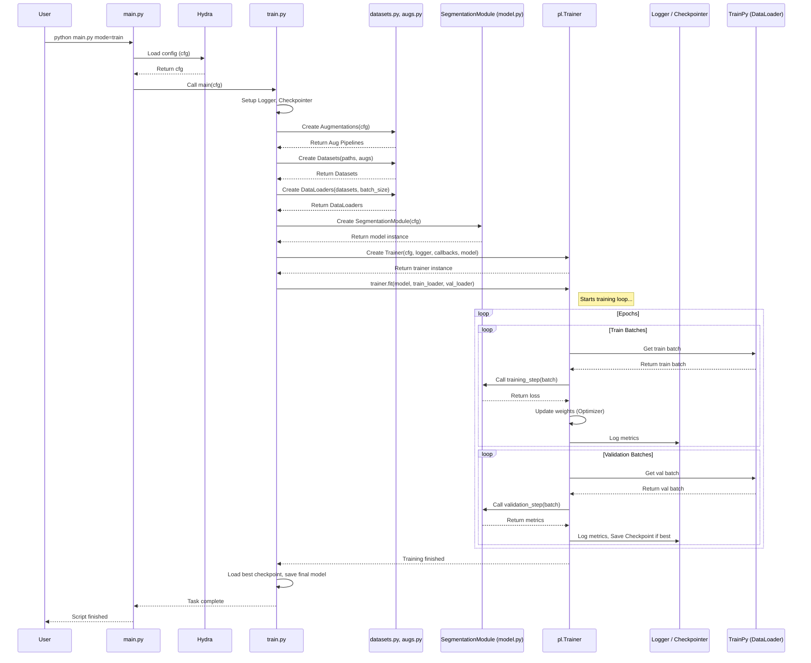

# Chapter 7: Training Orchestration (`train.py`)

Welcome to Chapter 7! In [Chapter 6: Segmentation Model Module (`model.py`)](06_segmentation_model_module___model_py___.md), we met the "brain" of our project – the `SegmentationModule` that defines our model architecture and how it learns. We also saw in [Chapter 5: Data Loading & Augmentation (`datasets.py`, `augs.py`)](05_data_loading___augmentation___datasets_py____augs_py___.md) how data is prepared and efficiently fed to the model.

But how do we actually connect the data pipeline to the model and manage the whole learning process? Who tells the model when to start training, how many times to practice (epochs), and keeps track of its performance?

This is where `train.py` comes in. Think of it as the **Head Coach** for our segmentation model.

## What Problem Does `train.py` Solve?

Imagine our `SegmentationModule` (from `model.py`) is a talented student athlete. The `Dataset` and `DataLoader` (from `datasets.py`) are the practice drills and equipment. The student knows *how* to learn, and the drills are ready, but someone needs to organize the practice sessions!

`train.py` is that coach. It sets up the entire training environment, brings the student (model) and the practice materials (data) together, uses a sophisticated assistant coach (`pytorch_lightning.Trainer`) to run the drills, monitors progress, and saves the best results.

**Use Case:** You have your preprocessed data ready, you've configured your desired model architecture (like `DeepLabV3+`) and learning parameters (like learning rate) using Hydra. Now, you want to actually *start* the training process, run it for 50 epochs on your available GPUs, log the performance after each epoch, and automatically save the model that performs best on the validation set. `train.py` manages this entire workflow.

## Key Concepts

1.  **The Head Coach (`train.py`):** This script is the main entry point for the training task (run via `main.py mode=train`). It receives the overall game plan (configuration `cfg` from Hydra) and sets everything up.
2.  **The Student (`SegmentationModule`):** An instance of the class defined in [Chapter 6: Segmentation Model Module (`model.py`)](06_segmentation_model_module___model_py___.md). This is the actual model being trained.
3.  **The Practice Materials (`Dataset` / `DataLoader`):** Instances created using the classes/functions from [Chapter 5: Data Loading & Augmentation (`datasets.py`, `augs.py`)](05_data_loading___augmentation___datasets_py____augs_py___.md). They provide batches of training and validation data.
4.  **The Assistant Coach (`pytorch_lightning.Trainer`):** A powerful tool from the `pytorch-lightning` library. The Head Coach (`train.py`) configures and uses the `Trainer`. The `Trainer` handles the complex parts of running the training loop:
    *   Iterating through epochs and batches.
    *   Moving data and the model to the correct GPU(s).
    *   Calling the appropriate methods in our `SegmentationModule` (`training_step`, `validation_step`, `configure_optimizers`).
    *   Calling logging functions.
    *   Calling checkpointing functions.
5.  **The Training Log (`CSVLogger`):** An object configured by `train.py` (using `pytorch-lightning`). It automatically records metrics (like loss, IoU) calculated by the `SegmentationModule` into a CSV file during training.
6.  **The Trophy Cabinet (`ModelCheckpoint`):** Another `pytorch-lightning` tool configured by `train.py`. It monitors a specific metric (e.g., validation IoU) and automatically saves the model's state (a "checkpoint") whenever it achieves a new best score. It can also save the very last checkpoint.

## How to Use `train.py`

You don't run `train.py` directly. You use the main project manager, `main.py`, as we learned in [Chapter 1: Task Orchestration (`main.py`)](01_task_orchestration___main_py___.md).

**Example: Running Training**

1.  **Configure:** Make sure your settings in `conf/config.yaml` and related files (like `conf/train/default.yaml`, `conf/model/deeplabv3plus.yaml`, `conf/paths/default.yaml`) are correct. Key settings include:
    *   `train.epochs`: How many epochs to train for.
    *   `train.batch_size`: Number of samples per batch.
    *   `model`: Which model architecture to use.
    *   `train.lr.base_lr`: The learning rate.
    *   `paths`: Where the data is and where to save results.
    *   `train.cuda_visible_devices`: Which GPUs to use.

2.  **Run:** Open your terminal in the project's root directory and type:

    ```bash
    python main.py mode=train
    ```

    *   `python main.py`: Executes the main dispatcher.
    *   `mode=train`: Tells `main.py` to run the training task. This causes `main.py` to find and execute the `main` function inside `src/train.py`.

**What Happens?**

1.  `main.py` receives the command and identifies `mode=train`.
2.  Hydra loads all configurations (`.yaml` files specified in `conf/config.yaml` defaults and any command-line overrides) into the `cfg` object ([Chapter 2: Hydra Configuration Management](02_hydra_configuration_management_.md)).
3.  `main.py` calls the `main` function in `src/train.py`, passing the `cfg`.
4.  `src/train.py` (the Head Coach) executes its steps:
    *   Sets up logging (`CSVLogger`) and checkpointing (`ModelCheckpoint`).
    *   Creates the Datasets and DataLoaders for training and validation data (using `datasets.py`, `augs.py`, and paths from `cfg`).
    *   Initializes the `SegmentationModule` (the model) based on `cfg.model`.
    *   Initializes the `pytorch_lightning.Trainer` with all the settings (logger, callbacks, number of epochs, GPU strategy from `cfg.train`).
    *   Starts the training by calling `trainer.fit(model, train_loader, val_loader)`.
5.  The `Trainer` takes over, running the training loop for the specified number of epochs, logging metrics, and saving checkpoints.
6.  Once training finishes, `train.py` might perform final actions like validating the best model and saving it in a deployment-ready format.

## Under the Hood: The Coach's Playbook

Let's follow the `main` function inside `src/train.py` step-by-step when you run `python main.py mode=train`:

1.  **Receive Config:** The `main(cfg: DictConfig)` function starts, receiving the complete configuration from Hydra.
2.  **Setup:**
    *   (Optional) Sets which GPUs are visible using `os.environ['CUDA_VISIBLE_DEVICES']`.
    *   Sets the random seed (`set_seed(cfg.train.seed)`) for reproducibility.
    *   Loads data statistics (mean, std) if normalization is enabled (`load_stats(...)`).
    *   Creates the `CSVLogger` to save metrics to `project_dir/train/version_X/metrics.csv`.
    *   Creates `ModelCheckpoint` callbacks: one to save the `best` model based on `cfg.train.callbacks.monitor` (e.g., `valid_dataset_iou`), and one to save the `last` model checkpoint.
3.  **Prepare Data:**
    *   Creates the training and validation augmentation pipelines using `train_aug(cfg)` and `val_aug(cfg)` from [Chapter 5: Data Loading & Augmentation (`datasets.py`, `augs.py`)](05_data_loading___augmentation___datasets_py____augs_py___.md).
    *   Creates `Dataset` instances for training and validation, passing the image/mask directories (from `cfg.paths`) and the augmentation pipelines.
    *   Creates `DataLoader` instances, wrapping the datasets and specifying `batch_size`, `num_workers`, and shuffling from `cfg.train`.
4.  **Initialize Model:** Creates an instance of the `SegmentationModule` from [Chapter 6: Segmentation Model Module (`model.py`)](06_segmentation_model_module___model_py___.md), passing the `cfg`: `model = SegmentationModule(cfg)`.
5.  **Initialize Trainer:** Creates the `pytorch_lightning.Trainer` instance. It passes many settings from `cfg.train.trainer` (like `max_epochs`), the `logger`, the `callbacks` (checkpoints), and the GPU strategy (`cfg.train.train_strategy`).
6.  **Start Training:** Calls `trainer.fit(model, train_loader, val_loader)`. This is the main command that kicks off the training loop managed by PyTorch Lightning. The `Trainer` will now repeatedly:
    *   Get batches from `train_loader`.
    *   Call `model.training_step`.
    *   Update model weights.
    *   Periodically get batches from `val_loader`.
    *   Call `model.validation_step`.
    *   Log metrics via the `logger`.
    *   Check if a new best model should be saved via `ModelCheckpoint`.
7.  **Post-Training:** After `trainer.fit()` completes:
    *   (Optional) Runs final validation using `trainer.validate(model, val_loader)`.
    *   Loads the best checkpoint saved by `ModelCheckpoint`.
    *   Saves the best model's state dictionary in a standard format (e.g., `.pth`) for later use in inference.

**Visualizing the Flow:**



## Diving Deeper into the Code (`src/train.py`)

Let's look at some simplified key snippets from `src/train.py`.

**1. Setup (Logger, Checkpoints, DataLoaders)**

```python
# File: src/train.py (Simplified Setup)
import hydra
from omegaconf import DictConfig, OmegaConf
import os
from pathlib import Path
import torch
from torch.utils.data import DataLoader
from pytorch_lightning import Trainer
from pytorch_lightning.loggers import CSVLogger
from pytorch_lightning.callbacks import ModelCheckpoint
# Import our custom classes/functions
from src.utils.datasets import Dataset
from src.utils.augs import train_aug, val_aug
from src.utils.model import SegmentationModule

# (Helper functions like set_seed, load_stats defined elsewhere or above)

@hydra.main(version_base="1.3", config_path="../conf", config_name="config")
def main(cfg: DictConfig):
    print(OmegaConf.to_yaml(cfg)) # Log the config used

    # Basic setup
    set_seed(cfg.train.seed)
    mean, std = load_stats(Path(cfg.paths.project_preprocess_dir) / "data/data_stats/rgb_mean_std.json")

    # --- Logger ---
    # Saves logs to project_dir/train/version_X/
    logger = CSVLogger(save_dir=cfg.paths.project_mode_dir, name=None)

    # --- Checkpoints ---
    checkpoint_dir = Path(logger.log_dir, "checkpoints")
    checkpoint_dir.mkdir(parents=True, exist_ok=True)

    # Saves the best model based on validation IoU
    best_checkpoint = ModelCheckpoint(
        dirpath=checkpoint_dir,
        monitor=cfg.train.callbacks.monitor, # e.g., "valid_dataset_iou"
        mode=cfg.train.callbacks.mode,       # e.g., "max"
        save_top_k=1,                      # Save only the single best
        filename="best",                   # Name the file "best.ckpt"
    )
    # Saves the checkpoint from the very last epoch
    last_checkpoint = ModelCheckpoint(
        dirpath=checkpoint_dir,
        save_last=True,                      # Enable saving the last one
        filename="last",                     # Name the file "last.ckpt"
    )

    # --- Data Augmentation and Datasets (Uses Ch 5 concepts) ---
    training_augmentations = train_aug(cfg)
    validation_augmentations = val_aug(cfg)

    # Get data directories from config
    split_data_dir = Path(cfg.paths.split_dir)
    train_image_dir = split_data_dir / "train" / "images"
    train_mask_dir = split_data_dir / "train" / "masks"
    val_image_dir = split_data_dir / "val" / "images"
    val_mask_dir = split_data_dir / "val" / "masks"

    # Create Dataset instances
    train_dataset = Dataset(
        train_image_dir, train_mask_dir,
        augmentation=training_augmentations,
        normalize_image=cfg.train.dataset.normalize, mean=mean, std=std
    )
    val_dataset = Dataset(
        val_image_dir, val_mask_dir,
        augmentation=validation_augmentations,
        normalize_image=cfg.train.dataset.normalize, mean=mean, std=std
    )

    # --- DataLoaders ---
    train_loader = DataLoader(
        train_dataset,
        batch_size=cfg.train.batch_size,
        shuffle=True,
        num_workers=cfg.train.dataset.workers,
        pin_memory=True, # Helps speed up GPU transfer
        drop_last=True   # Avoid smaller batches at the end
    )
    val_loader = DataLoader(
        val_dataset,
        batch_size=cfg.train.batch_size,
        shuffle=False, # No need to shuffle validation data
        num_workers=cfg.train.dataset.workers
    )

    # ... rest of the main function ...
```

*   **Explanation:**
    *   The code sets up the `CSVLogger` to record metrics in a CSV file within a versioned directory (e.g., `version_0`, `version_1`).
    *   It configures `ModelCheckpoint` to monitor the validation IoU (`cfg.train.callbacks.monitor`) and save the checkpoint file (`best.ckpt`) when a new maximum is reached. It also saves the `last.ckpt`.
    *   It then uses the functions and classes from `augs.py` and `datasets.py` (Chapter 5) to create the augmentation pipelines, datasets, and dataloaders needed for training and validation, using parameters read from the `cfg` object.

**2. Model and Trainer Initialization**

```python
# File: src/train.py (Simplified Model and Trainer Init)

# (Inside the main(cfg) function, after DataLoader setup)

    # --- Initialize Model (Uses Ch 6 concept) ---
    model = SegmentationModule(cfg)

    # --- Select Training Strategy (for multi-GPU) ---
    if cfg.train.train_strategy == "auto":
        train_strategy = "auto"
    elif cfg.train.train_strategy == "ddp":
        from pytorch_lightning.strategies import DDPStrategy
        # DDP is for distributed training across multiple GPUs/machines
        train_strategy = DDPStrategy(find_unused_parameters=False)
    else:
        train_strategy = "auto" # Default

    # --- Initialize Trainer ---
    trainer = Trainer(
        # Settings from conf/train/default.yaml -> trainer section
        max_epochs=cfg.train.trainer.max_epochs,
        enable_progress_bar=cfg.train.trainer.enable_progress_bar,
        log_every_n_steps=cfg.train.trainer.log_every_n_steps,
        # ... other trainer settings ...

        # Assign the logger and callbacks we created
        logger=logger,
        callbacks=[best_checkpoint, last_checkpoint],

        # Specify the GPU strategy
        strategy=train_strategy,
        # Deterministic mode helps reproducibility
        deterministic=cfg.train.trainer.deterministic,
        # Specify devices based on CUDA_VISIBLE_DEVICES or config
        # devices="auto", accelerator="auto" are often sufficient
    )

    # ... rest of the main function ...
```

*   **Explanation:**
    *   An instance of our `SegmentationModule` (from Chapter 6) is created, passing the configuration `cfg` so it knows which architecture, loss function, etc., to use.
    *   A training strategy (like `DDP` for multi-GPU training) is selected based on the config.
    *   The `pytorch_lightning.Trainer` is initialized. Crucially, it's given:
        *   Settings like `max_epochs` from `cfg.train.trainer`.
        *   The `logger` object for recording metrics.
        *   The `callbacks` list (containing our `ModelCheckpoint` objects).
        *   The chosen `strategy`.

**3. Running Training and Saving the Best Model**

```python
# File: src/train.py (Simplified Training Start and Saving)

# (Inside the main(cfg) function, after Trainer initialization)

    # --- Start Training ---
    print("Starting training...")
    trainer.fit(model, train_loader, val_loader)
    print("Training finished.")

    # --- Validate the Best Model ---
    print("Validating the best model...")
    # trainer.validate() automatically uses the best checkpoint if checkpointing was enabled
    val_result = trainer.validate(model, val_loader, ckpt_path='best', verbose=False) # Specify 'best' explicitly
    # val_result = trainer.validate(ckpt_path='best', dataloaders=val_loader) # Alternative syntax

    if val_result:
        valid_dataset_iou = val_result[0].get("valid_dataset_iou", "N/A")
        print(f"Best model validation dataset IoU: {valid_dataset_iou}")
        # (Optional: Log final results to a file, like log_run_info function)
        # log_run_info(logger, cfg, val_result)
    else:
        print("Could not retrieve validation results for the best model.")


    # --- Load and Save the Best Model's Weights ---
    best_model_ckpt_path = best_checkpoint.best_model_path
    if best_model_ckpt_path and Path(best_model_ckpt_path).exists():
        print(f"Loading best model from: {best_model_ckpt_path}")
        # Load the SegmentationModule state from the best checkpoint file
        best_model = SegmentationModule.load_from_checkpoint(
            checkpoint_path=best_model_ckpt_path,
            cfg=cfg # Need to pass cfg again if needed by model __init__
        )

        # Create a directory to save the final model weights
        model_dir = Path(logger.log_dir, "model")
        model_dir.mkdir(parents=True, exist_ok=True)
        save_path = Path(model_dir, "best_model.pth")

        print(f"Saving best model weights to: {save_path}")
        # Use the model's own saving method (if it exists) or save state_dict
        # best_model.save_model(model_dir, "best_model") # Assumes save_model method exists
        torch.save(best_model.state_dict(), save_path) # Standard PyTorch way

    else:
        print("Could not find the best model checkpoint path.")

# Standard Python entry point check
if __name__ == "__main__":
    main()
```

*   **Explanation:**
    *   `trainer.fit(model, train_loader, val_loader)` is the command that starts the entire training process managed by PyTorch Lightning.
    *   After training, `trainer.validate(..., ckpt_path='best', ...)` is called to evaluate the best saved model on the validation set.
    *   The code then finds the path to the `best.ckpt` file saved by `ModelCheckpoint`.
    *   `SegmentationModule.load_from_checkpoint(...)` re-instantiates the model and loads the weights from that best checkpoint.
    *   Finally, `torch.save(best_model.state_dict(), ...)` saves just the learned parameters (weights) of the best model to a `.pth` file. This lightweight file is typically what's used for deployment or inference later.

## Conclusion

Well done! You've learned how `train.py` acts as the **Head Coach**, orchestrating the entire training process in `SemiF-Segmentation`.

*   It sets up the necessary components: **logging**, **checkpointing**, **data loaders**, and the **model**.
*   It leverages the power of **`pytorch-lightning.Trainer`** to handle the complex training loop mechanics (epochs, batches, GPU management).
*   It uses configuration (`cfg`) extensively to control all aspects of training (epochs, batch size, learning rate, model choice, paths).
*   You initiate the whole process simply by running `python main.py mode=train`.
*   It ensures that the best-performing model is automatically saved for later use.

This script is the glue that holds the data preparation, model definition, and learning process together, allowing you to train your segmentation models effectively.

Now that we have successfully trained a model and saved its best version, how can we use this trained model to make predictions on new, unseen images?

Let's move on to the next chapter: [Chapter 8: Inference Pipeline (`inference.py`)](08_inference_pipeline___inference_py___.md)!

---

Generated by [AI Codebase Knowledge Builder](https://github.com/The-Pocket/Tutorial-Codebase-Knowledge)