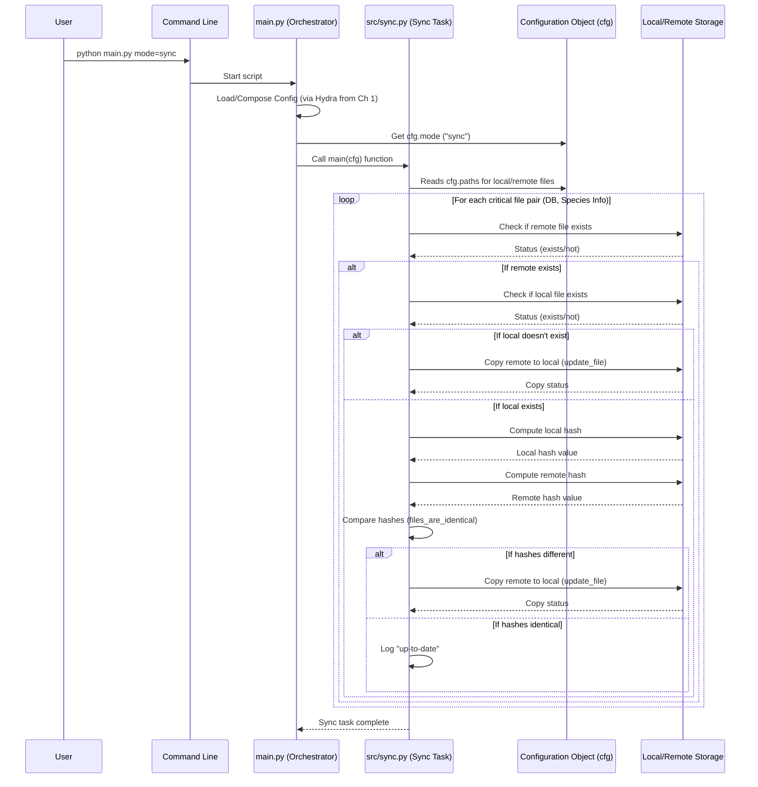

# Chapter 8: File Synchronization

Welcome back to the SemiF-Segmentation tutorial! In our journey so far, we've learned how [Chapter 1: Hydra Configuration](01_hydra_configuration_.md) controls the project, how [Chapter 2: Task Orchestration](02_task_orchestration_.md) directs which job to run, how [Chapter 3: Data Querying](03_data_querying_.md) selects the data, how [Chapter 4: Preprocessing Pipeline](04_preprocessing_pipeline_.md) prepares it, how [Chapter 7: Data Loading & Augmentation](07_data_loading___augmentation_.md) efficiently loads it for [Chapter 5: Segmentation Model & Training](05_segmentation_model___training_.md), and finally how [Chapter 6: Inference Pipeline](06_inference_pipeline_.md) uses the trained model.

All these steps rely on crucial input files, especially the main project database (`agir.db`) and the file containing species information (`species_info.json`). But what if your local copies of these files are old, missing, or corrupted?

## The Challenge: Keeping Critical Files Correct and Up-to-Date

Imagine the project database and species information file are like the master recipe book and the ingredient list for all your image processing tasks. These files often live on a central server or long-term storage location accessible by everyone using the project. When you run a task like querying data, your project needs access to these specific files on your local machine (or wherever you're running the code).

The problem is:

*   **Manual Updates:** You might forget to copy the latest version from the central storage.
*   **Inconsistency:** Different team members might accidentally work with different, outdated versions of the database or species info, leading to inconsistent results.
*   **Corruption:** A file copy might fail or get corrupted.
*   **Location Changes:** The exact path on the central storage might change, or your local copy needs to move.

Relying on manual file copying is error-prone and makes it hard to ensure everyone is using the same, correct source data. You need an automated way to guarantee that your local copies of these essential files are synchronized with the official, up-to-date versions.

## The Solution: File Synchronization

This is the job of the **File Synchronization** component (`src/sync.py`). It's like a vigilant librarian for your project's critical input files. It automatically checks if your local copies of the database and species information file match the definitive versions stored in a designated long-term storage location.

Its main functions are:

1.  **Identify Critical Files:** It knows which local files (the database and species info JSON) need to be kept synchronized.
2.  **Locate Remote Source:** It knows where the official, up-to-date versions of these files are stored in a central location.
3.  **Compare Versions:** It uses a reliable method to check if the local file is the exact same as the remote file. The project does this by comparing their **digital fingerprints** (called hashes).
4.  **Automated Update:** If the local file is missing or doesn't match the remote version's fingerprint, it automatically copies the remote version to the local path.

This process ensures you are always working with the latest and correct data, preventing issues caused by outdated files.

## Key Concepts

Let's break down the ideas behind file synchronization:

### Remote vs. Local Files

*   **Remote File:** This is the trusted "master" copy of the file, usually stored in a stable, shared location (like a network drive or cloud storage). It's the source of truth.
*   **Local File:** This is the copy of the file on your machine or in the specific environment where you are running the project code.

The synchronization process aims to make the local file identical to the remote file.

### Digital Fingerprints (File Hashes)

How do you know if two files are *exactly* the same without reading every single byte? You use a **hash function**. A hash function takes a file (no matter how big) and produces a short, unique string of characters (like `a1b2c3d4e5f6...`). This string is the file's digital fingerprint.

*   Even the tiniest change in the file (like changing one pixel in an image or one character in a text file) will produce a *completely different* hash.
*   The chance of two different files having the same hash is astronomically small (for strong hash functions like SHA-256, which this project uses).

So, to check if a local file matches a remote file, the synchronization script simply calculates the hash of both files and compares the hash strings. If the hashes match, the files are identical. If they don't, the files are different.

### Comparison and Update Logic

The core synchronization logic follows simple rules for each critical file pair:

1.  **Does the Remote File Exist?** If the remote source of truth isn't even there, the script can't sync and skips this file pair.
2.  **Does the Local File Exist?**
    *   If **No**: The local file is missing. The script logs a warning and copies the remote file to the local location.
    *   If **Yes**: Move to step 3.
3.  **Do the Hashes Match?**
    *   If **No**: The local file is different from the remote one. The script logs a warning and copies the remote file to the local location, overwriting the old version.
    *   If **Yes**: The local file is already up-to-date. The script logs an information message and does nothing.

This simple logic ensures that your local critical files are always brought into sync with the remote master versions whenever you run the synchronization task.

## How to Use File Synchronization

As with other tasks in the SemiF-Segmentation project, you trigger file synchronization using the `mode` parameter when running `main.py`.

To run the file synchronization task:

```bash
python main.py mode=sync
```

This command tells the [Chapter 2: Task Orchestration](02_task_orchestration_.md) (`main.py`) to execute the synchronization logic.

**Configuration:** The paths for the local and remote files that need to be synchronized are defined in the Hydra configuration, specifically in `conf/paths/default.yaml`. The main `conf/config.yaml` includes `- paths: default` to load these settings.

Let's look at the relevant parts of `conf/paths/default.yaml`:

```yaml
# --- File: conf/paths/default.yaml (Relevant Parts) ---

# DB
db:
  # path to db directory
  db_dir: ${paths.data_dir}/db # Local directory for DB

  # path to db file (Local Path)
  db_file: ${paths.db.db_dir}/agir.db # The actual local database file path
  # path to long-term storage db file (Remote Path)
  lts_db_file: ${paths.tertiary_storage}/semifield-database/agir.db # The remote database file path

# Species information
species_info_dir: ${paths.semif_utils_dir}/species_information # Local directory
species_info_file: ${paths.species_info_dir}/species_info.json # The actual local species info file path
lts_species_info: ${paths.tertiary_storage}/semifield-utils/species_information/species_info.json # The remote species info file path

# ... other paths ...
```
*   The `db_file` and `species_info_file` settings define the **local** paths where the project expects to find the database and species info files.
*   The `lts_db_file` and `lts_species_info` settings define the **remote** paths in long-term storage (`lts` stands for Long-Term Storage) where the master copies are located.

When you run `python main.py mode=sync`, the script reads these paths from the configuration and performs the sync logic for the pair `(db_file, lts_db_file)` and the pair `(species_info_file, lts_species_info)`.

**Expected Output:** The synchronization task's output is primarily in the form of **log messages** printed to your console (and potentially saved to log files if configured).

You will see messages indicating:

*   Which file pair is being checked (e.g., "Comparing db files...").
*   If the remote file is missing.
*   If the local file is missing and being downloaded ("Local file ... does not exist. Downloading...").
*   If the local file is outdated and being updated ("Local ... is outdated or different... Updating...").
*   If the local file is already up-to-date ("... Local file is up-to-date.").
*   If the update was successful.

For example, if your local database is missing, you might see output like:
```
[INFO] Starting sync
[INFO] Comparing db files...
[WARNING] Local file data/db/agir.db does not exist. Downloading...
[INFO] Updating data/db/agir.db from /mnt/research-projects/s/screberg/longterm_images2/semifield-database/agir.db
[INFO] Update complete: data/db/agir.db
[INFO] Comparing species_info files...
[INFO] Local file is up-to-date.
[INFO] File synchronization complete.
```

If both files were already identical, the output would be simpler:
```
[INFO] Starting sync
[INFO] Comparing db files...
[INFO] Local file is up-to-date.
[INFO] Comparing species_info files...
[INFO] Local file is up-to-date.
[INFO] File synchronization complete.
```

Running `mode=sync` is a good practice to perform before running other tasks like `query`, `preprocess`, or `train`, especially if you are working in a collaborative environment or haven't used the project in a while.

## Internal Workflow (Simplified)

Let's visualize the steps when you run `python main.py mode=sync`:



This diagram shows how `main.py` triggers `src/sync.py`, which then uses the configuration to find the file paths and interacts with the file system (both local and remote storage locations) to check file existence, compute hashes, and perform copies as needed.

## Inside the Code (Simplified)

Let's peek at simplified code snippets from `src/sync.py` to see how this logic is implemented.

First, the main function that is called by `main.py`:

```python
# --- File: src/sync.py (Simplified main function) ---
import hashlib
import logging
import shutil
from pathlib import Path

import hydra
from omegaconf import DictConfig

log = logging.getLogger(__name__)

# (compute_file_hash and files_are_identical functions defined here)

def update_file(local_file: Path, remote_file: Path):
    """Replace the local file with the remote file."""
    try:
        log.info(f"Updating {local_file} from {remote_file}")
        local_file.parent.mkdir(parents=True, exist_ok=True) # Create parent directories if needed
        shutil.copy2(remote_file, local_file) # Copy the file
        log.info(f"Update complete: {local_file}")
    except Exception as e:
        log.error(f"Failed to update {local_file}: {e}")

# This is the function that main.py calls
# @hydra.main(...) # Decorator for direct execution, not used when called by parent orchestrator
def main(cfg: DictConfig) -> None:
    """ Checks and updates critical local files based on remote versions. """
    # Define the critical file pairs using paths from the configuration
    model_files = {
        "db": {
            "local": Path(cfg.paths.db.db_file),
            "remote": Path(cfg.paths.db.lts_db_file),
        },
        "species_info": {
            "local": Path(cfg.paths.species_info_file),
            "remote": Path(cfg.paths.lts_species_info),
        }
    }
    
    log.info("Starting file synchronization...")

    try:
        # Loop through each critical file pair defined above
        for name, paths in model_files.items():
            local = paths["local"]
            remote = paths["remote"]

            log.info(f"Checking file: {name} (Local: {local}, Remote: {remote})")

            # --- Sync Logic ---
            if not remote.exists():
                log.error(f"Remote file {remote} does not exist, skipping {name}.")
                continue # Can't sync if the remote file isn't there
            
            if not local.exists():
                log.warning(f"Local file {local} does not exist. Downloading...")
                update_file(local, remote) # Copy remote to local
                continue # Move to next file pair after downloading

            # If both exist, compare them using their hashes
            log.info(f"Comparing {name} files...")
            if files_are_identical(local, remote):
                log.info(f"{name}: Local file is up-to-date.")
            else:
                log.warning(f"Local {name} is outdated or different from the remote version. Updating...")
                update_file(local, remote) # Copy remote to local
            # --- End Sync Logic ---

    except Exception as e:
        log.error(f"An error occurred while syncing files: {e}")
        # You might want to re-raise the exception depending on desired behavior
        # raise
    
    log.info("File synchronization complete.")
    return

# if __name__ == "__main__":
#     main() # This part runs ONLY if you execute src/sync.py directly
```
This snippet shows how the `main` function defines the list of files to synchronize (`model_files` dictionary), gets their local and remote paths from the `cfg` provided by Hydra, and then iterates through them, applying the sync logic described earlier. It calls helper functions like `remote.exists()`, `local.exists()`, `files_are_identical()`, and `update_file()` based on the comparison results.

Now let's look at the `files_are_identical` function, which relies on `compute_file_hash`.

```python
# --- File: src/sync.py (Simplified comparison functions) ---
import hashlib
from pathlib import Path
import logging

log = logging.getLogger(__name__)

def compute_file_hash(filepath: Path, chunk_size: int = 65536) -> str:
    """
    Compute SHA-256 hash for a file. Reads in chunks to handle large files.
    (Implementation details skipped for brevity)
    """
    # Example simplified concept (actual code reads in chunks)
    # with filepath.open("rb") as f:
    #     file_content = f.read()
    # hash_func = hashlib.sha256()
    # hash_func.update(file_content)
    # return hash_func.hexdigest()
    pass # Represents the actual implementation reading chunks

def files_are_identical(local_file: Path, remote_file: Path) -> bool:
    """
    Compare hash of local and remote files.
    """
    # The main function already checked that remote exists.
    # We also check local exists here just in case, but the main logic handles the !local.exists() case.
    if not local_file.exists() or not remote_file.exists():
        log.debug(f"files_are_identical check: Missing file {local_file} or {remote_file}")
        return False # Files aren't identical if one is missing

    try:
        local_hash = compute_file_hash(local_file)
        remote_hash = compute_file_hash(remote_file)
        
        log.debug(f"Comparing hashes: Local='{local_hash[:8]}...', Remote='{remote_hash[:8]}...'") # Log part of the hash
        return local_hash == remote_hash # True if hashes match, False otherwise
    except Exception as e:
        log.error(f"Error computing hash for comparison: {e}")
        return False # Treat error during comparison as not identical

# (update_file and main function defined here)
```
This snippet shows the `files_are_identical` function. It takes the local and remote `Path` objects, calls `compute_file_hash` for each, and simply returns `True` if the resulting hash strings are equal, and `False` otherwise. The `compute_file_hash` function itself (simplified here) handles opening the file and calculating the hash.

The `update_file` function, shown in the first snippet, uses the `shutil.copy2` function, which is a standard Python way to copy a file, preserving metadata like modification times. It also ensures the destination directory exists before attempting the copy.

By combining these simple functions within the loop in `main`, the `src/sync.py` script provides a robust and automated way to keep critical project files synchronized.

## Summary

In this chapter, we explored **File Synchronization**, the project utility that ensures your local copies of crucial input files, like the database (`agir.db`) and species information JSON (`species_info.json`), are up-to-date with definitive versions stored in a central location.

*   We learned that this addresses the challenge of manual updates, inconsistency, and potential file corruption.
*   The process works by identifying local and remote file pairs (configured in `conf/paths/default.yaml`), comparing their unique digital fingerprints (hashes), and automatically copying the remote version if the local one is missing or different.
*   You execute this task by running `python main.py mode=sync`, and the output is primarily informative log messages detailing the sync status of each file.
*   Internally, `src/sync.py` reads the configured paths, uses helper functions to check file existence, compute and compare hashes, and performs file copies using standard Python functions.

Understanding file synchronization is important for maintaining a consistent and reliable working environment with the SemiF-Segmentation project, especially when working with others or over time as central data sources are updated.

This concludes our tutorial on the core components and workflows of the SemiF-Segmentation project. You should now have a good understanding of how to configure, orchestrate, query, preprocess, train, infer, load data, and synchronize files within the project.

---

Generated by [AI Codebase Knowledge Builder](https://github.com/The-Pocket/Tutorial-Codebase-Knowledge)