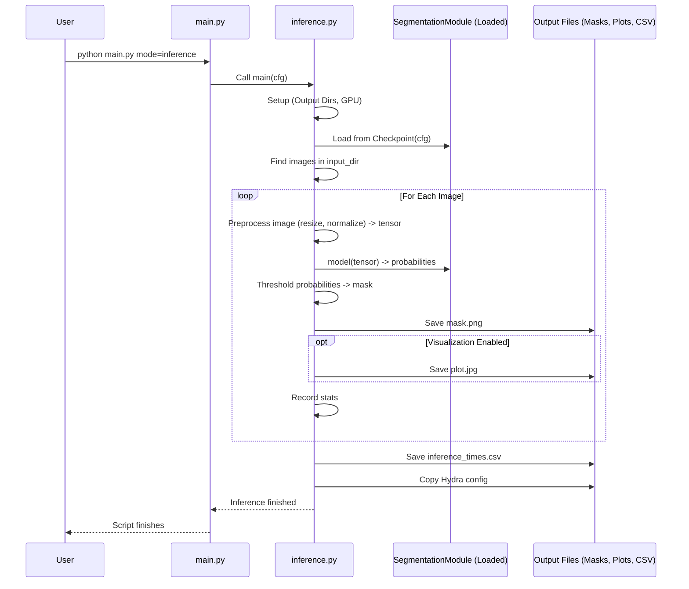

# Chapter 8: Inference Pipeline (`inference.py`)

Congratulations! In [Chapter 7: Training Orchestration (`train.py`)](07_training_orchestration___train_py___.md), you learned how we coached our model, trained it using `pytorch_lightning`, and saved its best version as a checkpoint file (`best.ckpt`). We now have a trained "brain"!

But what's the point of training a model if we can't use it? How do we take this trained brain and apply it to *new* images it hasn't seen before to get useful predictions?

This is exactly what the **Inference Pipeline (`inference.py`)** is for.

## What Problem Does `inference.py` Solve?

Imagine you've spent weeks training a dog (our model) to recognize a specific type of flower (e.g., daisies) in photographs. You've taught it well, and you know it can do the job. Now, a friend gives you a new batch of photos from their garden, and you want the dog to point out all the daisies in *these* photos.

`inference.py` is like the handler who takes the trained dog (our saved model checkpoint), shows it the new photos (input images), and records where the dog indicates the daisies are (generates segmentation masks). It's the "deployment" or "application" stage where the trained model performs its task on new, unseen data.

**Use Case:** You've trained a model to segment grass in images using `train.py`, and it saved the best checkpoint (`best.ckpt`). Now, you have a folder full of new drone images of fields (`data/new_field_images/`), and you want to generate masks showing exactly where the grass is in each of those images. You want to save these masks as image files (e.g., PNGs) in an output folder (`results/grass_masks/`). `inference.py` is the script you use for this.

## Key Concepts

1.  **Trained Model Checkpoint (`best.ckpt`):** This is the file saved at the end of training (Chapter 7). It contains the learned knowledge (the weights or parameters) of our `SegmentationModule`. It's the "trained brain" or the "trained dog."
2.  **Input Images:** A directory containing new images (e.g., `.jpg` files) that the model hasn't been trained on. These are the photos you want to analyze.
3.  **Preprocessing (Getting Ready):** Just like during training, new images need to be prepared before the model can understand them. This usually involves:
    *   **Resizing:** Changing the image dimensions to something the model expects (often done via `cfg.inference.rescale_factor`).
    *   **Normalization:** Adjusting pixel values (e.g., subtracting the mean and dividing by the standard deviation calculated during preprocessing, [Chapter 4: Preprocessing Pipeline (`preprocess.py` & `src/preprocessing/`)](04_preprocessing_pipeline___preprocess_py_____src_preprocessing____.md)) if the model was trained with normalized data (`cfg.inference.use_normalization`).
4.  **Model Prediction (Thinking):** The preprocessed image is fed into the loaded model (`model(image_tensor)`). The model outputs its raw prediction, often as probabilities (scores between 0 and 1 indicating the likelihood of each pixel belonging to the target class, like "grass").
5.  **Thresholding (Making a Decision):** The probability map is usually converted into a definite mask. For binary segmentation (like grass vs. background), we apply a threshold (`cfg.inference.threshold`, e.g., 0.5). Pixels with a probability above the threshold are assigned to the target class (e.g., value 1 for grass), and others are assigned to the background class (e.g., value 0).
6.  **Saving Masks:** The final binary (or multi-class) mask is saved as an image file (like a PNG) in the specified output directory (`cfg.paths.inference_output_dir`).
7.  **Visualization (Optional):** `inference.py` can also create visual outputs for easier checking, like overlaying the predicted mask (often colored) onto the original image (`cfg.inference.plot.overlays: true`) or showing the original image and the mask side-by-side (`cfg.inference.plot.comparisons: true`).

## How to Use `inference.py`

Like training, you run inference using our main project manager, `main.py`.

**Example: Running Inference on New Images**

1.  **Configure:** Check your inference settings, usually in `conf/inference/default.yaml`. Key settings include:
    *   `inference.input_dir`: Path to the folder with your new images.
    *   `inference.version`: Which training version's checkpoint to use (e.g., `0` for `projects/your_project/train/version_0/checkpoints/best.ckpt`).
    *   `inference.threshold`: The probability threshold for creating the binary mask (e.g., `0.5`).
    *   `paths.inference_output_dir`: Where the results (masks, plots) will be saved. This path often includes the version number and current date/time automatically.
    *   `inference.plot.overlays` / `inference.plot.comparisons`: Enable or disable visualizations.

    ```yaml
    # File: conf/inference/default.yaml (Snippet)
    inference_subname: new_field_run # Subfolder for this inference run
    input_dir: ../../data/new_field_images/ # <--- Path to your new images

    version: 0 # <--- Use checkpoint from version_0 training run

    rescale_factor: .5 # Resize images to 50% before feeding to model
    threshold: 0.5     # Probability cutoff
    use_normalization: true # Use mean/std normalization?

    cuda_visible_devices: [0] # Which GPU to use

    plot:
      overlays: true      # Save images with masks overlaid?
      comparisons: false  # Save side-by-side comparison plots?
    ```

2.  **Run:** Open your terminal in the project's root directory and type:

    ```bash
    python main.py mode=inference
    ```
    *   You can override settings directly: `python main.py mode=inference inference.input_dir=path/to/other/images inference.threshold=0.6`

**What Happens?**

1.  `main.py` identifies `mode=inference`.
2.  Hydra loads the configuration, including `conf/inference/default.yaml` and combining it with other defaults (like paths and model structure from the specified training version).
3.  `main.py` calls the `main` function in `src/inference.py`, passing the final `cfg`.
4.  `inference.py` executes:
    *   Sets the GPU (`os.environ['CUDA_VISIBLE_DEVICES']`).
    *   Creates the output directories based on `cfg.paths.inference_output_dir`.
    *   Loads the specified trained model checkpoint (`SegmentationModule.load_from_checkpoint`).
    *   Finds all `.jpg` images in the `cfg.inference.input_dir`.
    *   Loops through each image:
        *   Preprocesses the image (loads, resizes, normalizes) using `ImageProcessor`.
        *   Feeds the preprocessed image tensor to the model to get predictions using `Predictor`.
        *   Applies the threshold to get the final mask.
        *   Saves the mask as a PNG file in the `output/masks` directory.
        *   (Optional) Creates and saves visualizations using `Visualizer`.
    *   Saves a CSV file (`inference_times.csv`) with statistics about the run (like processing time per image).

## Under the Hood: The Inference Workflow

Let's trace the steps inside `inference.py` when it runs:

1.  **Setup:** The script starts, reads the configuration (`cfg`), sets up the GPU, and creates the output directories.
2.  **Load Model:** It finds the `best.ckpt` file from the specified training version (`cfg.inference.version`) and loads the trained `SegmentationModule` from it. This puts the model onto the correct device (GPU or CPU).
3.  **Load Stats:** It loads the dataset `mean` and `std` values saved during preprocessing (from `project_preprocess_dir`) needed for normalization.
4.  **Initialize Helpers:** It creates instances of helper classes:
    *   `ImageProcessor`: Knows how to resize and normalize images based on `cfg.inference`.
    *   `Predictor`: Knows how to run the loaded model and apply the threshold (`cfg.inference.threshold`).
    *   `Visualizer`: Knows how to create overlays and comparison plots based on `cfg.inference.plot`.
5.  **Find Images:** It gets a list of all `.jpg` image file paths from the `cfg.inference.input_dir`.
6.  **Process Loop:** It iterates through each image path in the list:
    *   **Preprocess:** Calls `processor.preprocess(path, device)` to load the image, resize it, normalize it (if enabled), and convert it to a PyTorch tensor ready for the model.
    *   **Predict:** Calls `predictor.predict(tensor, out_classes)` which runs `model(tensor)`, gets the probabilities, applies the threshold, and returns the final mask as a NumPy array.
    *   **Save Mask:** Saves the NumPy mask array as a PNG image file (e.g., `output/masks/image_name.png`). Often, pixel values are scaled (e.g., 0 and 255 for binary masks) for better visibility in standard image viewers.
    *   **Visualize (Optional):** If enabled in the config, calls `visualizer.draw_overlay(path, mask, out_classes)` to create and save plots (e.g., `output/overlays/image_name_overlay.jpg`).
    *   **Record Stats:** Records processing times and other info for this image.
7.  **Save Stats:** After processing all images, saves the collected statistics into `inference_times.csv` in the output directory.
8.  **Copy Config:** Copies the Hydra configuration used for this run into the output directory for reproducibility.

**Visualizing the Flow:**



## Diving Deeper into the Code (`src/inference.py`)

Let's look at simplified snippets focusing on the `InferenceRunner` class.

**1. Initialization and Setup (`InferenceRunner.__init__`, `_load_stats`)**

```python
# File: src/inference.py (Simplified __init__)
import torch
from pathlib import Path
import json
import numpy as np
from omegaconf import DictConfig
# Assume SegmentationModule is correctly imported
from src.utils.model import SegmentationModule

class InferenceRunner:
    def __init__(self, cfg: DictConfig):
        self.cfg = cfg
        # --- Get paths from config ---
        # Path to the trained model checkpoint
        self.model_ckpt = Path(cfg.paths.inference.checkpoints) / "best.ckpt"
        # Path to the folder with new images
        self.image_dir = Path(cfg.inference.input_dir)
        # Base path for saving results
        self.output_dir = Path(cfg.paths.inference_output_dir)
        # Path to where masks will be saved specifically
        self.output_mask_dir = self.output_dir / "masks"
        # Path to where preprocessing stats are stored
        self.project_dir = Path(cfg.paths.project_mode_dir) # e.g., project/train/version_X

        # --- Create output directories ---
        self.output_dir.mkdir(parents=True, exist_ok=True)
        self.output_mask_dir.mkdir(parents=True, exist_ok=True)

        # --- Load normalization stats (mean, std) ---
        self.mean, self.std = self._load_stats()

        # --- Set device (GPU or CPU) ---
        self.device = torch.device("cuda" if torch.cuda.is_available() else "cpu")
        # Number of output classes from the model config
        self.out_classes = cfg.model.out_classes # e.g., 1 for binary

    def _load_stats(self):
        # Tries to load mean/std from the corresponding preprocess run
        stats_file = self.project_dir / "../preprocess/data/data_stats/rgb_mean_std.json" # Go up one level from train dir
        if stats_file.exists():
            with open(stats_file) as f:
                data = json.load(f)
                return np.array(data['mean']), np.array(data['std'])
        # Fallback to default values in inference config if file not found
        log.warning(f"Stats file not found at {stats_file}, using defaults from config.")
        return self.cfg.inference.mean, self.cfg.inference.std
```

*   **Explanation:**
    *   The constructor (`__init__`) takes the Hydra configuration `cfg`.
    *   It sets up all the necessary input and output paths based on the configuration.
    *   It creates the directories where the results will be saved.
    *   `_load_stats` attempts to load the mean and standard deviation values used during training (which were calculated by the `data_stats` task in [Chapter 4: Preprocessing Pipeline (`preprocess.py` & `src/preprocessing/`)](04_preprocessing_pipeline___preprocess_py_____src_preprocessing____.md)). If it can't find them, it uses default values specified in `conf/inference/default.yaml`.
    *   It determines whether to use a GPU (`cuda`) or CPU.

**2. The Main Inference Loop (`InferenceRunner.run`)**

```python
# File: src/inference.py (Simplified run method)
import cv2
import pandas as pd
from tqdm import tqdm
import random
import time
# Assume ImageProcessor, Predictor, Visualizer classes are defined above

class InferenceRunner:
    # ... (__init__ and _load_stats methods) ...

    def run(self):
        # --- 1. Load the trained model ---
        log.info(f"Loading model from: {self.model_ckpt}")
        model = SegmentationModule.load_from_checkpoint(
            checkpoint_path=self.model_ckpt,
            cfg=self.cfg, # Pass config in case model needs it
        ).to(self.device) # Move model to GPU/CPU
        model.eval() # Set model to evaluation mode (disables dropout etc.)

        # --- 2. Initialize helper classes ---
        processor = ImageProcessor(self.mean, self.std, self.cfg.inference.rescale_factor, self.cfg.inference.use_normalization)
        predictor = Predictor(model, self.cfg.inference.threshold)
        visualizer = Visualizer(self.output_dir, self.cfg.inference.plot)

        # --- 3. Find image paths ---
        paths = sorted(self.image_dir.glob("*.jpg"))
        # Optional: Select a random subset for quick testing
        if self.cfg.inference.samplek and len(paths) > self.cfg.inference.samplek:
            paths = random.sample(paths, self.cfg.inference.samplek)
        log.info(f"Found {len(paths)} images to process.")

        stats = [] # List to store timing info
        # --- 4. Loop through images ---
        for path in tqdm(paths, desc="Processing Images"):
            # --- 4a. Preprocess ---
            tensor, orig_size, resc_size, load_t, prep_t = processor.preprocess(path, self.device)
            if tensor is None: continue # Skip if image loading failed

            # --- 4b. Predict ---
            mask, inf_t = predictor.predict(tensor, self.out_classes) # mask is NumPy array

            # --- 4c. Save Mask ---
            # Define where to save the mask image
            mask_path = self.output_mask_dir / f"{path.stem}.png"
            # Scale binary mask (0, 1) to (0, 255) for saving as visible PNG
            save_mask = mask * 255 if self.out_classes == 1 else mask
            cv2.imwrite(str(mask_path), save_mask)

            # --- 4d. Record Stats ---
            stats.append({
                "image_name": path.name, "load_time_s": load_t,
                "preprocess_time_s": prep_t, "inference_time_s": inf_t,
                # ... other stats ...
            })

            # --- 4e. Visualize (Optional) ---
            visualizer.draw_overlay(path, mask, self.out_classes) # Handles checks internally

        # --- 5. Save Stats ---
        pd.DataFrame(stats).to_csv(self.output_dir / "inference_times.csv", index=False)
        log.info(f"Saved all predictions and stats to {self.output_dir}")

        # --- 6. Copy Config (handled outside runner usually) ---
```

*   **Explanation:**
    *   The `run` method orchestrates the inference process.
    *   It loads the model from the specified checkpoint using `SegmentationModule.load_from_checkpoint` and sets it to `eval()` mode.
    *   It initializes the `ImageProcessor`, `Predictor`, and `Visualizer` helpers.
    *   It finds the image files and optionally samples them.
    *   The main loop iterates through each image path (`tqdm` provides a progress bar).
    *   Inside the loop, it calls the `preprocess` and `predict` methods.
    *   It saves the resulting mask using `cv2.imwrite`. Note the scaling `mask * 255` for binary masks to make the output PNG visible (black and white).
    *   It records timing statistics.
    *   It calls the `visualizer` if plotting is enabled.
    *   Finally, it saves the collected statistics to a CSV file.

**3. Helper Class Snippets (Conceptual)**

```python
# File: src/inference.py (Conceptual Helper Classes)

class ImageProcessor:
    def __init__(self, mean, std, rescale_factor, use_normalization):
        # Store settings
        self.mean = np.array(mean)
        self.std = np.array(std)
        self.rescale_factor = rescale_factor
        self.use_normalization = use_normalization

    def preprocess(self, image_path, device):
        # 1. Load image using OpenCV (cv2.imread)
        # 2. Convert color BGR -> RGB (cv2.cvtColor)
        # 3. Resize image based on rescale_factor (cv2.resize), ensuring divisibility by 32
        # 4. Normalize:
        #    - Convert to float and scale to [0, 1] (divide by 255.0)
        #    - If use_normalization is True, subtract self.mean and divide by self.std
        # 5. Transpose from HWC to CHW format (np.transpose)
        # 6. Convert NumPy array to PyTorch tensor (torch.tensor)
        # 7. Add batch dimension (unsqueeze(0)) and move to device (.to(device))
        # 8. Return tensor and timing info
        # ... (Simplified implementation) ...
        image = cv2.imread(str(image_path)) # Step 1
        image = cv2.cvtColor(image, cv2.COLOR_BGR2RGB) # Step 2
        # ... resize, normalize, transpose, tensor conversion ...
        image_tensor = torch.randn(1, 3, 256, 256).to(device) # Dummy tensor
        return image_tensor, (1000,1000), (512,512), 0.1, 0.2 # Dummy return


class Predictor:
    def __init__(self, model, threshold):
        self.model = model # The loaded SegmentationModule
        self.threshold = threshold

    def predict(self, image_tensor, out_classes):
        # --- Ensure model is in eval mode and no gradients are computed ---
        self.model.eval()
        with torch.no_grad():
            # --- Run tensor through the model ---
            logits = self.model(image_tensor) # Step 1: Get raw output

            # --- Convert logits to mask based on mode ---
            if out_classes == 1: # Binary case
                prob = torch.sigmoid(logits) # Step 2: Get probabilities
                # Step 3: Apply threshold and convert to NumPy
                mask = (prob > self.threshold).squeeze().cpu().numpy().astype(np.uint8)
            else: # Multiclass case
                prob = torch.softmax(logits, dim=1)
                mask = torch.argmax(prob, dim=1).squeeze().cpu().numpy()

            # Return final NumPy mask and inference time
            return mask, 0.5 # Dummy time
```

*   **Explanation:**
    *   These classes encapsulate the logic for specific steps.
    *   `ImageProcessor.preprocess` handles loading, resizing, normalizing, and converting the image to a tensor suitable for the model.
    *   `Predictor.predict` runs the model inference (`self.model(image_tensor)`), converts the output logits to probabilities (using `sigmoid` for binary or `softmax` for multiclass), applies the threshold (for binary) or finds the most likely class (`argmax` for multiclass), and returns the final mask as a NumPy array. Using `torch.no_grad()` is crucial during inference to save memory and computation.

## Conclusion

Excellent! You've now learned how the `SemiF-Segmentation` project uses `inference.py` to apply a trained model to new data.

*   `inference.py` acts as the **inference pipeline manager**.
*   It **loads a trained model checkpoint** saved by `train.py`.
*   It processes a directory of **new input images**.
*   It **preprocesses** each image (resize, normalize).
*   It runs the image through the **model** to get predictions.
*   It applies a **threshold** to create final segmentation masks.
*   It **saves** the resulting masks and optionally creates **visualizations**.
*   You control the process via configuration (`conf/inference/default.yaml`) and run it using `python main.py mode=inference`.

This allows you to leverage your trained models to analyze new datasets and generate valuable segmentation results.

We've covered the core workflow from configuration and data handling to training and inference. What if you need to manage data across different storage locations or keep your local data synchronized with a remote server?

Let's move on to the final chapter in this core tutorial: [Chapter 9: File Synchronization (`sync.py`)](09_file_synchronization___sync_py___.md)!

---

Generated by [AI Codebase Knowledge Builder](https://github.com/The-Pocket/Tutorial-Codebase-Knowledge)