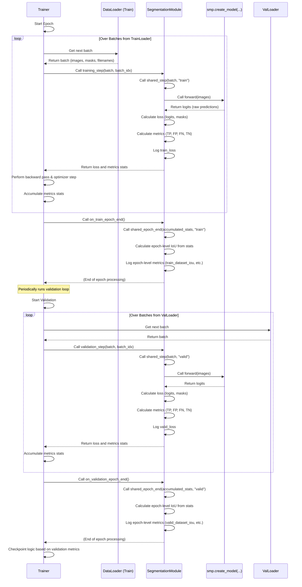

# Chapter 8: Segmentation Model Module (Training/Validation)

Welcome back! In our last chapter, [Dataset Loader](07_dataset_loader_.md), you learned how the `Dataset` and `DataLoader` classes work together to efficiently load, preprocess, and augment your data, getting it ready for the machine learning model.

Now that you have batches of data ready to go, the big question is: what actually *does* the learning? How do we take those images and masks, feed them to a segmentation model, measure how well it did, and adjust the model so it gets better over time?

This is the core of machine learning training, and it's handled by the **Segmentation Model Module**.

## What Problem Does the Module Solve? (The Training Brain)

Training a deep learning model is a complex process. For each batch of data, you need to:

1.  Pass the images through the model to get predictions.
2.  Compare those predictions to the correct masks using a **loss function** to measure the error.
3.  Calculate **performance metrics** (like Intersection over Union or IoU) to understand how well the model is doing from a human perspective.
4.  Use the calculated loss to figure out how much each part of the model contributed to the error (the "backward pass").
5.  Adjust the model's internal numbers (weights) slightly using an **optimizer** to reduce the error for the next batch.
6.  Repeat this for thousands or millions of batches.
7.  Periodically evaluate the model on a separate **validation dataset** to ensure it's learning well and not just memorizing the training data ([Data Augmentation](06_data_augmentation_.md) also helps with this!).
8.  Save the model's progress (checkpoints).
9.  Keep track of all the numbers (loss, metrics) for plotting and analysis.

Doing all of this from scratch can be a lot of work! This is where libraries like **PyTorch Lightning** come in. They provide a structured way to organize your training code, handling much of the boilerplate (like the actual training loop, moving data to the GPU, logging, etc.) so you can focus on the core model logic.

The **Segmentation Model Module** in `SemiF-Segmentation` is the project's specialized brain for training and validation. It uses PyTorch Lightning to wrap a segmentation model and manage all the steps listed above.

## What is the Segmentation Model Module? (Your Structured ML Engine)

The **Segmentation Model Module** is a Python class, specifically `SegmentationModule` located in `src/utils/model.py`. It's built using **PyTorch Lightning**, which means it inherits special abilities and structure that make training much cleaner.

Its main responsibilities are:

1.  **Holding the Model:** It contains the actual segmentation model (like Segformer or DeepLabV3+) built using the `segmentation_models.pytorch` (smp) library.
2.  **Forward Pass:** It defines how an image goes through the model to produce an output (the prediction).
3.  **Loss Calculation:** It determines which loss function to use (based on your configuration) and calculates the error between predictions and ground truth masks.
4.  **Metric Calculation:** It calculates performance metrics like IoU during training and validation.
5.  **Optimizer & Scheduler Setup:** It defines how the model's weights are updated and how the learning rate changes during training.
6.  **Training/Validation Steps:** It contains the specific logic that runs for *each* batch during the training and validation phases, calculating loss and metrics.
7.  **Logging:** It logs the calculated losses and metrics so you can track the training progress.

By putting all this logic into one structured `SegmentationModule`, your main training script (`src/train.py`) becomes much simpler – it just needs to create the module, create the data loaders, and tell the PyTorch Lightning `Trainer` to start training.

## How to Use the Module (Via the Training Script)

You don't directly "run" the `SegmentationModule`. It's a component that is initialized and used by the main **training script**, `src/train.py`.

To start the training process, you use the command you learned in [Chapter 2: Main Task Runner](02_main_task_runner_.md):

```bash
python main.py mode=train
```

When you run this, `main.py` loads the configuration (`cfg`), finds the `train` task in its registry, and calls the `main` function in `src/train.py`. The `src/train.py` script then orchestrates the training run.

A key part of `src/train.py` is creating an instance of the `SegmentationModule` and setting up the PyTorch Lightning `Trainer`:

```python
# --- Snippet from src/train.py ---
# ... imports like hydra, Path, torch, DataLoader, Trainer, ModelCheckpoint ...
from src.utils.model import SegmentationModule # Import our SegmentationModule
# ... other imports for datasets, augmentations, stats, viz ...

@hydra.main(...) # Hydra provides the cfg object
def main(cfg: DictConfig):
    # ... setup logger, directories, load stats, create datasets & dataloaders (as in Ch 7) ...

    # --- Create the Segmentation Model Module ---
    log.info(f"Creating model: {cfg.model.arch_name} with encoder {cfg.model.encoder_name}")
    model = SegmentationModule(cfg) # Initialize the module with the config

    # --- Setup the PyTorch Lightning Trainer ---
    log.info(f"Setting up trainer for {cfg.train.epochs} epochs")
    # Callbacks (like saving the best model) are set up here
    best_checkpoint = ModelCheckpoint(
        dirpath=Path(logger.log_dir, "checkpoints"),
        monitor=cfg.train.callbacks.monitor, # Metric to watch (e.g., valid_dataset_iou)
        mode=cfg.train.callbacks.mode,       # 'max' to save model with highest IoU
        save_top_k=cfg.train.callbacks.save_top_k,
        filename="best",
    )
    last_checkpoint = ModelCheckpoint(
        dirpath=Path(logger.log_dir, "checkpoints"),
        save_last=cfg.train.callbacks.save_last, # Save the model from the final epoch
    )

    trainer = Trainer(
        **cfg.train.trainer, # Pass trainer settings from config (max_epochs, etc.)
        strategy=cfg.train.train_strategy, # Distributed training strategy (ddp, auto)
        callbacks=[best_checkpoint, last_checkpoint], # Add checkpoint callbacks
        logger=logger, # Pass the logger for tracking metrics
        # devices="auto" # or list like [0, 1] handled by CUDA_VISIBLE_DEVICES
    )

    # --- Start the Training Process ---
    log.info("Starting model training...")
    # The trainer uses the model module and the data loaders
    trainer.fit(model, train_loader, val_loader) 
    log.info("Training finished.")

    # ... After training, validate one last time and save the best model ...
    # ... Also includes sample inference visualization using the trained model ...

# ... if __name__ == "__main__": main() ...
```

As you can see, `src/train.py` reads the configuration (`cfg`), uses it to create the `SegmentationModule`, sets up the PyTorch Lightning `Trainer` (including callbacks defined in the config like `ModelCheckpoint`), and then simply calls `trainer.fit(model, train_loader, val_loader)`. This single line kicks off the entire training loop managed by PyTorch Lightning, using the logic defined within our `SegmentationModule` and feeding it data from the `train_loader` and `val_loader` ([Chapter 7: Dataset Loader](07_dataset_loader_.md)).

### Configuration

The behavior of the `SegmentationModule` and the training process is heavily influenced by your configuration files, especially `conf/model/*.yaml` and `conf/train/default.yaml`.

*   **Model Architecture:** Files like `conf/model/segformer.yaml` or `conf/model/deeplabv3plus.yaml` define *which* model from `segmentation_models.pytorch` is used, its encoder (the base network like ResNet152), whether to use pretrained weights (`encoder_weights`), and the number of input/output channels/classes. The `SegmentationModule` reads these settings from `cfg.model`.

    ```yaml
    # --- Snippet from conf/model/segformer.yaml ---
    arch_name: Segformer         # Which architecture (used by smp.create_model)
    encoder_name: resnet152      # The backbone network
    encoder_weights: imagenet    # Start from weights trained on ImageNet
    in_channels: 3               # RGB images have 3 channels
    out_classes: ${train.out_classes} # Number of output classes (read from train config)
    mode: ${train.class_mode}    # 'binary' or 'multiclass' (read from train config)
    ignore_index: null           # Pixel value to ignore in loss/metrics
    ```

*   **Loss Function:** `conf/train/default.yaml` specifies which loss function to use (`cfg.train.loss.name`). The `SegmentationModule`'s `configure_loss` method uses this to select or combine appropriate loss functions.

    ```yaml
    # --- Snippet from conf/train/default.yaml ---
    loss:
      name: smpDiceLoss # Options like smpDiceLoss, DiceBCELoss, etc.
    ```

*   **Optimizer and Learning Rate:** `conf/train/default.yaml` also defines the base learning rate (`cfg.train.lr.base_lr`). The `SegmentationModule`'s `configure_optimizers` method sets up the optimizer (Adam) and a learning rate scheduler (OneCycleLR) based on this. Different parts of the model (encoder, decoder, head) can even have different learning rates.

    ```yaml
    # --- Snippet from conf/train/default.yaml ---
    lr:
      base_lr: 0.001 # The base learning rate
    ```

*   **Training Parameters:** Settings like `epochs`, `batch_size`, `train_strategy`, `cuda_visible_devices`, and `dataset` workers are defined here. `batch_size` and `dataset.workers` are used when creating the `DataLoader`s ([Chapter 7](07_dataset_loader_.md)), while `epochs` and `train_strategy` are passed to the PyTorch Lightning `Trainer` via the `cfg.train.trainer` section.

    ```yaml
    # --- Snippet from conf/train/default.yaml ---
    epochs: 50          # Max number of epochs (used by Trainer)
    batch_size: 4       # Batch size (used by DataLoaders)
    train_strategy: ddp # Distributed training strategy (used by Trainer)

    trainer: # Settings passed directly to PyTorch Lightning Trainer
      max_epochs: ${train.epochs}
      # ... other trainer settings ...
    ```

By modifying these configuration values, you can control the model architecture, how it's trained, and what metrics are tracked, without changing the core Python code of the `SegmentationModule` itself.

## How the Segmentation Model Module Works Under the Hood

Let's peek inside the `SegmentationModule` class in `src/utils/model.py` to see how it uses PyTorch Lightning to manage the training and validation loops.

When you call `trainer.fit(model, train_loader, val_loader)` in `src/train.py`, the PyTorch Lightning `Trainer` takes control. It will:

1.  Loop through epochs (up to `cfg.train.epochs`).
2.  For each epoch, it will get batches from the `train_loader`.
3.  For each training batch, it calls `model.training_step(batch, batch_idx)`.
4.  It performs the backward pass and updates weights.
5.  Periodically (or at the end of the epoch), it gets batches from the `val_loader`.
6.  For each validation batch, it calls `model.validation_step(batch, batch_idx)`.
7.  At the end of the training or validation epoch, it calls `model.on_train_epoch_end()` or `model.on_validation_epoch_end()`.
8.  It handles logging metrics recorded during these steps.

The `SegmentationModule` defines the logic for these specific methods expected by PyTorch Lightning.

Here's a simplified sequence of events during one training epoch:



Let's look at simplified code snippets from `src/utils/model.py` to see how this logic is implemented.

**1. Module Initialization (`__init__`)**

This sets up the model and other necessary components based on the config.

```python
# --- Snippet from src/utils/model.py ---
import pytorch_lightning as pl
import segmentation_models_pytorch as smp
import torch
from omegaconf import DictConfig # For type hinting

class SegmentationModule(pl.LightningModule): # Inherits from PyTorch Lightning Module
    def __init__(self, cfg: DictConfig, **kwargs):
        super().__init__()
        self.cfg = cfg # Store the full configuration
        
        # --- Get model settings from config ---
        self.arch_name = cfg.model.arch_name
        self.encoder_name = cfg.model.encoder_name
        self.encoder_weights = cfg.model.encoder_weights
        self.in_channels = cfg.model.in_channels
        self.out_classes = cfg.model.out_classes
        self.mode = cfg.model.mode # binary or multiclass
        self.ignore_index = cfg.model.ignore_index
        
        # --- Create the segmentation model ---
        self.model = smp.create_model(
            self.arch_name,
            encoder_name=self.encoder_name,
            encoder_weights=self.encoder_weights,
            in_channels=self.in_channels,
            classes=self.out_classes,
            # Add any other specific model args from config if needed
            **kwargs, # Allow passing extra arguments
        )

        # --- Setup loss function ---
        self.loss_strategy = cfg.train.loss.name # Get loss name from train config
        self.loss_fn = self.configure_loss() # Helper method to build the loss function

        # --- Setup metrics (PyTorch Lightning automatically handles aggregation) ---
        # We will calculate metrics (TP, FP, FN, TN) manually in shared_step
        # and aggregate/compute IoU in shared_epoch_end
        
        # Threshold for binary predictions (e.g., pixel > 0.5 probability is class 1)
        self.threshold = 0.5 

        # Store outputs from steps for epoch end aggregation
        self.training_step_outputs = []
        self.validation_step_outputs = []

    # ... configure_loss, configure_optimizers, forward, shared_step, etc. methods below ...
```

The `__init__` method reads the model and training configuration. It uses `smp.create_model` to build the actual neural network based on the specified architecture and encoder. It also calls `configure_loss` to set up the loss function and prepares for metric tracking.

**2. Loss Configuration (`configure_loss`)**

This method selects and creates the appropriate loss function object based on the `loss.name` and `class_mode` settings in your configuration.

```python
# --- Snippet from src/utils/model.py ---
# ... __init__ method above ...
import segmentation_models_pytorch.losses as smp_losses # Import loss functions
import torch.nn as nn # For CrossEntropyLoss
import torch.nn.functional as F # For BCEWithLogitsLoss

    def configure_loss(self):
        """
        Configures the loss function based on the mode (binary or multiclass) and name from config.
        """
        loss_name = self.cfg.train.loss.name

        if self.mode == "binary":
            # Return the chosen loss function for binary mode
            if loss_name == "smpDiceLoss":
                # segmentation_models.pytorch's Dice Loss
                return smp_losses.DiceLoss(smp_losses.BINARY_MODE, from_logits=True, ignore_index=self.ignore_index)
            elif loss_name == "DiceBCELoss":
                 # Custom Dice + BCE loss
                return DiceBCELoss() # Referencing a custom class defined in this file
            elif loss_name == "DiceWithBoundaryLoss":
                 # Custom Dice + Boundary loss
                return DiceWithBoundaryLoss(boundary_weight=0.2) # Referencing another custom class
            # ... add other binary loss options ...

        elif self.mode == "multiclass":
             # Return the chosen loss function for multiclass mode
            if loss_name == "DiceCrossEntropy":
                # Combine smp Dice Loss and PyTorch Cross Entropy Loss
                dice = smp_losses.DiceLoss(smp_losses.MULTICLASS_MODE, from_logits=True, ignore_index=self.ignore_index)
                ce = nn.CrossEntropyLoss(ignore_index=self.ignore_index) # PyTorch's CE Loss
                # Return a function that computes the combined loss
                return lambda logits, targets: 0.5 * dice(logits, targets) + 0.5 * ce(logits, targets)
            elif loss_name == "smpDiceLoss":
                 # Just smp Dice Loss for multiclass
                return smp_losses.DiceLoss(smp_losses.MULTICLASS_MODE, from_logits=True, ignore_index=self.ignore_index)
            # ... add other multiclass loss options ...

        else:
            raise ValueError(f"Invalid mode: {self.mode}. Choose 'binary' or 'multiclass'.")
        
    # ... configure_optimizers, forward, shared_step, etc. methods below ...

# Custom loss classes like DiceBCELoss and DiceWithBoundaryLoss are defined here
# ... Example DiceBCELoss ...
class DiceBCELoss(torch.nn.Module):
    def __init__(self, smooth=1.0):
        super().__init__()
        self.smooth = smooth # Used in manual Dice calculation

    def forward(self, logits, targets):
        # Compute Binary Cross Entropy with logits
        bce_loss = F.binary_cross_entropy_with_logits(logits, targets.float())

        # Compute Dice Loss manually for binary case
        probs = torch.sigmoid(logits) # Convert logits to probabilities [0, 1]
        probs = probs.view(-1)       # Flatten tensors
        targets = targets.view(-1)

        intersection = (probs * targets).sum()
        dice_loss = 1 - (2. * intersection + self.smooth) / (probs.sum() + targets.sum() + self.smooth)

        # Combine BCE and Dice
        return 0.5 * bce_loss + 0.5 * dice_loss
```

This method dynamically creates the loss function object(s) needed. It handles both binary and multiclass cases and allows combining different losses (like Dice and Cross Entropy). The custom loss classes (`DiceBCELoss`, `DiceWithBoundaryLoss`) are also defined within `src/utils/model.py`.

**3. Optimizer Configuration (`configure_optimizers`)**

This method sets up the optimizer (how the model updates its weights) and optionally a learning rate scheduler (how the learning rate changes over time).

```python
# --- Snippet from src/utils/model.py ---
# ... configure_loss method above ...
import torch.optim as optim
from torch.optim.lr_scheduler import OneCycleLR

    def configure_optimizers(self):
        # Set different learning rates for different parts of the model
        # Encoder learns features, often benefit from smaller LR or different schedule
        # Decoder and head are task-specific layers
        encoder_lr = self.cfg.train.lr.base_lr * 0.1 # Encoder LR is 1/10th of base
        decoder_lr = self.cfg.train.lr.base_lr       # Decoder LR is base LR
        head_lr = self.cfg.train.lr.base_lr          # Head LR is base LR

        # Define parameter groups for the optimizer
        params = [
            {"params": self.model.encoder.parameters(), "lr": encoder_lr},
            {"params": self.model.decoder.parameters(), "lr": decoder_lr},
        ]
        # Add segmentation head parameters if the model has one (most SMP models do)
        if hasattr(self.model, 'segmentation_head'):
             params.append({"params": self.model.segmentation_head.parameters(), "lr": head_lr})

        # Create the Adam optimizer
        optimizer = optim.Adam(params)

        # Create a learning rate scheduler (OneCycleLR is common and effective)
        scheduler = OneCycleLR(
            optimizer,
            max_lr=[encoder_lr * 10, decoder_lr * 10, head_lr * 10], # Max LR for each param group
            epochs=self.trainer.max_epochs, # Total epochs from Trainer
            steps_per_epoch=self.trainer.estimated_stepping_batches, # Batches per epoch
        )

        # Return the optimizer and scheduler info for PyTorch Lightning
        return {
            "optimizer": optimizer,
            "lr_scheduler": {
                "scheduler": scheduler,
                "interval": "step", # Update scheduler every step
                "frequency": 1
                }
            }

    # ... forward, shared_step, etc. methods below ...
```

This method tells PyTorch Lightning which optimizer and scheduler to use. It sets up the Adam optimizer and the OneCycleLR scheduler, which adjusts the learning rates over the course of training based on the total number of training steps (`epochs * steps_per_epoch`). It also demonstrates using different learning rates for different parts of the model (encoder vs. decoder/head), which is a common practice.

**4. Forward Pass (`forward`)**

This is the simplest method. It just defines how input (`image`) is passed through the underlying model (`self.model`).

```python
# --- Snippet from src/utils/model.py ---
# ... configure_optimizers method above ...

    def forward(self, image: torch.Tensor) -> torch.Tensor:
        """
        Defines the forward pass of the model.
        Takes an image tensor and returns raw model outputs (logits).
        """
        # Pass the input image through the actual segmentation model
        return self.model(image)

    # ... shared_step, etc. methods below ...
```

When the `Trainer` needs to run a batch through the model, it calls this `forward` method.

**5. Shared Step Logic (`shared_step`)**

This method contains the core logic for processing a *single* batch, used by both training and validation steps.

```python
# --- Snippet from src/utils/model.py ---
# ... forward method above ...
import segmentation_models_pytorch.metrics as smp_metrics # For metrics
import torch.nn.functional as F # For activation functions (sigmoid, softmax)

    def shared_step(self, batch, stage: str):
        """
        Processes a single batch (used by training_step and validation_step).
        Calculates loss and performance metrics (TP, FP, FN, TN).
        """
        images, masks, _ = batch # Unpack the batch (image, mask, filename stem)
        masks = masks.long() # Ensure mask tensor is long type (required for many losses/metrics)
        
        # Adjust mask shape if necessary for multiclass (sometimes DataLoader adds a channel)
        if self.mode == "multiclass" and masks.ndim == 4 and masks.shape[1] == 1:
            masks = masks.squeeze(1)  # Remove the channel dimension (B, 1, H, W) -> (B, H, W)
        
        # --- Forward pass: get model predictions ---
        logits = self.forward(images) # Call the forward method

        # --- Calculate the loss ---
        loss = self.loss_fn(logits, masks)

        # --- Calculate metrics (TP, FP, FN, TN) ---
        # Convert raw logits to predicted class IDs
        if self.mode == "binary":
            # For binary, use sigmoid activation and a threshold (e.g., 0.5)
            prob_masks = torch.sigmoid(logits) # Convert logits to probabilities [0, 1]
            pred_masks = (prob_masks > self.threshold).long() # Get class IDs (0 or 1)
        elif self.mode == "multiclass":
            # For multiclass, use softmax activation and take the highest probability class
            prob_masks = torch.softmax(logits, dim=1) # Convert logits to probabilities for each class
            pred_masks = prob_masks.argmax(keepdim=True, dim=1) # Get the class ID with max prob
        
        # Calculate True Positives, False Positives, False Negatives, True Negatives
        # Note: Using a patched version of smp.metrics.get_stats for determinism
        tp, fp, fn, tn = smp_metrics.get_stats(pred_masks, masks, mode=self.mode, num_classes=self.out_classes)
        
        # Return the results needed for logging and aggregation
        return {"loss": loss, "tp": tp, "fp": fp, "fn": fn, "tn": tn}

    # ... training_step, validation_step, shared_epoch_end methods below ...

```

This is where the core per-batch computation happens. It gets the image and mask, runs the model (`self.forward`), calculates the loss using the configured `self.loss_fn`, and then calculates the crucial metrics needed for IoU (True Positives, False Positives, False Negatives, True Negatives) using a helper function (`smp_metrics.get_stats`, which is slightly customized in this project for consistency). It returns the calculated loss and metric components.

**6. Training and Validation Steps (`training_step`, `validation_step`)**

These are the methods PyTorch Lightning specifically calls. They typically just call the `shared_step` and log the loss.

```python
# --- Snippet from src/utils/model.py ---
# ... shared_step method above ...

    def training_step(self, batch, batch_idx):
        """PyTorch Lightning hook: Logic for a single training step (batch)."""
        # Call the shared logic
        result = self.shared_step(batch, "train")
        # Log the training loss for this batch (optional, can log on epoch end too)
        self.log("train_loss", result["loss"], on_step=False, on_epoch=True, prog_bar=True)
        self.training_step_outputs.append(result) # Store results for epoch end
        return result

    def validation_step(self, batch, batch_idx):
        """PyTorch Lightning hook: Logic for a single validation step (batch)."""
        # Call the shared logic
        result = self.shared_step(batch, "valid")
        # Log the validation loss
        self.log("valid_loss", result["loss"], on_step=False, on_epoch=True, prog_bar=True)
        self.validation_step_outputs.append(result) # Store results for epoch end
        return result

    # ... on_train_epoch_end, on_validation_epoch_end, shared_epoch_end methods below ...
```

These methods are thin wrappers around `shared_step`. PyTorch Lightning runs `training_step` within a training loop and `validation_step` within a validation loop.

**7. Shared Epoch End Logic (`shared_epoch_end`)**

After the `Trainer` has called `training_step` or `validation_step` for all batches in an epoch, it gathers the results returned by these steps and passes them to the corresponding `on_..._epoch_end` method, which then calls this `shared_epoch_end` method. This is where metrics like IoU are calculated over the *entire* epoch's data.

```python
# --- Snippet from src/utils/model.py ---
# ... training_step, validation_step methods above ...

    def shared_epoch_end(self, outputs: list[dict], stage: str):
        """
        Aggregates results from all steps in an epoch and calculates metrics (IoU).
        Used by on_train_epoch_end and on_validation_epoch_end.
        """
        # Concatenate the TP, FP, FN, TN results from all batches in the epoch
        tp = torch.cat([x["tp"] for x in outputs]) # tp is (BatchSize, Classes) for each step
        fp = torch.cat([x["fp"] for x in outputs])
        fn = torch.cat([x["fn"] for x in outputs])
        tn = torch.cat([x["tn"] for x in outputs])

        # Calculate IoU metrics using segmentation_models.pytorch's function
        # 'micro-imagewise' calculates IoU for each image, then averages
        per_image_iou = smp_metrics.iou_score(tp, fp, fn, tn, reduction="micro-imagewise")
        # 'micro' calculates total TP/FP/FN over the dataset, then computes one IoU
        dataset_iou = smp_metrics.iou_score(tp, fp, fn, tn, reduction="micro")

        # Log the calculated epoch-level metrics
        self.log(f"{stage}_per_image_iou", per_image_iou, on_epoch=True, prog_bar=False)
        self.log(f"{stage}_dataset_iou", dataset_iou, on_epoch=True, prog_bar=True)

        # Optionally compute and log per-class IoU for multiclass mode
        if self.mode == "multiclass":
            class_iou = self.compute_classwise_iou(tp, fp, fn, tn) # Custom helper
            for idx, iou in enumerate(class_iou):
                self.log(f"{stage}_class_{idx}_iou", iou.item(), on_epoch=True, prog_bar=False)
                
        # Clear the collected step outputs for the next epoch
        if stage == "train":
             self.training_step_outputs.clear()
        elif stage == "valid":
             self.validation_step_outputs.clear()


    # ... on_train_epoch_end, on_validation_epoch_end, test methods, save_model ...

```

This method receives the aggregated TP, FP, FN, TN tensors from all steps of the epoch. It then uses these to compute the overall IoU for the epoch using `smp_metrics.iou_score`. Two common ways to calculate average IoU are shown: `micro-imagewise` (average IoU per image) and `micro` (IoU calculated globally over the dataset). These metrics are then logged using `self.log`, which PyTorch Lightning automatically handles saving to the logger configured in `src/train.py` (like the CSVLogger).

By implementing these structured methods (`__init__`, `configure_loss`, `configure_optimizers`, `forward`, `shared_step`, `training_step`, `validation_step`, `shared_epoch_end`, `on_train_epoch_end`, `on_validation_epoch_end`), the `SegmentationModule` provides PyTorch Lightning with everything it needs to run the full training and validation process defined by your configuration, making the training code organized and scalable.

The `src/train.py` script then uses this module and the data loaders, along with the PyTorch Lightning `Trainer` and callbacks, to execute the training run, handle logging, save checkpoints, and even perform some sample inference visualizations after training is complete (as shown in the full `src/train.py` snippet).

## Conclusion

You've learned that the **Segmentation Model Module** (`SegmentationModule` in `src/utils/model.py`) is the central component for training and validating segmentation models in `SemiF-Segmentation`. Built using PyTorch Lightning, it provides a structured way to define the model architecture, forward pass, loss calculation, metric computation, optimizer setup, and the per-batch and per-epoch logic for training and validation. Your configuration files (`conf/model/*.yaml`, `conf/train/default.yaml`) dictate the specifics of the model, loss, and training process, which the module reads via the `cfg` object. The `src/train.py` script uses this module, along with data loaders and the PyTorch Lightning `Trainer`, to execute the complete training workflow.

Now that you know how to train a model, the next step is to see how to use that trained model to make predictions on new, unseen images.

[Next Chapter: Inference Pipeline](09_inference_pipeline_.md)

---

Generated by [AI Codebase Knowledge Builder](https://github.com/The-Pocket/Tutorial-Codebase-Knowledge)