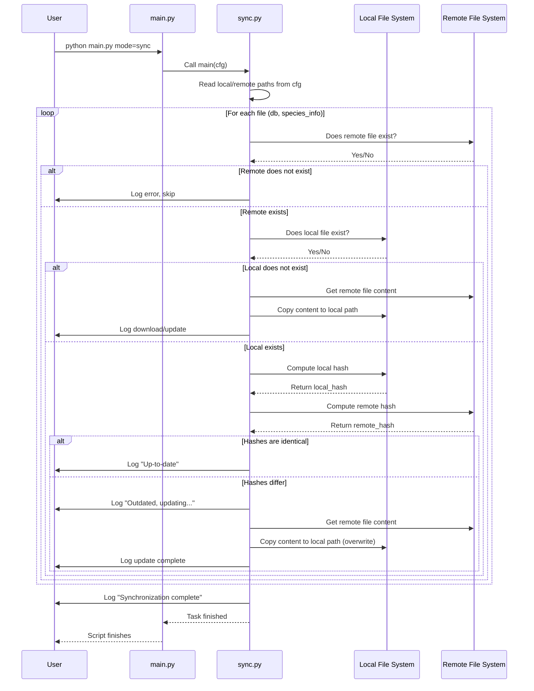

# Chapter 9: File Synchronization (`sync.py`)

Welcome to the final chapter of our core tutorial! In [Chapter 8: Inference Pipeline (`inference.py`)](08_inference_pipeline___inference_py___.md), we learned how to use our trained model to make predictions on new images. We've covered the entire workflow from setting up the project to getting results.

But what happens when essential project resources, like the main database or critical metadata files, are updated? How do you make sure your local copy is always the latest version, especially if these files are stored in a shared location used by multiple people?

This is where the `sync.py` utility comes in handy.

## What Problem Does `sync.py` Solve?

Imagine you're part of a team working on a shared document stored on a company server. Someone updates the master document on the server, but you're still working with an older copy you downloaded last week. Your work might become inconsistent or based on outdated information!

`sync.py` solves a similar problem for our project. We have crucial files, like the plant image database (`agir.db`) and the species information file (`species_info.json`), that might be stored in a central, shared location (like a network drive or cloud storage). These files might get updated occasionally. `sync.py` ensures that your *local* copies of these files match the *master* versions in the shared location.

Think of `sync.py` as a helpful **Document Checker**. It automatically compares your local files with the master copies and downloads the latest version if yours is missing or outdated.

**Use Case:** Let's say a new team member joins the project, or you set up the project on a new computer. You need the most current version of the `agir.db` database and the `species_info.json` file to run queries or preprocessing correctly. Instead of manually finding and downloading these files, you can simply run the `sync.py` utility. It will check the shared location (defined in the configuration) and download the necessary files to your local machine, ensuring you start with the correct, up-to-date resources.

## Key Concepts

1.  **Shared Files:** These are the essential files used across the project that might be updated centrally. In `SemiF-Segmentation`, the key shared files are typically:
    *   `agir.db`: The main database containing information about image cutouts ([Chapter 3: Data Querying & Sampling (`query.py`)](03_data_querying___sampling___query_py___.md)).
    *   `species_info.json`: A file containing details about different plant species.
2.  **Local Copy:** The version of a shared file stored on your own computer (in the paths defined by your configuration, e.g., within `data/db/`).
3.  **Remote Master Copy:** The official, up-to-date version of the file stored in a shared location (like `/mnt/research-projects/...` or a cloud path), also defined in the configuration.
4.  **File Hash (Fingerprint):** How does the Document Checker know if files are different without reading the whole thing? It calculates a "hash" for each file. A hash is a unique, short string of characters (like a fingerprint) generated based on the file's content. If two files have *exactly* the same content, they will have the *exact same* hash. If even one byte changes, the hash will be completely different. Comparing hashes is a very fast way to check if files are identical. `sync.py` uses the SHA-256 hashing algorithm.
5.  **Synchronization:** The process performed by `sync.py`:
    *   Find the paths to the local and remote files from the configuration.
    *   Check if the files exist.
    *   If the local file is missing, copy the remote file to the local path.
    *   If both exist, calculate the hash for both.
    *   If the hashes don't match, copy the remote file to the local path, overwriting the old local version.

## How to Use `sync.py`

Using the synchronization utility is very simple, thanks to our [Chapter 1: Task Orchestration (`main.py`)](01_task_orchestration___main_py___.md).

**Example: Running File Synchronization**

1.  **Configure:** Ensure your configuration files (`conf/paths/default.yaml`) correctly specify the paths to *both* your intended local storage and the remote master storage for the key files. Hydra needs to know where to find both versions!

    ```yaml
    # File: conf/paths/default.yaml (Relevant Snippet)
    # --- Local Paths (Where files should be on your machine) ---
    db:
      db_dir: ${paths.data_dir}/db
      db_file: ${paths.db.db_dir}/agir.db # Local DB path

    semif_utils_dir: ${paths.data_dir}/semifield-utils
    species_info_dir: ${paths.semif_utils_dir}/species_information
    species_info_file: ${paths.species_info_dir}/species_info.json # Local species info path

    # --- Remote Master Paths (Where the official copies are stored) ---
    tertiary_storage: /mnt/research-projects/s/screberg/longterm_images2 # Example shared drive path
    db:
      lts_db_file: ${paths.tertiary_storage}/semifield-database/agir.db # Remote DB path

    species_info:
      lts_species_info: ${paths.tertiary_storage}/semifield-utils/species_information/species_info.json # Remote species info path
    ```
    *   **Explanation:** This config tells `sync.py` where your local `agir.db` *should* be (`paths.db.db_file`) and where the master version *is* (`paths.db.lts_db_file`). It does the same for `species_info.json`.

2.  **Run:** Open your terminal in the project's root directory and type:

    ```bash
    python main.py mode=sync
    ```

**What Happens?**

1.  `main.py` sees `mode=sync`.
2.  Hydra loads the configuration, including the paths defined in `conf/paths/default.yaml`.
3.  `main.py` calls the `main` function in `src/sync.py`, passing the configuration (`cfg`).
4.  `sync.py` starts its checks:
    *   It looks at the `db` file: Does the remote file exist? Does the local file exist? If local is missing, it copies the remote file over. If both exist, it calculates and compares their hashes. If hashes differ, it copies the remote file over the local one.
    *   It repeats the same process for the `species_info` file.
5.  You will see log messages in your terminal indicating whether files were already up-to-date or if they were updated.
6.  After the script finishes, you can be confident that your local `agir.db` and `species_info.json` files match the master copies specified in the configuration.

## Under the Hood: The Document Checker's Process

Let's trace the steps `sync.py` takes when you run `python main.py mode=sync`:

1.  **Read Config:** The script gets the configuration object `cfg` containing all paths (local and remote for `db` and `species_info`).
2.  **Check File Pair (`db`):**
    *   Gets the local path (`cfg.paths.db.db_file`) and remote path (`cfg.paths.db.lts_db_file`).
    *   **Remote Exists?** Checks if the remote file actually exists. If not, logs an error and skips this file.
    *   **Local Exists?** Checks if the local file exists.
    *   **Scenario A: Local Missing:** If the local file doesn't exist, it calls `update_file` to copy the remote file to the local path.
    *   **Scenario B: Local Exists:** If the local file exists, it calls `files_are_identical`.
        *   `files_are_identical` calls `compute_file_hash` for the local file.
        *   `files_are_identical` calls `compute_file_hash` for the remote file.
        *   It compares the two hashes.
        *   If hashes are the same, logs "Local file is up-to-date."
        *   If hashes are different, logs "Local ... is outdated..." and calls `update_file` to copy the remote file over the local one.
3.  **Check File Pair (`species_info`):** Repeats Step 2 for the `species_info.json` file using its respective local and remote paths from `cfg`.
4.  **Completion:** Logs "File synchronization complete."

**Visualizing the Flow:**



## Diving Deeper into the Code (`src/sync.py`)

Let's look at the key functions within `sync.py`.

**1. Computing the File Hash (`compute_file_hash`)**

```python
# File: src/sync.py (Simplified compute_file_hash)
import hashlib
from pathlib import Path

def compute_file_hash(filepath: Path, chunk_size: int = 65536) -> str:
    """Compute SHA-256 hash for a file."""
    hash_func = hashlib.sha256() # Initialize the hashing algorithm
    # Open the file in binary read mode ('rb')
    with filepath.open("rb") as f:
        # Read the file in chunks to handle large files efficiently
        for chunk in iter(lambda: f.read(chunk_size), b""):
            hash_func.update(chunk) # Update the hash with the current chunk
    # Return the final hash as a hexadecimal string
    return hash_func.hexdigest()
```

*   **Explanation:** This function takes a file path, opens the file, reads it piece by piece (in chunks), and feeds each piece into the SHA-256 algorithm. Finally, it returns the calculated hash (fingerprint) as a string of text characters. Reading in chunks prevents loading massive files entirely into memory.

**2. Comparing Files (`files_are_identical`)**

```python
# File: src/sync.py (Simplified files_are_identical)
import logging
log = logging.getLogger(__name__)

def files_are_identical(local_file: Path, remote_file: Path) -> bool:
    """Compare hash of local and remote files."""
    # First, basic check: do both files actually exist?
    if not local_file.exists() or not remote_file.exists():
        log.error(f"Missing file: {local_file} or {remote_file}")
        return False # Cannot compare if one is missing

    # Calculate hash for the local file
    local_hash = compute_file_hash(local_file)
    # Calculate hash for the remote file
    remote_hash = compute_file_hash(remote_file)

    # Return True if the hashes match, False otherwise
    return local_hash == remote_hash
```

*   **Explanation:** This function takes the paths to the local and remote files. It first checks if both files exist. If they do, it calls `compute_file_hash` for each and returns `True` only if the resulting hashes are identical.

**3. Updating the Local File (`update_file`)**

```python
# File: src/sync.py (Simplified update_file)
import shutil # Standard Python library for file operations

def update_file(local_file: Path, remote_file: Path):
    """Replace the local file with the remote file."""
    try:
        log.info(f"Updating {local_file} from {remote_file}")
        # Ensure the directory for the local file exists
        local_file.parent.mkdir(parents=True, exist_ok=True)
        # Copy the remote file to the local path.
        # copy2 also tries to preserve metadata like modification time.
        shutil.copy2(remote_file, local_file)
        log.info(f"Update complete: {local_file}")
    except Exception as e: # Catch potential errors during copy
        log.error(f"Failed to update {local_file}: {e}")
```

*   **Explanation:** This function handles the actual copying. It first makes sure the destination directory exists. Then, it uses `shutil.copy2` (a reliable way to copy files in Python) to copy the `remote_file` to the `local_file` path, replacing the old local file if it existed.

**4. The Main Logic (`main`)**

```python
# File: src/sync.py (Simplified main function)
import hydra
from omegaconf import DictConfig

@hydra.main(version_base="1.3", config_path="../conf", config_name="config")
def main(cfg: DictConfig) -> None:
    """Checks and updates local files based on remote versions."""
    log.info("Starting file synchronization...")

    # Define the pairs of files to check using paths from the config
    files_to_sync = {
        "db": {
            "local": Path(cfg.paths.db.db_file),         # Local DB path
            "remote": Path(cfg.paths.db.lts_db_file),     # Remote DB path
        },
        "species_info": {
            "local": Path(cfg.paths.species_info_file), # Local species info path
            "remote": Path(cfg.paths.lts_species_info),  # Remote species info path
        }
        # Can add more file pairs here if needed
    }

    try:
        # Loop through each defined file pair (db, species_info)
        for name, paths in files_to_sync.items():
            local_path = paths["local"]
            remote_path = paths["remote"]

            # Check 1: Does the remote master file exist?
            if not remote_path.exists():
                log.error(f"Remote file {remote_path} does not exist, skipping '{name}'.")
                continue # Move to the next file pair

            # Check 2: Does the local file exist?
            if not local_path.exists():
                log.warning(f"Local file {local_path} does not exist. Downloading...")
                update_file(local_path, remote_path) # Download if missing
                continue # Move to the next file pair

            # Check 3: If both exist, are they identical?
            log.info(f"Comparing '{name}' files: {local_path} vs {remote_path}")
            if files_are_identical(local_path, remote_path):
                log.info(f"'{name}': Local file is up-to-date.")
            else:
                log.warning(f"Local '{name}' is outdated or different. Updating...")
                update_file(local_path, remote_path) # Update if different

    except Exception as e: # Catch any unexpected errors during the process
        log.error(f"An error occurred while syncing files: {e}")
        raise

    log.info("File synchronization complete.")
```

*   **Explanation:**
    *   The `@hydra.main` decorator ensures this function receives the configuration `cfg`.
    *   It defines a dictionary `files_to_sync` mapping a logical name (like `"db"`) to the local and remote file paths read directly from the `cfg` object (using `cfg.paths...`).
    *   It then loops through this dictionary. For each file pair, it performs the checks described in the "Under the Hood" section: remote exists? local exists? hashes identical? It calls `update_file` when necessary.

## Conclusion

Congratulations on completing the core `SemiF-Segmentation` tutorial! You've now learned about the handy `sync.py` utility.

*   It acts like a **Document Checker**, ensuring your local copies of essential shared files (like `agir.db` and `species_info.json`) are consistent with the master versions.
*   It uses **file hashes (fingerprints)** for efficient comparison.
*   If a local file is missing or outdated, it **automatically downloads** the correct version from the remote location specified in your configuration.
*   You run it easily via `python main.py mode=sync`.

This utility helps maintain consistency across different users and environments, ensuring everyone is working with the same, up-to-date base information.

You've now seen the full pipeline: configuring the project with Hydra, querying data, preprocessing it, setting up data loaders and augmentations, defining the model, training it, running inference, and finally, ensuring your core resources are synchronized. You have a solid foundation for understanding and using the `SemiF-Segmentation` project!

---

Generated by [AI Codebase Knowledge Builder](https://github.com/The-Pocket/Tutorial-Codebase-Knowledge)