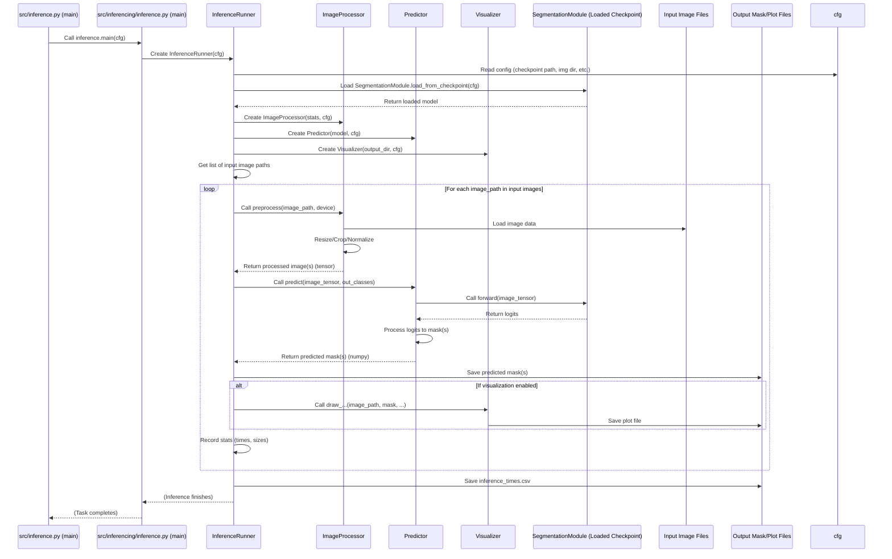

# Chapter 9: Inference Pipeline

Welcome back! In our last chapter, [Segmentation Model Module (Training/Validation)](08_segmentation_model_module__training_validation__.md), you learned how the `SegmentationModule` uses PyTorch Lightning to manage the complex process of training your segmentation model, using data delivered by the [Dataset Loader](07_dataset_loader_.md).

After investing time and computing power to train a great model, the goal is to use that trained model to actually segment **new, unseen images**. You have a skilled "worker" (your trained model) ready to apply its knowledge. How do you give it new images and get the segmentation masks back?

This is the job of the **Inference Pipeline**.

## What Problem Does the Inference Pipeline Solve? (Applying Your Trained Model)

Imagine you have a trained model that's great at finding plants in images. Now, you have a new folder full of thousands of images you've never shown the model before. Your task is to get a segmentation mask for *each* of these new images, showing exactly where the plants are.

This requires a specific process:

1.  **Find the trained model:** You need to load the best version of your model that was saved during training (the "checkpoint").
2.  **Get the new images:** You need to tell the system where these new images are located.
3.  **Prepare each image:** Models expect images in a specific format (size, color channels, normalization). Each new image might need to be resized, cropped, and processed just like the training data was ([Data Preprocessing Pipeline](05_data_preprocessing_pipeline_.md), [Dataset Loader](07_dataset_loader_.md)).
4.  **Run the prediction:** Pass the prepared image through the loaded model.
5.  **Process the output:** The model outputs raw numbers (logits). These need to be converted into clean segmentation masks with clear class labels.
6.  **Save the results:** Store the predicted masks so you can use them later.
7.  **Visualize (Optional):** See the predictions overlaid on the original images to check the results.

Doing this manually for many images is tedious and error-prone. The **Inference Pipeline** automates this entire process.

## What is the Inference Pipeline? (Your Prediction Factory)

The **Inference Pipeline** is the part of `SemiF-Segmentation` responsible for taking a trained model checkpoint and applying it to a set of input images to produce segmentation mask predictions.

It's designed to be flexible, allowing you to:

*   Specify the folder containing the images you want to segment.
*   Automatically load the best-trained model checkpoint.
*   Handle image preprocessing steps necessary for your model (like resizing or normalization, based on settings derived from your training configuration).
*   Run the prediction efficiently on your chosen device (CPU or GPU).
*   Save the resulting segmentation masks.
*   Optionally create visualizations of the results (like overlays or side-by-side comparisons).

It's essentially a streamlined workflow for deploying your trained model to make predictions on new data.

## How to Use the Inference Pipeline

Just like other main tasks in the project, you run the Inference Pipeline using the `main.py` script with a specific `mode`:

```bash
python main.py mode=inference
```

As you learned in [Chapter 1: Hydra Configuration System](01_hydra_configuration_system_.md), the behavior of this task is controlled by the configuration, primarily located in `conf/inference/default.yaml`.

Let's look at key parts of the `conf/inference/default.yaml` configuration:

```yaml
# --- Snippet from conf/inference/default.yaml ---
tasks:
  get_dataset: false # Should the pipeline select/copy input images using the query/preprocessing logic?
  inference: true    # Should the core prediction logic run?

get_dataset: # Configuration if get_dataset task is enabled
  query: false # Should the query sampler be used to select images?
  collect_paths: true # If not querying, collect paths from specified locations?
  sample_size: 10 # If collecting paths, sample this many images
  images: true      # Copy images to inference data dir
  metadata: true    # Copy metadata
  masks: false      # Don't copy ground truth masks (unless needed for comparison)

inference: # Configuration for the main inference logic
  explicit_img_dir: # Option to point directly to a folder of images
    enable: true   # Use an explicit directory?
    img_dir: data/rye_vetch/biomass-data/images # The path to the input images
  
  bbox_crop: false # Should inference happen on bounding box crops instead of full images?
  inference_subname: test_set # A name added to output folders
  version: 2 # Which 'version' of the project/model outputs to look for the checkpoint
  rescale_factor: 1.0 # Factor to resize images before inference (if not bbox_crop)
  threshold: 0.5 # Threshold for binary segmentation (pixels > 0.5 probability become foreground)
  use_normalization: true # Should images be normalized using trained mean/std?
  cuda_visible_devices: [9] # Which GPU(s) to use
  seed: 422 # Random seed for reproducibility (e.g., if sampling inputs)

  plot: # Configuration for visualization
    overlays: false     # Create images with predicted masks overlaid
    comparisons: false  # Create side-by-side comparisons (input vs. overlay)
    image_and_mask: true # Create side-by-side (input image vs. colorized predicted mask)
    dpi: 300 # Resolution for plots
    transparent: true # Save plots with transparent background
    
  mean: # Default mean/std if data_stats.json is not found
    - 0.3429
    - 0.3214
    - 0.2834
  std:
    - 0.1894
    - 0.1925
    - 0.1707
```

When you run `python main.py mode=inference` with this configuration:

1.  The `main.py` script loads the `cfg` object ([Chapter 1](01_hydra_configuration_system_.md)).
2.  It calls the `main` function in `src/inference.py` ([Chapter 2](02_main_task_runner_.md)).
3.  `src/inference.py` reads the `cfg.inference.tasks` dictionary.
4.  Based on the config, it will skip the `get_dataset` task (`false`) and run the `inference` task (`true`).
5.  The `inference` task reads `cfg.inference.inference.explicit_img_dir`. Since `enable` is `true`, it will use the directory specified by `img_dir` (`data/rye_vetch/biomass-data/images`) as the source of input images.
6.  It will then proceed to load the trained model, process images from that directory one by one, run predictions, save masks, and generate the configured plots (`image_and_mask: true`).

The configuration provides detailed control over where input images come from (`get_dataset` vs. `explicit_img_dir`), how they are processed (`rescale_factor`, `use_normalization`, `bbox_crop`), which model to load (`version` implies searching based on project name and run version), and how the outputs are saved and visualized (`plot` settings).

## How the Inference Pipeline Works Under the Hood

When you execute `python main.py mode=inference`, the [Main Task Runner](02_main_task_runner_.md) in `main.py` calls the `main` function in `src/inference.py`. This `main` function, similar to the preprocessing one ([Chapter 5](05_data_preprocessing_pipeline_.md)), acts as an orchestrator, calling sub-tasks based on the `cfg.inference.tasks` configuration.

```python
# --- Snippet from src/inference.py ---
# ... imports ...
from src.inferencing.get_dataset import main as get_dataset
from src.inferencing.inference import main as inference

log = logging.getLogger(__name__)

# Define a registry of tasks
TASK_REGISTRY = {
    "get_dataset": get_dataset, # Task to get input images (optional)
    "inference": inference,     # Task to run prediction on images
    # Add more tasks here as needed
}

# ... copy_hydra_config_to_subfolder function ...

@hydra.main(version_base="1.3", config_path="../conf", config_name="config")
def main(cfg: DictConfig) -> None:
    """ Main entry point for the inference pipeline """
    log.info(f"Starting inferencing tasks...")
    
    # Set CUDA visible devices based on config
    os.environ['CUDA_VISIBLE_DEVICES'] = ",".join(map(str, cfg.inference.inference.cuda_visible_devices))
    random.seed(cfg.inference.inference.seed)
    
    task_dict = cfg.inference.tasks # Get the dictionary of tasks from config

    # Loop through each task defined in the config
    for task, enabled in task_dict.items():
        if enabled: # Check if the task is enabled
            log.info(f"Running task {task}")

            if task in TASK_REGISTRY: # Check if the task name exists in our registry
                TASK_REGISTRY[task](cfg) # Call the task function and pass the config!
                # copy_hydra_config_to_subfolder(cfg, task) # (Simplified: Skipping config backup)
            else:
                log.error(f"Task {task} not found in inferencing task registry")
                return
        else:
            log.info(f"Skipping task {task}. Enabled: {enabled}")
    
    log.info("Inferencing complete.")

# ... if __name__ == "__main__": main() ...
```

This `main` function in `src/inference.py` orchestrates the sub-tasks. The `get_dataset` task (if enabled in config) would prepare a dataset of images for inference, potentially by querying the database for specific cutouts or sampling from existing images. The core prediction logic is handled by the `inference` task function (imported from `src/inferencing/inference.py`), which is usually enabled.

Here's a simplified look at the flow when the main `inference` task runs:



Let's look at simplified code snippets from `src/inferencing/inference.py` to see how the core prediction process works.

**1. The `InferenceRunner` Class (`__init__` and `run`)**

This class orchestrates the main inference loop. Its `__init__` reads configuration, and its `run` method performs the loop over images.

```python
# --- Snippet from src/inferencing/inference.py ---
# ... imports ...
from src.utils.model import SegmentationModule # Need to load the trained model

log = logging.getLogger(__name__)

class InferenceRunner:
    def __init__(self, cfg: DictConfig):
        self.cfg = cfg
        # Get path to the best checkpoint from config (usually in the training run outputs)
        self.model_ckpt = Path(cfg.paths.inference.checkpoints) / "best.ckpt"
        
        # Determine the directory containing input images based on config
        self.image_dir = (Path(cfg.inference.inference.explicit_img_dir.img_dir) 
                  if cfg.inference.inference.explicit_img_dir.enable # Use explicit dir if enabled
                  else Path(cfg.paths.project_inference_dir) / "data" / "images") # Otherwise, use data prepared by get_dataset
                  
        # Define output directories
        self.output_dir = Path(cfg.paths.inference_output_dir) / "results"
        self.output_mask_dir = self.output_dir / "masks"

        self.output_dir.mkdir(parents=True, exist_ok=True) # Ensure dirs exist
        self.output_mask_dir.mkdir(parents=True, exist_ok=True)
        
        # Load normalization stats (mean/std)
        self.mean, self.std = self._load_stats()
        # Determine device (GPU if available)
        self.device = torch.device("cuda" if torch.cuda.is_available() else "cpu")
        self.out_classes = cfg.model.out_classes # Number of classes the model predicts
        self.bbox_crop = self.cfg.inference.inference.bbox_crop # Whether to use bbox cropping

    def _load_stats(self):
        """Loads training stats (mean/std) for normalization."""
        stats_file = Path(self.cfg.paths.project_preprocess_dir) / "data/data_stats/rgb_mean_std.json"
        if stats_file.exists(): # Check if stats were saved from a preprocess run
            with open(stats_file) as f:
                data = json.load(f)
                return np.array(data['mean']), np.array(data['std'])
        # If not found, use default values from inference config
        log.warning(f"Normalization stats not found at {stats_file}. Using default values from config.")
        return np.array(self.cfg.inference.inference.mean), np.array(self.cfg.inference.inference.std)


    def run(self):
        # --- Load the trained model from the checkpoint ---
        log.info(f"Loading model from checkpoint: {self.model_ckpt}")
        model = SegmentationModule.load_from_checkpoint( # PyTorch Lightning method to load
            checkpoint_path=self.model_ckpt,
            cfg=self.cfg, # Pass config to the module's init during loading
        ).to(self.device) # Move model to the specified device (GPU/CPU)

        # --- Initialize helper classes ---
        processor = ImageProcessor(self.mean, self.std, self.cfg) # Handles image loading/prep
        predictor = Predictor(model, self.cfg.inference.inference.threshold) # Handles prediction logic
        visualizer = Visualizer(self.output_dir, self.cfg.inference.inference.plot, # Handles visualization
                                 self.cfg.inference.inference.plot.dpi, self.cfg.inference.inference.plot.transparent)

        # --- Get list of images to process ---
        paths = sorted(list(self.image_dir.glob("*.jpg"))) # Find all JPG images in the input directory
        log.info(f"Found {len(paths)} images to process.")

        stats = [] # List to collect statistics about each inference run

        # --- Loop through each image and perform inference ---
        for path in tqdm(paths, desc="Running Inference"): # Use tqdm for progress bar
            # Preprocess the image(s)
            # Returns processed tensor(s), original crop(s) (if bbox), original size, timing
            tensor_result = processor.preprocess(path, self.device) 
            
            if tensor_result[0] is None:
                log.warning(f"Skipping {path} due to preprocessing error.")
                continue

            tensors, crops, original_size, load_time, prep_time = tensor_result

            # Perform prediction(s)
            # predict method handles single full image or a list of bbox crops
            predicted_masks, inf_time = predictor.predict(tensors, self.out_classes)

            # --- Save masks and visualize ---
            if isinstance(predicted_masks, list): # Case: multiple masks (from bbox crops)
                for idx, (mask, crop_img) in enumerate(zip(predicted_masks, crops)):
                    # Save mask (convert to uint8, scale if binary)
                    mask_path = self.output_mask_dir / f"{path.stem}_bbox{idx}.png"
                    cv2.imwrite(str(mask_path), mask * 255 if self.out_classes == 1 else mask)
                    # Visualize (pass crop image if available)
                    visualizer.draw_image_and_mask(path, mask, self.out_classes, bbox_idx=idx, crop_image=crop_img)

            else: # Case: single mask (from full image)
                mask = predicted_masks
                # Save mask
                mask_path = self.output_mask_dir / f"{path.stem}.png"
                cv2.imwrite(str(mask_path), mask * 255 if self.out_classes == 1 else mask)
                # Visualize
                visualizer.draw_image_and_mask(path, mask, self.out_classes) # Pass original image path

            # --- Record stats ---
            crop_shapes = [crop.shape[:2] for crop in crops] if self.bbox_crop else None
            stats.append({
                "image_name": path.name,
                "original_size": original_size,
                "rescaled/cropped_sizes": crop_shapes if self.bbox_crop else tensors.shape[2:],
                "load_time_s": round(load_time, 4),
                "preprocess_time_s": round(prep_time, 4),
                "inference_time_s": round(inf_time, 4),
                "model_name": model.__class__.__name__,
                "device": self.device.type,
                "out_classes": self.out_classes
            })

        # --- Save all collected stats to a CSV file ---
        pd.DataFrame(stats).to_csv(self.output_dir / "inference_times.csv", index=False)
        log.info(f"Inference complete. Saved masks and stats to {self.output_dir}")

# The main function in src/inferencing/inference.py just creates and runs the runner
@hydra.main(...)
def main(cfg: DictConfig):
    os.environ['CUDA_VISIBLE_DEVICES'] = ",".join(map(str, cfg.inference.inference.cuda_visible_devices))
    random.seed(cfg.inference.inference.seed)
    InferenceRunner(cfg).run() # Create the runner and call its run method
    # copy_hydra_config(cfg) # Simplified: Skipping config backup

# ... if __name__ == "__main__": main() ...
```

The `InferenceRunner` is the central piece. It loads the model checkpoint using the PyTorch Lightning `load_from_checkpoint` method (a great feature that re-creates the `SegmentationModule` and loads its saved weights). It then initializes helper classes (`ImageProcessor`, `Predictor`, `Visualizer`) and iterates through the images in the input directory, calling these helpers to perform the necessary steps for each image.

**2. The `ImageProcessor` Class**

This class handles loading and preparing individual images (or crops) for the model.

```python
# --- Snippet from src/inferencing/inference.py ---
# ... InferenceRunner class above ...
import cv2
import numpy as np
import torch

class ImageProcessor:
    def __init__(self, mean, std, cfg):
        self.cfg = cfg
        self.mean = mean # Mean for normalization
        self.std = std   # Standard deviation for normalization
        self.rescale_factor = cfg.inference.inference.rescale_factor # How much to resize full images
        self.use_normalization = cfg.inference.inference.use_normalization # Apply normalization?
        self.bbox_crop = cfg.inference.inference.bbox_crop # Use bounding box crops?

    def preprocess(self, image_path, device):
        """
        Loads an image, applies resizing/cropping/normalization, and converts to tensor(s).
        Handles both full image inference and bbox crop inference.
        """
        metadata_path = str(image_path).replace("images", "metadata").replace(".jpg", ".json")
        image = cv2.imread(str(image_path)) # Load image (BGR format)
        if image is None:
            return None, None, None, 0.0, 0.0 # Handle loading errors

        image = cv2.cvtColor(image, cv2.COLOR_BGR2RGB) # Convert to RGB
        original_size = image.shape[:2] # Keep track of original size

        if self.bbox_crop and Path(metadata_path).exists():
             # If bbox cropping is enabled and metadata exists, extract crops
            crops = self._get_bbox_crops(image, metadata_path)
            if not crops: # If no crops were found
                return None, None, None, 0.0, 0.0

            # Convert each crop to a tensor
            tensors = [self._to_tensor(crop, device) for crop in crops]
            # Return list of tensors, the original crops (for visualization), original size, and timing
            return tensors, crops, original_size, 0.0, 0.0 # Simplified timing

        else:
            # If bbox cropping is disabled, process the full image
            image = self._resize_image(image) # Resize based on rescale_factor
            tensor = self._to_tensor(image, device).unsqueeze(0) # Convert to tensor, add batch dim
            # Return a single tensor, dummy crops/size, original size, and timing
            return tensor, None, original_size, 0.0, 0.0 # Simplified timing

    def _resize_image(self, image):
        """Resizes image based on rescale_factor, ensuring dimensions are divisible by 32."""
        height, width = image.shape[:2]
        new_height = int(height * self.rescale_factor)
        new_width = int(width * self.rescale_factor)
        # Ensure dimensions are compatible with model architectures (often divisible by 32)
        new_height = max((new_height // 32) * 32, 32)
        new_width = max((new_width // 32) * 32, 32)
        return cv2.resize(image, (new_width, new_height)) # Resize using OpenCV

    def _to_tensor(self, image, device):
        """Normalizes image (optional) and converts numpy array to PyTorch tensor."""
        if self.use_normalization: # Apply normalization if enabled
            image = (image / 255.0 - self.mean) / self.std # Scale [0,255] to [0,1] then normalize
        image = np.transpose(image, (2, 0, 1)) # Change HWC to CHW
        return torch.tensor(image, dtype=torch.float32, device=device) # Convert to float tensor on device

    def _get_bbox_crops(self, image, metadata_path):
        """Extracts image crops based on bounding boxes found in the metadata file."""
        # Simplified: Opens metadata, reads bbox coordinates, extracts crop from image
        # Resizes each crop using _resize_image
        # Returns a list of cropped numpy images
        pass # See full code for implementation details

# ... Predictor and Visualizer classes below ...
```

The `ImageProcessor` handles reading images, converting color space, applying resizing or extracting crops based on bounding boxes defined in metadata (if `bbox_crop` is true), applying the training-time normalization using the loaded mean/std, and finally converting the image data into a PyTorch tensor ready to be fed into the model.

**3. The `Predictor` Class**

This class takes the prepared image tensor(s) and the loaded model, performs the forward pass, and converts the model's output logits into final mask predictions.

```python
# --- Snippet from src/inferencing/inference.py ---
# ... ImageProcessor class above ...
import torch.nn.functional as F

class Predictor:
    def __init__(self, model, threshold=0.5):
        self.model = model # The loaded trained model
        self.threshold = threshold # Threshold for binary masks

    def predict(self, image_tensor: torch.Tensor, out_classes: int):
        """
        Runs the model on the input tensor(s) and converts logits to predicted masks.
        image_tensor can be a single [1, C, H, W] tensor or a list of such tensors.
        Returns predicted mask(s) as numpy array(s).
        """
        self.model.eval() # Set model to evaluation mode (disables dropout etc.)
        with torch.no_grad(): # Disable gradient calculation (not needed for inference, saves memory)
            start = time.time()
            # If input is a list of tensors (bbox crops), run prediction on each separately
            if isinstance(image_tensor, list):
                all_preds = []
                for t in image_tensor:
                     outputs = self.model(t) # Forward pass for one crop
                     # Process outputs (sigmoid/softmax) and get class IDs
                     if out_classes == 1:
                        probs = torch.sigmoid(outputs)
                        preds = (probs > self.threshold).float()
                     else:
                        probs = torch.softmax(outputs, dim=1)
                        preds = torch.argmax(probs, dim=1)
                     all_preds.append(preds.squeeze(0)) # Remove batch dim (1)

                # Convert list of tensors to list of numpy arrays
                masks = [p.cpu().numpy().astype(np.uint8) for p in all_preds]
                inference_time = time.time() - start
                return masks, inference_time

            # If input is a single tensor (full image)
            outputs = self.model(image_tensor) # Forward pass for the full image

            # Process outputs (sigmoid/softmax) and get class IDs
            if out_classes == 1:
                probs = torch.sigmoid(outputs) # Binary: sigmoid
                preds = (probs > self.threshold).float() # Apply threshold
            else:
                probs = torch.softmax(outputs, dim=1) # Multiclass: softmax
                preds = torch.argmax(probs, dim=1) # Get class with max probability

            preds = preds.squeeze(0) # Remove batch dimension (1)
            
            # Convert tensor prediction to numpy array
            mask = preds.cpu().numpy().astype(np.uint8)
            inference_time = time.time() - start
            
            return mask, inference_time # Return single numpy mask and time


# ... Visualizer class below ...
```

The `Predictor` takes the loaded model and input tensor(s). It puts the model in evaluation mode (`model.eval()`) and disables gradient calculation (`torch.no_grad()`) which are standard practices for inference. It then performs the forward pass. Based on whether the model is binary or multiclass, it applies a sigmoid or softmax activation to the raw outputs (logits) and converts them into final class predictions (0, 1, 2, ...). The results are converted from PyTorch tensors back to NumPy arrays (CPU-based) and returned. The code handles both single image and multiple bbox crop scenarios.

**4. The `Visualizer` Class**

This class is responsible for generating visual output (plots) based on the original images and the predicted masks, controlled by the `plot` section of the inference configuration.

```python
# --- Snippet from src/inferencing/inference.py ---
# ... Predictor class above ...
import matplotlib.pyplot as plt
from matplotlib.patches import Patch # For legend

class Visualizer:
    def __init__(self, output_dir: Path, plot_cfg, dpi: int = 300, transparent: bool = False):
        self.output_dir = output_dir # Base output directory
        self.dpi = dpi               # Plot resolution
        self.transparent = transparent # Save plots with transparent background
        self.plot_cfg = plot_cfg     # Plotting configuration section
        # Determine which types of plots to generate based on config
        self.plot_comparisons = plot_cfg.comparisons
        self.plot_overlays = plot_cfg.overlays
        self.plot_image_mask = plot_cfg.image_and_mask
        self._setup_dirs() # Create output subdirectories

        # Define colors for different classes (used for colorizing masks)
        self.class_colors = {
            0: ("Background/Soil", [0, 0, 0]),
            1: ("Grass", [255, 182, 193]),
            2: ("Hairy vetch", [173, 216, 230]),
            # ... define colors for all your classes ...
        }

    def _setup_dirs(self):
        # Create directories for each plot type if enabled
        self.plots_dst = self.output_dir / "plots"
        if self.plot_comparisons: self.plots_dst.mkdir(parents=True, exist_ok=True)
        self.overlays_dst = self.output_dir / "overlays"
        if self.plot_overlays: self.overlays_dst.mkdir(parents=True, exist_ok=True)
        self.image_and_mask_dst = self.output_dir / "sidebyside"
        if self.plot_image_mask: self.image_and_mask_dst.mkdir(parents=True, exist_ok=True)

    def draw_image_and_mask(self, image_path: Path, mask: np.ndarray, out_classes: int, bbox_idx: int = None, crop_image=None):
        """
        Draw and save side-by-side original image and colorized predicted mask.
        """
        if not self.plot_image_mask: return # Skip if this plot type is disabled

        # Load original image (or use the crop if provided)
        if crop_image is not None:
            image = crop_image
        else:
            image = cv2.imread(str(image_path))
            if image is None: return # Handle errors
            image = cv2.cvtColor(image, cv2.COLOR_BGR2RGB)

        # Resize image to match mask size if needed (e.g., if using rescale_factor)
        if image.shape[:2] != mask.shape:
            image = cv2.resize(image, (mask.shape[1], mask.shape[0]), interpolation=cv2.INTER_LINEAR)

        # Create a color version of the predicted mask using self.class_colors
        color_mask = np.zeros((mask.shape[0], mask.shape[1], 3), dtype=np.uint8)
        for cls_idx, (_, cls_color) in self.class_colors.items():
            if cls_idx >= out_classes: continue # Only plot colors for classes the model outputs
            color_mask[mask == cls_idx] = cls_color

        # Create and configure the plot using Matplotlib
        fig, axs = plt.subplots(1, 2, figsize=(2 * image.shape[1] / self.dpi, image.shape[0] / self.dpi), dpi=self.dpi)
        axs[0].imshow(image); axs[0].set_title("Original"); axs[0].axis('off')
        axs[1].imshow(color_mask); axs[1].set_title("Predicted Mask"); axs[1].axis('off')

        # Add legend showing class names and colors
        legend_elements = []
        for cls_idx, (cls_name, cls_color) in self.class_colors.items():
            if cls_idx >= out_classes: continue
            legend_elements.append(Patch(facecolor=np.array(cls_color) / 255.0, edgecolor='black', label=cls_name))
        axs[1].legend(handles=legend_elements, loc='lower right', fontsize='small', frameon=True, bbox_to_anchor=(1.05, 0))

        # Save the plot
        suffix = f"_bbox{bbox_idx}" if bbox_idx is not None else "" # Add suffix for bbox crops
        out_path = self.image_and_mask_dst / f"{image_path.stem}{suffix}_sidebyside.png"
        plt.tight_layout(); plt.savefig(out_path, bbox_inches='tight', pad_inches=0, transparent=self.transparent); plt.close(fig)

    # draw_overlay and draw_comparison methods follow a similar pattern...
    # _apply_mask_overlay helper function blends the mask colors onto the image
```

The `Visualizer` class handles generating the plots you configured (`image_and_mask`, `overlays`, `comparisons`). It uses the `plot` section of the config to decide which plots to create. For the `draw_image_and_mask` example shown, it loads the original image (or uses the crop), creates a color version of the predicted mask based on a defined color mapping (`self.class_colors`), and uses Matplotlib to create a side-by-side plot, save it to the specified output directory, and close the plot to free memory. The class also includes helper methods (`_apply_mask_overlay`) and similar `draw_overlay` and `draw_comparison` methods to generate the other plot types. The `class_colors` dictionary is crucial here, defining which color corresponds to which class index in your predicted masks.

In summary, the inference pipeline works by coordinating these components: the `InferenceRunner` loads the model and iterates through images, the `ImageProcessor` prepares the images, the `Predictor` runs the model and processes the output, and the `Visualizer` generates optional plots. All of this behavior is driven by the detailed settings in your `conf/inference/default.yaml` configuration file.

## Conclusion

You've learned that the Inference Pipeline is how you apply a trained segmentation model to new data in `SemiF-Segmentation`. By running `python main.py mode=inference` and configuring the `conf/inference/default.yaml` file, you automate the process of loading your best model checkpoint, preparing input images (including optional bounding box cropping and normalization), running predictions, saving the resulting segmentation masks, and optionally generating visualizations. The core logic is orchestrated by the `InferenceRunner` and implemented by helper classes (`ImageProcessor`, `Predictor`, `Visualizer`) within `src/inferencing/inference.py`.

You saw how the `Visualizer` class uses a predefined color mapping to make predicted masks understandable. The process of creating plots and visualizations is a common need, not just for inference results but also for debugging or analyzing data. The next chapter will dive deeper into these reusable tools.

[Next Chapter: Visualization Utilities](10_visualization_utilities_.md)

---

Generated by [AI Codebase Knowledge Builder](https://github.com/The-Pocket/Tutorial-Codebase-Knowledge)