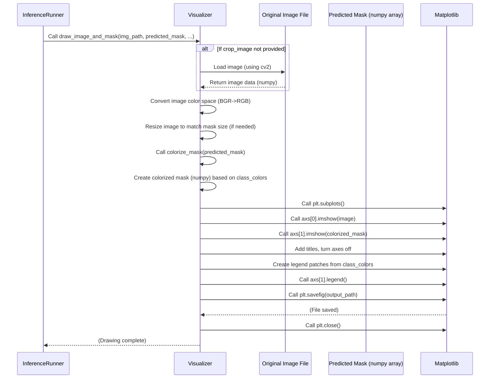

# Chapter 10: Visualization Utilities

Welcome back! In the previous chapter, [Inference Pipeline](09_inference_pipeline_.md), you learned how to take your trained model and apply it to new images to generate segmentation masks. You saw how the inference process can even automatically generate plots to show the predicted masks alongside the original images.

Creating these visual outputs is incredibly important throughout a machine learning project, not just at the very end. How do you know if your data looks right *before* training? How do you understand if your model is actually improving during training, or perhaps getting worse? How do you quickly check if your predictions make sense?

Numbers like loss values and IoU scores are crucial ([Segmentation Model Module (Training/Validation)](08_segmentation_model_module__training_validation__.md)), but sometimes you just need to *see* things to really understand what's happening. This is where **Visualization Utilities** come in.

## What Problem Do Visualization Utilities Solve? (Seeing What's Happening)

Working with image data and complex models can be abstract. Raw image files and arrays of numbers (like predicted masks or performance metrics) aren't easy for humans to understand directly. Visualization utilities turn this raw data into pictures, graphs, and charts that make sense.

They help you answer questions like:

*   **Is my data loading correctly?** Are the images and masks paired up? Does the augmentation look right?
*   **Is my model learning?** Is the loss decreasing over epochs? Is the IoU metric going up? Are the training and validation curves behaving as expected?
*   **How good are the predictions?** Do the predicted masks accurately outline the objects? Are there obvious errors the model is making?

Without visualization, you'd be trying to diagnose problems or understand success by just looking at numbers, which is much harder.

## What are Visualization Utilities? (Your Project's Eyes)

Visualization Utilities are helper functions or classes in `SemiF-Segmentation` designed specifically for creating visual representations of data, training progress, and model outputs.

They include tools for:

*   **Data Exploration:** Plotting sample images and their corresponding masks from the dataset loader ([Dataset Loader](07_dataset_loader_.md)) to quickly check data integrity and augmentations.
*   **Training Monitoring:** Plotting training and validation metrics (like loss and IoU) recorded over epochs to track model performance over time.
*   **Prediction Analysis:** Creating side-by-side comparisons of original images, ground truth masks (if available), and predicted masks, often with masks colorized for clarity and legends explaining the colors.

These tools are typically found in `src/utils/viz_utils.py`, although dedicated visualization logic for specific tasks (like the `Visualizer` class used in the [Inference Pipeline](09_inference_pipeline_.md)) might live alongside that task's code.

## How to Use Visualization Utilities

Visualization utilities are not a standalone `mode` you run directly from `main.py`. Instead, they are functions called by other tasks or scripts when visualization is needed.

Here are some key ways they are used in the project:

### 1. Visualizing a Sample Batch (Before Training)

It's a good practice to check a sample batch of data *before* you start training to ensure your [Data Preprocessing Pipeline](05_data_preprocessing_pipeline_.md) and [Data Augmentation](06_data_augmentation_.md) are working as expected. The `src/train.py` script does this automatically at the start of a training run using the `viz_batch` function from `src/utils/viz_utils.py`.

Look at the `src/train.py` code snippet below. After setting up the data loaders but *before* calling `trainer.fit`, there's a call to `viz_batch`:

```python
# --- Snippet from src/train.py ---
# ... imports ...
from src.utils.viz_utils import viz_batch # Import the viz_batch function
# ... dataset and dataloader setup ...

    sample_dataloader = DataLoader(
        train_dataset, # Use the training dataset
        batch_size=cfg.train.batch_size, 
        shuffle=True, 
        num_workers=cfg.train.dataset.workers
        )

    # ... Model and Trainer setup ...

    if trainer.is_global_zero: # Only run on the main process in distributed training
        viz_batch(sample_dataloader, output_dir=logger.log_dir) # <<< Visualize a sample batch
    del sample_dataloader # Free up the sampler dataloader

    trainer.fit(model, train_loader, val_loader)
    # ... rest of train.py ...
```

When you run `python main.py mode=train`, this part of the code creates a temporary DataLoader, takes *one* batch from it, and calls `viz_batch`, passing the batch and an output directory.

**What you see:** This will save plots (usually side-by-side images and masks) for each item in that first batch into a subdirectory (e.g., `outputs/YYYY-MM-DD/HH-MM-SS/train/batch_sample/`). You can open these images to visually inspect the data the model will see, including the effects of augmentation.

### 2. Plotting Training/Validation Metrics (After Training)

The PyTorch Lightning `Trainer` configured in `src/train.py` automatically logs training and validation metrics (like loss and IoU) to a CSV file (e.g., `outputs/YYYY-MM-DD/HH-MM-SS/train/version_0/metrics.csv`) using the `CSVLogger`. After training is complete, you can use this CSV file to plot the progress over epochs.

The `plot_train_val_metrics` function from `src/utils/viz_utils.py` is designed for this analysis. You would typically run this function *after* the `main.py` script finishes, perhaps in a separate analysis script or manually in a Python console or Jupyter notebook.

You give it the path to the `metrics.csv` file:

```python
# Example of how you might use it *after* training finishes
from src.utils.viz_utils import plot_train_val_metrics
from pathlib import Path

# Assume your training output was in this directory
run_output_dir = Path("outputs/YYYY-MM-DD/HH-MM-SS/train/version_0") # Replace with your actual path

metrics_file = run_output_dir / "metrics.csv"
output_plot = run_output_dir / "training_metrics_plot.png"

if metrics_file.exists():
    plot_train_val_metrics(metrics_file, output_file=output_plot)
else:
    print(f"Metrics file not found at {metrics_file}")
```

**What you see:** This generates a plot showing lines for training loss, validation loss, training IoU, and validation IoU over the training epochs. This is essential for spotting issues like overfitting (when training performance keeps improving but validation performance plateaus or gets worse).

### 3. Visualizing Sample Predictions (After Training in `src/train.py`)

After training, `src/train.py` also includes logic to run inference on a small number of sample images (both from the validation set and potentially some unlabeled images specified in the config) and save visualizations. This uses the `side_by_side_plot` function from `src/utils/viz_utils.py`.

```python
# --- Snippet from src/train.py ---
# ... after trainer.fit and validation ...
from src.utils.viz_utils import side_by_side_plot # Import the plot function
# ... setup class_colors and class_labels dictionaries ...

    if is_rank_zero: # Only run on the main process
        log.info("Running sample inference on validation images...")
        # ... load the best model ...
        
        # Get a sample image/mask from the test dataset
        sample = test_dataset[0] 
        image = sample[0].unsqueeze(0).to(best_model.device) # Format for model
        mask_gt = sample[1].cpu().numpy().squeeze() # Ground truth mask
        mask_stem = sample[2] # Filename stem
        img_path = test_image_dir / f"{mask_stem}.jpg" # Original image path

        with torch.no_grad():
            output = best_model(image)
            mask_pred = output.argmax(dim=1).squeeze(0).cpu().numpy() # Predicted mask

        # Save side-by-side plot
        output_dir = Path(logger.log_dir) / "sample_predictions"
        output_dir.mkdir(parents=True, exist_ok=True)
        output_path = output_dir / f"test_prediction.png"

        # <<< Call the plotting function!
        side_by_side_plot(img_path, mask_gt, mask_pred, output_path, class_colors=class_colors, class_labels=class_labels)

        # ... similar logic for sample unlabeled images ...
```

**What you see:** This saves plots (e.g., `outputs/YYYY-MM-DD/HH-MM-SS/train/version_0/sample_predictions/test_prediction.png`) that show the original image, the ground truth mask, and the predicted mask side-by-side. If class colors and labels are provided, the masks are colorized, and a legend is included. This is a quick visual check of the model's qualitative performance.

### 4. Visualizing Predictions during Inference (`src/inferencing/inference.py`)

As seen in the [Inference Pipeline](09_inference_pipeline_.md) chapter, the inference script (`src/inferencing/inference.py`) includes a dedicated `Visualizer` class that handles saving prediction plots for *all* processed images (or a subset, depending on config). This is controlled by the `plot` section in `conf/inference/default.yaml`.

```yaml
# --- Snippet from conf/inference/default.yaml ---
inference:
  # ... other inference settings ...
  plot: # Configuration for visualization during inference
    overlays: false      # Create images with predicted masks overlaid
    comparisons: false   # Create side-by-side comparisons (input vs. overlay)
    image_and_mask: true # Create side-by-side (input image vs. colorized predicted mask)
    dpi: 300
    transparent: true
```

If `image_and_mask: true`, the `InferenceRunner` will call the `Visualizer.draw_image_and_mask` method for each image processed.

**What you see:** This saves side-by-side plots of the original image and the colorized predicted mask (like the sample prediction plot in `src/train.py`), but for every image processed by the inference pipeline, allowing you to visually inspect the results across your entire inference dataset. These plots are saved in a subdirectory (e.g., `outputs/YYYY-MM-DD/HH-MM-SS/inference/results/sidebyside/`).

By using these utilities throughout the project, you gain valuable insights into your data and model, making development and debugging much more efficient.

## How Visualization Utilities Work Under the Hood

The visualization utilities primarily rely on standard Python libraries for image manipulation and plotting, mainly **OpenCV (`cv2`)** for loading/saving images and handling colors, and **Matplotlib (`matplotlib.pyplot`)** for creating the plots.

Let's look at simple examples of how some of the key visualization functions work:

### 1. Plotting a Batch (`viz_batch`)

This function takes a PyTorch `DataLoader`, gets one batch, and uses Matplotlib to plot each image-mask pair.

```python
# --- Snippet from src/utils/viz_utils.py (Simplified) ---
import matplotlib.pyplot as plt
import numpy as np
from pathlib import Path

def viz_batch(dataloader, output_dir="output"):
    # Create output directory if it doesn't exist
    batch_sample_dir = Path(output_dir, "batch_sample")
    batch_sample_dir.mkdir(parents=True, exist_ok=True)

    # Get one batch from the dataloader
    images, masks, stems = next(iter(dataloader)) # Use next(iter(...)) to get one batch

    # Loop through each item in the batch
    for idx in range(images.shape[0]):
        # Prepare image and mask for plotting
        image = images[idx].permute(1, 2, 0).numpy() # Convert from CHW to HWC for matplotlib
        image = np.clip(image, 0, 1) # Ensure pixel values are in expected range (0 to 1)

        mask = masks[idx].squeeze(0).numpy() # Remove potential channel dim if present

        # Use matplotlib to create a figure with two subplots (side-by-side)
        fig, axes = plt.subplots(1, 2, figsize=(10, 5))

        # Plot the image on the first subplot
        axes[0].imshow(image)
        axes[0].set_title(f"Image: {stems[idx]}")
        axes[0].axis("off") # Hide axes

        # Plot the mask on the second subplot
        axes[1].imshow(mask, cmap="gray") # Use grayscale colormap for masks
        axes[1].set_title(f"Mask: {stems[idx]}")
        axes[1].axis("off") # Hide axes

        plt.tight_layout() # Adjust layout
        
        # Save the figure to a file
        plot_path = batch_sample_dir / f"{stems[idx]}.png"
        plt.savefig(plot_path, bbox_inches="tight")
        plt.close(fig) # Close the figure to free memory
        
        print(f"Saved: {plot_path}")
        
        # Only visualize the first batch for simplicity
        break 
```

This function demonstrates the basic pattern: load data (via DataLoader), prepare it for plotting (transpose dimensions, clip values), use Matplotlib to create plots, and save them.

### 2. Plotting Metrics (`plot_train_val_metrics`)

This function takes the path to the metrics CSV file, reads it into a Pandas DataFrame, and uses Matplotlib to plot the specified columns against the epoch number.

```python
# --- Snippet from src/utils/viz_utils.py (Simplified) ---
import matplotlib.pyplot as plt
import pandas as pd
from pathlib import Path
from matplotlib.ticker import MaxNLocator

def plot_train_val_metrics(metrics_file, metrics=["train_loss", "valid_loss"], output_file=None):
    # Load data from the CSV file
    metrics_df = pd.read_csv(metrics_file)

    # Separate into subplots if needed (e.g., Loss vs IoU)
    fig, axs = plt.subplots(2, 1, figsize=(12, 10), sharex=True)

    # Define colors (simplified)
    colors = {
        "train": "blue",
        "valid": "orange",
    }

    # Plot metrics like loss
    for metric in metrics:
        if "loss" in metric:
            if "train" in metric:
                axs[0].plot(metrics_df["epoch"].dropna(), metrics_df[metric].dropna(), label="Training Loss", color=colors["train"])
            elif "valid" in metric:
                axs[0].plot(metrics_df["epoch"].dropna(), metrics_df[metric].dropna(), label="Validation Loss", color=colors["valid"])

    axs[0].set_title("Loss")
    axs[0].set_ylabel("Loss")
    axs[0].legend()
    axs[0].grid(True)

    # Plot metrics like IoU (similar logic would go here for IoU metrics)
    # ...

    axs[1].set_title("IoU") # Assuming second subplot is for IoU
    axs[1].set_xlabel("Epoch")
    axs[1].set_ylabel("IoU")
    axs[1].legend() # Need separate legend for IoU metrics
    axs[1].grid(True)
    
    axs[1].xaxis.set_major_locator(MaxNLocator(integer=True)) # Force integer epochs

    plt.tight_layout()

    # Save the plot
    if output_file:
        plt.savefig(output_file)
        print(f"Plot saved to {output_file}")
    plt.close() # Close the figure
```

This shows how Pandas is used to read the CSV data and Matplotlib is used to create line plots for the specified metrics over epochs.

### 3. Side-by-Side Plot with Colorized Mask (`side_by_side_plot` & `Visualizer`)

Both the `side_by_side_plot` function in `viz_utils.py` and the `Visualizer` class in `src/inferencing/inference.py` perform similar tasks of creating side-by-side image and mask plots. The `Visualizer` class is more structured for batch processing during inference. A key part of these functions is colorizing the predicted (or ground truth) mask.

Here's a look at the colorization logic and the plotting from the `Visualizer` class, which is called by the Inference Pipeline:

```python
# --- Snippet from src/inferencing/inference.py (Visualizer class - Simplified) ---
import cv2
import numpy as np
import matplotlib.pyplot as plt
from matplotlib.patches import Patch # For legend
from pathlib import Path

class Visualizer:
    def __init__(self, output_dir: Path, plot_cfg, dpi: int = 300, transparent: bool = False):
        self.output_dir = output_dir
        self.dpi = dpi
        self.transparent = transparent
        # Configure which plots to create based on plot_cfg (e.g., plot_image_mask)
        self.plot_image_mask = plot_cfg.image_and_mask
        self._setup_dirs() # Create output directories

        # Define the color mapping for mask pixel values (class IDs)
        self.class_colors = {
            0: ("Background/Soil", [0, 0, 0]),         # Black
            1: ("Grass", [255, 182, 193]),            # Pink-ish
            2: ("Hairy vetch", [173, 216, 230]),       # Light Blue
            # Add mapping for other classes based on your data
        }

    def _setup_dirs(self):
         # Create directories for each plot type if enabled
         self.image_and_mask_dst = self.output_dir / "sidebyside"
         if self.plot_image_mask: self.image_and_mask_dst.mkdir(parents=True, exist_ok=True)

    def colorize_mask(self, mask: np.ndarray) -> np.ndarray:
        """Convert grayscale mask (H, W) to color image (H, W, 3) using self.class_colors"""
        color_mask = np.zeros((*mask.shape, 3), dtype=np.uint8)
        # Loop through each class defined in the color map
        for class_id, (cls_name, color) in self.class_colors.items():
             # Find all pixels in the mask with this class_id
             # Set the corresponding pixels in the color_mask to the defined color
             color_mask[mask == class_id] = color
        return color_mask

    def draw_image_and_mask(self, image_path: Path, mask: np.ndarray, out_classes: int, bbox_idx: int = None, crop_image=None):
        """
        Draw and save side-by-side original image and colorized predicted mask with legend.
        """
        if not self.plot_image_mask: return # Skip if this plot type is disabled

        # Load or get the original image data
        if crop_image is not None:
            image = crop_image # Use the provided crop
        else:
            image = cv2.imread(str(image_path)) # Load original image
            if image is None: return # Handle errors
            image = cv2.cvtColor(image, cv2.COLOR_BGR2RGB) # Convert color space

        # Resize image to match mask if needed (handles cases where image is resized during processing)
        if image.shape[:2] != mask.shape:
            image = cv2.resize(image, (mask.shape[1], mask.shape[0]), interpolation=cv2.INTER_LINEAR)

        # --- Colorize the predicted mask ---
        color_mask = self.colorize_mask(mask)

        # --- Use Matplotlib to create plot ---
        fig, axs = plt.subplots(1, 2, figsize=(2 * image.shape[1] / self.dpi, image.shape[0] / self.dpi), dpi=self.dpi)

        axs[0].imshow(image); axs[0].set_title("Original Image"); axs[0].axis('off')
        axs[1].imshow(color_mask); axs[1].set_title("Predicted Mask"); axs[1].axis('off')

        # --- Add Legend ---
        legend_elements = []
        for cls_idx, (cls_name, cls_color) in self.class_colors.items():
            # Only add legend entries for classes the model actually outputs
            if cls_idx < out_classes: 
                legend_elements.append(Patch(facecolor=np.array(cls_color) / 255.0, edgecolor='black', label=cls_name))
        axs[1].legend(handles=legend_elements, loc='lower right', fontsize='small', frameon=True, bbox_to_anchor=(1.05, 0))

        # --- Save the plot ---
        suffix = f"_bbox{bbox_idx}" if bbox_idx is not None else "" # Add suffix if this is a bbox crop
        out_path = self.image_and_mask_dst / f"{image_path.stem}{suffix}_sidebyside.png"
        plt.tight_layout(); plt.savefig(out_path, bbox_inches='tight', pad_inches=0, transparent=self.transparent); plt.close(fig)

    # Other plotting methods (draw_overlay, draw_comparison) would be here
```

This snippet shows the `colorize_mask` helper function which maps pixel values to colors based on the `self.class_colors` dictionary, and the `draw_image_and_mask` method which uses Matplotlib to display the original image and the colorized mask side-by-side. It also includes logic to add a legend explaining the colors, which is derived from the same `self.class_colors` dictionary.

Here's a simple sequence diagram illustrating the `draw_image_and_mask` process for one image:



This overview shows how the visualization utilities leverage standard libraries to convert numerical and image data into informative plots and images, providing essential visual feedback throughout the different stages of the `SemiF-Segmentation` project.

## Conclusion

You've learned that Visualization Utilities are crucial tools in `SemiF-Segmentation` for understanding your data, monitoring model training progress, and inspecting inference results visually. They are used in scripts like `src/train.py` (to visualize sample data and post-training predictions) and `src/inferencing/inference.py` (via the `Visualizer` class, configured for systematic prediction plotting). These utilities, primarily found in `src/utils/viz_utils.py`, rely on libraries like OpenCV and Matplotlib to generate plots of training metrics, sample batches, and side-by-side comparisons of images, ground truth masks, and colorized predicted masks. By incorporating these visualizations, you gain valuable insights that complement numerical metrics and help you effectively develop and deploy your segmentation models.

This chapter concludes the beginner-friendly tutorial for the `SemiF-Segmentation` project. You have explored the core components from configuration and data handling to model training and inference, including the essential utilities for visualization.

Congratulations on completing the tutorial! You now have a foundational understanding of how `SemiF-Segmentation` is structured and how its key parts work together to tackle segmentation tasks.

---

Generated by [AI Codebase Knowledge Builder](https://github.com/The-Pocket/Tutorial-Codebase-Knowledge)