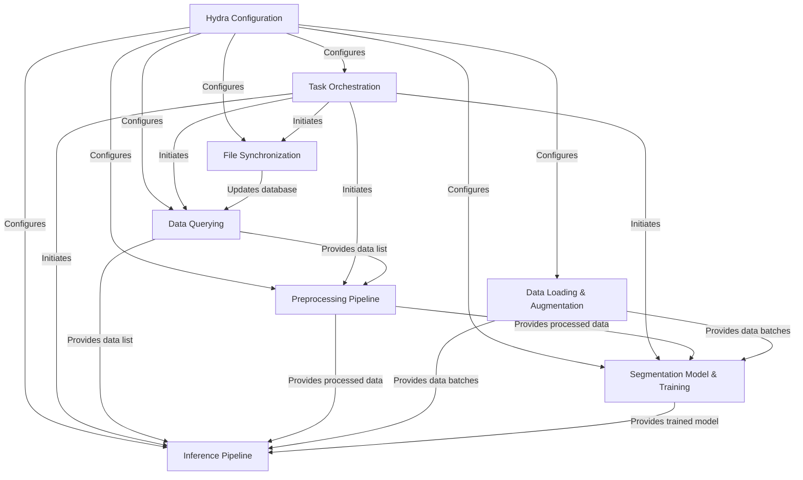

# Tutorial: SemiF-Segmentation

This project provides a pipeline for **image segmentation**, allowing users to
*query* specific data, *preprocess* it (like cropping and remapping), *train* a segmentation model
using PyTorch Lightning, and finally *run inference* to predict masks on new images.
The entire process is managed by **Hydra configuration**, making it simple to
configure experiments and manage different workflow stages.

**Source Repository:** [None](None)

## Chapters

1. [Hydra Configuration
](01_hydra_configuration_.md)
2. [Task Orchestration
](02_task_orchestration_.md)
3. [Data Querying
](03_data_querying_.md)
4. [Preprocessing Pipeline
](04_preprocessing_pipeline_.md)
5. [Segmentation Model & Training
](05_segmentation_model___training_.md)
6. [Inference Pipeline
](06_inference_pipeline_.md)
7. [Data Loading & Augmentation
](07_data_loading___augmentation_.md)
8. [File Synchronization
](08_file_synchronization_.md)

---

Generated by [AI Codebase Knowledge Builder](https://github.com/The-Pocket/Tutorial-Codebase-Knowledge)